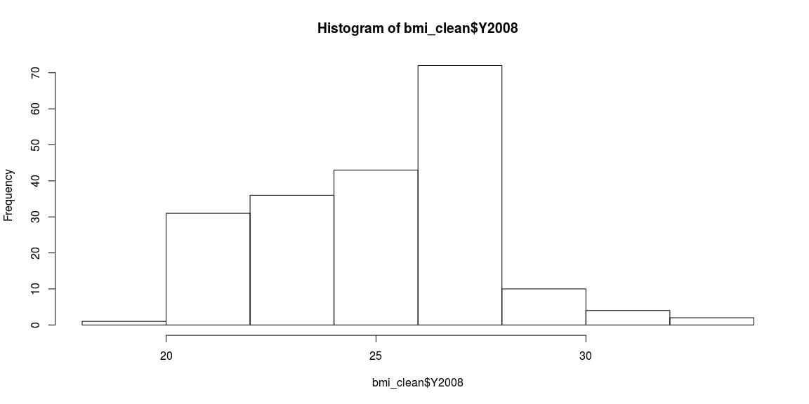
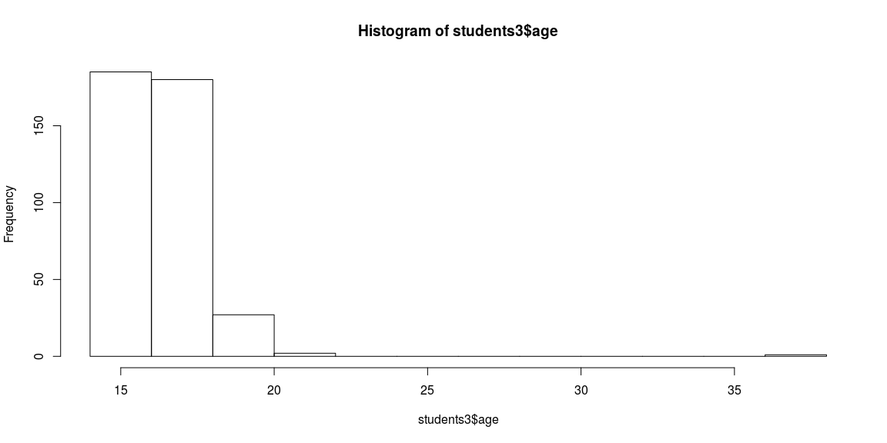
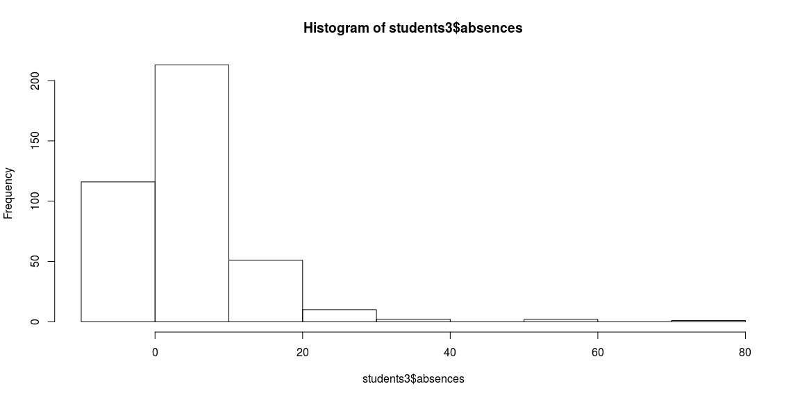
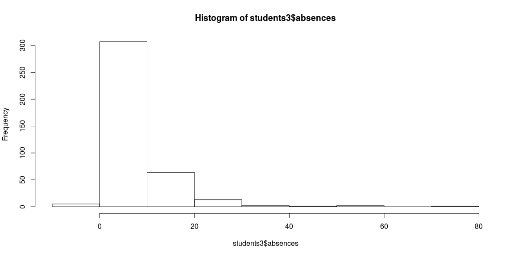
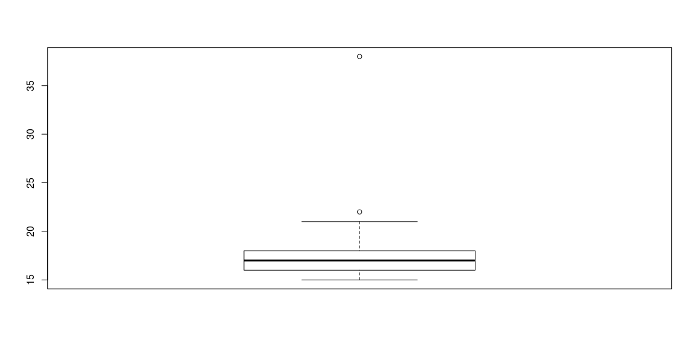
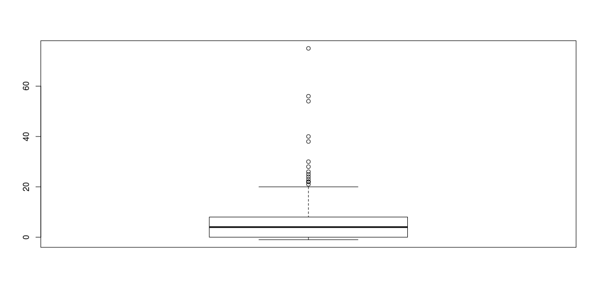
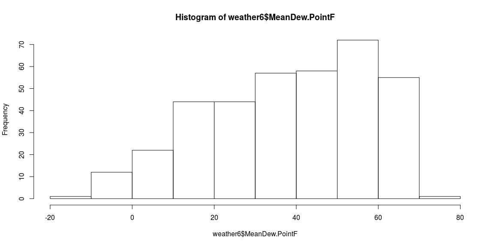
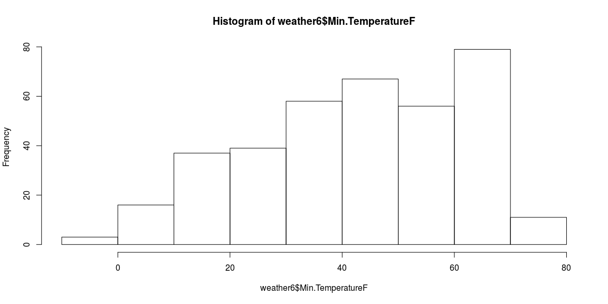
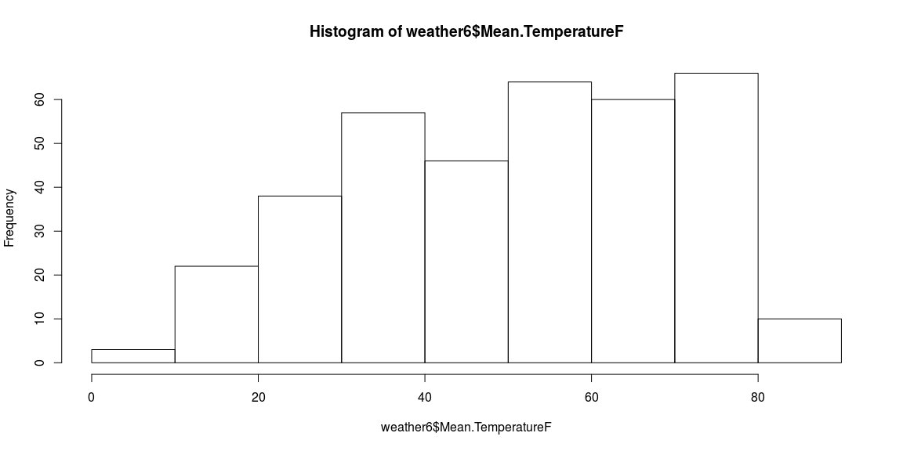

# {.tabset .tabset-fade}


## Background

https://campus.datacamp.com/courses/cleaning-data-in-r/chapter-1-introduction-and-exploring-raw-data?ex=1

https://github.com/JoshuaHaden/Cleaning-Data-in-R-Data-Camp


## Intro


```r
###Chapter 1 Introduction and Exploring Raw Data

###Here's what Messy Data Looks Like
# Weather in Data Camp's workspace
weather <- read.csv("weather.csv")
weather_clean <- read.csv("weather_clean.csv")
bmi_clean <- read.csv("bmi_clean.csv")

# View the first 6 rows of data
head(weather)
```

```
##   X year month           measure X1 X2 X3 X4 X5 X6 X7 X8 X9 X10 X11 X12
## 1 1 2014    12  Max.TemperatureF 64 42 51 43 42 45 38 29 49  48  39  39
## 2 2 2014    12 Mean.TemperatureF 52 38 44 37 34 42 30 24 39  43  36  35
## 3 3 2014    12  Min.TemperatureF 39 33 37 30 26 38 21 18 29  38  32  31
## 4 4 2014    12    Max.Dew.PointF 46 40 49 24 37 45 36 28 49  45  37  28
## 5 5 2014    12    MeanDew.PointF 40 27 42 21 25 40 20 16 41  39  31  27
## 6 6 2014    12     Min.DewpointF 26 17 24 13 12 36 -3  3 28  37  27  25
##   X13 X14 X15 X16 X17 X18 X19 X20 X21 X22 X23 X24 X25 X26 X27 X28 X29 X30
## 1  42  45  42  44  49  44  37  36  36  44  47  46  59  50  52  52  41  30
## 2  37  39  37  40  45  40  33  32  33  39  45  44  52  44  45  46  36  26
## 3  32  33  32  35  41  36  29  27  30  33  42  41  44  37  38  40  30  22
## 4  28  29  33  42  46  34  25  30  30  39  45  46  58  31  34  42  26  10
## 5  26  27  29  36  41  30  22  24  27  34  42  44  43  29  31  35  20   4
## 6  24  25  27  30  32  26  20  20  25  25  37  41  29  28  29  27  10  -6
##   X31
## 1  30
## 2  25
## 3  20
## 4   8
## 5   5
## 6   1
```

```r
# View the last 6 rows of data
tail(weather)
```

```
##       X year month            measure   X1   X2   X3   X4   X5   X6   X7
## 281 281 2015    12 Mean.Wind.SpeedMPH    6 <NA> <NA> <NA> <NA> <NA> <NA>
## 282 282 2015    12  Max.Gust.SpeedMPH   17 <NA> <NA> <NA> <NA> <NA> <NA>
## 283 283 2015    12    PrecipitationIn 0.14 <NA> <NA> <NA> <NA> <NA> <NA>
## 284 284 2015    12         CloudCover    7 <NA> <NA> <NA> <NA> <NA> <NA>
## 285 285 2015    12             Events Rain <NA> <NA> <NA> <NA> <NA> <NA>
## 286 286 2015    12     WindDirDegrees  109 <NA> <NA> <NA> <NA> <NA> <NA>
##       X8   X9  X10  X11  X12  X13  X14  X15  X16  X17  X18  X19  X20  X21
## 281 <NA> <NA> <NA> <NA> <NA> <NA> <NA> <NA> <NA> <NA> <NA> <NA> <NA> <NA>
## 282 <NA> <NA> <NA> <NA> <NA> <NA> <NA> <NA> <NA> <NA> <NA> <NA> <NA> <NA>
## 283 <NA> <NA> <NA> <NA> <NA> <NA> <NA> <NA> <NA> <NA> <NA> <NA> <NA> <NA>
## 284 <NA> <NA> <NA> <NA> <NA> <NA> <NA> <NA> <NA> <NA> <NA> <NA> <NA> <NA>
## 285 <NA> <NA> <NA> <NA> <NA> <NA> <NA> <NA> <NA> <NA> <NA> <NA> <NA> <NA>
## 286 <NA> <NA> <NA> <NA> <NA> <NA> <NA> <NA> <NA> <NA> <NA> <NA> <NA> <NA>
##      X22  X23  X24  X25  X26  X27  X28  X29  X30  X31
## 281 <NA> <NA> <NA> <NA> <NA> <NA> <NA> <NA> <NA> <NA>
## 282 <NA> <NA> <NA> <NA> <NA> <NA> <NA> <NA> <NA> <NA>
## 283 <NA> <NA> <NA> <NA> <NA> <NA> <NA> <NA> <NA> <NA>
## 284 <NA> <NA> <NA> <NA> <NA> <NA> <NA> <NA> <NA> <NA>
## 285 <NA> <NA> <NA> <NA> <NA> <NA> <NA> <NA> <NA> <NA>
## 286 <NA> <NA> <NA> <NA> <NA> <NA> <NA> <NA> <NA> <NA>
```

```r
# View a condensed summary of the data
str(weather)
```

```
## 'data.frame':	286 obs. of  35 variables:
##  $ X      : int  1 2 3 4 5 6 7 8 9 10 ...
##  $ year   : int  2014 2014 2014 2014 2014 2014 2014 2014 2014 2014 ...
##  $ month  : int  12 12 12 12 12 12 12 12 12 12 ...
##  $ measure: Factor w/ 22 levels "CloudCover","Events",..: 7 12 19 3 15 16 5 10 17 6 ...
##  $ X1     : Factor w/ 129 levels "","-6","0","0.01",..: 101 89 76 83 78 31 111 100 89 66 ...
##  $ X2     : Factor w/ 126 levels "","-5","0","0.01",..: 82 77 72 80 34 18 122 109 91 69 ...
##  $ X3     : Factor w/ 124 levels "","-3","0","0.01",..: 85 78 70 82 76 27 11 109 90 59 ...
##  $ X4     : Factor w/ 131 levels "","0","0.02",..: 82 75 49 27 23 14 108 94 77 68 ...
##  $ X5     : Factor w/ 119 levels "","-4","-6","-7",..: 74 66 31 69 29 14 109 96 77 61 ...
##  $ X6     : Factor w/ 119 levels "","-1","-5","-8",..: 75 73 69 75 72 67 11 116 111 59 ...
##  $ X7     : Factor w/ 120 levels "","-13","-3",..: 70 44 22 68 20 3 116 92 33 61 ...
##  $ X8     : Factor w/ 129 levels "","-1","-18",..: 35 27 19 33 17 43 123 106 82 65 ...
##  $ X9     : Factor w/ 127 levels "","0","0.01",..: 81 73 34 81 76 33 10 121 116 63 ...
##  $ X10    : Factor w/ 125 levels "","-2","0","0.05",..: 87 82 77 84 78 76 13 123 121 39 ...
##  $ X11    : Factor w/ 126 levels "","-1","0","0.01",..: 74 72 68 73 67 32 120 115 111 45 ...
##  $ X12    : Factor w/ 126 levels "","0","0.01",..: 77 74 68 33 32 29 117 110 100 50 ...
##  $ X13    : Factor w/ 128 levels "","-10","-4",..: 85 80 74 32 29 26 113 105 95 47 ...
##  $ X14    : Factor w/ 125 levels "","-4","-9","0",..: 85 81 75 36 32 29 115 104 92 51 ...
##  $ X15    : Factor w/ 129 levels "","-13","-2",..: 83 78 69 74 37 34 120 112 101 60 ...
##  $ X16    : Factor w/ 123 levels "","-11","-16",..: 83 80 74 82 75 53 120 114 108 61 ...
##  $ X17    : Factor w/ 133 levels "","-3","-7","-9",..: 90 86 83 87 83 74 12 125 113 47 ...
##  $ X18    : Factor w/ 122 levels "","-1","-6","0",..: 76 73 70 68 46 29 114 104 88 40 ...
##  $ X19    : Factor w/ 126 levels "","-2","-4","-5",..: 73 71 36 29 26 21 101 95 90 58 ...
##  $ X20    : Factor w/ 128 levels "","-10","-4",..: 79 74 32 54 28 23 121 117 110 70 ...
##  $ X21    : Factor w/ 126 levels "","-5","0","0.07",..: 73 69 49 49 31 28 115 108 100 65 ...
##  $ X22    : Factor w/ 128 levels "","-5","0","0.05",..: 83 78 70 78 72 27 120 115 107 66 ...
##  $ X23    : Factor w/ 122 levels "","-14","-6",..: 87 86 84 86 84 79 11 119 115 66 ...
##  $ X24    : Factor w/ 125 levels "","-15","-4",..: 81 80 78 81 80 78 10 120 119 51 ...
##  $ X25    : Factor w/ 130 levels "","0","0.03",..: 99 93 85 98 84 34 9 115 89 49 ...
##  $ X26    : Factor w/ 118 levels "","-2","0","0.02",..: 81 74 67 60 30 29 99 90 79 52 ...
##  $ X27    : Factor w/ 132 levels "","-2","-5","0",..: 94 86 78 75 71 37 112 102 92 59 ...
##  $ X28    : Factor w/ 127 levels "","-1","0","0.01",..: 91 86 81 83 75 33 112 104 92 50 ...
##  $ X29    : Factor w/ 113 levels "","-2","0","0.04",..: 70 64 45 27 18 6 86 76 65 53 ...
##  $ X30    : Factor w/ 124 levels "","-6","0","0.02",..: 50 29 24 7 73 2 81 71 29 60 ...
##  $ X31    : Factor w/ 95 levels "","-8","0","0.05",..: 42 23 17 86 65 6 71 61 53 51 ...
```

```r
###Here's what Clean Data Look Like
# View the first 6 rows of data
head(weather_clean)
```

```
##   X       date    events cloud_cover max_dew_point_f max_gust_speed_mph
## 1 1 2014-12-01      Rain           6              46                 29
## 2 2 2014-12-02 Rain-Snow           7              40                 29
## 3 3 2014-12-03      Rain           8              49                 38
## 4 4 2014-12-04      None           3              24                 33
## 5 5 2014-12-05      Rain           5              37                 26
## 6 6 2014-12-06      Rain           8              45                 25
##   max_humidity max_sea_level_pressure_in max_temperature_f
## 1           74                     30.45                64
## 2           92                     30.71                42
## 3          100                     30.40                51
## 4           69                     30.56                43
## 5           85                     30.68                42
## 6          100                     30.42                45
##   max_visibility_miles max_wind_speed_mph mean_humidity
## 1                   10                 22            63
## 2                   10                 24            72
## 3                   10                 29            79
## 4                   10                 25            54
## 5                   10                 22            66
## 6                   10                 22            93
##   mean_sea_level_pressure_in mean_temperature_f mean_visibility_miles
## 1                      30.13                 52                    10
## 2                      30.59                 38                     8
## 3                      30.07                 44                     5
## 4                      30.33                 37                    10
## 5                      30.59                 34                    10
## 6                      30.24                 42                     4
##   mean_wind_speed_mph mean_dew_point_f min_dew_point_f min_humidity
## 1                  13               40              26           52
## 2                  15               27              17           51
## 3                  12               42              24           57
## 4                  12               21              13           39
## 5                  10               25              12           47
## 6                   8               40              36           85
##   min_sea_level_pressure_in min_temperature_f min_visibility_miles
## 1                     30.01                39                   10
## 2                     30.40                33                    2
## 3                     29.87                37                    1
## 4                     30.09                30                   10
## 5                     30.45                26                    5
## 6                     30.16                38                    0
##   precipitation_in wind_dir_degrees
## 1             0.01              268
## 2             0.10               62
## 3             0.44              254
## 4             0.00              292
## 5             0.11               61
## 6             1.09              313
```

```r
# View the last 6 rows of data
tail(weather_clean)
```

```
##       X       date events cloud_cover max_dew_point_f max_gust_speed_mph
## 361 361 2015-11-26   None           6              49                 28
## 362 362 2015-11-27   None           7              52                 32
## 363 363 2015-11-28   Rain           8              50                 23
## 364 364 2015-11-29   None           4              33                 20
## 365 365 2015-11-30   None           6              26                 17
## 366 366 2015-12-01   Rain           7              43                 17
##     max_humidity max_sea_level_pressure_in max_temperature_f
## 361          100                     30.87                59
## 362          100                     30.63                64
## 363           93                     30.20                60
## 364           79                     30.42                44
## 365           75                     30.53                38
## 366           96                     30.40                45
##     max_visibility_miles max_wind_speed_mph mean_humidity
## 361                   10                 22            79
## 362                   10                 26            78
## 363                   10                 18            80
## 364                   10                 16            58
## 365                   10                 14            65
## 366                   10                 15            83
##     mean_sea_level_pressure_in mean_temperature_f mean_visibility_miles
## 361                      30.77                 49                     9
## 362                      30.41                 56                     9
## 363                      30.16                 51                     9
## 364                      30.26                 38                    10
## 365                      30.46                 33                    10
## 366                      30.24                 39                     8
##     mean_wind_speed_mph mean_dew_point_f min_dew_point_f min_humidity
## 361                  10               42              34           57
## 362                  14               49              47           56
## 363                  10               43              36           67
## 364                  10               23              15           36
## 365                   9               23              18           54
## 366                   6               35              25           69
##     min_sea_level_pressure_in min_temperature_f min_visibility_miles
## 361                     30.64                38                    5
## 362                     30.15                48                    5
## 363                     30.11                41                    4
## 364                     30.19                32                   10
## 365                     30.39                28                   10
## 366                     30.01                32                    1
##     precipitation_in wind_dir_degrees
## 361             0.00              180
## 362             0.00              209
## 363             0.21              358
## 364             0.00              326
## 365             0.00               65
## 366             0.14              109
```

```r
# View a condensed summary of the data
str(weather_clean)
```

```
## 'data.frame':	366 obs. of  24 variables:
##  $ X                         : int  1 2 3 4 5 6 7 8 9 10 ...
##  $ date                      : Factor w/ 366 levels "2014-12-01","2014-12-02",..: 1 2 3 4 5 6 7 8 9 10 ...
##  $ events                    : Factor w/ 12 levels "Fog","Fog-Rain",..: 8 9 8 7 8 8 8 11 8 8 ...
##  $ cloud_cover               : int  6 7 8 3 5 8 6 8 8 8 ...
##  $ max_dew_point_f           : int  46 40 49 24 37 45 36 28 49 45 ...
##  $ max_gust_speed_mph        : int  29 29 38 33 26 25 32 28 52 29 ...
##  $ max_humidity              : int  74 92 100 69 85 100 92 92 100 100 ...
##  $ max_sea_level_pressure_in : num  30.4 30.7 30.4 30.6 30.7 ...
##  $ max_temperature_f         : int  64 42 51 43 42 45 38 29 49 48 ...
##  $ max_visibility_miles      : int  10 10 10 10 10 10 10 10 10 10 ...
##  $ max_wind_speed_mph        : int  22 24 29 25 22 22 25 21 38 23 ...
##  $ mean_humidity             : int  63 72 79 54 66 93 61 70 93 95 ...
##  $ mean_sea_level_pressure_in: num  30.1 30.6 30.1 30.3 30.6 ...
##  $ mean_temperature_f        : int  52 38 44 37 34 42 30 24 39 43 ...
##  $ mean_visibility_miles     : int  10 8 5 10 10 4 10 8 2 3 ...
##  $ mean_wind_speed_mph       : int  13 15 12 12 10 8 15 13 20 13 ...
##  $ mean_dew_point_f          : int  40 27 42 21 25 40 20 16 41 39 ...
##  $ min_dew_point_f           : int  26 17 24 13 12 36 -3 3 28 37 ...
##  $ min_humidity              : int  52 51 57 39 47 85 29 47 86 89 ...
##  $ min_sea_level_pressure_in : num  30 30.4 29.9 30.1 30.4 ...
##  $ min_temperature_f         : int  39 33 37 30 26 38 21 18 29 38 ...
##  $ min_visibility_miles      : int  10 2 1 10 5 0 5 2 1 1 ...
##  $ precipitation_in          : num  0.01 0.1 0.44 0 0.11 1.09 0.13 0.03 2.9 0.28 ...
##  $ wind_dir_degrees          : int  268 62 254 292 61 313 350 354 38 357 ...
```

```r
###Getting a Feel for Your Data
# Check the class of bmi
class(bmi_clean)
```

```
## [1] "data.frame"
```

```r
# Check the dimensions of bmi
dim(bmi_clean)
```

```
## [1] 199  30
```

```r
# View the column names of bmi
names(bmi_clean)
```

```
##  [1] "Country" "Y1980"   "Y1981"   "Y1982"   "Y1983"   "Y1984"   "Y1985"  
##  [8] "Y1986"   "Y1987"   "Y1988"   "Y1989"   "Y1990"   "Y1991"   "Y1992"  
## [15] "Y1993"   "Y1994"   "Y1995"   "Y1996"   "Y1997"   "Y1998"   "Y1999"  
## [22] "Y2000"   "Y2001"   "Y2002"   "Y2003"   "Y2004"   "Y2005"   "Y2006"  
## [29] "Y2007"   "Y2008"
```

```r
###Viewing the Structure of Your Data
# Check the structure of bmi
str(bmi_clean)
```

```
## 'data.frame':	199 obs. of  30 variables:
##  $ Country: Factor w/ 199 levels "Afghanistan",..: 1 2 3 4 5 6 7 8 9 10 ...
##  $ Y1980  : num  21.5 25.2 22.3 25.7 20.9 ...
##  $ Y1981  : num  21.5 25.2 22.3 25.7 20.9 ...
##  $ Y1982  : num  21.5 25.3 22.4 25.7 20.9 ...
##  $ Y1983  : num  21.4 25.3 22.5 25.8 20.9 ...
##  $ Y1984  : num  21.4 25.3 22.6 25.8 20.9 ...
##  $ Y1985  : num  21.4 25.3 22.7 25.9 20.9 ...
##  $ Y1986  : num  21.4 25.3 22.8 25.9 21 ...
##  $ Y1987  : num  21.4 25.3 22.8 25.9 21 ...
##  $ Y1988  : num  21.3 25.3 22.9 26 21 ...
##  $ Y1989  : num  21.3 25.3 23 26 21.1 ...
##  $ Y1990  : num  21.2 25.3 23 26.1 21.1 ...
##  $ Y1991  : num  21.2 25.3 23.1 26.2 21.1 ...
##  $ Y1992  : num  21.1 25.2 23.2 26.2 21.1 ...
##  $ Y1993  : num  21.1 25.2 23.3 26.3 21.1 ...
##  $ Y1994  : num  21 25.2 23.3 26.4 21.1 ...
##  $ Y1995  : num  20.9 25.3 23.4 26.4 21.2 ...
##  $ Y1996  : num  20.9 25.3 23.5 26.5 21.2 ...
##  $ Y1997  : num  20.8 25.3 23.5 26.6 21.2 ...
##  $ Y1998  : num  20.8 25.4 23.6 26.7 21.3 ...
##  $ Y1999  : num  20.8 25.5 23.7 26.8 21.3 ...
##  $ Y2000  : num  20.7 25.6 23.8 26.8 21.4 ...
##  $ Y2001  : num  20.6 25.7 23.9 26.9 21.4 ...
##  $ Y2002  : num  20.6 25.8 24 27 21.5 ...
##  $ Y2003  : num  20.6 25.9 24.1 27.1 21.6 ...
##  $ Y2004  : num  20.6 26 24.2 27.2 21.7 ...
##  $ Y2005  : num  20.6 26.1 24.3 27.3 21.8 ...
##  $ Y2006  : num  20.6 26.2 24.4 27.4 21.9 ...
##  $ Y2007  : num  20.6 26.3 24.5 27.5 22.1 ...
##  $ Y2008  : num  20.6 26.4 24.6 27.6 22.3 ...
```

```r
# Load dplyr
library(dplyr)

# Check the structure of bmi, the dplyr way
glimpse(bmi_clean)
```

```
## Observations: 199
## Variables: 30
## $ Country <fct> Afghanistan, Albania, Algeria, Andorra, Angola, Antigua …
## $ Y1980   <dbl> 21.48678, 25.22533, 22.25703, 25.66652, 20.94876, 23.314…
## $ Y1981   <dbl> 21.46552, 25.23981, 22.34745, 25.70868, 20.94371, 23.390…
## $ Y1982   <dbl> 21.45145, 25.25636, 22.43647, 25.74681, 20.93754, 23.458…
## $ Y1983   <dbl> 21.43822, 25.27176, 22.52105, 25.78250, 20.93187, 23.537…
## $ Y1984   <dbl> 21.42734, 25.27901, 22.60633, 25.81874, 20.93569, 23.635…
## $ Y1985   <dbl> 21.41222, 25.28669, 22.69501, 25.85236, 20.94857, 23.731…
## $ Y1986   <dbl> 21.40132, 25.29451, 22.76979, 25.89089, 20.96030, 23.834…
## $ Y1987   <dbl> 21.37679, 25.30217, 22.84096, 25.93414, 20.98025, 23.936…
## $ Y1988   <dbl> 21.34018, 25.30450, 22.90644, 25.98477, 21.01375, 24.053…
## $ Y1989   <dbl> 21.29845, 25.31944, 22.97931, 26.04450, 21.05269, 24.163…
## $ Y1990   <dbl> 21.24818, 25.32357, 23.04600, 26.10936, 21.09007, 24.267…
## $ Y1991   <dbl> 21.20269, 25.28452, 23.11333, 26.17912, 21.12136, 24.365…
## $ Y1992   <dbl> 21.14238, 25.23077, 23.18776, 26.24017, 21.14987, 24.456…
## $ Y1993   <dbl> 21.06376, 25.21192, 23.25764, 26.30356, 21.13938, 24.540…
## $ Y1994   <dbl> 20.97987, 25.22115, 23.32273, 26.36793, 21.14186, 24.609…
## $ Y1995   <dbl> 20.91132, 25.25874, 23.39526, 26.43569, 21.16022, 24.664…
## $ Y1996   <dbl> 20.85155, 25.31097, 23.46811, 26.50769, 21.19076, 24.725…
## $ Y1997   <dbl> 20.81307, 25.33988, 23.54160, 26.58255, 21.22621, 24.787…
## $ Y1998   <dbl> 20.78591, 25.39116, 23.61592, 26.66337, 21.27082, 24.849…
## $ Y1999   <dbl> 20.75469, 25.46555, 23.69486, 26.75078, 21.31954, 24.917…
## $ Y2000   <dbl> 20.69521, 25.55835, 23.77659, 26.83179, 21.37480, 24.991…
## $ Y2001   <dbl> 20.62643, 25.66701, 23.86256, 26.92373, 21.43664, 25.058…
## $ Y2002   <dbl> 20.59848, 25.77167, 23.95294, 27.02525, 21.51765, 25.130…
## $ Y2003   <dbl> 20.58706, 25.87274, 24.05243, 27.12481, 21.59924, 25.207…
## $ Y2004   <dbl> 20.57759, 25.98136, 24.15957, 27.23107, 21.69218, 25.298…
## $ Y2005   <dbl> 20.58084, 26.08939, 24.27001, 27.32827, 21.80564, 25.399…
## $ Y2006   <dbl> 20.58749, 26.20867, 24.38270, 27.43588, 21.93881, 25.513…
## $ Y2007   <dbl> 20.60246, 26.32753, 24.48846, 27.53363, 22.08962, 25.642…
## $ Y2008   <dbl> 20.62058, 26.44657, 24.59620, 27.63048, 22.25083, 25.766…
```

```r
# View a summary of bmi
summary(bmi_clean)
```

```
##                 Country        Y1980           Y1981           Y1982      
##  Afghanistan        :  1   Min.   :19.01   Min.   :19.04   Min.   :19.07  
##  Albania            :  1   1st Qu.:21.27   1st Qu.:21.31   1st Qu.:21.36  
##  Algeria            :  1   Median :23.31   Median :23.39   Median :23.46  
##  Andorra            :  1   Mean   :23.15   Mean   :23.21   Mean   :23.26  
##  Angola             :  1   3rd Qu.:24.82   3rd Qu.:24.89   3rd Qu.:24.94  
##  Antigua and Barbuda:  1   Max.   :28.12   Max.   :28.36   Max.   :28.58  
##  (Other)            :193                                                  
##      Y1983           Y1984           Y1985           Y1986      
##  Min.   :19.10   Min.   :19.13   Min.   :19.16   Min.   :19.20  
##  1st Qu.:21.42   1st Qu.:21.45   1st Qu.:21.47   1st Qu.:21.49  
##  Median :23.57   Median :23.64   Median :23.73   Median :23.82  
##  Mean   :23.32   Mean   :23.37   Mean   :23.42   Mean   :23.48  
##  3rd Qu.:25.02   3rd Qu.:25.06   3rd Qu.:25.11   3rd Qu.:25.20  
##  Max.   :28.82   Max.   :29.05   Max.   :29.28   Max.   :29.52  
##                                                                 
##      Y1987           Y1988           Y1989           Y1990      
##  Min.   :19.23   Min.   :19.27   Min.   :19.31   Min.   :19.35  
##  1st Qu.:21.50   1st Qu.:21.52   1st Qu.:21.55   1st Qu.:21.57  
##  Median :23.87   Median :23.93   Median :24.03   Median :24.14  
##  Mean   :23.53   Mean   :23.59   Mean   :23.65   Mean   :23.71  
##  3rd Qu.:25.27   3rd Qu.:25.34   3rd Qu.:25.37   3rd Qu.:25.39  
##  Max.   :29.75   Max.   :29.98   Max.   :30.20   Max.   :30.42  
##                                                                 
##      Y1991           Y1992           Y1993           Y1994      
##  Min.   :19.40   Min.   :19.45   Min.   :19.51   Min.   :19.59  
##  1st Qu.:21.60   1st Qu.:21.65   1st Qu.:21.74   1st Qu.:21.76  
##  Median :24.20   Median :24.19   Median :24.27   Median :24.36  
##  Mean   :23.76   Mean   :23.82   Mean   :23.88   Mean   :23.94  
##  3rd Qu.:25.42   3rd Qu.:25.48   3rd Qu.:25.54   3rd Qu.:25.62  
##  Max.   :30.64   Max.   :30.85   Max.   :31.04   Max.   :31.23  
##                                                                 
##      Y1995           Y1996           Y1997           Y1998      
##  Min.   :19.67   Min.   :19.71   Min.   :19.74   Min.   :19.77  
##  1st Qu.:21.83   1st Qu.:21.89   1st Qu.:21.94   1st Qu.:22.00  
##  Median :24.41   Median :24.42   Median :24.50   Median :24.49  
##  Mean   :24.00   Mean   :24.07   Mean   :24.14   Mean   :24.21  
##  3rd Qu.:25.70   3rd Qu.:25.78   3rd Qu.:25.85   3rd Qu.:25.94  
##  Max.   :31.41   Max.   :31.59   Max.   :31.77   Max.   :31.95  
##                                                                 
##      Y1999           Y2000           Y2001           Y2002      
##  Min.   :19.80   Min.   :19.83   Min.   :19.86   Min.   :19.84  
##  1st Qu.:22.04   1st Qu.:22.12   1st Qu.:22.22   1st Qu.:22.29  
##  Median :24.61   Median :24.66   Median :24.73   Median :24.81  
##  Mean   :24.29   Mean   :24.36   Mean   :24.44   Mean   :24.52  
##  3rd Qu.:26.01   3rd Qu.:26.09   3rd Qu.:26.19   3rd Qu.:26.30  
##  Max.   :32.13   Max.   :32.32   Max.   :32.51   Max.   :32.70  
##                                                                 
##      Y2003           Y2004           Y2005           Y2006      
##  Min.   :19.81   Min.   :19.79   Min.   :19.79   Min.   :19.80  
##  1st Qu.:22.37   1st Qu.:22.45   1st Qu.:22.54   1st Qu.:22.63  
##  Median :24.89   Median :25.00   Median :25.11   Median :25.24  
##  Mean   :24.61   Mean   :24.70   Mean   :24.79   Mean   :24.89  
##  3rd Qu.:26.38   3rd Qu.:26.47   3rd Qu.:26.53   3rd Qu.:26.59  
##  Max.   :32.90   Max.   :33.10   Max.   :33.30   Max.   :33.49  
##                                                                 
##      Y2007           Y2008      
##  Min.   :19.83   Min.   :19.87  
##  1st Qu.:22.73   1st Qu.:22.83  
##  Median :25.36   Median :25.50  
##  Mean   :24.99   Mean   :25.10  
##  3rd Qu.:26.66   3rd Qu.:26.82  
##  Max.   :33.69   Max.   :33.90  
## 
```

```r
###Looking at Your Data
# Print bmi to the console
bmi_clean
```

```
##                              Country    Y1980    Y1981    Y1982    Y1983
## 1                        Afghanistan 21.48678 21.46552 21.45145 21.43822
## 2                            Albania 25.22533 25.23981 25.25636 25.27176
## 3                            Algeria 22.25703 22.34745 22.43647 22.52105
## 4                            Andorra 25.66652 25.70868 25.74681 25.78250
## 5                             Angola 20.94876 20.94371 20.93754 20.93187
## 6                Antigua and Barbuda 23.31424 23.39054 23.45883 23.53735
## 7                          Argentina 25.37913 25.44951 25.50242 25.55644
## 8                            Armenia 23.82469 23.86401 23.91023 23.95649
## 9                          Australia 24.92729 25.00216 25.07660 25.14938
## 10                           Austria 24.84097 24.88110 24.93482 24.98118
## 11                        Azerbaijan 24.49375 24.52584 24.56064 24.60150
## 12                           Bahamas 24.21064 24.30814 24.42750 24.54415
## 13                           Bahrain 23.97588 24.09045 24.20617 24.32335
## 14                        Bangladesh 20.51918 20.47766 20.43741 20.40075
## 15                          Barbados 24.36372 24.43455 24.49314 24.54713
## 16                           Belarus 24.90898 24.90986 24.91623 24.91568
## 17                           Belgium 25.09879 25.12474 25.16059 25.18982
## 18                            Belize 24.54345 24.63418 24.71853 24.76496
## 19                             Benin 20.80754 20.83999 20.88208 20.90821
## 20                           Bermuda 25.07881 25.19625 25.31163 25.43990
## 21                            Bhutan 21.81929 21.80187 21.78799 21.77328
## 22                           Bolivia 23.00319 23.04351 23.07385 23.08641
## 23            Bosnia and Herzegovina 25.32025 25.33178 25.35258 25.37304
## 24                          Botswana 19.54182 19.57970 19.62362 19.66629
## 25                            Brazil 22.63867 22.72772 22.81802 22.89804
## 26            British Virgin Islands 23.74249 23.79803 23.85294 23.91227
## 27                            Brunei 23.23982 23.27246 23.30495 23.33870
## 28                          Bulgaria 25.28913 25.34139 25.39515 25.44814
## 29                      Burkina Faso 20.03144 20.06225 20.09198 20.11975
## 30                           Burundi 21.08872 21.11359 21.12784 21.13206
## 31                          Cambodia 19.69966 19.70779 19.71740 19.73194
## 32                          Cameroon 21.78602 21.86229 21.94666 22.03968
## 33                            Canada 25.24074 25.33069 25.41020 25.48895
## 34                        Cape Verde 20.65607 20.71493 20.77269 20.84066
## 35              Central African Rep. 20.95858 20.96244 20.96119 20.94252
## 36                              Chad 20.22551 20.22710 20.23140 20.25014
## 37                             Chile 24.48362 24.56329 24.62478 24.67812
## 38                             China 21.57840 21.58356 21.59550 21.61408
## 39                          Colombia 22.07035 22.17690 22.26799 22.36244
## 40                           Comoros 20.98163 21.00660 21.04036 21.07561
## 41                  Congo, Dem. Rep. 20.74786 20.73587 20.72111 20.70907
## 42                       Congo, Rep. 20.63666 20.69499 20.76571 20.83255
## 43                      Cook Islands 26.20250 26.43064 26.67362 26.90854
## 44                        Costa Rica 23.69370 23.76567 23.82701 23.88394
## 45                     Cote d'Ivoire 21.12741 21.18081 21.22675 21.27402
## 46                           Croatia 25.28752 25.31690 25.34765 25.37672
## 47                              Cuba 22.73085 22.80724 22.89338 22.98056
## 48                            Cyprus 25.33529 25.37046 25.42285 25.48050
## 49                        Czech Rep. 26.30589 26.35295 26.40544 26.45339
## 50                           Denmark 24.56320 24.56873 24.57527 24.58004
## 51                          Djibouti 21.23864 21.31928 21.40683 21.48918
## 52                          Dominica 22.31900 22.38872 22.46119 22.51509
## 53                    Dominican Rep. 22.92812 22.97861 23.02566 23.07558
## 54                           Ecuador 23.79064 23.85029 23.90204 23.94343
## 55                             Egypt 24.25654 24.34966 24.44688 24.54141
## 56                       El Salvador 23.77156 23.83422 23.89040 23.94184
## 57                 Equatorial Guinea 21.08890 21.10687 21.12008 21.13055
## 58                           Eritrea 20.01453 20.04318 20.06819 20.09359
## 59                           Estonia 24.68737 24.69421 24.70221 24.70975
## 60                          Ethiopia 19.47815 19.50485 19.52747 19.55625
## 61                              Fiji 22.28238 22.43676 22.57832 22.71827
## 62                           Finland 25.46078 25.48010 25.50321 25.52352
## 63                            France 24.70702 24.73514 24.76177 24.78531
## 64                  French Polynesia 25.41759 25.60073 25.78890 25.97905
## 65                             Gabon 22.27217 22.32139 22.37964 22.44393
## 66                            Gambia 19.94139 19.97059 20.00107 20.03257
## 67                           Georgia 24.61762 24.66646 24.71051 24.76342
## 68                           Germany 25.46227 25.50636 25.55565 25.59814
## 69                             Ghana 21.01212 21.01867 21.01856 21.01256
## 70                            Greece 24.80837 24.85004 24.88029 24.91068
## 71                         Greenland 24.46978 24.52714 24.57298 24.62106
## 72                           Grenada 23.27113 23.31463 23.36183 23.40248
## 73                         Guatemala 23.18719 23.26498 23.33675 23.39964
## 74                            Guinea 21.14949 21.17170 21.19272 21.21010
## 75                     Guinea-Bissau 20.71293 20.72467 20.74743 20.76258
## 76                            Guyana 22.71432 22.73525 22.74163 22.74203
## 77                             Haiti 22.90655 22.93626 22.95830 22.97473
## 78                          Honduras 23.13391 23.19850 23.25895 23.31384
## 79                  Hong Kong, China 21.63375 21.75267 21.86784 21.98671
## 80                           Hungary 25.28424 25.35008 25.42012 25.48757
## 81                           Iceland 24.82734 24.92462 25.00838 25.07729
## 82                             India 21.09132 21.04581 21.00317 20.96066
## 83                         Indonesia 19.85723 19.90366 19.94077 19.98318
## 84                              Iran 23.16184 23.23424 23.31364 23.40150
## 85                              Iraq 24.98391 25.07866 25.16866 25.25453
## 86                           Ireland 25.80942 25.83961 25.86538 25.88202
## 87                            Israel 24.76857 24.79572 24.84701 24.89470
## 88                             Italy 25.41060 25.41417 25.41974 25.42467
## 89                           Jamaica 22.33166 22.35883 22.38478 22.41510
## 90                             Japan 22.10080 22.11807 22.13820 22.15686
## 91                            Jordan 24.65223 24.77498 24.90362 25.03078
## 92                        Kazakhstan 24.57360 24.61631 24.66513 24.71128
## 93                             Kenya 20.31468 20.36356 20.40880 20.45230
## 94                          Kiribati 25.48169 25.55256 25.62888 25.70594
## 95                  Korea, Dem. Rep. 21.79468 21.84316 21.89581 21.94895
## 96                       Korea, Rep. 22.06965 22.07588 22.10213 22.13054
## 97                            Kuwait 25.49319 25.59347 25.69393 25.79244
## 98                        Kyrgyzstan 24.36430 24.38836 24.40658 24.42736
## 99                              Laos 19.59954 19.63955 19.67721 19.71391
## 100                           Latvia 25.12425 25.14042 25.15379 25.16715
## 101                          Lebanon 23.88020 23.98402 24.07560 24.18211
## 102                          Lesotho 20.57660 20.59964 20.62078 20.63468
## 103                          Liberia 21.12546 21.15314 21.18413 21.21202
## 104                            Libya 24.39546 24.50966 24.61506 24.71525
## 105                        Lithuania 25.99960 25.99385 25.98854 25.98756
## 106                       Luxembourg 24.99432 25.03678 25.09048 25.14088
## 107                     Macao, China 22.65022 22.75827 22.86494 22.97370
## 108                   Macedonia, FYR 25.39905 25.42642 25.45236 25.48184
## 109                       Madagascar 20.69690 20.71678 20.73192 20.74784
## 110                           Malawi 20.79355 20.81847 20.84065 20.85144
## 111                         Malaysia 21.58003 21.68427 21.78490 21.89074
## 112                         Maldives 20.44454 20.50850 20.56406 20.63904
## 113                             Mali 20.28129 20.30682 20.32526 20.33895
## 114                            Malta 25.70377 25.75106 25.79222 25.82924
## 115                 Marshall Islands 24.66611 24.82211 24.97811 25.14127
## 116                       Mauritania 20.85381 20.90764 20.95424 21.00572
## 117                        Mauritius 21.98902 22.10120 22.20631 22.30447
## 118                           Mexico 24.45367 24.60031 24.73697 24.86073
## 119            Micronesia, Fed. Sts. 24.40224 24.53078 24.65937 24.78983
## 120                          Moldova 24.73103 24.71636 24.70478 24.69535
## 121                         Mongolia 23.49880 23.52186 23.54675 23.56861
## 122                       Montenegro 25.50200 25.52961 25.54953 25.57340
## 123                          Morocco 23.21760 23.29614 23.37691 23.45429
## 124                       Mozambique 20.43321 20.45127 20.46667 20.47859
## 125                          Myanmar 19.66279 19.69720 19.73897 19.78487
## 126                          Namibia 21.08291 21.10802 21.13112 21.14890
## 127                            Nauru 28.12449 28.35509 28.58248 28.81528
## 128                            Nepal 20.96360 20.92431 20.88984 20.85290
## 129                      Netherlands 24.12897 24.15129 24.17799 24.20056
## 130             Netherlands Antilles 24.61514 24.75996 24.89463 25.01301
## 131                      New Zealand 25.26155 25.31869 25.37423 25.43056
## 132                        Nicaragua 24.02412 24.08819 24.14205 24.19660
## 133                            Niger 20.52134 20.56417 20.60781 20.64086
## 134                          Nigeria 21.00792 21.04177 21.07423 21.09329
## 135                           Norway 24.68457 24.73764 24.78809 24.83173
## 136                             Oman 23.03985 23.12850 23.22638 23.33009
## 137                         Pakistan 21.53642 21.54144 21.55069 21.56113
## 138                            Palau 25.42376 25.55124 25.67951 25.81130
## 139                           Panama 23.52611 23.60551 23.69240 23.77497
## 140                 Papua New Guinea 21.76194 21.89020 22.01556 22.14111
## 141                         Paraguay 23.40858 23.48692 23.56611 23.63013
## 142                             Peru 23.03994 23.08686 23.12890 23.15487
## 143                      Philippines 21.21647 21.28866 21.35576 21.42220
## 144                           Poland 25.14062 25.15950 25.16896 25.18511
## 145                         Portugal 25.04993 25.04398 25.04309 25.04187
## 146                      Puerto Rico 24.80369 24.87429 24.94592 25.02585
## 147                            Qatar 24.96196 25.06774 25.16338 25.23498
## 148                          Romania 24.67017 24.69330 24.72487 24.75422
## 149                           Russia 25.00430 25.00232 24.99679 24.99353
## 150                           Rwanda 21.61922 21.66140 21.71239 21.76031
## 151            Saint Kitts and Nevis 25.26100 25.33652 25.40736 25.47582
## 152                      Saint Lucia 22.82916 22.85923 22.88790 22.92127
## 153 Saint Vincent and the Grenadines 23.06618 23.11392 23.16536 23.21704
## 154                            Samoa 25.83472 25.99935 26.15725 26.31038
## 155            Sao Tome and Principe 21.27399 21.31334 21.36899 21.41756
## 156                     Saudi Arabia 25.02500 25.17207 25.30601 25.41727
## 157                          Senegal 20.26700 20.31774 20.37281 20.41856
## 158                           Serbia 25.60380 25.64709 25.68167 25.71951
## 159                       Seychelles 22.15891 22.26575 22.36578 22.46072
## 160                     Sierra Leone 21.36041 21.40767 21.45595 21.49821
## 161                        Singapore 22.56816 22.63397 22.69746 22.76362
## 162                  Slovak Republic 25.54614 25.58635 25.62135 25.65713
## 163                         Slovenia 25.69628 25.73622 25.77252 25.80809
## 164                  Solomon Islands 23.98967 24.11103 24.23121 24.34351
## 165                          Somalia 20.92911 20.96415 20.99438 21.02672
## 166                     South Africa 23.13811 23.17439 23.20612 23.23626
## 167                            Spain 25.34477 25.37087 25.39528 25.41502
## 168                        Sri Lanka 20.38152 20.44378 20.49434 20.54698
## 169                            Sudan 20.71915 20.75761 20.79627 20.82779
## 170                         Suriname 23.29584 23.36229 23.42391 23.48051
## 171                        Swaziland 21.41393 21.44680 21.47732 21.49897
## 172                           Sweden 24.71797 24.75768 24.79446 24.82977
## 173                      Switzerland 25.15845 25.17901 25.20452 25.22270
## 174                            Syria 24.34752 24.47281 24.59099 24.69695
## 175                           Taiwan 22.40238 22.47259 22.54484 22.62341
## 176                       Tajikistan 24.19187 24.21477 24.23035 24.25412
## 177                         Tanzania 21.27393 21.30234 21.33163 21.36444
## 178                         Thailand 20.26858 20.36836 20.46200 20.55553
## 179                      Timor-Leste 19.92875 19.94611 19.95992 19.97382
## 180                             Togo 20.90726 20.93318 20.95090 20.95109
## 181                            Tonga 26.38245 26.53977 26.71129 26.87732
## 182              Trinidad and Tobago 24.81322 24.89256 24.96594 25.02672
## 183                          Tunisia 22.19206 22.27883 22.36236 22.44939
## 184                           Turkey 23.66064 23.72726 23.79751 23.86535
## 185                     Turkmenistan 24.36178 24.39382 24.42410 24.45290
## 186                           Uganda 21.26771 21.27590 21.30671 21.34758
## 187                          Ukraine 24.91605 24.92332 24.93381 24.94412
## 188             United Arab Emirates 24.88388 25.07570 25.23880 25.36219
## 189                   United Kingdom 24.72216 24.78911 24.86057 24.93208
## 190                    United States 25.46406 25.57524 25.67883 25.78812
## 191                          Uruguay 24.24001 24.31948 24.39260 24.44209
## 192                       Uzbekistan 24.56500 24.60077 24.62187 24.64780
## 193                          Vanuatu 23.20701 23.32990 23.46016 23.60431
## 194                        Venezuela 24.58052 24.69666 24.80082 24.89208
## 195                          Vietnam 19.01394 19.03902 19.06804 19.09675
## 196               West Bank and Gaza 24.31624 24.40192 24.48713 24.57107
## 197                      Yemen, Rep. 22.90384 22.96813 23.02669 23.07279
## 198                           Zambia 19.66295 19.69512 19.72538 19.75420
## 199                         Zimbabwe 21.46989 21.48867 21.50738 21.52936
##        Y1984    Y1985    Y1986    Y1987    Y1988    Y1989    Y1990
## 1   21.42734 21.41222 21.40132 21.37679 21.34018 21.29845 21.24818
## 2   25.27901 25.28669 25.29451 25.30217 25.30450 25.31944 25.32357
## 3   22.60633 22.69501 22.76979 22.84096 22.90644 22.97931 23.04600
## 4   25.81874 25.85236 25.89089 25.93414 25.98477 26.04450 26.10936
## 5   20.93569 20.94857 20.96030 20.98025 21.01375 21.05269 21.09007
## 6   23.63584 23.73109 23.83449 23.93649 24.05364 24.16347 24.26782
## 7   25.61271 25.66593 25.72364 25.78529 25.84428 25.88510 25.92482
## 8   24.00181 24.04083 24.08736 24.13334 24.17219 24.19556 24.20618
## 9   25.22894 25.31849 25.41017 25.50528 25.60001 25.70050 25.80568
## 10  25.02208 25.06015 25.10680 25.14747 25.19333 25.24928 25.30882
## 11  24.64121 24.67566 24.71906 24.75799 24.78894 24.82277 24.83167
## 12  24.66558 24.78408 24.90724 25.03166 25.14778 25.26173 25.35641
## 13  24.43174 24.53684 24.63328 24.74914 24.86604 24.98644 25.11479
## 14  20.36524 20.32983 20.29654 20.26401 20.23497 20.20736 20.18246
## 15  24.59913 24.64998 24.71728 24.77976 24.84265 24.90790 24.96113
## 16  24.91640 24.92013 24.93057 24.94083 24.96638 24.99085 25.01652
## 17  25.21949 25.25266 25.28532 25.32356 25.37574 25.42939 25.49029
## 18  24.81656 24.85631 24.90216 24.95997 25.01621 25.08335 25.16254
## 19  20.96054 21.00726 21.05137 21.07871 21.12584 21.16916 21.20891
## 20  25.56404 25.69903 25.82431 25.94406 26.06962 26.19307 26.30429
## 21  21.76640 21.75421 21.74839 21.75695 21.76646 21.78100 21.79810
## 22  23.10750 23.13397 23.16541 23.20657 23.25603 23.30494 23.35095
## 23  25.39811 25.42164 25.44097 25.44440 25.43763 25.41851 25.39629
## 24  19.72270 19.77501 19.82815 19.89551 19.98147 20.07896 20.18715
## 25  22.97890 23.07389 23.17442 23.27956 23.38452 23.49948 23.60242
## 26  23.97016 24.02379 24.07072 24.13198 24.20123 24.26937 24.36658
## 27  23.37014 23.39392 23.40646 23.41929 23.44076 23.45710 23.48593
## 28  25.50580 25.55694 25.61303 25.66821 25.72108 25.77352 25.79169
## 29  20.14327 20.17957 20.22333 20.25441 20.29278 20.31980 20.34378
## 30  21.12775 21.14807 21.17456 21.19978 21.23035 21.24526 21.27423
## 31  19.74852 19.77075 19.79420 19.81391 19.83981 19.86195 19.88134
## 32  22.11848 22.21209 22.30308 22.35705 22.39403 22.42781 22.45710
## 33  25.57519 25.66346 25.75539 25.85306 25.94492 26.04039 26.13240
## 34  20.91738 20.99708 21.07982 21.19000 21.30276 21.39508 21.48587
## 35  20.92022 20.89449 20.87539 20.85032 20.83262 20.82311 20.81775
## 36  20.27327 20.31534 20.34928 20.37757 20.41912 20.46667 20.50477
## 37  24.73825 24.79547 24.84530 24.89825 24.96211 25.04196 25.12311
## 38  21.64363 21.67833 21.71745 21.76390 21.81317 21.85731 21.90382
## 39  22.45181 22.54068 22.63499 22.73777 22.84228 22.94990 23.05701
## 40  21.10763 21.14296 21.18685 21.24550 21.30362 21.36185 21.41916
## 41  20.70142 20.69308 20.68853 20.68344 20.67990 20.67300 20.66681
## 42  20.90094 20.96044 21.00631 21.05228 21.09124 21.12095 21.14711
## 43  27.15532 27.40135 27.63931 27.86856 28.09469 28.31247 28.52606
## 44  23.94700 24.02210 24.09956 24.18361 24.26875 24.37064 24.48617
## 45  21.31013 21.34647 21.39242 21.43551 21.47739 21.52854 21.56519
## 46  25.41073 25.44008 25.47011 25.50221 25.53267 25.56232 25.58771
## 47  23.07165 23.16927 23.26024 23.34879 23.43399 23.51321 23.58502
## 48  25.54387 25.60054 25.66655 25.72550 25.77662 25.84370 25.92588
## 49  26.49958 26.54167 26.57995 26.62097 26.66796 26.71839 26.77285
## 50  24.58269 24.59358 24.61120 24.62859 24.65583 24.68136 24.71040
## 51  21.57510 21.65800 21.74279 21.82127 21.89558 21.96332 22.03327
## 52  22.57613 22.63925 22.71689 22.82212 22.95088 23.06797 23.17038
## 53  23.12295 23.16528 23.21672 23.27431 23.32603 23.38897 23.44034
## 54  23.98012 24.02461 24.06992 24.10850 24.18380 24.25491 24.31515
## 55  24.63365 24.72495 24.81456 24.90070 24.98559 25.06945 25.15310
## 56  23.99645 24.05124 24.10831 24.16901 24.23836 24.31059 24.38845
## 57  21.15667 21.16472 21.17019 21.18436 21.19979 21.21889 21.24399
## 58  20.11151 20.12814 20.14323 20.15587 20.17161 20.18797 20.20741
## 59  24.71732 24.72067 24.73069 24.74468 24.75588 24.77373 24.79018
## 60  19.57007 19.57426 19.58084 19.58116 19.59220 19.59811 19.61111
## 61  22.86411 23.01144 23.15024 23.27566 23.40989 23.53817 23.68988
## 62  25.54429 25.56019 25.58275 25.61171 25.64807 25.69802 25.73860
## 63  24.80748 24.82895 24.85285 24.87929 24.90935 24.94199 24.97491
## 64  26.17356 26.37292 26.58224 26.79378 27.01086 27.21275 27.41426
## 65  22.52077 22.58744 22.64612 22.68952 22.74415 22.80386 22.85174
## 66  20.06460 20.08321 20.11353 20.15348 20.19417 20.24274 20.29888
## 67  24.80930 24.85546 24.89456 24.93330 24.97082 25.00293 25.02149
## 68  25.64293 25.69249 25.74425 25.79212 25.85154 25.91132 25.97675
## 69  21.04529 21.07916 21.12201 21.16956 21.22088 21.27398 21.30206
## 70  24.94193 24.97295 24.99539 25.01424 25.06154 25.10876 25.14763
## 71  24.66469 24.69663 24.74168 24.78147 24.83124 24.88810 24.93611
## 72  23.44967 23.50168 23.55609 23.62251 23.68593 23.74835 23.81588
## 73  23.46354 23.52726 23.58663 23.64597 23.70560 23.77519 23.84902
## 74  21.22866 21.24527 21.26469 21.28652 21.30961 21.34284 21.38083
## 75  20.78623 20.83811 20.89059 20.93714 20.98369 21.04060 21.09450
## 76  22.73863 22.73909 22.74348 22.75543 22.76465 22.76998 22.76845
## 77  22.98937 23.00320 23.01128 23.01336 23.01286 23.01159 23.01501
## 78  23.36687 23.42180 23.47703 23.53606 23.60608 23.67884 23.74195
## 79  22.11127 22.23343 22.36179 22.49845 22.64054 22.78243 22.92726
## 80  25.55388 25.61893 25.68529 25.75694 25.82174 25.88606 25.93988
## 81  25.13832 25.20076 25.27223 25.33542 25.39311 25.45393 25.50969
## 82  20.92134 20.88185 20.84291 20.80062 20.76272 20.72949 20.70240
## 83  20.03233 20.07793 20.12761 20.17621 20.23084 20.29108 20.35126
## 84  23.49059 23.57426 23.64439 23.70826 23.75791 23.81757 23.90194
## 85  25.33199 25.40363 25.47775 25.55415 25.62027 25.68940 25.74914
## 86  25.90272 25.92826 25.95512 25.98481 26.02015 26.06396 26.12140
## 87  24.94352 24.98970 25.04481 25.10475 25.17435 25.23233 25.30622
## 88  25.42456 25.43023 25.44088 25.45918 25.48011 25.50611 25.53778
## 89  22.44398 22.46556 22.49161 22.53213 22.57322 22.61526 22.65921
## 90  22.17225 22.18911 22.20966 22.23754 22.27578 22.31904 22.36753
## 91  25.15302 25.28247 25.40708 25.52928 25.64378 25.72128 25.80050
## 92  24.75603 24.80378 24.85316 24.89028 24.93086 24.96555 24.99543
## 93  20.48854 20.52727 20.57398 20.61483 20.66073 20.71295 20.76428
## 94  25.79347 25.88021 25.97192 26.06400 26.17248 26.27602 26.39606
## 95  22.00332 22.05701 22.10736 22.15829 22.20420 22.24927 22.28636
## 96  22.16327 22.19934 22.23220 22.29200 22.35878 22.43610 22.52903
## 97  25.90140 25.99631 26.09362 26.18917 26.28548 26.39680 26.45012
## 98  24.44845 24.46970 24.48991 24.50398 24.52412 24.53841 24.54697
## 99  19.75092 19.78267 19.81244 19.84167 19.86999 19.90187 19.93683
## 100 25.18238 25.20249 25.21924 25.23322 25.25345 25.28678 25.31766
## 101 24.30688 24.44256 24.57106 24.69291 24.79828 24.87539 24.96990
## 102 20.64601 20.64596 20.64452 20.64342 20.65339 20.66906 20.68597
## 103 21.23418 21.26864 21.30005 21.33355 21.37133 21.37889 21.37232
## 104 24.80350 24.88258 24.95610 25.02871 25.10423 25.17578 25.23568
## 105 25.99007 25.98661 25.98031 25.97981 25.97800 25.97939 25.98296
## 106 25.19478 25.25380 25.31911 25.38969 25.47533 25.56535 25.66131
## 107 23.08299 23.18620 23.28912 23.39836 23.50617 23.61729 23.72873
## 108 25.50533 25.52948 25.55564 25.56933 25.57418 25.57386 25.56535
## 109 20.76609 20.78503 20.80859 20.83242 20.86045 20.88876 20.92158
## 110 20.86300 20.87576 20.88920 20.89811 20.90349 20.90734 20.91860
## 111 22.00053 22.10504 22.20184 22.29582 22.39520 22.49698 22.60640
## 112 20.73497 20.83734 20.93894 21.03828 21.13978 21.24048 21.32886
## 113 20.35725 20.37219 20.39957 20.42252 20.45123 20.48889 20.53095
## 114 25.86289 25.90376 25.93342 25.97413 26.02576 26.08931 26.15002
## 115 25.30169 25.45539 25.62721 25.81112 26.00013 26.19721 26.39335
## 116 21.03823 21.07181 21.11438 21.16486 21.21562 21.26856 21.32159
## 117 22.40026 22.50229 22.61191 22.73157 22.85638 22.98164 23.10631
## 118 24.97602 25.09166 25.19845 25.29718 25.39259 25.48460 25.58431
## 119 24.92259 25.06607 25.20833 25.34769 25.48999 25.62898 25.77362
## 120 24.69167 24.68037 24.66774 24.65955 24.65856 24.65603 24.65421
## 121 23.59294 23.61857 23.65152 23.68385 23.71549 23.74836 23.78044
## 122 25.59635 25.61765 25.63735 25.65933 25.68741 25.71230 25.74268
## 123 23.52726 23.60259 23.68938 23.76385 23.85318 23.94904 24.03563
## 124 20.48482 20.47810 20.48316 20.50792 20.54160 20.58594 20.63906
## 125 19.83216 19.87848 19.92212 19.95474 19.96996 19.97640 19.98742
## 126 21.16460 21.17665 21.18981 21.20287 21.21441 21.22541 21.23260
## 127 29.04548 29.28105 29.52002 29.75319 29.97877 30.20436 30.42198
## 128 20.81872 20.78904 20.75913 20.72783 20.70202 20.67723 20.65819
## 129 24.22622 24.25089 24.28017 24.31371 24.35609 24.40036 24.46741
## 130 25.11061 25.19954 25.28359 25.36058 25.42579 25.51157 25.59446
## 131 25.49691 25.56261 25.63663 25.71278 25.78555 25.85735 25.92780
## 132 24.25427 24.30151 24.35246 24.39314 24.43531 24.47409 24.51608
## 133 20.65010 20.64729 20.65594 20.66154 20.66368 20.66718 20.67435
## 134 21.10216 21.11996 21.14383 21.16731 21.20638 21.26245 21.33302
## 135 24.88225 24.93555 24.99121 25.05209 25.10225 25.15460 25.20980
## 136 23.44716 23.56629 23.68203 23.79362 23.90753 24.02710 24.14473
## 137 21.57176 21.58268 21.59759 21.61532 21.63534 21.65368 21.67267
## 138 25.95121 26.09220 26.23760 26.38045 26.55388 26.73779 26.93610
## 139 23.86279 23.95022 24.03780 24.13173 24.19482 24.26210 24.34073
## 140 22.26208 22.38668 22.51598 22.64344 22.76684 22.89698 23.02485
## 141 23.69463 23.76862 23.82157 23.87321 23.92801 23.98979 24.05131
## 142 23.18981 23.23261 23.29090 23.36432 23.42941 23.46155 23.47687
## 143 21.47510 21.51568 21.55869 21.60986 21.66246 21.72042 21.78691
## 144 25.20527 25.22662 25.25539 25.28185 25.31771 25.35477 25.37587
## 145 25.03374 25.03827 25.05478 25.09686 25.14198 25.20641 25.28416
## 146 25.10865 25.19510 25.27972 25.37373 25.47403 25.58268 25.69013
## 147 25.31202 25.38300 25.44971 25.51719 25.59487 25.67348 25.75640
## 148 24.78878 24.81455 24.82589 24.82688 24.82019 24.80314 24.78799
## 149 24.98785 24.98302 24.97976 24.96914 24.97129 24.97609 24.98775
## 150 21.78135 21.81261 21.82631 21.83247 21.82560 21.84076 21.81502
## 151 25.55506 25.63500 25.72520 25.82189 25.91584 26.00314 26.08753
## 152 22.97072 23.01605 23.06768 23.11783 23.17762 23.24659 23.32514
## 153 23.27733 23.33821 23.40612 23.47805 23.55157 23.62715 23.71626
## 154 26.46727 26.64126 26.80807 26.98565 27.15731 27.31196 27.45165
## 155 21.46420 21.51928 21.56152 21.60658 21.64982 21.69960 21.75361
## 156 25.51095 25.57572 25.63769 25.69672 25.76424 25.82999 25.91673
## 157 20.46449 20.51621 20.56741 20.61342 20.66175 20.70301 20.74356
## 158 25.75549 25.78928 25.82077 25.85356 25.89123 25.92414 25.96170
## 159 22.55543 22.66130 22.76010 22.86179 22.97205 23.09156 23.21328
## 160 21.53877 21.57846 21.61450 21.65417 21.68635 21.71679 21.74587
## 161 22.82848 22.88449 22.93952 22.99660 23.06131 23.12883 23.19591
## 162 25.69851 25.73811 25.77931 25.81626 25.85951 25.90598 25.94697
## 163 25.85281 25.88685 25.92372 25.95768 25.99316 26.03286 26.06808
## 164 24.45388 24.56463 24.66985 24.77464 24.87843 24.99609 25.11838
## 165 21.05783 21.08966 21.12220 21.15619 21.19051 21.23726 21.27975
## 166 23.27040 23.30367 23.33707 23.37885 23.42474 23.47430 23.52675
## 167 25.43313 25.46042 25.48971 25.53439 25.58617 25.65028 25.72032
## 168 20.59544 20.63366 20.67478 20.70746 20.73936 20.77225 20.80921
## 169 20.84730 20.86213 20.88240 20.90864 20.93535 20.96653 20.99367
## 170 23.52685 23.57228 23.61061 23.64374 23.68688 23.73931 23.79644
## 171 21.52619 21.55783 21.59290 21.63469 21.68481 21.74249 21.79222
## 172 24.86689 24.90539 24.94952 24.99710 25.05041 25.10748 25.16444
## 173 25.24600 25.26813 25.29805 25.32245 25.35413 25.38598 25.42673
## 174 24.78259 24.86739 24.93725 24.99488 25.06755 25.11164 25.16734
## 175 22.70801 22.78902 22.87436 22.96184 23.04687 23.13216 23.21114
## 176 24.27539 24.29276 24.31117 24.31859 24.32583 24.31905 24.30014
## 177 21.39463 21.41743 21.43652 21.45773 21.48072 21.50454 21.53365
## 178 20.65286 20.75336 20.84919 20.95146 21.06203 21.18918 21.31953
## 179 19.98943 20.00549 20.02296 20.03980 20.06136 20.08093 20.10669
## 180 20.96319 20.97264 20.97971 20.98591 21.00101 21.02166 21.05222
## 181 27.05085 27.22789 27.40442 27.58062 27.75135 27.91988 28.09517
## 182 25.07835 25.11966 25.14045 25.15129 25.14310 25.12705 25.11359
## 183 22.53428 22.62118 22.70853 22.79393 22.87136 22.95095 23.04268
## 184 23.94047 24.02091 24.10812 24.20839 24.31877 24.43041 24.54882
## 185 24.48779 24.50808 24.53527 24.55679 24.57425 24.58731 24.59178
## 186 21.36312 21.37401 21.38591 21.40204 21.42637 21.45810 21.49764
## 187 24.95250 24.95528 24.97105 24.98551 24.99758 25.01783 25.03725
## 188 25.51162 25.63167 25.70268 25.79164 25.83178 25.90462 25.98216
## 189 25.00774 25.08727 25.17483 25.26661 25.36885 25.47263 25.58043
## 190 25.90690 26.02568 26.13740 26.25939 26.37687 26.49269 26.60827
## 191 24.49525 24.54516 24.59804 24.67024 24.73972 24.80593 24.86952
## 192 24.66890 24.69832 24.72305 24.74603 24.77115 24.78287 24.78404
## 193 23.75134 23.89466 24.03171 24.15571 24.27529 24.39727 24.52964
## 194 24.98440 25.07104 25.15587 25.24624 25.35274 25.43322 25.52678
## 195 19.13046 19.16397 19.19740 19.23481 19.27090 19.31105 19.35150
## 196 24.65582 24.74148 24.82984 24.91615 25.00108 25.08593 25.17834
## 197 23.12566 23.16944 23.20933 23.25043 23.29401 23.33879 23.38236
## 198 19.78070 19.80335 19.82396 19.85065 19.88320 19.92451 19.96680
## 199 21.53383 21.54341 21.54859 21.54590 21.55396 21.56903 21.58005
##        Y1991    Y1992    Y1993    Y1994    Y1995    Y1996    Y1997
## 1   21.20269 21.14238 21.06376 20.97987 20.91132 20.85155 20.81307
## 2   25.28452 25.23077 25.21192 25.22115 25.25874 25.31097 25.33988
## 3   23.11333 23.18776 23.25764 23.32273 23.39526 23.46811 23.54160
## 4   26.17912 26.24017 26.30356 26.36793 26.43569 26.50769 26.58255
## 5   21.12136 21.14987 21.13938 21.14186 21.16022 21.19076 21.22621
## 6   24.36568 24.45644 24.54096 24.60945 24.66461 24.72544 24.78714
## 7   25.99177 26.07642 26.17288 26.27872 26.37522 26.47182 26.57778
## 8   24.19790 24.12982 24.05854 24.02297 24.01570 24.02627 24.03885
## 9   25.90295 26.00624 26.10586 26.20077 26.29241 26.38256 26.47351
## 10  25.37186 25.43668 25.50507 25.56626 25.61814 25.66410 25.71737
## 11  24.83972 24.81781 24.76250 24.69113 24.61946 24.55527 24.49745
## 12  25.44039 25.51294 25.58479 25.65514 25.72418 25.79938 25.89374
## 13  25.25103 25.40173 25.56146 25.71611 25.87566 26.03138 26.18600
## 14  20.15921 20.14118 20.12952 20.11823 20.10770 20.10489 20.11304
## 15  25.00859 25.05249 25.09414 25.14401 25.20411 25.26850 25.35236
## 16  25.05106 25.07413 25.09742 25.10406 25.10237 25.11362 25.14026
## 17  25.55918 25.64048 25.70620 25.77927 25.84461 25.91482 25.98577
## 18  25.23639 25.34573 25.45261 25.54387 25.64134 25.72576 25.80637
## 19  21.25774 21.30311 21.35252 21.40226 21.45576 21.52050 21.58523
## 20  26.40672 26.53011 26.65258 26.75763 26.88993 27.01108 27.12503
## 21  21.81922 21.84349 21.87072 21.90149 21.93914 21.98528 22.03650
## 22  23.39988 23.45185 23.50266 23.55810 23.61766 23.68542 23.75520
## 23  25.34749 25.26577 25.17015 25.09667 25.07033 25.12328 25.22345
## 24  20.30422 20.41434 20.50823 20.58939 20.66838 20.74696 20.82805
## 25  23.71304 23.82606 23.92823 24.03524 24.14789 24.25992 24.37651
## 26  24.49622 24.65423 24.83680 25.04243 25.26959 25.48898 25.70132
## 27  23.50616 23.52962 23.55589 23.61052 23.64776 23.69483 23.75058
## 28  25.78741 25.78690 25.78218 25.77516 25.78474 25.77704 25.76761
## 29  20.37212 20.40300 20.43103 20.46465 20.49193 20.52809 20.56636
## 30  21.30618 21.33931 21.35314 21.35172 21.34265 21.33228 21.31820
## 31  19.90519 19.93750 19.96919 20.00377 20.03927 20.08239 20.12625
## 32  22.48289 22.50597 22.53125 22.56063 22.59547 22.63932 22.69765
## 33  26.22243 26.31568 26.40651 26.49979 26.58874 26.67114 26.75346
## 34  21.57392 21.66202 21.74446 21.83323 21.95150 22.04010 22.13422
## 35  20.81553 20.80177 20.78856 20.78073 20.78063 20.77539 20.78390
## 36  20.54673 20.58760 20.61301 20.63280 20.66849 20.70319 20.74174
## 37  25.21000 25.32067 25.43773 25.55295 25.66344 25.77917 25.88624
## 38  21.95193 22.00604 22.07320 22.15110 22.23897 22.31367 22.38700
## 39  23.16434 23.27852 23.39628 23.51334 23.63950 23.75218 23.86203
## 40  21.47534 21.52733 21.57169 21.60407 21.63794 21.66373 21.68527
## 41  20.65040 20.61508 20.55550 20.48951 20.40021 20.31166 20.22254
## 42  21.16591 21.18663 21.20412 21.21799 21.23934 21.27222 21.30124
## 43  28.74348 28.96110 29.18297 29.40326 29.61475 29.82420 30.02693
## 44  24.60423 24.73446 24.84882 24.95523 25.05350 25.14893 25.24253
## 45  21.60217 21.64058 21.67979 21.70943 21.75006 21.80476 21.85798
## 46  25.58618 25.57456 25.55173 25.55107 25.57994 25.61993 25.66831
## 47  23.63893 23.67952 23.68752 23.70158 23.71862 23.75730 23.80301
## 48  25.99995 26.09039 26.18266 26.25772 26.36080 26.43776 26.52202
## 49  26.80636 26.84969 26.89619 26.93426 26.98314 27.04343 27.10100
## 50  24.74973 24.80236 24.85176 24.90462 24.96431 25.02533 25.09952
## 51  22.08923 22.14750 22.21000 22.26702 22.33623 22.39746 22.45329
## 52  23.27171 23.37355 23.46711 23.53829 23.61304 23.70171 23.79924
## 53  23.48433 23.53831 23.60267 23.67182 23.73003 23.79631 23.87457
## 54  24.37246 24.44259 24.50867 24.58842 24.65281 24.71664 24.79187
## 55  25.23388 25.31826 25.40298 25.48856 25.57944 25.67577 25.76764
## 56  24.47169 24.56273 24.65915 24.75942 24.86310 24.96370 25.07297
## 57  21.26717 21.29670 21.33208 21.35662 21.40690 21.47658 21.61891
## 58  20.23979 20.28294 20.32333 20.38827 20.45346 20.52008 20.58793
## 59  24.79900 24.79527 24.79123 24.79648 24.82701 24.88001 24.94357
## 60  19.61798 19.63097 19.64647 19.66306 19.68413 19.71305 19.74240
## 61  23.83829 23.98230 24.13829 24.28999 24.44879 24.61446 24.77189
## 62  25.77032 25.80032 25.82563 25.85309 25.87877 25.90909 25.94636
## 63  25.01122 25.05716 25.09455 25.13114 25.17051 25.20739 25.24361
## 64  27.62614 27.84075 28.04665 28.24191 28.44179 28.62167 28.80280
## 65  22.91242 22.97127 23.03261 23.09335 23.15467 23.22810 23.30589
## 66  20.35389 20.41435 20.48088 20.53630 20.58593 20.63716 20.69583
## 67  25.00377 24.92825 24.82921 24.73249 24.65405 24.61017 24.59323
## 68  26.05322 26.14012 26.20839 26.27577 26.34132 26.41410 26.48539
## 69  21.36352 21.42402 21.49269 21.56186 21.64113 21.73307 21.82109
## 70  25.18922 25.24259 25.28895 25.34534 25.38483 25.43099 25.48494
## 71  24.98535 25.02616 25.06717 25.11891 25.18005 25.23576 25.30131
## 72  23.88011 23.93367 23.98792 24.05428 24.11636 24.18421 24.24889
## 73  23.92220 23.99349 24.06859 24.14395 24.22730 24.30849 24.39249
## 74  21.42148 21.47000 21.52042 21.56541 21.61652 21.66950 21.72217
## 75  21.14396 21.17416 21.19819 21.23877 21.28187 21.33048 21.38461
## 76  22.77741 22.80459 22.84753 22.90881 22.97709 23.05076 23.12913
## 77  23.02191 23.01622 23.01219 23.00373 23.01138 23.02365 23.04808
## 78  23.80441 23.87519 23.95347 24.02490 24.09955 24.18044 24.26988
## 79  23.07181 23.22325 23.37374 23.52496 23.66960 23.80513 23.93306
## 80  25.96832 25.99537 26.02490 26.05337 26.07566 26.10413 26.13989
## 81  25.57076 25.63281 25.69722 25.77402 25.84124 25.91334 25.99882
## 82  20.67306 20.64642 20.62593 20.61725 20.62203 20.63797 20.66520
## 83  20.41887 20.49719 20.57903 20.66926 20.76345 20.85661 20.94721
## 84  23.99346 24.09265 24.19475 24.30065 24.40843 24.51378 24.61608
## 85  25.71613 25.71062 25.73522 25.76909 25.78760 25.84621 25.88685
## 86  26.18222 26.25085 26.31231 26.38027 26.45337 26.54485 26.65412
## 87  25.37606 25.45771 25.53842 25.61811 25.71673 25.83036 25.94161
## 88  25.57722 25.61943 25.65440 25.69556 25.73105 25.77075 25.80452
## 89  22.70581 22.75759 22.82344 22.89494 22.96110 23.03603 23.10743
## 90  22.42054 22.48151 22.54894 22.62295 22.70061 22.78450 22.86718
## 91  25.88009 25.97150 26.07142 26.17154 26.27064 26.35048 26.44347
## 92  25.01690 25.03312 25.03165 25.01606 24.99333 24.97532 24.96995
## 93  20.81422 20.85751 20.89796 20.93270 20.96952 21.00601 21.04325
## 94  26.52029 26.64841 26.78385 26.93106 27.07819 27.24093 27.40715
## 95  22.31865 22.33416 22.34280 22.32529 22.28610 22.23183 22.17696
## 96  22.62556 22.71199 22.78586 22.85881 22.94119 23.03472 23.11659
## 97  26.52780 26.65572 26.83413 27.02469 27.21557 27.40334 27.57843
## 98  24.53643 24.51208 24.45599 24.38295 24.30610 24.24907 24.21422
## 99  19.96869 20.00568 20.05038 20.10266 20.15559 20.20878 20.26491
## 100 25.33516 25.31612 25.29426 25.27586 25.27005 25.28771 25.31835
## 101 25.11042 25.24546 25.37992 25.50984 25.65785 25.80689 25.96556
## 102 20.69714 20.71191 20.73445 20.76178 20.79940 20.84460 20.89856
## 103 21.38477 21.39278 21.39555 21.40775 21.41723 21.43646 21.47413
## 104 25.30868 25.37987 25.45129 25.52624 25.59521 25.66955 25.74354
## 105 25.98461 25.95745 25.91784 25.86401 25.83189 25.82294 25.83361
## 106 25.76898 25.88519 25.98781 26.09424 26.18726 26.28181 26.37856
## 107 23.83763 23.95554 24.07472 24.19368 24.30920 24.41917 24.51903
## 108 25.55013 25.52933 25.50323 25.50643 25.51704 25.53988 25.56424
## 109 20.95133 20.97571 20.99956 21.01822 21.03670 21.05489 21.07619
## 110 20.93791 20.94862 20.97348 20.99899 21.04616 21.10198 21.16561
## 111 22.71714 22.83756 22.96548 23.09928 23.24460 23.39285 23.53373
## 112 21.41354 21.50514 21.61515 21.72258 21.81634 21.91005 22.00691
## 113 20.57916 20.63152 20.67800 20.72976 20.77477 20.82456 20.88091
## 114 26.23524 26.32343 26.41604 26.50236 26.60634 26.69914 26.79132
## 115 26.59011 26.77802 26.96030 27.14187 27.32525 27.48536 27.63951
## 116 21.37271 21.42490 21.48606 21.54433 21.61680 21.68749 21.75554
## 117 23.23364 23.36001 23.48322 23.60584 23.71886 23.82652 23.92989
## 118 25.69054 25.79848 25.90837 26.02117 26.11915 26.22286 26.32961
## 119 25.92188 26.07245 26.22206 26.37687 26.53033 26.67402 26.80811
## 120 24.63374 24.57371 24.52099 24.41854 24.30591 24.20170 24.11505
## 121 23.79683 23.79353 23.79059 23.79410 23.80494 23.81547 23.84189
## 122 25.76415 25.76374 25.70893 25.66753 25.64686 25.68660 25.73129
## 123 24.13242 24.22001 24.30474 24.39779 24.47190 24.55772 24.64174
## 124 20.68369 20.71624 20.75391 20.79259 20.82918 20.87000 20.92308
## 125 19.99667 20.01802 20.05130 20.09014 20.13908 20.19545 20.25928
## 126 21.25007 21.27006 21.28986 21.31720 21.34968 21.38736 21.44053
## 127 30.63617 30.84639 31.04119 31.23113 31.41477 31.59122 31.76624
## 128 20.64725 20.63693 20.63084 20.63165 20.63472 20.63549 20.64214
## 129 24.53565 24.61928 24.69735 24.76790 24.84707 24.92677 25.00139
## 130 25.67834 25.76481 25.87287 25.98254 26.10876 26.23626 26.36881
## 131 25.98728 26.05001 26.12349 26.20156 26.28952 26.38163 26.46966
## 132 24.55510 24.60781 24.65470 24.70176 24.75597 24.80855 24.86823
## 133 20.67518 20.67278 20.67461 20.68006 20.69191 20.70413 20.72050
## 134 21.42180 21.51588 21.61643 21.70705 21.79146 21.87817 21.96262
## 135 25.26717 25.33276 25.40433 25.49028 25.57453 25.67179 25.77152
## 136 24.26554 24.38626 24.51702 24.64511 24.78063 24.90626 25.02654
## 137 21.69424 21.72510 21.75977 21.79347 21.83634 21.87969 21.91376
## 138 27.13085 27.32420 27.51336 27.70460 27.90584 28.11214 28.31536
## 139 24.42244 24.50784 24.59741 24.68749 24.78475 24.88972 24.99820
## 140 23.15420 23.28480 23.43394 23.59245 23.73647 23.86733 23.99009
## 141 24.12454 24.19453 24.27485 24.35741 24.44485 24.53223 24.61662
## 142 23.49980 23.51614 23.54635 23.59906 23.66987 23.74694 23.83509
## 143 21.84904 21.91127 21.97304 22.04148 22.10968 22.18426 22.25555
## 144 25.39355 25.42163 25.45525 25.48839 25.53633 25.59576 25.66453
## 145 25.36382 25.44172 25.52125 25.59756 25.67780 25.75557 25.82777
## 146 25.80270 25.92082 26.04660 26.17938 26.32539 26.47035 26.62131
## 147 25.84907 25.95368 26.06332 26.17688 26.29329 26.41204 26.54693
## 148 24.75188 24.70036 24.66560 24.63574 24.62790 24.63848 24.63866
## 149 24.99100 24.98536 24.98602 24.97425 24.96507 24.95205 24.95279
## 150 21.79399 21.79264 21.78895 21.71451 21.71504 21.71962 21.73684
## 151 26.17170 26.25930 26.35119 26.45641 26.57601 26.69849 26.81985
## 152 23.40686 23.49037 23.57300 23.65405 23.73497 23.80912 23.88018
## 153 23.79168 23.87487 23.95685 24.01646 24.08867 24.15437 24.23214
## 154 27.57865 27.67714 27.80065 27.90823 28.03800 28.19742 28.36491
## 155 21.80610 21.86141 21.92185 21.99450 22.06417 22.13677 22.23617
## 156 26.01571 26.12018 26.22935 26.33868 26.45034 26.55977 26.66882
## 157 20.79289 20.84855 20.90822 20.96130 21.01431 21.06393 21.12464
## 158 25.99304 25.99561 25.95303 25.92375 25.90583 25.92565 25.95209
## 159 23.34457 23.48498 23.62919 23.77534 23.90865 24.04069 24.18047
## 160 21.77198 21.78860 21.80850 21.84373 21.87518 21.90497 21.91602
## 161 23.26571 23.32999 23.40270 23.47382 23.54164 23.60396 23.65914
## 162 25.97514 25.99551 26.01680 26.04675 26.08351 26.13178 26.19109
## 163 26.09041 26.10641 26.14656 26.20079 26.26542 26.34704 26.42509
## 164 25.24286 25.37952 25.51425 25.64945 25.79141 25.93356 26.06930
## 165 21.31888 21.35827 21.39259 21.42431 21.44441 21.46899 21.49611
## 166 23.58051 23.63539 23.69439 23.76762 23.85642 23.96304 24.09036
## 167 25.79976 25.88464 25.96412 26.04306 26.12167 26.20999 26.30220
## 168 20.85393 20.90149 20.95994 21.02658 21.09320 21.16420 21.23943
## 169 21.03162 21.07525 21.12529 21.17918 21.23783 21.29703 21.36275
## 170 23.87112 23.94219 24.01218 24.07298 24.13357 24.20795 24.30276
## 171 21.83435 21.87637 21.91338 21.94854 21.98135 22.02255 22.07354
## 172 25.21542 25.26597 25.31753 25.37889 25.43743 25.49521 25.56026
## 173 25.46021 25.50033 25.54019 25.57968 25.61801 25.66158 25.69975
## 174 25.23955 25.32346 25.41595 25.52016 25.62992 25.75749 25.87469
## 175 23.29005 23.37324 23.45302 23.53399 23.61526 23.69346 23.77188
## 176 24.26272 24.18024 24.08605 23.96471 23.84028 23.70978 23.59187
## 177 21.56672 21.59534 21.61958 21.64031 21.65659 21.67487 21.71586
## 178 21.45581 21.59724 21.74154 21.88441 22.03004 22.16708 22.28385
## 179 20.14658 20.19698 20.25745 20.32359 20.39477 20.46321 20.53556
## 180 21.07697 21.09815 21.11306 21.14536 21.18566 21.23926 21.28900
## 181 28.26486 28.43514 28.60130 28.76827 28.94029 29.11615 29.28199
## 182 25.11614 25.12136 25.12806 25.15276 25.18803 25.23361 25.28595
## 183 23.13144 23.23761 23.34740 23.45644 23.55951 23.67153 23.79291
## 184 24.66999 24.79153 24.91986 25.03051 25.14651 25.27038 25.39673
## 185 24.57935 24.55385 24.53719 24.49877 24.45991 24.41998 24.37632
## 186 21.53288 21.55733 21.59188 21.63840 21.69042 21.73546 21.78184
## 187 25.05170 25.05866 25.04840 24.99754 24.93999 24.87676 24.82352
## 188 26.06863 26.16562 26.26360 26.39207 26.51119 26.64237 26.76028
## 189 25.68395 25.79325 25.90392 26.01879 26.12699 26.23783 26.34611
## 190 26.71961 26.83609 26.95163 27.06838 27.17810 27.28376 27.39366
## 191 24.95229 25.05527 25.15742 25.26958 25.36804 25.47642 25.58248
## 192 24.77866 24.75026 24.73165 24.71118 24.69517 24.67727 24.68203
## 193 24.66287 24.79143 24.92541 25.05856 25.19282 25.32325 25.45811
## 194 25.63444 25.75528 25.87036 25.97218 26.08046 26.18272 26.29177
## 195 19.39625 19.45212 19.51493 19.58757 19.66996 19.75854 19.84794
## 196 25.27187 25.37683 25.48893 25.61249 25.73496 25.87428 26.01468
## 197 23.42152 23.46544 23.51371 23.56154 23.61684 23.66973 23.72737
## 198 20.00746 20.04096 20.07781 20.09502 20.09977 20.11009 20.12375
## 199 21.59694 21.59010 21.58547 21.59029 21.58986 21.60362 21.62721
##        Y1998    Y1999    Y2000    Y2001    Y2002    Y2003    Y2004
## 1   20.78591 20.75469 20.69521 20.62643 20.59848 20.58706 20.57759
## 2   25.39116 25.46555 25.55835 25.66701 25.77167 25.87274 25.98136
## 3   23.61592 23.69486 23.77659 23.86256 23.95294 24.05243 24.15957
## 4   26.66337 26.75078 26.83179 26.92373 27.02525 27.12481 27.23107
## 5   21.27082 21.31954 21.37480 21.43664 21.51765 21.59924 21.69218
## 6   24.84936 24.91721 24.99158 25.05857 25.13039 25.20713 25.29898
## 7   26.68714 26.79005 26.88103 26.96067 26.99882 27.04738 27.11001
## 8   24.07100 24.11699 24.18045 24.26670 24.37698 24.50332 24.64178
## 9   26.56314 26.65506 26.74486 26.84397 26.93858 27.03801 27.13871
## 10  25.75996 25.81773 25.87471 25.93806 25.99583 26.06356 26.14360
## 11  24.47179 24.47842 24.51287 24.57202 24.66021 24.77164 24.89376
## 12  25.99417 26.12080 26.25748 26.38653 26.51184 26.62607 26.75612
## 13  26.34294 26.50245 26.65409 26.80388 26.94923 27.09298 27.23908
## 14  20.12622 20.13361 20.14774 20.16802 20.18621 20.20948 20.23957
## 15  25.42067 25.51681 25.60292 25.68910 25.77615 25.87020 25.95660
## 16  25.17221 25.20688 25.25472 25.32148 25.40160 25.48133 25.58449
## 17  26.05275 26.12240 26.18388 26.24196 26.30602 26.37453 26.44661
## 18  25.88939 25.97705 26.08213 26.19233 26.30847 26.43920 26.56389
## 19  21.64874 21.71747 21.79710 21.87272 21.95309 22.02760 22.10390
## 20  27.24352 27.34456 27.45476 27.55826 27.66492 27.76999 27.87082
## 21  22.09205 22.14998 22.21076 22.26991 22.33607 22.40769 22.48194
## 22  23.81981 23.88573 23.95185 24.01547 24.08033 24.14039 24.20067
## 23  25.33549 25.44956 25.57757 25.71444 25.84310 25.97224 26.11931
## 24  20.90699 20.99408 21.09464 21.19850 21.31605 21.43809 21.56543
## 25  24.48850 24.60608 24.73196 24.84949 24.97064 25.09147 25.21990
## 26  25.89812 26.08206 26.26016 26.41788 26.56046 26.66719 26.78915
## 27  23.81059 23.84890 23.87813 23.90486 23.93406 23.97980 24.02261
## 28  25.77903 25.80308 25.84258 25.89594 25.95657 26.03088 26.11251
## 29  20.60729 20.66053 20.70895 20.75999 20.81927 20.88506 20.95357
## 30  21.30669 21.30712 21.29665 21.30016 21.31762 21.33669 21.36172
## 31  20.16351 20.21073 20.25863 20.31227 20.36407 20.42144 20.48485
## 32  22.76663 22.83120 22.90632 22.98135 23.07282 23.16918 23.27218
## 33  26.83631 26.91646 26.99336 27.06234 27.12542 27.18538 27.24205
## 34  22.24215 22.35591 22.47423 22.59267 22.71017 22.83106 22.95363
## 35  20.79623 20.81486 20.83702 20.86100 20.88060 20.88965 20.90453
## 36  20.78687 20.83189 20.86887 20.91294 20.96196 21.02777 21.12698
## 37  25.98953 26.08188 26.17741 26.26824 26.36532 26.46749 26.57109
## 38  22.44676 22.49909 22.54068 22.57822 22.61654 22.65637 22.69719
## 39  23.95979 24.05208 24.14347 24.23406 24.32036 24.40818 24.49940
## 40  21.70443 21.72285 21.74088 21.76273 21.79129 21.82661 21.86940
## 41  20.14174 20.05896 19.97498 19.89845 19.83696 19.80717 19.78927
## 42  21.33138 21.35159 21.38374 21.42314 21.47048 21.51900 21.57437
## 43  30.23299 30.44719 30.68088 30.92207 31.16078 31.41451 31.66918
## 44  25.33913 25.45658 25.56878 25.67900 25.78377 25.88441 25.98928
## 45  21.91746 21.97590 22.03598 22.09198 22.15328 22.21676 22.28061
## 46  25.72217 25.78556 25.85519 25.93817 26.03011 26.12982 26.21837
## 47  23.86160 23.94593 24.05065 24.16575 24.26055 24.39186 24.52858
## 48  26.60921 26.69027 26.77099 26.84331 26.92450 26.99325 27.07204
## 49  27.16112 27.22247 27.28216 27.34798 27.41303 27.48463 27.56048
## 50  25.17054 25.24724 25.33594 25.42577 25.52596 25.62415 25.72962
## 51  22.50722 22.56731 22.63424 22.70345 22.77671 22.85583 22.94165
## 52  23.88361 23.96444 24.05267 24.12374 24.18375 24.24105 24.30642
## 53  23.96611 24.05981 24.15264 24.26207 24.38454 24.51173 24.63408
## 54  24.84832 24.91341 24.96302 25.02230 25.09470 25.16315 25.24706
## 55  25.86074 25.95852 26.05777 26.15256 26.24082 26.32384 26.40268
## 56  25.18381 25.30405 25.43048 25.55340 25.67399 25.78960 25.89710
## 57  21.77227 21.96034 22.14823 22.37332 22.59892 22.81279 23.04308
## 58  20.65244 20.70602 20.73423 20.76801 20.79514 20.81538 20.83535
## 59  25.02112 25.12637 25.22421 25.33714 25.45733 25.58138 25.71923
## 60  19.76632 19.79587 19.82768 19.86357 19.89855 19.92608 19.96905
## 61  24.93184 25.08671 25.23879 25.39149 25.55150 25.71604 25.88463
## 62  25.98993 26.03724 26.09098 26.15458 26.22336 26.29856 26.37982
## 63  25.28337 25.32587 25.37416 25.42911 25.49014 25.54863 25.60759
## 64  28.98991 29.18193 29.37214 29.56011 29.74904 29.93783 30.12372
## 65  23.38905 23.45478 23.51540 23.57320 23.62414 23.68267 23.74528
## 66  20.76738 20.84354 20.91996 21.00113 21.07306 21.15780 21.25230
## 67  24.60131 24.61786 24.65540 24.71795 24.79837 24.90761 25.02260
## 68  26.55047 26.61048 26.67425 26.72962 26.78618 26.84581 26.90287
## 69  21.90907 21.99521 22.08191 22.16325 22.24690 22.32978 22.41644
## 70  25.53608 25.60453 25.66926 25.74295 25.82012 25.90066 25.99356
## 71  25.36390 25.42475 25.49719 25.56386 25.63414 25.70048 25.76241
## 72  24.32500 24.40094 24.48022 24.55684 24.64323 24.73372 24.81219
## 73  24.47797 24.56244 24.64744 24.72662 24.80671 24.88390 24.96091
## 74  21.78149 21.84375 21.90431 21.96945 22.03964 22.11533 22.19452
## 75  21.38489 21.39546 21.43209 21.44340 21.45472 21.47358 21.49230
## 76  23.19851 23.27014 23.34875 23.42045 23.46826 23.50962 23.54778
## 77  23.08169 23.12460 23.17348 23.22320 23.27578 23.32960 23.38565
## 78  24.34796 24.41586 24.48024 24.54868 24.62025 24.68800 24.76042
## 79  24.04084 24.14409 24.24734 24.34116 24.43015 24.51804 24.61484
## 80  26.19210 26.24871 26.32296 26.40176 26.48809 26.57555 26.68557
## 81  26.09548 26.19390 26.29702 26.39685 26.50299 26.61204 26.73403
## 82  20.69815 20.74060 20.77932 20.81119 20.83562 20.85550 20.87218
## 83  21.01366 21.07734 21.14825 21.22000 21.29583 21.37829 21.46416
## 84  24.70879 24.78711 24.85189 24.90839 24.96062 24.99582 25.05111
## 85  25.96694 26.08411 26.18983 26.31219 26.41797 26.45662 26.49992
## 86  26.76096 26.86328 26.96904 27.07264 27.17342 27.26380 27.34373
## 87  26.04805 26.15018 26.26250 26.37810 26.49152 26.59689 26.70230
## 88  25.84628 25.89138 25.94303 25.99564 26.05786 26.11983 26.19245
## 89  23.17743 23.25101 23.32343 23.40351 23.48137 23.56227 23.64944
## 90  22.93991 23.00911 23.07719 23.13928 23.19359 23.24493 23.29598
## 91  26.53386 26.61774 26.71033 26.80006 26.89672 26.97629 27.07908
## 92  24.98548 25.02408 25.09305 25.19051 25.31124 25.44805 25.60121
## 93  21.08762 21.13181 21.16970 21.20768 21.24814 21.28430 21.33211
## 94  27.58718 27.78224 27.97350 28.15224 28.32844 28.49638 28.65407
## 95  22.12870 22.08971 22.06108 22.03698 22.02024 22.00924 22.00605
## 96  23.19187 23.27742 23.37520 23.46793 23.55274 23.64225 23.71901
## 97  27.73497 27.88174 28.03291 28.16929 28.26425 28.38786 28.52341
## 98  24.20921 24.20643 24.22082 24.25526 24.29772 24.35925 24.43839
## 99  20.32028 20.38000 20.44315 20.50587 20.57241 20.64257 20.71752
## 100 25.35780 25.41413 25.48263 25.56402 25.67228 25.78197 25.90648
## 101 26.10938 26.24877 26.36601 26.48124 26.58461 26.69645 26.80757
## 102 20.95402 21.01332 21.07902 21.15073 21.22586 21.31467 21.41338
## 103 21.50622 21.54662 21.60139 21.65415 21.71408 21.72496 21.74375
## 104 25.81026 25.86860 25.92907 25.99243 26.05284 26.12052 26.19720
## 105 25.86464 25.90548 25.97347 26.06024 26.15035 26.25435 26.37283
## 106 26.47301 26.57184 26.66440 26.75076 26.84210 26.93574 27.03119
## 107 24.60659 24.68031 24.75673 24.82586 24.90383 24.99584 25.11858
## 108 25.61423 25.67776 25.74675 25.79818 25.85252 25.92015 25.99986
## 109 21.09783 21.12003 21.14569 21.17412 21.18056 21.19548 21.21640
## 110 21.23388 21.31075 21.38712 21.45321 21.51781 21.58806 21.66330
## 111 23.64981 23.76383 23.87947 23.98722 24.08880 24.19118 24.29169
## 112 22.11027 22.20688 22.30609 22.39307 22.48262 22.57956 22.69181
## 113 20.94695 21.01837 21.08027 21.15852 21.23538 21.32541 21.41081
## 114 26.88889 26.98558 27.07791 27.16484 27.24103 27.31940 27.39609
## 115 27.78486 27.93394 28.08491 28.23885 28.39540 28.55544 28.72246
## 116 21.81767 21.89184 21.96901 22.04644 22.12388 22.19542 22.27490
## 117 24.03661 24.14182 24.25019 24.36163 24.47135 24.58312 24.69464
## 118 26.43387 26.53752 26.64478 26.74807 26.84663 26.94203 27.03794
## 119 26.94028 27.05913 27.18218 27.30293 27.42871 27.54716 27.66177
## 120 24.02066 23.93918 23.90064 23.86770 23.87107 23.89259 23.92992
## 121 23.88370 23.93297 23.98707 24.05100 24.12177 24.20976 24.31712
## 122 25.78081 25.81960 25.85950 25.91759 25.98394 26.07903 26.17555
## 123 24.72833 24.80851 24.88582 24.96542 25.05147 25.13929 25.22994
## 124 20.98645 21.05083 21.11392 21.19397 21.28235 21.37949 21.48161
## 125 20.32560 20.39798 20.47997 20.57011 20.67094 20.78169 20.90676
## 126 21.50213 21.57426 21.66432 21.75061 21.84144 21.94967 22.07364
## 127 31.94707 32.13097 32.31834 32.50635 32.70215 32.89697 33.09517
## 128 20.64776 20.65933 20.67479 20.69141 20.70203 20.71377 20.72315
## 129 25.08457 25.17431 25.26476 25.35808 25.45318 25.53967 25.62767
## 130 26.50441 26.63572 26.76995 26.88983 27.00248 27.11191 27.23803
## 131 26.54919 26.64585 26.75492 26.87056 26.99480 27.11813 27.24742
## 132 24.94007 25.02261 25.10603 25.18950 25.26476 25.33901 25.42519
## 133 20.75920 20.79823 20.82732 20.85903 20.89746 20.94246 20.97408
## 134 22.04579 22.13099 22.21424 22.29861 22.37732 22.47019 22.57170
## 135 25.87428 25.97399 26.07561 26.17836 26.28499 26.39151 26.50614
## 136 25.15218 25.26009 25.36880 25.48419 25.58856 25.68600 25.78828
## 137 21.94951 21.98501 22.01724 22.04435 22.06815 22.09327 22.12042
## 138 28.51126 28.69487 28.86910 29.04586 29.21880 29.39326 29.57591
## 139 25.11160 25.22942 25.34018 25.44021 25.54370 25.64547 25.75525
## 140 24.11004 24.22417 24.32653 24.42179 24.50827 24.59360 24.67095
## 141 24.69241 24.77588 24.84526 24.92018 24.99871 25.08099 25.16125
## 142 23.92300 24.01365 24.10617 24.18814 24.27281 24.35174 24.42612
## 143 22.30886 22.36491 22.42190 22.46598 22.51297 22.56001 22.61532
## 144 25.74525 25.83350 25.92540 26.01650 26.10348 26.18799 26.27893
## 145 25.90605 25.99047 26.07041 26.14950 26.23559 26.31265 26.39127
## 146 26.77866 26.94262 27.10872 27.27551 27.43545 27.59733 27.76338
## 147 26.69291 26.84067 26.98686 27.12452 27.26179 27.40511 27.55011
## 148 24.64353 24.65689 24.68514 24.73358 24.79496 24.87472 24.96144
## 149 24.95298 24.97309 25.01720 25.08625 25.17367 25.28208 25.40880
## 150 21.77367 21.82058 21.87056 21.91962 22.00366 22.09058 22.17715
## 151 26.93852 27.06626 27.19905 27.32119 27.44162 27.56483 27.69350
## 152 23.95697 24.02473 24.09073 24.13984 24.19099 24.25605 24.32437
## 153 24.30362 24.38506 24.47418 24.57098 24.68569 24.80068 24.92831
## 154 28.54905 28.73785 28.93492 29.13945 29.34069 29.53503 29.72547
## 155 22.33400 22.42935 22.53154 22.64028 22.75203 22.86699 22.98085
## 156 26.77904 26.88356 26.99168 27.09600 27.19191 27.30168 27.41224
## 157 21.18605 21.25350 21.32190 21.38834 21.44909 21.51800 21.59394
## 158 25.98264 25.98488 25.99052 26.02009 26.05982 26.12686 26.20059
## 159 24.32030 24.44887 24.58040 24.70393 24.82301 24.93235 25.02781
## 160 21.91706 21.90284 21.89919 21.91800 21.96438 22.02819 22.10557
## 161 23.70100 23.73247 23.76281 23.77667 23.78492 23.78935 23.79608
## 162 26.26112 26.30941 26.34440 26.38367 26.43238 26.48572 26.54207
## 163 26.50649 26.58650 26.69247 26.78108 26.87825 26.96881 27.06755
## 164 26.19822 26.31477 26.40337 26.47893 26.55288 26.63543 26.72525
## 165 21.52228 21.54537 21.57201 21.59810 21.63510 21.67554 21.71384
## 166 24.23022 24.39328 24.57778 24.78496 25.01756 25.27456 25.55277
## 167 26.39609 26.50000 26.60724 26.71782 26.83500 26.95143 27.06646
## 168 21.31520 21.38576 21.45652 21.51639 21.56997 21.62526 21.68151
## 169 21.43225 21.49895 21.57897 21.66078 21.75247 21.84463 21.94340
## 170 24.40073 24.50072 24.58296 24.67839 24.77476 24.88042 25.00262
## 171 22.13207 22.20111 22.28343 22.37484 22.48246 22.58925 22.70309
## 172 25.62147 25.68738 25.75589 25.82526 25.89779 25.97058 26.04705
## 173 25.73992 25.77055 25.80709 25.85000 25.89402 25.93850 25.98248
## 174 25.99952 26.11749 26.23028 26.32429 26.41778 26.50727 26.59230
## 175 23.84441 23.91390 23.98341 24.03942 24.09281 24.14591 24.20489
## 176 23.48205 23.39624 23.34496 23.32384 23.33256 23.36877 23.42971
## 177 21.75849 21.80313 21.84710 21.89837 21.96421 22.03282 22.11099
## 178 22.36538 22.43802 22.49964 22.54997 22.60467 22.66055 22.72091
## 179 20.59645 20.60753 20.61151 20.61698 20.61505 20.60296 20.59168
## 180 21.33483 21.38407 21.42564 21.46784 21.51224 21.56682 21.62273
## 181 29.44018 29.60169 29.77377 29.94115 30.10416 30.25656 30.40434
## 182 25.34881 25.42055 25.50427 25.59349 25.68500 25.79790 25.90978
## 183 23.91893 24.05655 24.18309 24.30098 24.41337 24.53262 24.66164
## 184 25.51746 25.62130 25.73719 25.82401 25.92331 26.03143 26.14951
## 185 24.34956 24.35392 24.37988 24.42746 24.49745 24.58993 24.70728
## 186 21.83446 21.88065 21.92922 21.98402 22.04069 22.09274 22.14330
## 187 24.77336 24.73059 24.71955 24.73512 24.77167 24.83912 24.94095
## 188 26.86474 26.97721 27.08488 27.17422 27.27616 27.39974 27.51332
## 189 26.44777 26.55022 26.64648 26.74677 26.83783 26.92578 27.01620
## 190 27.49846 27.60386 27.71039 27.80569 27.90479 28.00041 28.10039
## 191 25.68818 25.78625 25.86898 25.93469 25.96627 26.00585 26.06073
## 192 24.69876 24.72082 24.75326 24.79418 24.83998 24.88965 24.95455
## 193 25.59565 25.72398 25.85208 25.96032 26.05661 26.16060 26.27087
## 194 26.40105 26.50035 26.61021 26.71688 26.79210 26.85498 26.95162
## 195 19.93580 20.02081 20.10343 20.18623 20.27145 20.36402 20.46585
## 196 26.15144 26.28240 26.39074 26.45700 26.48925 26.51152 26.52924
## 197 23.79152 23.85482 23.92467 23.99129 24.05692 24.12459 24.19204
## 198 20.13349 20.15094 20.17261 20.20266 20.24298 20.29474 20.35966
## 199 21.65496 21.68873 21.72652 21.76514 21.79645 21.82499 21.85806
##        Y2005    Y2006    Y2007    Y2008
## 1   20.58084 20.58749 20.60246 20.62058
## 2   26.08939 26.20867 26.32753 26.44657
## 3   24.27001 24.38270 24.48846 24.59620
## 4   27.32827 27.43588 27.53363 27.63048
## 5   21.80564 21.93881 22.08962 22.25083
## 6   25.39965 25.51382 25.64247 25.76602
## 7   27.18941 27.28179 27.38889 27.50170
## 8   24.81447 24.99160 25.17590 25.35542
## 9   27.24614 27.35267 27.45878 27.56373
## 10  26.21107 26.29374 26.38136 26.46741
## 11  25.06256 25.25706 25.45513 25.65117
## 12  26.88517 27.00715 27.12653 27.24594
## 13  27.38693 27.53868 27.68865 27.83721
## 14  20.27648 20.31554 20.35493 20.39742
## 15  26.06074 26.16874 26.27575 26.38439
## 16  25.70824 25.85820 26.01110 26.16443
## 17  26.51575 26.59522 26.67529 26.75915
## 18  26.68025 26.80065 26.90962 27.02255
## 19  22.17929 22.25322 22.33366 22.41835
## 20  27.98684 28.12057 28.26753 28.41894
## 21  22.55711 22.63300 22.72221 22.82180
## 22  24.26262 24.31851 24.37227 24.43335
## 23  26.25022 26.37229 26.49206 26.61163
## 24  21.69989 21.83982 21.98606 22.12984
## 25  25.34959 25.48902 25.63555 25.78623
## 26  26.91179 27.03094 27.16578 27.31079
## 27  24.06445 24.09869 24.13907 24.18179
## 28  26.20561 26.30869 26.42397 26.54286
## 29  21.02654 21.10561 21.18575 21.27157
## 30  21.38838 21.42011 21.45897 21.50291
## 31  20.55831 20.63655 20.72057 20.80496
## 32  23.37502 23.47444 23.57521 23.68173
## 33  27.29581 27.35018 27.40416 27.45210
## 34  23.07864 23.22111 23.36939 23.51522
## 35  20.92015 20.94058 20.96435 20.99095
## 36  21.22857 21.32338 21.40464 21.48569
## 37  26.67952 26.79366 26.90237 27.01542
## 38  22.74628 22.80042 22.86161 22.92176
## 39  24.59634 24.70577 24.82307 24.94041
## 40  21.91364 21.96340 22.01198 22.06131
## 41  19.78781 19.80180 19.82910 19.86692
## 42  21.64382 21.72486 21.79519 21.87134
## 43  31.92132 32.17190 32.42350 32.67440
## 44  26.10699 26.23096 26.35650 26.47897
## 45  22.34639 22.41761 22.48889 22.56469
## 46  26.30989 26.39597 26.49896 26.59629
## 47  24.65646 24.79302 24.93192 25.06867
## 48  27.15274 27.24326 27.32855 27.41899
## 49  27.63067 27.73361 27.81401 27.90524
## 50  25.82771 25.92875 26.03329 26.13287
## 51  23.04275 23.15419 23.26892 23.38403
## 52  24.37049 24.43348 24.50453 24.57270
## 53  24.76461 24.90856 25.05235 25.19668
## 54  25.33264 25.41453 25.49568 25.58841
## 55  26.48005 26.56054 26.64671 26.73243
## 56  26.00695 26.12564 26.24783 26.36751
## 57  23.25296 23.43077 23.60238 23.76640
## 58  20.85448 20.86087 20.86923 20.88509
## 59  25.85257 25.98743 26.13144 26.26446
## 60  20.02382 20.08834 20.16319 20.24700
## 61  26.05042 26.22081 26.37474 26.53078
## 62  26.46406 26.55016 26.64191 26.73339
## 63  25.66854 25.72756 25.79057 25.85329
## 64  30.30850 30.49157 30.67857 30.86752
## 65  23.81530 23.89335 23.98256 24.07620
## 66  21.34863 21.44274 21.54302 21.65029
## 67  25.15806 25.27708 25.41457 25.54942
## 68  26.96115 27.02184 27.09050 27.16509
## 69  22.51645 22.62040 22.73069 22.84247
## 70  26.07865 26.16494 26.25289 26.33786
## 71  25.83021 25.88646 25.94868 26.01359
## 72  24.90676 24.98739 25.08222 25.17988
## 73  25.04007 25.12426 25.20987 25.29947
## 74  22.27405 22.35562 22.43725 22.52449
## 75  21.51679 21.54966 21.59109 21.64338
## 76  23.58721 23.61695 23.64781 23.68465
## 77  23.44359 23.50879 23.58323 23.66302
## 78  24.84076 24.92453 25.01546 25.10872
## 79  24.72025 24.83090 24.94447 25.05747
## 80  26.78605 26.90203 27.00873 27.11568
## 81  26.85805 26.97796 27.09734 27.20687
## 82  20.88994 20.91145 20.93488 20.95956
## 83  21.55427 21.64688 21.74807 21.85576
## 84  25.11463 25.17429 25.24163 25.31003
## 85  26.53882 26.58597 26.64623 26.71017
## 86  27.41975 27.48572 27.57676 27.65325
## 87  26.81523 26.91824 27.02232 27.13151
## 88  26.26249 26.33693 26.40849 26.48020
## 89  23.73732 23.82337 23.91519 24.00421
## 90  23.34532 23.39421 23.44693 23.50004
## 91  27.17381 27.27590 27.37429 27.47362
## 92  25.76711 25.93951 26.11979 26.29078
## 93  21.38233 21.44531 21.51645 21.59258
## 94  28.80720 28.95385 29.09752 29.23840
## 95  22.00731 22.00708 22.01135 22.01726
## 96  23.78490 23.85106 23.92079 23.98950
## 97  28.67629 28.83975 29.00300 29.17211
## 98  24.51638 24.58982 24.66600 24.74743
## 99  20.79999 20.88963 20.98242 21.07931
## 100 26.04137 26.19151 26.32953 26.45693
## 101 26.90386 26.98947 27.09268 27.20117
## 102 21.51798 21.63691 21.76567 21.90157
## 103 21.76799 21.79850 21.84234 21.89537
## 104 26.27448 26.35506 26.44751 26.54164
## 105 26.49493 26.61939 26.74333 26.86102
## 106 27.12382 27.22776 27.33210 27.43404
## 107 25.24306 25.38320 25.54498 25.71382
## 108 26.07165 26.15740 26.25277 26.34473
## 109 21.24992 21.29165 21.34370 21.40347
## 110 21.73955 21.82693 21.92539 22.03468
## 111 24.39334 24.50300 24.61322 24.73069
## 112 22.79395 22.93190 23.07533 23.21991
## 113 21.50232 21.59780 21.69203 21.78881
## 114 27.46856 27.54120 27.60792 27.68361
## 115 28.88675 29.04784 29.21093 29.37337
## 116 22.35387 22.44672 22.53522 22.62295
## 117 24.80830 24.92287 25.03885 25.15669
## 118 27.13567 27.23219 27.32899 27.42468
## 119 27.77213 27.88686 27.99366 28.10315
## 120 23.99155 24.07066 24.14999 24.23690
## 121 24.43532 24.56507 24.71713 24.88385
## 122 26.25773 26.34725 26.44582 26.55412
## 123 25.31940 25.42322 25.52608 25.63182
## 124 21.59168 21.70539 21.81930 21.93536
## 125 21.04131 21.18272 21.32024 21.44932
## 126 22.20702 22.34933 22.49870 22.65008
## 127 33.29640 33.49282 33.69373 33.89634
## 128 20.73189 20.73895 20.74963 20.76344
## 129 25.72061 25.81805 25.91880 26.01541
## 130 27.35193 27.46039 27.58046 27.70558
## 131 27.38210 27.51091 27.64444 27.76893
## 132 25.50722 25.59272 25.68266 25.77291
## 133 21.02509 21.08073 21.14583 21.21958
## 134 22.68060 22.79538 22.91228 23.03322
## 135 26.61797 26.72222 26.83126 26.93424
## 136 25.89545 26.00377 26.12140 26.24109
## 137 22.15676 22.20030 22.24841 22.29914
## 138 29.76823 29.96297 30.16934 30.37757
## 139 25.86856 25.99121 26.12567 26.26959
## 140 24.75387 24.83114 24.92197 25.01506
## 141 25.24504 25.33655 25.43538 25.54223
## 142 24.50203 24.58439 24.67405 24.77041
## 143 22.67081 22.73129 22.80070 22.87263
## 144 26.37137 26.47001 26.57013 26.67380
## 145 26.46130 26.53228 26.60810 26.68445
## 146 27.92199 28.08172 28.22804 28.37804
## 147 27.69226 27.83362 27.98678 28.13138
## 148 25.06320 25.17666 25.28747 25.41069
## 149 25.54944 25.69557 25.85350 26.01131
## 150 22.26357 22.35369 22.45160 22.55453
## 151 27.81906 27.94909 28.08559 28.22986
## 152 24.40291 24.48682 24.56844 24.65176
## 153 25.05374 25.18827 25.31760 25.44121
## 154 29.90551 30.08890 30.26044 30.42475
## 155 23.10325 23.23616 23.37208 23.51233
## 156 27.52896 27.64713 27.76440 27.88432
## 157 21.67412 21.75457 21.84124 21.92743
## 158 26.26456 26.33689 26.42002 26.51495
## 159 25.14325 25.26795 25.41426 25.56236
## 160 22.19761 22.30192 22.41321 22.53139
## 161 23.80876 23.81831 23.83205 23.83996
## 162 26.62371 26.71742 26.82124 26.92717
## 163 27.16275 27.25763 27.35064 27.43983
## 164 26.82223 26.92452 27.03587 27.15988
## 165 21.77287 21.82666 21.89742 21.96917
## 166 25.85105 26.17266 26.51022 26.85538
## 167 27.17847 27.29197 27.39562 27.49975
## 168 21.74239 21.81124 21.88625 21.96671
## 169 22.04730 22.16048 22.28084 22.40484
## 170 25.12524 25.23747 25.36476 25.49887
## 171 22.81750 22.94034 23.05694 23.16969
## 172 26.12550 26.20980 26.29358 26.37629
## 173 26.02880 26.07963 26.13979 26.20195
## 174 26.67649 26.76554 26.84018 26.91969
## 175 24.26291 24.32540 24.38886 24.44939
## 176 23.50825 23.59211 23.68440 23.77966
## 177 22.19579 22.29067 22.38359 22.47792
## 178 22.78312 22.85569 22.93186 23.00803
## 179 20.57762 20.56050 20.56553 20.59082
## 180 21.68029 21.74056 21.80899 21.87875
## 181 30.54701 30.69518 30.84629 30.99563
## 182 26.02441 26.14762 26.27426 26.39669
## 183 24.77842 24.90897 25.03337 25.15699
## 184 26.28537 26.42238 26.56181 26.70371
## 185 24.83750 24.97361 25.11037 25.24796
## 186 22.18915 22.23996 22.29680 22.35833
## 187 25.05419 25.17695 25.30307 25.42379
## 188 27.61944 27.76261 27.90413 28.05359
## 189 27.10412 27.20432 27.29918 27.39249
## 190 28.19703 28.28959 28.37574 28.45698
## 191 26.13136 26.20624 26.29256 26.39123
## 192 25.03331 25.12717 25.22226 25.32054
## 193 26.38887 26.51376 26.64903 26.78926
## 194 27.05633 27.17698 27.30849 27.44500
## 195 20.57277 20.68655 20.80189 20.91630
## 196 26.54329 26.54449 26.55460 26.57750
## 197 24.25638 24.32120 24.37949 24.44157
## 198 20.43398 20.51422 20.59770 20.68321
## 199 21.89495 21.93371 21.97405 22.02660
```

```r
# View the first 6 rows
head(bmi_clean)
```

```
##               Country    Y1980    Y1981    Y1982    Y1983    Y1984
## 1         Afghanistan 21.48678 21.46552 21.45145 21.43822 21.42734
## 2             Albania 25.22533 25.23981 25.25636 25.27176 25.27901
## 3             Algeria 22.25703 22.34745 22.43647 22.52105 22.60633
## 4             Andorra 25.66652 25.70868 25.74681 25.78250 25.81874
## 5              Angola 20.94876 20.94371 20.93754 20.93187 20.93569
## 6 Antigua and Barbuda 23.31424 23.39054 23.45883 23.53735 23.63584
##      Y1985    Y1986    Y1987    Y1988    Y1989    Y1990    Y1991    Y1992
## 1 21.41222 21.40132 21.37679 21.34018 21.29845 21.24818 21.20269 21.14238
## 2 25.28669 25.29451 25.30217 25.30450 25.31944 25.32357 25.28452 25.23077
## 3 22.69501 22.76979 22.84096 22.90644 22.97931 23.04600 23.11333 23.18776
## 4 25.85236 25.89089 25.93414 25.98477 26.04450 26.10936 26.17912 26.24017
## 5 20.94857 20.96030 20.98025 21.01375 21.05269 21.09007 21.12136 21.14987
## 6 23.73109 23.83449 23.93649 24.05364 24.16347 24.26782 24.36568 24.45644
##      Y1993    Y1994    Y1995    Y1996    Y1997    Y1998    Y1999    Y2000
## 1 21.06376 20.97987 20.91132 20.85155 20.81307 20.78591 20.75469 20.69521
## 2 25.21192 25.22115 25.25874 25.31097 25.33988 25.39116 25.46555 25.55835
## 3 23.25764 23.32273 23.39526 23.46811 23.54160 23.61592 23.69486 23.77659
## 4 26.30356 26.36793 26.43569 26.50769 26.58255 26.66337 26.75078 26.83179
## 5 21.13938 21.14186 21.16022 21.19076 21.22621 21.27082 21.31954 21.37480
## 6 24.54096 24.60945 24.66461 24.72544 24.78714 24.84936 24.91721 24.99158
##      Y2001    Y2002    Y2003    Y2004    Y2005    Y2006    Y2007    Y2008
## 1 20.62643 20.59848 20.58706 20.57759 20.58084 20.58749 20.60246 20.62058
## 2 25.66701 25.77167 25.87274 25.98136 26.08939 26.20867 26.32753 26.44657
## 3 23.86256 23.95294 24.05243 24.15957 24.27001 24.38270 24.48846 24.59620
## 4 26.92373 27.02525 27.12481 27.23107 27.32827 27.43588 27.53363 27.63048
## 5 21.43664 21.51765 21.59924 21.69218 21.80564 21.93881 22.08962 22.25083
## 6 25.05857 25.13039 25.20713 25.29898 25.39965 25.51382 25.64247 25.76602
```

```r
# View the first 15 rows
head(bmi_clean, 15)
```

```
##                Country    Y1980    Y1981    Y1982    Y1983    Y1984
## 1          Afghanistan 21.48678 21.46552 21.45145 21.43822 21.42734
## 2              Albania 25.22533 25.23981 25.25636 25.27176 25.27901
## 3              Algeria 22.25703 22.34745 22.43647 22.52105 22.60633
## 4              Andorra 25.66652 25.70868 25.74681 25.78250 25.81874
## 5               Angola 20.94876 20.94371 20.93754 20.93187 20.93569
## 6  Antigua and Barbuda 23.31424 23.39054 23.45883 23.53735 23.63584
## 7            Argentina 25.37913 25.44951 25.50242 25.55644 25.61271
## 8              Armenia 23.82469 23.86401 23.91023 23.95649 24.00181
## 9            Australia 24.92729 25.00216 25.07660 25.14938 25.22894
## 10             Austria 24.84097 24.88110 24.93482 24.98118 25.02208
## 11          Azerbaijan 24.49375 24.52584 24.56064 24.60150 24.64121
## 12             Bahamas 24.21064 24.30814 24.42750 24.54415 24.66558
## 13             Bahrain 23.97588 24.09045 24.20617 24.32335 24.43174
## 14          Bangladesh 20.51918 20.47766 20.43741 20.40075 20.36524
## 15            Barbados 24.36372 24.43455 24.49314 24.54713 24.59913
##       Y1985    Y1986    Y1987    Y1988    Y1989    Y1990    Y1991    Y1992
## 1  21.41222 21.40132 21.37679 21.34018 21.29845 21.24818 21.20269 21.14238
## 2  25.28669 25.29451 25.30217 25.30450 25.31944 25.32357 25.28452 25.23077
## 3  22.69501 22.76979 22.84096 22.90644 22.97931 23.04600 23.11333 23.18776
## 4  25.85236 25.89089 25.93414 25.98477 26.04450 26.10936 26.17912 26.24017
## 5  20.94857 20.96030 20.98025 21.01375 21.05269 21.09007 21.12136 21.14987
## 6  23.73109 23.83449 23.93649 24.05364 24.16347 24.26782 24.36568 24.45644
## 7  25.66593 25.72364 25.78529 25.84428 25.88510 25.92482 25.99177 26.07642
## 8  24.04083 24.08736 24.13334 24.17219 24.19556 24.20618 24.19790 24.12982
## 9  25.31849 25.41017 25.50528 25.60001 25.70050 25.80568 25.90295 26.00624
## 10 25.06015 25.10680 25.14747 25.19333 25.24928 25.30882 25.37186 25.43668
## 11 24.67566 24.71906 24.75799 24.78894 24.82277 24.83167 24.83972 24.81781
## 12 24.78408 24.90724 25.03166 25.14778 25.26173 25.35641 25.44039 25.51294
## 13 24.53684 24.63328 24.74914 24.86604 24.98644 25.11479 25.25103 25.40173
## 14 20.32983 20.29654 20.26401 20.23497 20.20736 20.18246 20.15921 20.14118
## 15 24.64998 24.71728 24.77976 24.84265 24.90790 24.96113 25.00859 25.05249
##       Y1993    Y1994    Y1995    Y1996    Y1997    Y1998    Y1999    Y2000
## 1  21.06376 20.97987 20.91132 20.85155 20.81307 20.78591 20.75469 20.69521
## 2  25.21192 25.22115 25.25874 25.31097 25.33988 25.39116 25.46555 25.55835
## 3  23.25764 23.32273 23.39526 23.46811 23.54160 23.61592 23.69486 23.77659
## 4  26.30356 26.36793 26.43569 26.50769 26.58255 26.66337 26.75078 26.83179
## 5  21.13938 21.14186 21.16022 21.19076 21.22621 21.27082 21.31954 21.37480
## 6  24.54096 24.60945 24.66461 24.72544 24.78714 24.84936 24.91721 24.99158
## 7  26.17288 26.27872 26.37522 26.47182 26.57778 26.68714 26.79005 26.88103
## 8  24.05854 24.02297 24.01570 24.02627 24.03885 24.07100 24.11699 24.18045
## 9  26.10586 26.20077 26.29241 26.38256 26.47351 26.56314 26.65506 26.74486
## 10 25.50507 25.56626 25.61814 25.66410 25.71737 25.75996 25.81773 25.87471
## 11 24.76250 24.69113 24.61946 24.55527 24.49745 24.47179 24.47842 24.51287
## 12 25.58479 25.65514 25.72418 25.79938 25.89374 25.99417 26.12080 26.25748
## 13 25.56146 25.71611 25.87566 26.03138 26.18600 26.34294 26.50245 26.65409
## 14 20.12952 20.11823 20.10770 20.10489 20.11304 20.12622 20.13361 20.14774
## 15 25.09414 25.14401 25.20411 25.26850 25.35236 25.42067 25.51681 25.60292
##       Y2001    Y2002    Y2003    Y2004    Y2005    Y2006    Y2007    Y2008
## 1  20.62643 20.59848 20.58706 20.57759 20.58084 20.58749 20.60246 20.62058
## 2  25.66701 25.77167 25.87274 25.98136 26.08939 26.20867 26.32753 26.44657
## 3  23.86256 23.95294 24.05243 24.15957 24.27001 24.38270 24.48846 24.59620
## 4  26.92373 27.02525 27.12481 27.23107 27.32827 27.43588 27.53363 27.63048
## 5  21.43664 21.51765 21.59924 21.69218 21.80564 21.93881 22.08962 22.25083
## 6  25.05857 25.13039 25.20713 25.29898 25.39965 25.51382 25.64247 25.76602
## 7  26.96067 26.99882 27.04738 27.11001 27.18941 27.28179 27.38889 27.50170
## 8  24.26670 24.37698 24.50332 24.64178 24.81447 24.99160 25.17590 25.35542
## 9  26.84397 26.93858 27.03801 27.13871 27.24614 27.35267 27.45878 27.56373
## 10 25.93806 25.99583 26.06356 26.14360 26.21107 26.29374 26.38136 26.46741
## 11 24.57202 24.66021 24.77164 24.89376 25.06256 25.25706 25.45513 25.65117
## 12 26.38653 26.51184 26.62607 26.75612 26.88517 27.00715 27.12653 27.24594
## 13 26.80388 26.94923 27.09298 27.23908 27.38693 27.53868 27.68865 27.83721
## 14 20.16802 20.18621 20.20948 20.23957 20.27648 20.31554 20.35493 20.39742
## 15 25.68910 25.77615 25.87020 25.95660 26.06074 26.16874 26.27575 26.38439
```

```r
# View the last 6 rows
tail(bmi_clean)
```

```
##                Country    Y1980    Y1981    Y1982    Y1983    Y1984
## 194          Venezuela 24.58052 24.69666 24.80082 24.89208 24.98440
## 195            Vietnam 19.01394 19.03902 19.06804 19.09675 19.13046
## 196 West Bank and Gaza 24.31624 24.40192 24.48713 24.57107 24.65582
## 197        Yemen, Rep. 22.90384 22.96813 23.02669 23.07279 23.12566
## 198             Zambia 19.66295 19.69512 19.72538 19.75420 19.78070
## 199           Zimbabwe 21.46989 21.48867 21.50738 21.52936 21.53383
##        Y1985    Y1986    Y1987    Y1988    Y1989    Y1990    Y1991
## 194 25.07104 25.15587 25.24624 25.35274 25.43322 25.52678 25.63444
## 195 19.16397 19.19740 19.23481 19.27090 19.31105 19.35150 19.39625
## 196 24.74148 24.82984 24.91615 25.00108 25.08593 25.17834 25.27187
## 197 23.16944 23.20933 23.25043 23.29401 23.33879 23.38236 23.42152
## 198 19.80335 19.82396 19.85065 19.88320 19.92451 19.96680 20.00746
## 199 21.54341 21.54859 21.54590 21.55396 21.56903 21.58005 21.59694
##        Y1992    Y1993    Y1994    Y1995    Y1996    Y1997    Y1998
## 194 25.75528 25.87036 25.97218 26.08046 26.18272 26.29177 26.40105
## 195 19.45212 19.51493 19.58757 19.66996 19.75854 19.84794 19.93580
## 196 25.37683 25.48893 25.61249 25.73496 25.87428 26.01468 26.15144
## 197 23.46544 23.51371 23.56154 23.61684 23.66973 23.72737 23.79152
## 198 20.04096 20.07781 20.09502 20.09977 20.11009 20.12375 20.13349
## 199 21.59010 21.58547 21.59029 21.58986 21.60362 21.62721 21.65496
##        Y1999    Y2000    Y2001    Y2002    Y2003    Y2004    Y2005
## 194 26.50035 26.61021 26.71688 26.79210 26.85498 26.95162 27.05633
## 195 20.02081 20.10343 20.18623 20.27145 20.36402 20.46585 20.57277
## 196 26.28240 26.39074 26.45700 26.48925 26.51152 26.52924 26.54329
## 197 23.85482 23.92467 23.99129 24.05692 24.12459 24.19204 24.25638
## 198 20.15094 20.17261 20.20266 20.24298 20.29474 20.35966 20.43398
## 199 21.68873 21.72652 21.76514 21.79645 21.82499 21.85806 21.89495
##        Y2006    Y2007    Y2008
## 194 27.17698 27.30849 27.44500
## 195 20.68655 20.80189 20.91630
## 196 26.54449 26.55460 26.57750
## 197 24.32120 24.37949 24.44157
## 198 20.51422 20.59770 20.68321
## 199 21.93371 21.97405 22.02660
```

```r
# View the last 10 rows
tail(bmi_clean, 10)
```

```
##                Country    Y1980    Y1981    Y1982    Y1983    Y1984
## 190      United States 25.46406 25.57524 25.67883 25.78812 25.90690
## 191            Uruguay 24.24001 24.31948 24.39260 24.44209 24.49525
## 192         Uzbekistan 24.56500 24.60077 24.62187 24.64780 24.66890
## 193            Vanuatu 23.20701 23.32990 23.46016 23.60431 23.75134
## 194          Venezuela 24.58052 24.69666 24.80082 24.89208 24.98440
## 195            Vietnam 19.01394 19.03902 19.06804 19.09675 19.13046
## 196 West Bank and Gaza 24.31624 24.40192 24.48713 24.57107 24.65582
## 197        Yemen, Rep. 22.90384 22.96813 23.02669 23.07279 23.12566
## 198             Zambia 19.66295 19.69512 19.72538 19.75420 19.78070
## 199           Zimbabwe 21.46989 21.48867 21.50738 21.52936 21.53383
##        Y1985    Y1986    Y1987    Y1988    Y1989    Y1990    Y1991
## 190 26.02568 26.13740 26.25939 26.37687 26.49269 26.60827 26.71961
## 191 24.54516 24.59804 24.67024 24.73972 24.80593 24.86952 24.95229
## 192 24.69832 24.72305 24.74603 24.77115 24.78287 24.78404 24.77866
## 193 23.89466 24.03171 24.15571 24.27529 24.39727 24.52964 24.66287
## 194 25.07104 25.15587 25.24624 25.35274 25.43322 25.52678 25.63444
## 195 19.16397 19.19740 19.23481 19.27090 19.31105 19.35150 19.39625
## 196 24.74148 24.82984 24.91615 25.00108 25.08593 25.17834 25.27187
## 197 23.16944 23.20933 23.25043 23.29401 23.33879 23.38236 23.42152
## 198 19.80335 19.82396 19.85065 19.88320 19.92451 19.96680 20.00746
## 199 21.54341 21.54859 21.54590 21.55396 21.56903 21.58005 21.59694
##        Y1992    Y1993    Y1994    Y1995    Y1996    Y1997    Y1998
## 190 26.83609 26.95163 27.06838 27.17810 27.28376 27.39366 27.49846
## 191 25.05527 25.15742 25.26958 25.36804 25.47642 25.58248 25.68818
## 192 24.75026 24.73165 24.71118 24.69517 24.67727 24.68203 24.69876
## 193 24.79143 24.92541 25.05856 25.19282 25.32325 25.45811 25.59565
## 194 25.75528 25.87036 25.97218 26.08046 26.18272 26.29177 26.40105
## 195 19.45212 19.51493 19.58757 19.66996 19.75854 19.84794 19.93580
## 196 25.37683 25.48893 25.61249 25.73496 25.87428 26.01468 26.15144
## 197 23.46544 23.51371 23.56154 23.61684 23.66973 23.72737 23.79152
## 198 20.04096 20.07781 20.09502 20.09977 20.11009 20.12375 20.13349
## 199 21.59010 21.58547 21.59029 21.58986 21.60362 21.62721 21.65496
##        Y1999    Y2000    Y2001    Y2002    Y2003    Y2004    Y2005
## 190 27.60386 27.71039 27.80569 27.90479 28.00041 28.10039 28.19703
## 191 25.78625 25.86898 25.93469 25.96627 26.00585 26.06073 26.13136
## 192 24.72082 24.75326 24.79418 24.83998 24.88965 24.95455 25.03331
## 193 25.72398 25.85208 25.96032 26.05661 26.16060 26.27087 26.38887
## 194 26.50035 26.61021 26.71688 26.79210 26.85498 26.95162 27.05633
## 195 20.02081 20.10343 20.18623 20.27145 20.36402 20.46585 20.57277
## 196 26.28240 26.39074 26.45700 26.48925 26.51152 26.52924 26.54329
## 197 23.85482 23.92467 23.99129 24.05692 24.12459 24.19204 24.25638
## 198 20.15094 20.17261 20.20266 20.24298 20.29474 20.35966 20.43398
## 199 21.68873 21.72652 21.76514 21.79645 21.82499 21.85806 21.89495
##        Y2006    Y2007    Y2008
## 190 28.28959 28.37574 28.45698
## 191 26.20624 26.29256 26.39123
## 192 25.12717 25.22226 25.32054
## 193 26.51376 26.64903 26.78926
## 194 27.17698 27.30849 27.44500
## 195 20.68655 20.80189 20.91630
## 196 26.54449 26.55460 26.57750
## 197 24.32120 24.37949 24.44157
## 198 20.51422 20.59770 20.68321
## 199 21.93371 21.97405 22.02660
```

```r
###Visualizing your Data
# Histogram of BMIs from 2008
hist(bmi_clean$Y2008)
```

<!-- -->

```r
# Scatter plot comparing BMIs from 1980 to those from 2008
plot(bmi_clean$Y1980, bmi_clean$Y2008)
```

<!-- -->

## Tidying


```r
###Chapter 2 Tidying Data

###Gathering Columns into Key-Value Pairs
library(tidyr)
library(dplyr)
bmi_cc <- read.csv("bmi_cc.csv")
census <- read.csv("census.csv")
census_long <- read.csv("census_long.csv")
census_long3 <- read.csv("census_long3.csv")

# Apply gather() to bmi and save the result as bmi_long
bmi_long <- gather(bmi_clean, year, bmi_val, -Country)

# View the first 20 rows of the result
head(bmi_long, 20)
```

```
##                Country  year  bmi_val
## 1          Afghanistan Y1980 21.48678
## 2              Albania Y1980 25.22533
## 3              Algeria Y1980 22.25703
## 4              Andorra Y1980 25.66652
## 5               Angola Y1980 20.94876
## 6  Antigua and Barbuda Y1980 23.31424
## 7            Argentina Y1980 25.37913
## 8              Armenia Y1980 23.82469
## 9            Australia Y1980 24.92729
## 10             Austria Y1980 24.84097
## 11          Azerbaijan Y1980 24.49375
## 12             Bahamas Y1980 24.21064
## 13             Bahrain Y1980 23.97588
## 14          Bangladesh Y1980 20.51918
## 15            Barbados Y1980 24.36372
## 16             Belarus Y1980 24.90898
## 17             Belgium Y1980 25.09879
## 18              Belize Y1980 24.54345
## 19               Benin Y1980 20.80754
## 20             Bermuda Y1980 25.07881
```

```r
###Spreading Key-Value Pairs into Columns
# Apply spread() to bmi_long
bmi_wide <- spread(bmi_long, year, bmi_val)

# View the head of bmi_wide
head(bmi_wide)
```

```
##               Country    Y1980    Y1981    Y1982    Y1983    Y1984
## 1         Afghanistan 21.48678 21.46552 21.45145 21.43822 21.42734
## 2             Albania 25.22533 25.23981 25.25636 25.27176 25.27901
## 3             Algeria 22.25703 22.34745 22.43647 22.52105 22.60633
## 4             Andorra 25.66652 25.70868 25.74681 25.78250 25.81874
## 5              Angola 20.94876 20.94371 20.93754 20.93187 20.93569
## 6 Antigua and Barbuda 23.31424 23.39054 23.45883 23.53735 23.63584
##      Y1985    Y1986    Y1987    Y1988    Y1989    Y1990    Y1991    Y1992
## 1 21.41222 21.40132 21.37679 21.34018 21.29845 21.24818 21.20269 21.14238
## 2 25.28669 25.29451 25.30217 25.30450 25.31944 25.32357 25.28452 25.23077
## 3 22.69501 22.76979 22.84096 22.90644 22.97931 23.04600 23.11333 23.18776
## 4 25.85236 25.89089 25.93414 25.98477 26.04450 26.10936 26.17912 26.24017
## 5 20.94857 20.96030 20.98025 21.01375 21.05269 21.09007 21.12136 21.14987
## 6 23.73109 23.83449 23.93649 24.05364 24.16347 24.26782 24.36568 24.45644
##      Y1993    Y1994    Y1995    Y1996    Y1997    Y1998    Y1999    Y2000
## 1 21.06376 20.97987 20.91132 20.85155 20.81307 20.78591 20.75469 20.69521
## 2 25.21192 25.22115 25.25874 25.31097 25.33988 25.39116 25.46555 25.55835
## 3 23.25764 23.32273 23.39526 23.46811 23.54160 23.61592 23.69486 23.77659
## 4 26.30356 26.36793 26.43569 26.50769 26.58255 26.66337 26.75078 26.83179
## 5 21.13938 21.14186 21.16022 21.19076 21.22621 21.27082 21.31954 21.37480
## 6 24.54096 24.60945 24.66461 24.72544 24.78714 24.84936 24.91721 24.99158
##      Y2001    Y2002    Y2003    Y2004    Y2005    Y2006    Y2007    Y2008
## 1 20.62643 20.59848 20.58706 20.57759 20.58084 20.58749 20.60246 20.62058
## 2 25.66701 25.77167 25.87274 25.98136 26.08939 26.20867 26.32753 26.44657
## 3 23.86256 23.95294 24.05243 24.15957 24.27001 24.38270 24.48846 24.59620
## 4 26.92373 27.02525 27.12481 27.23107 27.32827 27.43588 27.53363 27.63048
## 5 21.43664 21.51765 21.59924 21.69218 21.80564 21.93881 22.08962 22.25083
## 6 25.05857 25.13039 25.20713 25.29898 25.39965 25.51382 25.64247 25.76602
```

```r
###Seperating Columns
# bmi_cc loaded in Data Camp's workspace
# Apply separate() to bmi_cc
bmi_cc_clean <- separate(bmi_cc, col = Country_ISO, into = c("Country", "ISO"), sep = "/")

# View the head of the result
head(bmi_cc_clean)
```

```
##   X             Country ISO  year  bmi_val
## 1 1         Afghanistan  AF Y1980 21.48678
## 2 2             Albania  AL Y1980 25.22533
## 3 3             Algeria  DZ Y1980 22.25703
## 4 4             Andorra  AD Y1980 25.66652
## 5 5              Angola  AO Y1980 20.94876
## 6 6 Antigua and Barbuda  AG Y1980 23.31424
```

```r
###Uniting Columns
# Apply unite() to bmi_cc_clean
bmi_cc <- unite(bmi_cc_clean, Country_ISO, Country, ISO, sep = "-")

# View the head of the result
head(bmi_cc)
```

```
##   X            Country_ISO  year  bmi_val
## 1 1         Afghanistan-AF Y1980 21.48678
## 2 2             Albania-AL Y1980 25.22533
## 3 3             Algeria-DZ Y1980 22.25703
## 4 4             Andorra-AD Y1980 25.66652
## 5 5              Angola-AO Y1980 20.94876
## 6 6 Antigua and Barbuda-AG Y1980 23.31424
```

```r
###Column Headers are Values, Not Variable Names
## tidyr and dplyr are already loaded for you

# View the head of census
head(census)
```

```
##   YEAR    JAN    FEB    MAR    APR    MAY    JUN    JUL    AUG    SEP
## 1 1992 146913 147270 146831 148082 149015 149821 150809 151064 152595
## 2 1993 157525 156292 154774 158996 160624 160171 162832 162491 163285
## 3 1994 167504 169652 172775 173099 172340 174307 174801 177289 178776
## 4 1995 182423 179472 180996 181702 183543 186088 185470 186814 187338
## 5 1996 189167 192269 193993 194712 196210 196127 196229 196215 198843
## 6 1997 202414 204273 204965 203372 201676 204666 207049 207643 208298
##      OCT    NOV    DEC
## 1 153577 153605 155504
## 2 164711 166593 168101
## 3 180569 180695 181492
## 4 186546 189052 190809
## 5 200488 200200 201191
## 6 208064 208982 209379
```

```r
# Gather the month columns
census2 <- gather(census, month, amount, -YEAR)

# Arrange rows by YEAR using dplyr's arrange
census2 <- arrange(census2, YEAR)

# View first 20 rows of census2
head(census2, 20)
```

```
##    YEAR month amount
## 1  1992   JAN 146913
## 2  1992   FEB 147270
## 3  1992   MAR 146831
## 4  1992   APR 148082
## 5  1992   MAY 149015
## 6  1992   JUN 149821
## 7  1992   JUL 150809
## 8  1992   AUG 151064
## 9  1992   SEP 152595
## 10 1992   OCT 153577
## 11 1992   NOV 153605
## 12 1992   DEC 155504
## 13 1993   JAN 157525
## 14 1993   FEB 156292
## 15 1993   MAR 154774
## 16 1993   APR 158996
## 17 1993   MAY 160624
## 18 1993   JUN 160171
## 19 1993   JUL 162832
## 20 1993   AUG 162491
```

```r
###Variables are Stored in Both Rows and Columns
## tidyr is already loaded for you

# View first 50 rows of census_long
# census_long in Data Camp's workspace
head(census_long, 50)
```

```
##     X YEAR month type   amount
## 1   1 1992   JAN  MED 146913.0
## 2   2 1992   FEB  MED 147270.0
## 3   3 1992   MAR  MED 146831.0
## 4   4 1992   APR  MED 148082.0
## 5   5 1992   MAY  MED 149015.0
## 6   6 1992   JUN  MED 149821.0
## 7   7 1992   JUL  MED 150809.0
## 8   8 1992   AUG  MED 151064.0
## 9   9 1992   SEP  MED 152595.0
## 10 10 1992   OCT  MED 153577.0
## 11 11 1992   NOV  MED 153605.0
## 12 12 1992   DEC  MED 155504.0
## 13 13 1992   JAN  LOW 138283.1
## 14 14 1992   FEB  LOW 139097.8
## 15 15 1992   MAR  LOW 139707.8
## 16 16 1992   APR  LOW 146174.1
## 17 17 1992   MAY  LOW 144659.5
## 18 18 1992   JUN  LOW 140761.8
## 19 19 1992   JUL  LOW 145347.8
## 20 20 1992   AUG  LOW 149368.9
## 21 21 1992   SEP  LOW 145721.9
## 22 22 1992   OCT  LOW 151195.6
## 23 23 1992   NOV  LOW 150228.7
## 24 24 1992   DEC  LOW 146701.6
## 25 25 1992   JAN HIGH 148180.5
## 26 26 1992   FEB HIGH 150315.3
## 27 27 1992   MAR HIGH 149089.4
## 28 28 1992   APR HIGH 157623.9
## 29 29 1992   MAY HIGH 155522.7
## 30 30 1992   JUN HIGH 158115.4
## 31 31 1992   JUL HIGH 160292.5
## 32 32 1992   AUG HIGH 152280.8
## 33 33 1992   SEP HIGH 154387.8
## 34 34 1992   OCT HIGH 157158.0
## 35 35 1992   NOV HIGH 158224.6
## 36 36 1992   DEC HIGH 162142.4
## 37 37 1993   JAN  MED 157525.0
## 38 38 1993   FEB  MED 156292.0
## 39 39 1993   MAR  MED 154774.0
## 40 40 1993   APR  MED 158996.0
## 41 41 1993   MAY  MED 160624.0
## 42 42 1993   JUN  MED 160171.0
## 43 43 1993   JUL  MED 162832.0
## 44 44 1993   AUG  MED 162491.0
## 45 45 1993   SEP  MED 163285.0
## 46 46 1993   OCT  MED 164711.0
## 47 47 1993   NOV  MED 166593.0
## 48 48 1993   DEC  MED 168101.0
## 49 49 1993   JAN  LOW 148895.1
## 50 50 1993   FEB  LOW 148119.8
```

```r
# Spread the type column
census_long2 <- spread(census_long, type, amount)

# View first 20 rows of census_long2
head(census_long2, 20)
```

```
##     X YEAR month HIGH      LOW    MED
## 1   1 1992   JAN   NA       NA 146913
## 2   2 1992   FEB   NA       NA 147270
## 3   3 1992   MAR   NA       NA 146831
## 4   4 1992   APR   NA       NA 148082
## 5   5 1992   MAY   NA       NA 149015
## 6   6 1992   JUN   NA       NA 149821
## 7   7 1992   JUL   NA       NA 150809
## 8   8 1992   AUG   NA       NA 151064
## 9   9 1992   SEP   NA       NA 152595
## 10 10 1992   OCT   NA       NA 153577
## 11 11 1992   NOV   NA       NA 153605
## 12 12 1992   DEC   NA       NA 155504
## 13 13 1992   JAN   NA 138283.1     NA
## 14 14 1992   FEB   NA 139097.8     NA
## 15 15 1992   MAR   NA 139707.8     NA
## 16 16 1992   APR   NA 146174.1     NA
## 17 17 1992   MAY   NA 144659.5     NA
## 18 18 1992   JUN   NA 140761.8     NA
## 19 19 1992   JUL   NA 145347.8     NA
## 20 20 1992   AUG   NA 149368.9     NA
```

```r
###Multiple Values are Stored in one column
## tidyr is already loaded for you

# View the head of census_long3
# census_long3 in Data Camp's workspace
head(census_long3)
```

```
##   X yr_month     HIGH      LOW    MED
## 1 1 1992_APR 157623.9 146174.1 148082
## 2 2 1992_AUG 152280.8 149368.9 151064
## 3 3 1992_DEC 162142.4 146701.6 155504
## 4 4 1992_FEB 150315.3 139097.8 147270
## 5 5 1992_JAN 148180.5 138283.1 146913
## 6 6 1992_JUL 160292.5 145347.8 150809
```

```r
# Separate the yr_month column into two
census_long4 <- separate(census_long3, yr_month, c("year", "month"))

# View the first 6 rows of the result
head(census_long4)
```

```
##   X year month     HIGH      LOW    MED
## 1 1 1992   APR 157623.9 146174.1 148082
## 2 2 1992   AUG 152280.8 149368.9 151064
## 3 3 1992   DEC 162142.4 146701.6 155504
## 4 4 1992   FEB 150315.3 139097.8 147270
## 5 5 1992   JAN 148180.5 138283.1 146913
## 6 6 1992   JUL 160292.5 145347.8 150809
```

## Preparing


```r
###Chapter 3 Preparing for Data Analysis

students <- read.csv("students.csv")
students2 <- read.csv("students2.csv")
states <- read.csv("states.csv")
social_df <- read.csv("social_df.csv")
students3 <- read.csv("students3.csv")

###Types of Variables in R
# Make this evaluate to character
class("true")
```

```
## [1] "character"
```

```r
# Make this evaluate to numeric
class(8484.00)
```

```
## [1] "numeric"
```

```r
# Make this evaluate to integer
class(99L)
```

```
## [1] "integer"
```

```r
# Make this evaluate to factor
class(factor("factor"))
```

```
## [1] "factor"
```

```r
# Make this evaluate to logical
class(FALSE)
```

```
## [1] "logical"
```

```r
###Common Type Conversions
# Preview students with str()
str(students)
```

```
## 'data.frame':	395 obs. of  33 variables:
##  $ X          : int  1 2 3 4 5 6 7 8 9 10 ...
##  $ school     : Factor w/ 2 levels "GP","MS": 1 1 1 1 1 1 1 1 1 1 ...
##  $ sex        : Factor w/ 2 levels "F","M": 1 1 1 1 1 2 2 1 2 2 ...
##  $ dob        : Factor w/ 345 levels "1996-11-02","1996-11-03",..: 313 267 113 100 162 224 79 147 292 44 ...
##  $ address    : Factor w/ 2 levels "R","U": 2 2 2 2 2 2 2 2 2 2 ...
##  $ famsize    : Factor w/ 2 levels "GT3","LE3": 1 1 2 1 1 2 2 1 2 1 ...
##  $ Pstatus    : Factor w/ 2 levels "A","T": 1 2 2 2 2 2 2 1 1 2 ...
##  $ Medu       : int  4 1 1 4 3 4 2 4 3 3 ...
##  $ Fedu       : int  4 1 1 2 3 3 2 4 2 4 ...
##  $ Mjob       : Factor w/ 5 levels "at_home","health",..: 1 1 1 2 3 4 3 3 4 3 ...
##  $ Fjob       : Factor w/ 5 levels "at_home","health",..: 5 3 3 4 3 3 3 5 3 3 ...
##  $ reason     : Factor w/ 4 levels "course","home",..: 1 1 3 2 2 4 2 2 2 2 ...
##  $ guardian   : Factor w/ 3 levels "father","mother",..: 2 1 2 2 1 2 2 2 2 2 ...
##  $ traveltime : int  2 1 1 1 1 1 1 2 1 1 ...
##  $ studytime  : int  2 2 2 3 2 2 2 2 2 2 ...
##  $ failures   : int  0 0 3 0 0 0 0 0 0 0 ...
##  $ schoolsup  : Factor w/ 2 levels "no","yes": 2 1 2 1 1 1 1 2 1 1 ...
##  $ famsup     : Factor w/ 2 levels "no","yes": 1 2 1 2 2 2 1 2 2 2 ...
##  $ paid       : Factor w/ 2 levels "no","yes": 1 1 2 2 2 2 1 1 2 2 ...
##  $ activities : Factor w/ 2 levels "no","yes": 1 1 1 2 1 2 1 1 1 2 ...
##  $ nursery    : Factor w/ 2 levels "no","yes": 2 1 2 2 2 2 2 2 2 2 ...
##  $ higher     : Factor w/ 2 levels "no","yes": 2 2 2 2 2 2 2 2 2 2 ...
##  $ internet   : Factor w/ 2 levels "no","yes": 1 2 2 2 1 2 2 1 2 2 ...
##  $ romantic   : Factor w/ 2 levels "no","yes": 1 1 1 2 1 1 1 1 1 1 ...
##  $ famrel     : int  4 5 4 3 4 5 4 4 4 5 ...
##  $ freetime   : int  3 3 3 2 3 4 4 1 2 5 ...
##  $ goout      : int  4 3 2 2 2 2 4 4 2 1 ...
##  $ Dalc       : int  1 1 2 1 1 1 1 1 1 1 ...
##  $ Walc       : int  1 1 3 1 2 2 1 1 1 1 ...
##  $ health     : int  3 3 3 5 5 5 3 1 1 5 ...
##  $ nurse_visit: Factor w/ 312 levels "2013-10-28 14:59:54",..: 78 224 303 295 234 9 302 208 238 199 ...
##  $ absences   : int  6 4 10 2 4 10 0 6 0 0 ...
##  $ Grades     : Factor w/ 197 levels "10/0/0","10/10/0",..: 124 123 154 86 128 88 46 131 104 77 ...
```

```r
# Coerce Grades to character
students$Grades <- as.character(students$Grades)

# Coerce Medu to factor
students$Medu <- as.factor(students$Medu)

# Coerce Fedu to factor
students$Fedu <- as.factor(students$Fedu)

# Look at students once more with str()
str(students)
```

```
## 'data.frame':	395 obs. of  33 variables:
##  $ X          : int  1 2 3 4 5 6 7 8 9 10 ...
##  $ school     : Factor w/ 2 levels "GP","MS": 1 1 1 1 1 1 1 1 1 1 ...
##  $ sex        : Factor w/ 2 levels "F","M": 1 1 1 1 1 2 2 1 2 2 ...
##  $ dob        : Factor w/ 345 levels "1996-11-02","1996-11-03",..: 313 267 113 100 162 224 79 147 292 44 ...
##  $ address    : Factor w/ 2 levels "R","U": 2 2 2 2 2 2 2 2 2 2 ...
##  $ famsize    : Factor w/ 2 levels "GT3","LE3": 1 1 2 1 1 2 2 1 2 1 ...
##  $ Pstatus    : Factor w/ 2 levels "A","T": 1 2 2 2 2 2 2 1 1 2 ...
##  $ Medu       : Factor w/ 5 levels "0","1","2","3",..: 5 2 2 5 4 5 3 5 4 4 ...
##  $ Fedu       : Factor w/ 5 levels "0","1","2","3",..: 5 2 2 3 4 4 3 5 3 5 ...
##  $ Mjob       : Factor w/ 5 levels "at_home","health",..: 1 1 1 2 3 4 3 3 4 3 ...
##  $ Fjob       : Factor w/ 5 levels "at_home","health",..: 5 3 3 4 3 3 3 5 3 3 ...
##  $ reason     : Factor w/ 4 levels "course","home",..: 1 1 3 2 2 4 2 2 2 2 ...
##  $ guardian   : Factor w/ 3 levels "father","mother",..: 2 1 2 2 1 2 2 2 2 2 ...
##  $ traveltime : int  2 1 1 1 1 1 1 2 1 1 ...
##  $ studytime  : int  2 2 2 3 2 2 2 2 2 2 ...
##  $ failures   : int  0 0 3 0 0 0 0 0 0 0 ...
##  $ schoolsup  : Factor w/ 2 levels "no","yes": 2 1 2 1 1 1 1 2 1 1 ...
##  $ famsup     : Factor w/ 2 levels "no","yes": 1 2 1 2 2 2 1 2 2 2 ...
##  $ paid       : Factor w/ 2 levels "no","yes": 1 1 2 2 2 2 1 1 2 2 ...
##  $ activities : Factor w/ 2 levels "no","yes": 1 1 1 2 1 2 1 1 1 2 ...
##  $ nursery    : Factor w/ 2 levels "no","yes": 2 1 2 2 2 2 2 2 2 2 ...
##  $ higher     : Factor w/ 2 levels "no","yes": 2 2 2 2 2 2 2 2 2 2 ...
##  $ internet   : Factor w/ 2 levels "no","yes": 1 2 2 2 1 2 2 1 2 2 ...
##  $ romantic   : Factor w/ 2 levels "no","yes": 1 1 1 2 1 1 1 1 1 1 ...
##  $ famrel     : int  4 5 4 3 4 5 4 4 4 5 ...
##  $ freetime   : int  3 3 3 2 3 4 4 1 2 5 ...
##  $ goout      : int  4 3 2 2 2 2 4 4 2 1 ...
##  $ Dalc       : int  1 1 2 1 1 1 1 1 1 1 ...
##  $ Walc       : int  1 1 3 1 2 2 1 1 1 1 ...
##  $ health     : int  3 3 3 5 5 5 3 1 1 5 ...
##  $ nurse_visit: Factor w/ 312 levels "2013-10-28 14:59:54",..: 78 224 303 295 234 9 302 208 238 199 ...
##  $ absences   : int  6 4 10 2 4 10 0 6 0 0 ...
##  $ Grades     : chr  "5/6/6" "5/5/6" "7/8/10" "15/14/15" ...
```

```r
###Working with Dates
# students2 in Data Camp's workspace
# Preview students2 with str()
str(students2)
```

```
## 'data.frame':	395 obs. of  34 variables:
##  $ X.1        : int  1 2 3 4 5 6 7 8 9 10 ...
##  $ X          : int  1 2 3 4 5 6 7 8 9 10 ...
##  $ school     : Factor w/ 2 levels "GP","MS": 1 1 1 1 1 1 1 1 1 1 ...
##  $ sex        : Factor w/ 2 levels "F","M": 1 1 1 1 1 2 2 1 2 2 ...
##  $ dob        : Factor w/ 345 levels "1996-11-02","1996-11-03",..: 313 267 113 100 162 224 79 147 292 44 ...
##  $ address    : Factor w/ 2 levels "R","U": 2 2 2 2 2 2 2 2 2 2 ...
##  $ famsize    : Factor w/ 2 levels "GT3","LE3": 1 1 2 1 1 2 2 1 2 1 ...
##  $ Pstatus    : Factor w/ 2 levels "A","T": 1 2 2 2 2 2 2 1 1 2 ...
##  $ Medu       : int  4 1 1 4 3 4 2 4 3 3 ...
##  $ Fedu       : int  4 1 1 2 3 3 2 4 2 4 ...
##  $ Mjob       : Factor w/ 5 levels "at_home","health",..: 1 1 1 2 3 4 3 3 4 3 ...
##  $ Fjob       : Factor w/ 5 levels "at_home","health",..: 5 3 3 4 3 3 3 5 3 3 ...
##  $ reason     : Factor w/ 4 levels "course","home",..: 1 1 3 2 2 4 2 2 2 2 ...
##  $ guardian   : Factor w/ 3 levels "father","mother",..: 2 1 2 2 1 2 2 2 2 2 ...
##  $ traveltime : int  2 1 1 1 1 1 1 2 1 1 ...
##  $ studytime  : int  2 2 2 3 2 2 2 2 2 2 ...
##  $ failures   : int  0 0 3 0 0 0 0 0 0 0 ...
##  $ schoolsup  : Factor w/ 2 levels "no","yes": 2 1 2 1 1 1 1 2 1 1 ...
##  $ famsup     : Factor w/ 2 levels "no","yes": 1 2 1 2 2 2 1 2 2 2 ...
##  $ paid       : Factor w/ 2 levels "no","yes": 1 1 2 2 2 2 1 1 2 2 ...
##  $ activities : Factor w/ 2 levels "no","yes": 1 1 1 2 1 2 1 1 1 2 ...
##  $ nursery    : Factor w/ 2 levels "no","yes": 2 1 2 2 2 2 2 2 2 2 ...
##  $ higher     : Factor w/ 2 levels "no","yes": 2 2 2 2 2 2 2 2 2 2 ...
##  $ internet   : Factor w/ 2 levels "no","yes": 1 2 2 2 1 2 2 1 2 2 ...
##  $ romantic   : Factor w/ 2 levels "no","yes": 1 1 1 2 1 1 1 1 1 1 ...
##  $ famrel     : int  4 5 4 3 4 5 4 4 4 5 ...
##  $ freetime   : int  3 3 3 2 3 4 4 1 2 5 ...
##  $ goout      : int  4 3 2 2 2 2 4 4 2 1 ...
##  $ Dalc       : int  1 1 2 1 1 1 1 1 1 1 ...
##  $ Walc       : int  1 1 3 1 2 2 1 1 1 1 ...
##  $ health     : int  3 3 3 5 5 5 3 1 1 5 ...
##  $ nurse_visit: Factor w/ 312 levels "2013-10-28 14:59:54",..: 78 224 303 295 234 9 302 208 238 199 ...
##  $ absences   : int  6 4 10 2 4 10 0 6 0 0 ...
##  $ Grades     : Factor w/ 197 levels "10/0/0","10/10/0",..: 124 123 154 86 128 88 46 131 104 77 ...
```

```r
# Load the lubridate package
library(lubridate)

# Parse as date
dmy("17 Sep 2015")
```

```
## [1] "2015-09-17"
```

```r
# Parse as date and time (with no seconds!)
mdy_hm("July 15, 2012 12:56")
```

```
## [1] "2012-07-15 12:56:00 UTC"
```

```r
# Coerce dob to a date (with no time)
students2$dob <- ymd(students2$dob)

# Coerce nurse_visit to a date and time
students2$nurse_visit <- ymd_hms(students2$nurse_visit)

# Look at students2 once more with str()
str(students2)
```

```
## 'data.frame':	395 obs. of  34 variables:
##  $ X.1        : int  1 2 3 4 5 6 7 8 9 10 ...
##  $ X          : int  1 2 3 4 5 6 7 8 9 10 ...
##  $ school     : Factor w/ 2 levels "GP","MS": 1 1 1 1 1 1 1 1 1 1 ...
##  $ sex        : Factor w/ 2 levels "F","M": 1 1 1 1 1 2 2 1 2 2 ...
##  $ dob        : Date, format: "2000-06-05" "1999-11-25" ...
##  $ address    : Factor w/ 2 levels "R","U": 2 2 2 2 2 2 2 2 2 2 ...
##  $ famsize    : Factor w/ 2 levels "GT3","LE3": 1 1 2 1 1 2 2 1 2 1 ...
##  $ Pstatus    : Factor w/ 2 levels "A","T": 1 2 2 2 2 2 2 1 1 2 ...
##  $ Medu       : int  4 1 1 4 3 4 2 4 3 3 ...
##  $ Fedu       : int  4 1 1 2 3 3 2 4 2 4 ...
##  $ Mjob       : Factor w/ 5 levels "at_home","health",..: 1 1 1 2 3 4 3 3 4 3 ...
##  $ Fjob       : Factor w/ 5 levels "at_home","health",..: 5 3 3 4 3 3 3 5 3 3 ...
##  $ reason     : Factor w/ 4 levels "course","home",..: 1 1 3 2 2 4 2 2 2 2 ...
##  $ guardian   : Factor w/ 3 levels "father","mother",..: 2 1 2 2 1 2 2 2 2 2 ...
##  $ traveltime : int  2 1 1 1 1 1 1 2 1 1 ...
##  $ studytime  : int  2 2 2 3 2 2 2 2 2 2 ...
##  $ failures   : int  0 0 3 0 0 0 0 0 0 0 ...
##  $ schoolsup  : Factor w/ 2 levels "no","yes": 2 1 2 1 1 1 1 2 1 1 ...
##  $ famsup     : Factor w/ 2 levels "no","yes": 1 2 1 2 2 2 1 2 2 2 ...
##  $ paid       : Factor w/ 2 levels "no","yes": 1 1 2 2 2 2 1 1 2 2 ...
##  $ activities : Factor w/ 2 levels "no","yes": 1 1 1 2 1 2 1 1 1 2 ...
##  $ nursery    : Factor w/ 2 levels "no","yes": 2 1 2 2 2 2 2 2 2 2 ...
##  $ higher     : Factor w/ 2 levels "no","yes": 2 2 2 2 2 2 2 2 2 2 ...
##  $ internet   : Factor w/ 2 levels "no","yes": 1 2 2 2 1 2 2 1 2 2 ...
##  $ romantic   : Factor w/ 2 levels "no","yes": 1 1 1 2 1 1 1 1 1 1 ...
##  $ famrel     : int  4 5 4 3 4 5 4 4 4 5 ...
##  $ freetime   : int  3 3 3 2 3 4 4 1 2 5 ...
##  $ goout      : int  4 3 2 2 2 2 4 4 2 1 ...
##  $ Dalc       : int  1 1 2 1 1 1 1 1 1 1 ...
##  $ Walc       : int  1 1 3 1 2 2 1 1 1 1 ...
##  $ health     : int  3 3 3 5 5 5 3 1 1 5 ...
##  $ nurse_visit: POSIXct, format: "2014-04-10 14:59:54" "2015-03-12 14:59:54" ...
##  $ absences   : int  6 4 10 2 4 10 0 6 0 0 ...
##  $ Grades     : Factor w/ 197 levels "10/0/0","10/10/0",..: 124 123 154 86 128 88 46 131 104 77 ...
```

```r
###Trimming and Padding Strings
# Load the stringr package
library(stringr)

# Trim all leading and trailing whitespace
str_trim(c("   Filip ", "Nick  ", " Jonathan"))
```

```
## [1] "Filip"    "Nick"     "Jonathan"
```

```r
# Pad these strings with leading zeros
str_pad(c("23485W", "8823453Q", "994Z"), width = 9, side = "left", pad = "0")
```

```
## [1] "00023485W" "08823453Q" "00000994Z"
```

```r
###Upper and Lower Case
# states in Data Camp's workspace
# Print state abbreviations
states
```

```
##     X  x
## 1   1 al
## 2   2 ak
## 3   3 az
## 4   4 ar
## 5   5 ca
## 6   6 co
## 7   7 ct
## 8   8 de
## 9   9 fl
## 10 10 ga
## 11 11 hi
## 12 12 id
## 13 13 il
## 14 14 in
## 15 15 ia
## 16 16 ks
## 17 17 ky
## 18 18 la
## 19 19 me
## 20 20 md
## 21 21 ma
## 22 22 mi
## 23 23 mn
## 24 24 ms
## 25 25 mo
## 26 26 mt
## 27 27 ne
## 28 28 nv
## 29 29 nh
## 30 30 nj
## 31 31 nm
## 32 32 ny
## 33 33 nc
## 34 34 nd
## 35 35 oh
## 36 36 ok
## 37 37 or
## 38 38 pa
## 39 39 ri
## 40 40 sc
## 41 41 sd
## 42 42 tn
## 43 43 tx
## 44 44 ut
## 45 45 vt
## 46 46 va
## 47 47 wa
## 48 48 wv
## 49 49 wi
## 50 50 wy
```

```r
# Make states all uppercase and save result to states_upper
states_upper <- toupper(states)

# Make states_upper all lowercase again
tolower(states_upper)
```

```
## [1] "1:50"                                                                                                                                                                                            
## [2] "c(2, 1, 4, 3, 5, 6, 7, 8, 9, 10, 11, 13, 14, 15, 12, 16, 17, 18, 21, 20, 19, 22, 23, 25, 24, 26, 29, 33, 30, 31, 32, 34, 27, 28, 35, 36, 37, 38, 39, 40, 41, 42, 43, 44, 46, 45, 47, 49, 48, 50)"
```

```r
###Finding and Replacing Strings
## stringr has been loaded for you

# Look at the head of students2
head(students2)
```

```
##   X.1 X school sex        dob address famsize Pstatus Medu Fedu     Mjob
## 1   1 1     GP   F 2000-06-05       U     GT3       A    4    4  at_home
## 2   2 2     GP   F 1999-11-25       U     GT3       T    1    1  at_home
## 3   3 3     GP   F 1998-02-02       U     LE3       T    1    1  at_home
## 4   4 4     GP   F 1997-12-20       U     GT3       T    4    2   health
## 5   5 5     GP   F 1998-10-04       U     GT3       T    3    3    other
## 6   6 6     GP   M 1999-06-16       U     LE3       T    4    3 services
##       Fjob     reason guardian traveltime studytime failures schoolsup
## 1  teacher     course   mother          2         2        0       yes
## 2    other     course   father          1         2        0        no
## 3    other      other   mother          1         2        3       yes
## 4 services       home   mother          1         3        0        no
## 5    other       home   father          1         2        0        no
## 6    other reputation   mother          1         2        0        no
##   famsup paid activities nursery higher internet romantic famrel freetime
## 1     no   no         no     yes    yes       no       no      4        3
## 2    yes   no         no      no    yes      yes       no      5        3
## 3     no  yes         no     yes    yes      yes       no      4        3
## 4    yes  yes        yes     yes    yes      yes      yes      3        2
## 5    yes  yes         no     yes    yes       no       no      4        3
## 6    yes  yes        yes     yes    yes      yes       no      5        4
##   goout Dalc Walc health         nurse_visit absences   Grades
## 1     4    1    1      3 2014-04-10 14:59:54        6    5/6/6
## 2     3    1    1      3 2015-03-12 14:59:54        4    5/5/6
## 3     2    2    3      3 2015-09-21 14:59:54       10   7/8/10
## 4     2    1    1      5 2015-09-03 14:59:54        2 15/14/15
## 5     2    1    2      5 2015-04-07 14:59:54        4  6/10/10
## 6     2    1    2      5 2013-11-15 14:59:54       10 15/15/15
```

```r
# Detect all dates of birth (dob) in 1997
str_detect(students2$dob, "1997")
```

```
##   [1] FALSE FALSE FALSE  TRUE FALSE FALSE  TRUE FALSE FALSE  TRUE FALSE
##  [12] FALSE FALSE  TRUE FALSE FALSE  TRUE FALSE FALSE FALSE FALSE FALSE
##  [23]  TRUE  TRUE  TRUE FALSE FALSE  TRUE FALSE FALSE FALSE FALSE FALSE
##  [34] FALSE  TRUE FALSE  TRUE FALSE FALSE FALSE FALSE  TRUE  TRUE FALSE
##  [45] FALSE FALSE  TRUE  TRUE  TRUE  TRUE  TRUE FALSE FALSE FALSE FALSE
##  [56] FALSE  TRUE  TRUE FALSE FALSE FALSE FALSE FALSE FALSE FALSE FALSE
##  [67] FALSE  TRUE FALSE FALSE  TRUE FALSE FALSE FALSE FALSE FALSE FALSE
##  [78] FALSE FALSE FALSE  TRUE FALSE FALSE  TRUE FALSE FALSE FALSE  TRUE
##  [89] FALSE FALSE  TRUE  TRUE FALSE  TRUE FALSE  TRUE  TRUE FALSE  TRUE
## [100]  TRUE FALSE FALSE FALSE FALSE FALSE FALSE FALSE FALSE FALSE FALSE
## [111] FALSE FALSE FALSE  TRUE FALSE  TRUE FALSE FALSE FALSE FALSE  TRUE
## [122]  TRUE FALSE FALSE FALSE FALSE  TRUE FALSE FALSE FALSE FALSE  TRUE
## [133] FALSE FALSE FALSE FALSE  TRUE FALSE FALSE FALSE  TRUE FALSE FALSE
## [144]  TRUE FALSE  TRUE FALSE FALSE  TRUE  TRUE FALSE FALSE FALSE  TRUE
## [155] FALSE FALSE FALSE FALSE FALSE FALSE FALSE FALSE  TRUE FALSE  TRUE
## [166]  TRUE  TRUE FALSE FALSE FALSE FALSE  TRUE  TRUE  TRUE FALSE FALSE
## [177] FALSE FALSE FALSE FALSE  TRUE FALSE FALSE FALSE FALSE FALSE  TRUE
## [188] FALSE  TRUE  TRUE  TRUE  TRUE FALSE FALSE FALSE FALSE FALSE FALSE
## [199] FALSE FALSE FALSE FALSE FALSE FALSE FALSE FALSE FALSE FALSE FALSE
## [210]  TRUE FALSE FALSE FALSE FALSE FALSE FALSE FALSE  TRUE FALSE  TRUE
## [221] FALSE FALSE FALSE FALSE FALSE  TRUE  TRUE FALSE FALSE FALSE FALSE
## [232] FALSE FALSE FALSE FALSE FALSE FALSE FALSE  TRUE FALSE FALSE FALSE
## [243] FALSE FALSE FALSE FALSE FALSE FALSE FALSE  TRUE FALSE FALSE FALSE
## [254] FALSE FALSE FALSE FALSE FALSE FALSE FALSE FALSE FALSE FALSE FALSE
## [265] FALSE FALSE FALSE FALSE FALSE FALSE FALSE FALSE FALSE FALSE FALSE
## [276] FALSE  TRUE FALSE FALSE FALSE FALSE  TRUE FALSE  TRUE FALSE FALSE
## [287] FALSE FALSE FALSE FALSE FALSE FALSE FALSE  TRUE FALSE FALSE FALSE
## [298]  TRUE FALSE FALSE FALSE FALSE FALSE FALSE FALSE FALSE FALSE FALSE
## [309] FALSE FALSE FALSE FALSE FALSE FALSE FALSE FALSE FALSE FALSE FALSE
## [320] FALSE FALSE FALSE FALSE FALSE FALSE FALSE FALSE  TRUE FALSE  TRUE
## [331] FALSE FALSE  TRUE FALSE FALSE FALSE FALSE FALSE FALSE  TRUE FALSE
## [342] FALSE  TRUE FALSE FALSE  TRUE FALSE  TRUE  TRUE FALSE FALSE FALSE
## [353] FALSE FALSE FALSE FALSE  TRUE FALSE FALSE  TRUE FALSE  TRUE  TRUE
## [364] FALSE FALSE FALSE FALSE FALSE FALSE FALSE FALSE FALSE FALSE  TRUE
## [375]  TRUE  TRUE FALSE FALSE FALSE FALSE  TRUE  TRUE  TRUE  TRUE FALSE
## [386] FALSE FALSE FALSE FALSE FALSE FALSE FALSE FALSE FALSE FALSE
```

```r
# In the sex column, replace "F" with "Female"...
students2$sex <- str_replace(students2$sex, "F", "Female")

# ...And "M" with "Male"
students2$sex <- str_replace(students2$sex, "M", "Male")

# View the head of students2
head(students2)
```

```
##   X.1 X school    sex        dob address famsize Pstatus Medu Fedu
## 1   1 1     GP Female 2000-06-05       U     GT3       A    4    4
## 2   2 2     GP Female 1999-11-25       U     GT3       T    1    1
## 3   3 3     GP Female 1998-02-02       U     LE3       T    1    1
## 4   4 4     GP Female 1997-12-20       U     GT3       T    4    2
## 5   5 5     GP Female 1998-10-04       U     GT3       T    3    3
## 6   6 6     GP   Male 1999-06-16       U     LE3       T    4    3
##       Mjob     Fjob     reason guardian traveltime studytime failures
## 1  at_home  teacher     course   mother          2         2        0
## 2  at_home    other     course   father          1         2        0
## 3  at_home    other      other   mother          1         2        3
## 4   health services       home   mother          1         3        0
## 5    other    other       home   father          1         2        0
## 6 services    other reputation   mother          1         2        0
##   schoolsup famsup paid activities nursery higher internet romantic famrel
## 1       yes     no   no         no     yes    yes       no       no      4
## 2        no    yes   no         no      no    yes      yes       no      5
## 3       yes     no  yes         no     yes    yes      yes       no      4
## 4        no    yes  yes        yes     yes    yes      yes      yes      3
## 5        no    yes  yes         no     yes    yes       no       no      4
## 6        no    yes  yes        yes     yes    yes      yes       no      5
##   freetime goout Dalc Walc health         nurse_visit absences   Grades
## 1        3     4    1    1      3 2014-04-10 14:59:54        6    5/6/6
## 2        3     3    1    1      3 2015-03-12 14:59:54        4    5/5/6
## 3        3     2    2    3      3 2015-09-21 14:59:54       10   7/8/10
## 4        2     2    1    1      5 2015-09-03 14:59:54        2 15/14/15
## 5        3     2    1    2      5 2015-04-07 14:59:54        4  6/10/10
## 6        4     2    1    2      5 2013-11-15 14:59:54       10 15/15/15
```

```r
###Finding Missing Values
# social_df is in Data Camp's workspace
# Call is.na() on the full social_df to spot all NAs
is.na(social_df)
```

```
##          X  name n_friends status
## [1,] FALSE FALSE     FALSE  FALSE
## [2,] FALSE FALSE      TRUE  FALSE
## [3,] FALSE FALSE     FALSE  FALSE
## [4,] FALSE FALSE     FALSE  FALSE
```

```r
# Use the any() function to ask whether there are any NAs in the data
any(is.na(social_df))
```

```
## [1] TRUE
```

```r
# View a summary() of the dataset
summary(social_df)
```

```
##        X           name     n_friends                status 
##  Min.   :1.00   Alice:1   Min.   : 43.0                 :2  
##  1st Qu.:1.75   David:1   1st Qu.: 94.0   Going out!    :1  
##  Median :2.50   Sarah:1   Median :145.0   Movie night...:1  
##  Mean   :2.50   Tom  :1   Mean   :144.0                     
##  3rd Qu.:3.25             3rd Qu.:194.5                     
##  Max.   :4.00             Max.   :244.0                     
##                           NA's   :1
```

```r
# Call table() on the status column
table(social_df$status)
```

```
## 
##                    Going out! Movie night... 
##              2              1              1
```

```r
###Dealing with Missing Values
## The stringr package is preloaded

# Replace all empty strings in status with NA
social_df$status[social_df$status == ""] <- NA

# Print social_df to the console
social_df
```

```
##   X  name n_friends         status
## 1 1 Sarah       244     Going out!
## 2 2   Tom        NA           <NA>
## 3 3 David       145 Movie night...
## 4 4 Alice        43           <NA>
```

```r
# Use complete.cases() to see which rows have no missing values
complete.cases(social_df)
```

```
## [1]  TRUE FALSE  TRUE FALSE
```

```r
# Use na.omit() to remove all rows with any missing values
na.omit(social_df)
```

```
##   X  name n_friends         status
## 1 1 Sarah       244     Going out!
## 3 3 David       145 Movie night...
```

```r
###Dealing with Outliers and Obvious Errors
# students3 is in Data Camp's workspace
# Look at a summary() of students3
summary(students3)
```

```
##        X         school   sex          age        address famsize  
##  Min.   :  1.0   GP:349   F:208   Min.   :15.00   R: 88   GT3:281  
##  1st Qu.: 99.5   MS: 46   M:187   1st Qu.:16.00   U:307   LE3:114  
##  Median :198.0                    Median :17.00                    
##  Mean   :198.0                    Mean   :16.75                    
##  3rd Qu.:296.5                    3rd Qu.:18.00                    
##  Max.   :395.0                    Max.   :38.00                    
##                                                                    
##  Pstatus      Medu            Fedu             Mjob           Fjob    
##  A: 41   Min.   :0.000   Min.   :0.000   at_home : 59   at_home : 20  
##  T:354   1st Qu.:2.000   1st Qu.:2.000   health  : 34   health  : 18  
##          Median :3.000   Median :2.000   other   :141   other   :217  
##          Mean   :2.749   Mean   :2.522   services:103   services:111  
##          3rd Qu.:4.000   3rd Qu.:3.000   teacher : 58   teacher : 29  
##          Max.   :4.000   Max.   :4.000                                
##                                                                       
##         reason      guardian     traveltime      studytime    
##  course    :145   father: 90   Min.   :1.000   Min.   :1.000  
##  home      :109   mother:273   1st Qu.:1.000   1st Qu.:1.000  
##  other     : 36   other : 32   Median :1.000   Median :2.000  
##  reputation:105                Mean   :1.448   Mean   :2.035  
##                                3rd Qu.:2.000   3rd Qu.:2.000  
##                                Max.   :4.000   Max.   :4.000  
##                                                               
##     failures      schoolsup famsup     paid     activities nursery  
##  Min.   :0.0000   no :344   no :153   no :214   no :194    no : 81  
##  1st Qu.:0.0000   yes: 51   yes:242   yes:181   yes:201    yes:314  
##  Median :0.0000                                                     
##  Mean   :0.3342                                                     
##  3rd Qu.:0.0000                                                     
##  Max.   :3.0000                                                     
##                                                                     
##  higher    internet  romantic      famrel         freetime    
##  no : 20   no : 66   no :263   Min.   :1.000   Min.   :1.000  
##  yes:375   yes:329   yes:132   1st Qu.:4.000   1st Qu.:3.000  
##                                Median :4.000   Median :3.000  
##                                Mean   :3.944   Mean   :3.235  
##                                3rd Qu.:5.000   3rd Qu.:4.000  
##                                Max.   :5.000   Max.   :5.000  
##                                                               
##      goout            Dalc            Walc           health     
##  Min.   :1.000   Min.   :1.000   Min.   :1.000   Min.   :1.000  
##  1st Qu.:2.000   1st Qu.:1.000   1st Qu.:1.000   1st Qu.:3.000  
##  Median :3.000   Median :1.000   Median :2.000   Median :4.000  
##  Mean   :3.109   Mean   :1.481   Mean   :2.291   Mean   :3.554  
##  3rd Qu.:4.000   3rd Qu.:2.000   3rd Qu.:3.000   3rd Qu.:5.000  
##  Max.   :5.000   Max.   :5.000   Max.   :5.000   Max.   :5.000  
##                                                                 
##     absences           Grades   
##  Min.   :-1.000   10/10/10:  9  
##  1st Qu.: 0.000   10/9/9  :  7  
##  Median : 4.000   11/11/11:  7  
##  Mean   : 5.691   16/15/15:  7  
##  3rd Qu.: 8.000   8/9/10  :  7  
##  Max.   :75.000   11/11/10:  6  
##                   (Other) :352
```

```r
# View a histogram of the age variable
hist(students3$age)
```

<!-- -->

```r
# View a histogram of the absences variable
hist(students3$absences)
```

<!-- -->

```r
# View a histogram of absences, but force zeros to be bucketed to the right of zero
hist(students3$absences, right = FALSE)
```

<!-- -->

```r
###Another Look at Strange Values
# View a boxplot of age
boxplot(students3$age)
```

<!-- -->

```r
# View a boxplot of absences
boxplot(students3$absences)
```

<!-- -->

## All Together


```r
###Chapter 4 Putting it All Together

###Get a Feel For the Data
# Verify that weather is a data.frame
class(weather)
```

```
## [1] "data.frame"
```

```r
# Check the dimensions
dim(weather)
```

```
## [1] 286  35
```

```r
# View the column names
names(weather)
```

```
##  [1] "X"       "year"    "month"   "measure" "X1"      "X2"      "X3"     
##  [8] "X4"      "X5"      "X6"      "X7"      "X8"      "X9"      "X10"    
## [15] "X11"     "X12"     "X13"     "X14"     "X15"     "X16"     "X17"    
## [22] "X18"     "X19"     "X20"     "X21"     "X22"     "X23"     "X24"    
## [29] "X25"     "X26"     "X27"     "X28"     "X29"     "X30"     "X31"
```

```r
###Summarize the Data
# View the structure of the data
str(weather)
```

```
## 'data.frame':	286 obs. of  35 variables:
##  $ X      : int  1 2 3 4 5 6 7 8 9 10 ...
##  $ year   : int  2014 2014 2014 2014 2014 2014 2014 2014 2014 2014 ...
##  $ month  : int  12 12 12 12 12 12 12 12 12 12 ...
##  $ measure: Factor w/ 22 levels "CloudCover","Events",..: 7 12 19 3 15 16 5 10 17 6 ...
##  $ X1     : Factor w/ 129 levels "","-6","0","0.01",..: 101 89 76 83 78 31 111 100 89 66 ...
##  $ X2     : Factor w/ 126 levels "","-5","0","0.01",..: 82 77 72 80 34 18 122 109 91 69 ...
##  $ X3     : Factor w/ 124 levels "","-3","0","0.01",..: 85 78 70 82 76 27 11 109 90 59 ...
##  $ X4     : Factor w/ 131 levels "","0","0.02",..: 82 75 49 27 23 14 108 94 77 68 ...
##  $ X5     : Factor w/ 119 levels "","-4","-6","-7",..: 74 66 31 69 29 14 109 96 77 61 ...
##  $ X6     : Factor w/ 119 levels "","-1","-5","-8",..: 75 73 69 75 72 67 11 116 111 59 ...
##  $ X7     : Factor w/ 120 levels "","-13","-3",..: 70 44 22 68 20 3 116 92 33 61 ...
##  $ X8     : Factor w/ 129 levels "","-1","-18",..: 35 27 19 33 17 43 123 106 82 65 ...
##  $ X9     : Factor w/ 127 levels "","0","0.01",..: 81 73 34 81 76 33 10 121 116 63 ...
##  $ X10    : Factor w/ 125 levels "","-2","0","0.05",..: 87 82 77 84 78 76 13 123 121 39 ...
##  $ X11    : Factor w/ 126 levels "","-1","0","0.01",..: 74 72 68 73 67 32 120 115 111 45 ...
##  $ X12    : Factor w/ 126 levels "","0","0.01",..: 77 74 68 33 32 29 117 110 100 50 ...
##  $ X13    : Factor w/ 128 levels "","-10","-4",..: 85 80 74 32 29 26 113 105 95 47 ...
##  $ X14    : Factor w/ 125 levels "","-4","-9","0",..: 85 81 75 36 32 29 115 104 92 51 ...
##  $ X15    : Factor w/ 129 levels "","-13","-2",..: 83 78 69 74 37 34 120 112 101 60 ...
##  $ X16    : Factor w/ 123 levels "","-11","-16",..: 83 80 74 82 75 53 120 114 108 61 ...
##  $ X17    : Factor w/ 133 levels "","-3","-7","-9",..: 90 86 83 87 83 74 12 125 113 47 ...
##  $ X18    : Factor w/ 122 levels "","-1","-6","0",..: 76 73 70 68 46 29 114 104 88 40 ...
##  $ X19    : Factor w/ 126 levels "","-2","-4","-5",..: 73 71 36 29 26 21 101 95 90 58 ...
##  $ X20    : Factor w/ 128 levels "","-10","-4",..: 79 74 32 54 28 23 121 117 110 70 ...
##  $ X21    : Factor w/ 126 levels "","-5","0","0.07",..: 73 69 49 49 31 28 115 108 100 65 ...
##  $ X22    : Factor w/ 128 levels "","-5","0","0.05",..: 83 78 70 78 72 27 120 115 107 66 ...
##  $ X23    : Factor w/ 122 levels "","-14","-6",..: 87 86 84 86 84 79 11 119 115 66 ...
##  $ X24    : Factor w/ 125 levels "","-15","-4",..: 81 80 78 81 80 78 10 120 119 51 ...
##  $ X25    : Factor w/ 130 levels "","0","0.03",..: 99 93 85 98 84 34 9 115 89 49 ...
##  $ X26    : Factor w/ 118 levels "","-2","0","0.02",..: 81 74 67 60 30 29 99 90 79 52 ...
##  $ X27    : Factor w/ 132 levels "","-2","-5","0",..: 94 86 78 75 71 37 112 102 92 59 ...
##  $ X28    : Factor w/ 127 levels "","-1","0","0.01",..: 91 86 81 83 75 33 112 104 92 50 ...
##  $ X29    : Factor w/ 113 levels "","-2","0","0.04",..: 70 64 45 27 18 6 86 76 65 53 ...
##  $ X30    : Factor w/ 124 levels "","-6","0","0.02",..: 50 29 24 7 73 2 81 71 29 60 ...
##  $ X31    : Factor w/ 95 levels "","-8","0","0.05",..: 42 23 17 86 65 6 71 61 53 51 ...
```

```r
# Load dplyr package
library(dplyr)

# Look at the structure using dplyr's glimpse()
glimpse(weather)
```

```
## Observations: 286
## Variables: 35
## $ X       <int> 1, 2, 3, 4, 5, 6, 7, 8, 9, 10, 11, 12, 13, 14, 15, 16, 1…
## $ year    <int> 2014, 2014, 2014, 2014, 2014, 2014, 2014, 2014, 2014, 20…
## $ month   <int> 12, 12, 12, 12, 12, 12, 12, 12, 12, 12, 12, 12, 12, 12, …
## $ measure <fct> Max.TemperatureF, Mean.TemperatureF, Min.TemperatureF, M…
## $ X1      <fct> 64, 52, 39, 46, 40, 26, 74, 63, 52, 30.45, 30.13, 30.01,…
## $ X2      <fct> 42, 38, 33, 40, 27, 17, 92, 72, 51, 30.71, 30.59, 30.4, …
## $ X3      <fct> 51, 44, 37, 49, 42, 24, 100, 79, 57, 30.4, 30.07, 29.87,…
## $ X4      <fct> 43, 37, 30, 24, 21, 13, 69, 54, 39, 30.56, 30.33, 30.09,…
## $ X5      <fct> 42, 34, 26, 37, 25, 12, 85, 66, 47, 30.68, 30.59, 30.45,…
## $ X6      <fct> 45, 42, 38, 45, 40, 36, 100, 93, 85, 30.42, 30.24, 30.16…
## $ X7      <fct> 38, 30, 21, 36, 20, -3, 92, 61, 29, 30.69, 30.46, 30.24,…
## $ X8      <fct> 29, 24, 18, 28, 16, 3, 92, 70, 47, 30.77, 30.67, 30.51, …
## $ X9      <fct> 49, 39, 29, 49, 41, 28, 100, 93, 86, 30.51, 30.04, 29.49…
## $ X10     <fct> 48, 43, 38, 45, 39, 37, 100, 95, 89, 29.58, 29.5, 29.43,…
## $ X11     <fct> 39, 36, 32, 37, 31, 27, 92, 87, 82, 29.81, 29.61, 29.44,…
## $ X12     <fct> 39, 35, 31, 28, 27, 25, 85, 75, 64, 29.88, 29.85, 29.81,…
## $ X13     <fct> 42, 37, 32, 28, 26, 24, 75, 65, 55, 29.86, 29.82, 29.78,…
## $ X14     <fct> 45, 39, 33, 29, 27, 25, 82, 68, 53, 29.91, 29.83, 29.78,…
## $ X15     <fct> 42, 37, 32, 33, 29, 27, 89, 75, 60, 30.15, 30.05, 29.91,…
## $ X16     <fct> 44, 40, 35, 42, 36, 30, 96, 85, 73, 30.17, 30.09, 29.92,…
## $ X17     <fct> 49, 45, 41, 46, 41, 32, 100, 85, 70, 29.91, 29.75, 29.69…
## $ X18     <fct> 44, 40, 36, 34, 30, 26, 89, 73, 57, 29.87, 29.78, 29.71,…
## $ X19     <fct> 37, 33, 29, 25, 22, 20, 69, 63, 56, 30.15, 29.98, 29.86,…
## $ X20     <fct> 36, 32, 27, 30, 24, 20, 89, 79, 69, 30.31, 30.26, 30.17,…
## $ X21     <fct> 36, 33, 30, 30, 27, 25, 85, 77, 69, 30.37, 30.32, 30.28,…
## $ X22     <fct> 44, 39, 33, 39, 34, 25, 89, 79, 69, 30.4, 30.35, 30.3, 1…
## $ X23     <fct> 47, 45, 42, 45, 42, 37, 100, 91, 82, 30.31, 30.23, 30.16…
## $ X24     <fct> 46, 44, 41, 46, 44, 41, 100, 98, 96, 30.13, 29.9, 29.55,…
## $ X25     <fct> 59, 52, 44, 58, 43, 29, 100, 75, 49, 29.96, 29.63, 29.47…
## $ X26     <fct> 50, 44, 37, 31, 29, 28, 70, 60, 49, 30.16, 30.11, 29.99,…
## $ X27     <fct> 52, 45, 38, 34, 31, 29, 70, 60, 50, 30.22, 30.14, 30.03,…
## $ X28     <fct> 52, 46, 40, 42, 35, 27, 76, 65, 53, 29.99, 29.87, 29.77,…
## $ X29     <fct> 41, 36, 30, 26, 20, 10, 64, 51, 37, 30.22, 30.12, 30, 10…
## $ X30     <fct> 30, 26, 22, 10, 4, -6, 50, 38, 26, 30.36, 30.32, 30.23, …
## $ X31     <fct> 30, 25, 20, 8, 5, 1, 57, 44, 31, 30.32, 30.25, 30.13, 10…
```

```r
# View a summary of the data
summary(weather)
```

```
##        X               year          month       
##  Min.   :  1.00   Min.   :2014   Min.   : 1.000  
##  1st Qu.: 72.25   1st Qu.:2015   1st Qu.: 4.000  
##  Median :143.50   Median :2015   Median : 7.000  
##  Mean   :143.50   Mean   :2015   Mean   : 6.923  
##  3rd Qu.:214.75   3rd Qu.:2015   3rd Qu.:10.000  
##  Max.   :286.00   Max.   :2015   Max.   :12.000  
##                                                  
##                      measure          X1            X2            X3     
##  CloudCover              : 13   10     : 33   10     : 27   10     : 23  
##  Events                  : 13   6      :  8   0      :  9   1      :  7  
##  Max.Dew.PointF          : 13   22     :  7          :  7   0      :  6  
##  Max.Gust.SpeedMPH       : 13   0      :  6   7      :  7   7      :  6  
##  Max.Humidity            : 13   30     :  6   37     :  5   9      :  6  
##  Max.Sea.Level.PressureIn: 13   (Other):225   (Other):209   (Other):214  
##  (Other)                 :208   NA's   :  1   NA's   : 22   NA's   : 24  
##        X4            X5            X6            X7            X8     
##  10     : 28   10     : 29   10     : 32   10     : 30   10     : 24  
##  0      : 10          :  8          :  9          :  7          :  6  
##         :  7   0      :  8   0      :  9   0      :  7   0      :  6  
##  49     :  5   22     :  6   9      :  5   21     :  6   25     :  6  
##  6      :  5   5      :  5   15     :  4   29     :  5   9      :  6  
##  (Other):209   (Other):208   (Other):205   (Other):209   (Other):215  
##  NA's   : 22   NA's   : 22   NA's   : 22   NA's   : 22   NA's   : 23  
##        X9           X10           X11           X12           X13     
##  10     : 22   10     : 26   10     : 24   10     : 26   10     : 31  
##  8      :  8   7      :  8   7      :  9   0      : 10          :  9  
##  0      :  6   8      :  8   0      :  7   7      :  7   0      :  9  
##  93     :  6   0      :  6          :  6          :  6   59     :  5  
##         :  5   21     :  6   68     :  6   25     :  6   6      :  5  
##  (Other):217   (Other):210   (Other):212   (Other):208   (Other):205  
##  NA's   : 22   NA's   : 22   NA's   : 22   NA's   : 23   NA's   : 22  
##       X14           X15           X16           X17           X18     
##  10     : 34   10     : 28   10     : 32   10     : 29   10     : 30  
##  0      :  8   0      : 10   0      :  9          :  8   0      :  9  
##         :  7          :  6          :  8   0      :  7   8      :  8  
##  39     :  5   6      :  5   3      :  6   8      :  6          :  6  
##  51     :  5   67     :  5   8      :  5   1      :  5   17     :  5  
##  (Other):205   (Other):210   (Other):204   (Other):209   (Other):205  
##  NA's   : 22   NA's   : 22   NA's   : 22   NA's   : 22   NA's   : 23  
##       X19           X20           X21           X22           X23     
##  10     : 32   10     : 26   10     : 24   10     : 24   10     : 33  
##  0      :  9          :  8   0      :  7   0      :  7   0      : 12  
##         :  8   0      :  6   5      :  7   7      :  7          :  8  
##  20     :  7   7      :  6   6      :  6   39     :  6   18     :  5  
##  30     :  6   26     :  5          :  5   8      :  5   42     :  5  
##  (Other):202   (Other):213   (Other):215   (Other):215   (Other):201  
##  NA's   : 22   NA's   : 22   NA's   : 22   NA's   : 22   NA's   : 22  
##       X24           X25           X26           X27           X28     
##  10     : 27   10     : 29   10     : 29   10     : 28   10     : 25  
##  0      :  8   0      :  8   0      :  8   0      :  9   0      :  7  
##         :  7          :  6   8      :  8          :  7   8      :  7  
##  16     :  7   4      :  5          :  6   52     :  5   Rain   :  6  
##  20     :  7   55     :  5   16     :  6   7      :  5   4      :  5  
##  (Other):208   (Other):211   (Other):207   (Other):210   (Other):214  
##  NA's   : 22   NA's   : 22   NA's   : 22   NA's   : 22   NA's   : 22  
##       X29           X30           X31     
##  10     : 28   10     : 28   10     : 17  
##  0      :  9   0      :  8   0      :  7  
##         :  8          :  7          :  5  
##  7      :  8   26     :  7   31     :  5  
##  20     :  5   6      :  5   1      :  3  
##  (Other):184   (Other):187   (Other):117  
##  NA's   : 44   NA's   : 44   NA's   :132
```

```r
###Take a Closer Look
# View first 6 rows
head(weather)
```

```
##   X year month           measure X1 X2 X3 X4 X5 X6 X7 X8 X9 X10 X11 X12
## 1 1 2014    12  Max.TemperatureF 64 42 51 43 42 45 38 29 49  48  39  39
## 2 2 2014    12 Mean.TemperatureF 52 38 44 37 34 42 30 24 39  43  36  35
## 3 3 2014    12  Min.TemperatureF 39 33 37 30 26 38 21 18 29  38  32  31
## 4 4 2014    12    Max.Dew.PointF 46 40 49 24 37 45 36 28 49  45  37  28
## 5 5 2014    12    MeanDew.PointF 40 27 42 21 25 40 20 16 41  39  31  27
## 6 6 2014    12     Min.DewpointF 26 17 24 13 12 36 -3  3 28  37  27  25
##   X13 X14 X15 X16 X17 X18 X19 X20 X21 X22 X23 X24 X25 X26 X27 X28 X29 X30
## 1  42  45  42  44  49  44  37  36  36  44  47  46  59  50  52  52  41  30
## 2  37  39  37  40  45  40  33  32  33  39  45  44  52  44  45  46  36  26
## 3  32  33  32  35  41  36  29  27  30  33  42  41  44  37  38  40  30  22
## 4  28  29  33  42  46  34  25  30  30  39  45  46  58  31  34  42  26  10
## 5  26  27  29  36  41  30  22  24  27  34  42  44  43  29  31  35  20   4
## 6  24  25  27  30  32  26  20  20  25  25  37  41  29  28  29  27  10  -6
##   X31
## 1  30
## 2  25
## 3  20
## 4   8
## 5   5
## 6   1
```

```r
# View first 15 rows
head(weather, 15)
```

```
##     X year month                   measure    X1    X2    X3    X4    X5
## 1   1 2014    12          Max.TemperatureF    64    42    51    43    42
## 2   2 2014    12         Mean.TemperatureF    52    38    44    37    34
## 3   3 2014    12          Min.TemperatureF    39    33    37    30    26
## 4   4 2014    12            Max.Dew.PointF    46    40    49    24    37
## 5   5 2014    12            MeanDew.PointF    40    27    42    21    25
## 6   6 2014    12             Min.DewpointF    26    17    24    13    12
## 7   7 2014    12              Max.Humidity    74    92   100    69    85
## 8   8 2014    12             Mean.Humidity    63    72    79    54    66
## 9   9 2014    12              Min.Humidity    52    51    57    39    47
## 10 10 2014    12  Max.Sea.Level.PressureIn 30.45 30.71  30.4 30.56 30.68
## 11 11 2014    12 Mean.Sea.Level.PressureIn 30.13 30.59 30.07 30.33 30.59
## 12 12 2014    12  Min.Sea.Level.PressureIn 30.01  30.4 29.87 30.09 30.45
## 13 13 2014    12       Max.VisibilityMiles    10    10    10    10    10
## 14 14 2014    12      Mean.VisibilityMiles    10     8     5    10    10
## 15 15 2014    12       Min.VisibilityMiles    10     2     1    10     5
##       X6    X7    X8    X9   X10   X11   X12   X13   X14   X15   X16   X17
## 1     45    38    29    49    48    39    39    42    45    42    44    49
## 2     42    30    24    39    43    36    35    37    39    37    40    45
## 3     38    21    18    29    38    32    31    32    33    32    35    41
## 4     45    36    28    49    45    37    28    28    29    33    42    46
## 5     40    20    16    41    39    31    27    26    27    29    36    41
## 6     36    -3     3    28    37    27    25    24    25    27    30    32
## 7    100    92    92   100   100    92    85    75    82    89    96   100
## 8     93    61    70    93    95    87    75    65    68    75    85    85
## 9     85    29    47    86    89    82    64    55    53    60    73    70
## 10 30.42 30.69 30.77 30.51 29.58 29.81 29.88 29.86 29.91 30.15 30.17 29.91
## 11 30.24 30.46 30.67 30.04  29.5 29.61 29.85 29.82 29.83 30.05 30.09 29.75
## 12 30.16 30.24 30.51 29.49 29.43 29.44 29.81 29.78 29.78 29.91 29.92 29.69
## 13    10    10    10    10    10    10    10    10    10    10    10    10
## 14     4    10     8     2     3     7    10    10    10    10     9     6
## 15     0     5     2     1     1     1     7    10    10    10     5     1
##      X18   X19   X20   X21   X22   X23   X24   X25   X26   X27   X28   X29
## 1     44    37    36    36    44    47    46    59    50    52    52    41
## 2     40    33    32    33    39    45    44    52    44    45    46    36
## 3     36    29    27    30    33    42    41    44    37    38    40    30
## 4     34    25    30    30    39    45    46    58    31    34    42    26
## 5     30    22    24    27    34    42    44    43    29    31    35    20
## 6     26    20    20    25    25    37    41    29    28    29    27    10
## 7     89    69    89    85    89   100   100   100    70    70    76    64
## 8     73    63    79    77    79    91    98    75    60    60    65    51
## 9     57    56    69    69    69    82    96    49    49    50    53    37
## 10 29.87 30.15 30.31 30.37  30.4 30.31 30.13 29.96 30.16 30.22 29.99 30.22
## 11 29.78 29.98 30.26 30.32 30.35 30.23  29.9 29.63 30.11 30.14 29.87 30.12
## 12 29.71 29.86 30.17 30.28  30.3 30.16 29.55 29.47 29.99 30.03 29.77    30
## 13    10    10    10    10    10    10     2    10    10    10    10    10
## 14    10    10    10     9    10     5     1     8    10    10    10    10
## 15    10    10     7     6     4     1     0     1    10    10    10    10
##      X30   X31
## 1     30    30
## 2     26    25
## 3     22    20
## 4     10     8
## 5      4     5
## 6     -6     1
## 7     50    57
## 8     38    44
## 9     26    31
## 10 30.36 30.32
## 11 30.32 30.25
## 12 30.23 30.13
## 13    10    10
## 14    10    10
## 15    10    10
```

```r
# View the last 6 rows
tail(weather)
```

```
##       X year month            measure   X1   X2   X3   X4   X5   X6   X7
## 281 281 2015    12 Mean.Wind.SpeedMPH    6 <NA> <NA> <NA> <NA> <NA> <NA>
## 282 282 2015    12  Max.Gust.SpeedMPH   17 <NA> <NA> <NA> <NA> <NA> <NA>
## 283 283 2015    12    PrecipitationIn 0.14 <NA> <NA> <NA> <NA> <NA> <NA>
## 284 284 2015    12         CloudCover    7 <NA> <NA> <NA> <NA> <NA> <NA>
## 285 285 2015    12             Events Rain <NA> <NA> <NA> <NA> <NA> <NA>
## 286 286 2015    12     WindDirDegrees  109 <NA> <NA> <NA> <NA> <NA> <NA>
##       X8   X9  X10  X11  X12  X13  X14  X15  X16  X17  X18  X19  X20  X21
## 281 <NA> <NA> <NA> <NA> <NA> <NA> <NA> <NA> <NA> <NA> <NA> <NA> <NA> <NA>
## 282 <NA> <NA> <NA> <NA> <NA> <NA> <NA> <NA> <NA> <NA> <NA> <NA> <NA> <NA>
## 283 <NA> <NA> <NA> <NA> <NA> <NA> <NA> <NA> <NA> <NA> <NA> <NA> <NA> <NA>
## 284 <NA> <NA> <NA> <NA> <NA> <NA> <NA> <NA> <NA> <NA> <NA> <NA> <NA> <NA>
## 285 <NA> <NA> <NA> <NA> <NA> <NA> <NA> <NA> <NA> <NA> <NA> <NA> <NA> <NA>
## 286 <NA> <NA> <NA> <NA> <NA> <NA> <NA> <NA> <NA> <NA> <NA> <NA> <NA> <NA>
##      X22  X23  X24  X25  X26  X27  X28  X29  X30  X31
## 281 <NA> <NA> <NA> <NA> <NA> <NA> <NA> <NA> <NA> <NA>
## 282 <NA> <NA> <NA> <NA> <NA> <NA> <NA> <NA> <NA> <NA>
## 283 <NA> <NA> <NA> <NA> <NA> <NA> <NA> <NA> <NA> <NA>
## 284 <NA> <NA> <NA> <NA> <NA> <NA> <NA> <NA> <NA> <NA>
## 285 <NA> <NA> <NA> <NA> <NA> <NA> <NA> <NA> <NA> <NA>
## 286 <NA> <NA> <NA> <NA> <NA> <NA> <NA> <NA> <NA> <NA>
```

```r
# View the last 10 rows
tail(weather, 10)
```

```
##       X year month              measure   X1   X2   X3   X4   X5   X6   X7
## 277 277 2015    12  Max.VisibilityMiles   10 <NA> <NA> <NA> <NA> <NA> <NA>
## 278 278 2015    12 Mean.VisibilityMiles    8 <NA> <NA> <NA> <NA> <NA> <NA>
## 279 279 2015    12  Min.VisibilityMiles    1 <NA> <NA> <NA> <NA> <NA> <NA>
## 280 280 2015    12    Max.Wind.SpeedMPH   15 <NA> <NA> <NA> <NA> <NA> <NA>
## 281 281 2015    12   Mean.Wind.SpeedMPH    6 <NA> <NA> <NA> <NA> <NA> <NA>
## 282 282 2015    12    Max.Gust.SpeedMPH   17 <NA> <NA> <NA> <NA> <NA> <NA>
## 283 283 2015    12      PrecipitationIn 0.14 <NA> <NA> <NA> <NA> <NA> <NA>
## 284 284 2015    12           CloudCover    7 <NA> <NA> <NA> <NA> <NA> <NA>
## 285 285 2015    12               Events Rain <NA> <NA> <NA> <NA> <NA> <NA>
## 286 286 2015    12       WindDirDegrees  109 <NA> <NA> <NA> <NA> <NA> <NA>
##       X8   X9  X10  X11  X12  X13  X14  X15  X16  X17  X18  X19  X20  X21
## 277 <NA> <NA> <NA> <NA> <NA> <NA> <NA> <NA> <NA> <NA> <NA> <NA> <NA> <NA>
## 278 <NA> <NA> <NA> <NA> <NA> <NA> <NA> <NA> <NA> <NA> <NA> <NA> <NA> <NA>
## 279 <NA> <NA> <NA> <NA> <NA> <NA> <NA> <NA> <NA> <NA> <NA> <NA> <NA> <NA>
## 280 <NA> <NA> <NA> <NA> <NA> <NA> <NA> <NA> <NA> <NA> <NA> <NA> <NA> <NA>
## 281 <NA> <NA> <NA> <NA> <NA> <NA> <NA> <NA> <NA> <NA> <NA> <NA> <NA> <NA>
## 282 <NA> <NA> <NA> <NA> <NA> <NA> <NA> <NA> <NA> <NA> <NA> <NA> <NA> <NA>
## 283 <NA> <NA> <NA> <NA> <NA> <NA> <NA> <NA> <NA> <NA> <NA> <NA> <NA> <NA>
## 284 <NA> <NA> <NA> <NA> <NA> <NA> <NA> <NA> <NA> <NA> <NA> <NA> <NA> <NA>
## 285 <NA> <NA> <NA> <NA> <NA> <NA> <NA> <NA> <NA> <NA> <NA> <NA> <NA> <NA>
## 286 <NA> <NA> <NA> <NA> <NA> <NA> <NA> <NA> <NA> <NA> <NA> <NA> <NA> <NA>
##      X22  X23  X24  X25  X26  X27  X28  X29  X30  X31
## 277 <NA> <NA> <NA> <NA> <NA> <NA> <NA> <NA> <NA> <NA>
## 278 <NA> <NA> <NA> <NA> <NA> <NA> <NA> <NA> <NA> <NA>
## 279 <NA> <NA> <NA> <NA> <NA> <NA> <NA> <NA> <NA> <NA>
## 280 <NA> <NA> <NA> <NA> <NA> <NA> <NA> <NA> <NA> <NA>
## 281 <NA> <NA> <NA> <NA> <NA> <NA> <NA> <NA> <NA> <NA>
## 282 <NA> <NA> <NA> <NA> <NA> <NA> <NA> <NA> <NA> <NA>
## 283 <NA> <NA> <NA> <NA> <NA> <NA> <NA> <NA> <NA> <NA>
## 284 <NA> <NA> <NA> <NA> <NA> <NA> <NA> <NA> <NA> <NA>
## 285 <NA> <NA> <NA> <NA> <NA> <NA> <NA> <NA> <NA> <NA>
## 286 <NA> <NA> <NA> <NA> <NA> <NA> <NA> <NA> <NA> <NA>
```

```r
###Column Names are Values
# Load the tidyr package
library(tidyr)

# Gather the columns
weather2 <- gather(weather, day, value, X1:X31, na.rm = TRUE)

# View the head
head(weather2)
```

```
##   X year month           measure day value
## 1 1 2014    12  Max.TemperatureF  X1    64
## 2 2 2014    12 Mean.TemperatureF  X1    52
## 3 3 2014    12  Min.TemperatureF  X1    39
## 4 4 2014    12    Max.Dew.PointF  X1    46
## 5 5 2014    12    MeanDew.PointF  X1    40
## 6 6 2014    12     Min.DewpointF  X1    26
```

```r
###Values are Variable Names
## The tidyr package is already loaded

# First remove column of row names
weather2 <- weather2[, -1]

# Spread the data
weather3 <- spread(weather2, measure, value)

# View the head
head(weather3)
```

```
##   year month day CloudCover    Events Max.Dew.PointF Max.Gust.SpeedMPH
## 1 2014    12  X1          6      Rain             46                29
## 2 2014    12 X10          8      Rain             45                29
## 3 2014    12 X11          8 Rain-Snow             37                28
## 4 2014    12 X12          7      Snow             28                21
## 5 2014    12 X13          5                       28                23
## 6 2014    12 X14          4                       29                20
##   Max.Humidity Max.Sea.Level.PressureIn Max.TemperatureF
## 1           74                    30.45               64
## 2          100                    29.58               48
## 3           92                    29.81               39
## 4           85                    29.88               39
## 5           75                    29.86               42
## 6           82                    29.91               45
##   Max.VisibilityMiles Max.Wind.SpeedMPH Mean.Humidity
## 1                  10                22            63
## 2                  10                23            95
## 3                  10                21            87
## 4                  10                16            75
## 5                  10                17            65
## 6                  10                15            68
##   Mean.Sea.Level.PressureIn Mean.TemperatureF Mean.VisibilityMiles
## 1                     30.13                52                   10
## 2                      29.5                43                    3
## 3                     29.61                36                    7
## 4                     29.85                35                   10
## 5                     29.82                37                   10
## 6                     29.83                39                   10
##   Mean.Wind.SpeedMPH MeanDew.PointF Min.DewpointF Min.Humidity
## 1                 13             40            26           52
## 2                 13             39            37           89
## 3                 13             31            27           82
## 4                 11             27            25           64
## 5                 12             26            24           55
## 6                 10             27            25           53
##   Min.Sea.Level.PressureIn Min.TemperatureF Min.VisibilityMiles
## 1                    30.01               39                  10
## 2                    29.43               38                   1
## 3                    29.44               32                   1
## 4                    29.81               31                   7
## 5                    29.78               32                  10
## 6                    29.78               33                  10
##   PrecipitationIn WindDirDegrees
## 1            0.01            268
## 2            0.28            357
## 3            0.02            230
## 4               T            286
## 5               T            298
## 6               0            306
```

```r
###Clean Up Dates
## tidyr and dplyr are already loaded

# Load the stringr and lubridate packages
library(stringr)
library(lubridate)

# Remove X's from day column
weather3$day <- str_replace(weather3$day, "X", "")

# Unite the year, month, and day columns
weather4 <- unite(weather3, date, year, month, day, sep = "-")

# Convert date column to proper date format using stringr's ymd()
weather4$date <- ymd(weather4$date)

# Rearrange columns using dplyr's select()
weather5 <- select(weather4, date, Events, CloudCover:WindDirDegrees)

# View the head
head(weather5)
```

```
##         date    Events CloudCover Max.Dew.PointF Max.Gust.SpeedMPH
## 1 2014-12-01      Rain          6             46                29
## 2 2014-12-10      Rain          8             45                29
## 3 2014-12-11 Rain-Snow          8             37                28
## 4 2014-12-12      Snow          7             28                21
## 5 2014-12-13                    5             28                23
## 6 2014-12-14                    4             29                20
##   Max.Humidity Max.Sea.Level.PressureIn Max.TemperatureF
## 1           74                    30.45               64
## 2          100                    29.58               48
## 3           92                    29.81               39
## 4           85                    29.88               39
## 5           75                    29.86               42
## 6           82                    29.91               45
##   Max.VisibilityMiles Max.Wind.SpeedMPH Mean.Humidity
## 1                  10                22            63
## 2                  10                23            95
## 3                  10                21            87
## 4                  10                16            75
## 5                  10                17            65
## 6                  10                15            68
##   Mean.Sea.Level.PressureIn Mean.TemperatureF Mean.VisibilityMiles
## 1                     30.13                52                   10
## 2                      29.5                43                    3
## 3                     29.61                36                    7
## 4                     29.85                35                   10
## 5                     29.82                37                   10
## 6                     29.83                39                   10
##   Mean.Wind.SpeedMPH MeanDew.PointF Min.DewpointF Min.Humidity
## 1                 13             40            26           52
## 2                 13             39            37           89
## 3                 13             31            27           82
## 4                 11             27            25           64
## 5                 12             26            24           55
## 6                 10             27            25           53
##   Min.Sea.Level.PressureIn Min.TemperatureF Min.VisibilityMiles
## 1                    30.01               39                  10
## 2                    29.43               38                   1
## 3                    29.44               32                   1
## 4                    29.81               31                   7
## 5                    29.78               32                  10
## 6                    29.78               33                  10
##   PrecipitationIn WindDirDegrees
## 1            0.01            268
## 2            0.28            357
## 3            0.02            230
## 4               T            286
## 5               T            298
## 6               0            306
```

```r
###A Closer Look at Column Types
# View the structure of weather5
str(weather5)
```

```
## 'data.frame':	366 obs. of  23 variables:
##  $ date                     : Date, format: "2014-12-01" "2014-12-10" ...
##  $ Events                   : chr  "Rain" "Rain" "Rain-Snow" "Snow" ...
##  $ CloudCover               : chr  "6" "8" "8" "7" ...
##  $ Max.Dew.PointF           : chr  "46" "45" "37" "28" ...
##  $ Max.Gust.SpeedMPH        : chr  "29" "29" "28" "21" ...
##  $ Max.Humidity             : chr  "74" "100" "92" "85" ...
##  $ Max.Sea.Level.PressureIn : chr  "30.45" "29.58" "29.81" "29.88" ...
##  $ Max.TemperatureF         : chr  "64" "48" "39" "39" ...
##  $ Max.VisibilityMiles      : chr  "10" "10" "10" "10" ...
##  $ Max.Wind.SpeedMPH        : chr  "22" "23" "21" "16" ...
##  $ Mean.Humidity            : chr  "63" "95" "87" "75" ...
##  $ Mean.Sea.Level.PressureIn: chr  "30.13" "29.5" "29.61" "29.85" ...
##  $ Mean.TemperatureF        : chr  "52" "43" "36" "35" ...
##  $ Mean.VisibilityMiles     : chr  "10" "3" "7" "10" ...
##  $ Mean.Wind.SpeedMPH       : chr  "13" "13" "13" "11" ...
##  $ MeanDew.PointF           : chr  "40" "39" "31" "27" ...
##  $ Min.DewpointF            : chr  "26" "37" "27" "25" ...
##  $ Min.Humidity             : chr  "52" "89" "82" "64" ...
##  $ Min.Sea.Level.PressureIn : chr  "30.01" "29.43" "29.44" "29.81" ...
##  $ Min.TemperatureF         : chr  "39" "38" "32" "31" ...
##  $ Min.VisibilityMiles      : chr  "10" "1" "1" "7" ...
##  $ PrecipitationIn          : chr  "0.01" "0.28" "0.02" "T" ...
##  $ WindDirDegrees           : chr  "268" "357" "230" "286" ...
```

```r
# Examine the first 20 rows of weather5. Are most of the characters numeric?
head(weather5, 20)
```

```
##          date    Events CloudCover Max.Dew.PointF Max.Gust.SpeedMPH
## 1  2014-12-01      Rain          6             46                29
## 2  2014-12-10      Rain          8             45                29
## 3  2014-12-11 Rain-Snow          8             37                28
## 4  2014-12-12      Snow          7             28                21
## 5  2014-12-13                    5             28                23
## 6  2014-12-14                    4             29                20
## 7  2014-12-15                    2             33                21
## 8  2014-12-16      Rain          8             42                10
## 9  2014-12-17      Rain          8             46                26
## 10 2014-12-18      Rain          7             34                30
## 11 2014-12-19                    4             25                23
## 12 2014-12-02 Rain-Snow          7             40                29
## 13 2014-12-20      Snow          6             30                26
## 14 2014-12-21      Snow          8             30                20
## 15 2014-12-22      Rain          7             39                22
## 16 2014-12-23      Rain          8             45                25
## 17 2014-12-24  Fog-Rain          8             46                15
## 18 2014-12-25      Rain          6             58                40
## 19 2014-12-26                    1             31                25
## 20 2014-12-27                    3             34                21
##    Max.Humidity Max.Sea.Level.PressureIn Max.TemperatureF
## 1            74                    30.45               64
## 2           100                    29.58               48
## 3            92                    29.81               39
## 4            85                    29.88               39
## 5            75                    29.86               42
## 6            82                    29.91               45
## 7            89                    30.15               42
## 8            96                    30.17               44
## 9           100                    29.91               49
## 10           89                    29.87               44
## 11           69                    30.15               37
## 12           92                    30.71               42
## 13           89                    30.31               36
## 14           85                    30.37               36
## 15           89                     30.4               44
## 16          100                    30.31               47
## 17          100                    30.13               46
## 18          100                    29.96               59
## 19           70                    30.16               50
## 20           70                    30.22               52
##    Max.VisibilityMiles Max.Wind.SpeedMPH Mean.Humidity
## 1                   10                22            63
## 2                   10                23            95
## 3                   10                21            87
## 4                   10                16            75
## 5                   10                17            65
## 6                   10                15            68
## 7                   10                15            75
## 8                   10                 8            85
## 9                   10                20            85
## 10                  10                23            73
## 11                  10                17            63
## 12                  10                24            72
## 13                  10                21            79
## 14                  10                16            77
## 15                  10                18            79
## 16                  10                20            91
## 17                   2                13            98
## 18                  10                28            75
## 19                  10                18            60
## 20                  10                17            60
##    Mean.Sea.Level.PressureIn Mean.TemperatureF Mean.VisibilityMiles
## 1                      30.13                52                   10
## 2                       29.5                43                    3
## 3                      29.61                36                    7
## 4                      29.85                35                   10
## 5                      29.82                37                   10
## 6                      29.83                39                   10
## 7                      30.05                37                   10
## 8                      30.09                40                    9
## 9                      29.75                45                    6
## 10                     29.78                40                   10
## 11                     29.98                33                   10
## 12                     30.59                38                    8
## 13                     30.26                32                   10
## 14                     30.32                33                    9
## 15                     30.35                39                   10
## 16                     30.23                45                    5
## 17                      29.9                44                    1
## 18                     29.63                52                    8
## 19                     30.11                44                   10
## 20                     30.14                45                   10
##    Mean.Wind.SpeedMPH MeanDew.PointF Min.DewpointF Min.Humidity
## 1                  13             40            26           52
## 2                  13             39            37           89
## 3                  13             31            27           82
## 4                  11             27            25           64
## 5                  12             26            24           55
## 6                  10             27            25           53
## 7                   6             29            27           60
## 8                   4             36            30           73
## 9                  11             41            32           70
## 10                 14             30            26           57
## 11                 11             22            20           56
## 12                 15             27            17           51
## 13                 10             24            20           69
## 14                  9             27            25           69
## 15                  8             34            25           69
## 16                 13             42            37           82
## 17                  6             44            41           96
## 18                 14             43            29           49
## 19                 11             29            28           49
## 20                  9             31            29           50
##    Min.Sea.Level.PressureIn Min.TemperatureF Min.VisibilityMiles
## 1                     30.01               39                  10
## 2                     29.43               38                   1
## 3                     29.44               32                   1
## 4                     29.81               31                   7
## 5                     29.78               32                  10
## 6                     29.78               33                  10
## 7                     29.91               32                  10
## 8                     29.92               35                   5
## 9                     29.69               41                   1
## 10                    29.71               36                  10
## 11                    29.86               29                  10
## 12                     30.4               33                   2
## 13                    30.17               27                   7
## 14                    30.28               30                   6
## 15                     30.3               33                   4
## 16                    30.16               42                   1
## 17                    29.55               41                   0
## 18                    29.47               44                   1
## 19                    29.99               37                  10
## 20                    30.03               38                  10
##    PrecipitationIn WindDirDegrees
## 1             0.01            268
## 2             0.28            357
## 3             0.02            230
## 4                T            286
## 5                T            298
## 6                0            306
## 7                0            324
## 8                T             79
## 9             0.43            311
## 10            0.01            281
## 11               0            305
## 12             0.1             62
## 13               T            350
## 14               T              2
## 15            0.05             24
## 16            0.25             63
## 17            0.56             12
## 18            0.14            250
## 19               0            255
## 20               0            251
```

```r
# See what happens if we try to convert PrecipitationIn to numeric
as.numeric(weather5$PrecipitationIn)
```

```
##   [1] 0.01 0.28 0.02   NA   NA 0.00 0.00   NA 0.43 0.01 0.00 0.10   NA   NA
##  [15] 0.05 0.25 0.56 0.14 0.00 0.00 0.01 0.00 0.44 0.00 0.00 0.00 0.11 1.09
##  [29] 0.13 0.03 2.90 0.00 0.00 0.00 0.20 0.00   NA 0.12 0.00 0.00 0.15 0.00
##  [43] 0.00 0.00 0.00   NA 0.00 0.71 0.00 0.10 0.95 0.01   NA 0.62 0.06 0.05
##  [57] 0.57 0.00 0.02   NA 0.00 0.01 0.00 0.05 0.01 0.03 0.00 0.23 0.39 0.00
##  [71] 0.02 0.01 0.06 0.78 0.00 0.17 0.11 0.00   NA 0.07 0.02 0.00 0.00 0.00
##  [85] 0.00 0.09   NA 0.07 0.37 0.88 0.17 0.06 0.01 0.00 0.00 0.80 0.27 0.00
##  [99] 0.14 0.00 0.00 0.01 0.05 0.09 0.00 0.00 0.00 0.04 0.80 0.21 0.12 0.00
## [113] 0.26   NA 0.00 0.02   NA 0.00 0.00   NA 0.00 0.00 0.09 0.00 0.00 0.00
## [127] 0.01 0.00 0.00 0.06 0.00 0.00 0.00 0.61 0.54   NA 0.00   NA 0.00 0.00
## [141] 0.10 0.07 0.00 0.03 0.00 0.39 0.00 0.00 0.03 0.26 0.09 0.00 0.00 0.00
## [155] 0.02 0.00 0.00 0.00   NA 0.00 0.00 0.27 0.00 0.00 0.00   NA 0.00 0.00
## [169]   NA 0.00 0.00   NA 0.00 0.00 0.00 0.91 0.00 0.02 0.00 0.00 0.00 0.00
## [183] 0.38 0.00 0.00 0.00   NA 0.00 0.40   NA 0.00 0.00 0.00 0.74 0.04 1.72
## [197] 0.00 0.01 0.00 0.00   NA 0.20 1.43   NA 0.00 0.00 0.00   NA 0.09 0.00
## [211]   NA   NA 0.50 1.12 0.00 0.00 0.00 0.03   NA 0.00   NA 0.14   NA 0.00
## [225]   NA   NA 0.00 0.00 0.01 0.00   NA 0.06 0.00 0.00 0.00 0.02 0.00   NA
## [239] 0.00 0.00 0.02   NA 0.15   NA 0.00 0.83 0.00 0.00 0.00 0.08 0.00 0.00
## [253] 0.14 0.00 0.00 0.00 0.63   NA 0.02   NA 0.00   NA 0.00 0.00 0.00 0.00
## [267] 0.00 0.00 0.49 0.00 0.00 0.00 0.00 0.00 0.00 0.17 0.66 0.01 0.38 0.00
## [281] 0.00 0.00 0.00 0.00 0.00 0.00   NA 0.00 0.00 0.00 0.00 0.00 0.00 0.00
## [295] 0.00 0.04 0.01 2.46   NA 0.00 0.00 0.00 0.20 0.00   NA 0.00 0.00 0.00
## [309] 0.12 0.00 0.00   NA   NA   NA 0.00 0.08   NA 0.07   NA 0.00 0.00 0.03
## [323] 0.00 0.00 0.36 0.73 0.01 0.00 0.00 0.00 0.00 0.00 0.00 0.00 0.34   NA
## [337] 0.07 0.54 0.04 0.01 0.00 0.00 0.00 0.00 0.00   NA 0.00 0.86 0.00 0.30
## [351] 0.04 0.00 0.00 0.00 0.00 0.21 0.00 0.00 0.00 0.00 0.00 0.00 0.00 0.00
## [365] 0.00 0.14
```

```r
###Column Type Conversions
## The dplyr package is already loaded

# Replace T with 0 (T = trace)

weather5$PrecipitationIn <- str_replace(weather5$PrecipitationIn, "T", "0")

# Convert characters to numerics
weather6 <- mutate_each(weather5, funs(as.numeric), CloudCover:WindDirDegrees)

# Look at result
str(weather6)
```

```
## 'data.frame':	366 obs. of  23 variables:
##  $ date                     : Date, format: "2014-12-01" "2014-12-10" ...
##  $ Events                   : chr  "Rain" "Rain" "Rain-Snow" "Snow" ...
##  $ CloudCover               : num  6 8 8 7 5 4 2 8 8 7 ...
##  $ Max.Dew.PointF           : num  46 45 37 28 28 29 33 42 46 34 ...
##  $ Max.Gust.SpeedMPH        : num  29 29 28 21 23 20 21 10 26 30 ...
##  $ Max.Humidity             : num  74 100 92 85 75 82 89 96 100 89 ...
##  $ Max.Sea.Level.PressureIn : num  30.4 29.6 29.8 29.9 29.9 ...
##  $ Max.TemperatureF         : num  64 48 39 39 42 45 42 44 49 44 ...
##  $ Max.VisibilityMiles      : num  10 10 10 10 10 10 10 10 10 10 ...
##  $ Max.Wind.SpeedMPH        : num  22 23 21 16 17 15 15 8 20 23 ...
##  $ Mean.Humidity            : num  63 95 87 75 65 68 75 85 85 73 ...
##  $ Mean.Sea.Level.PressureIn: num  30.1 29.5 29.6 29.9 29.8 ...
##  $ Mean.TemperatureF        : num  52 43 36 35 37 39 37 40 45 40 ...
##  $ Mean.VisibilityMiles     : num  10 3 7 10 10 10 10 9 6 10 ...
##  $ Mean.Wind.SpeedMPH       : num  13 13 13 11 12 10 6 4 11 14 ...
##  $ MeanDew.PointF           : num  40 39 31 27 26 27 29 36 41 30 ...
##  $ Min.DewpointF            : num  26 37 27 25 24 25 27 30 32 26 ...
##  $ Min.Humidity             : num  52 89 82 64 55 53 60 73 70 57 ...
##  $ Min.Sea.Level.PressureIn : num  30 29.4 29.4 29.8 29.8 ...
##  $ Min.TemperatureF         : num  39 38 32 31 32 33 32 35 41 36 ...
##  $ Min.VisibilityMiles      : num  10 1 1 7 10 10 10 5 1 10 ...
##  $ PrecipitationIn          : num  0.01 0.28 0.02 0 0 0 0 0 0.43 0.01 ...
##  $ WindDirDegrees           : num  268 357 230 286 298 306 324 79 311 281 ...
```

```r
###Find Missing Values
# Count missing values
sum(is.na(weather6))
```

```
## [1] 6
```

```r
# Find missing values
summary(weather6)
```

```
##       date               Events            CloudCover    Max.Dew.PointF 
##  Min.   :2014-12-01   Length:366         Min.   :0.000   Min.   :-6.00  
##  1st Qu.:2015-03-02   Class :character   1st Qu.:3.000   1st Qu.:32.00  
##  Median :2015-06-01   Mode  :character   Median :5.000   Median :47.50  
##  Mean   :2015-06-01                      Mean   :4.708   Mean   :45.48  
##  3rd Qu.:2015-08-31                      3rd Qu.:7.000   3rd Qu.:61.00  
##  Max.   :2015-12-01                      Max.   :8.000   Max.   :75.00  
##                                                                         
##  Max.Gust.SpeedMPH  Max.Humidity     Max.Sea.Level.PressureIn
##  Min.   : 0.00     Min.   :  39.00   Min.   :29.58           
##  1st Qu.:21.00     1st Qu.:  73.25   1st Qu.:30.00           
##  Median :25.50     Median :  86.00   Median :30.14           
##  Mean   :26.99     Mean   :  85.69   Mean   :30.16           
##  3rd Qu.:31.25     3rd Qu.:  93.00   3rd Qu.:30.31           
##  Max.   :94.00     Max.   :1000.00   Max.   :30.88           
##  NA's   :6                                                   
##  Max.TemperatureF Max.VisibilityMiles Max.Wind.SpeedMPH Mean.Humidity  
##  Min.   :18.00    Min.   : 2.000      Min.   : 8.00     Min.   :28.00  
##  1st Qu.:42.00    1st Qu.:10.000      1st Qu.:16.00     1st Qu.:56.00  
##  Median :60.00    Median :10.000      Median :20.00     Median :66.00  
##  Mean   :58.93    Mean   : 9.907      Mean   :20.62     Mean   :66.02  
##  3rd Qu.:76.00    3rd Qu.:10.000      3rd Qu.:24.00     3rd Qu.:76.75  
##  Max.   :96.00    Max.   :10.000      Max.   :38.00     Max.   :98.00  
##                                                                        
##  Mean.Sea.Level.PressureIn Mean.TemperatureF Mean.VisibilityMiles
##  Min.   :29.49             Min.   : 8.00     Min.   :-1.000      
##  1st Qu.:29.87             1st Qu.:36.25     1st Qu.: 8.000      
##  Median :30.03             Median :53.50     Median :10.000      
##  Mean   :30.04             Mean   :51.40     Mean   : 8.861      
##  3rd Qu.:30.19             3rd Qu.:68.00     3rd Qu.:10.000      
##  Max.   :30.77             Max.   :84.00     Max.   :10.000      
##                                                                  
##  Mean.Wind.SpeedMPH MeanDew.PointF   Min.DewpointF     Min.Humidity  
##  Min.   : 4.00      Min.   :-11.00   Min.   :-18.00   Min.   :16.00  
##  1st Qu.: 8.00      1st Qu.: 24.00   1st Qu.: 16.25   1st Qu.:35.00  
##  Median :10.00      Median : 41.00   Median : 35.00   Median :46.00  
##  Mean   :10.68      Mean   : 38.96   Mean   : 32.25   Mean   :48.31  
##  3rd Qu.:13.00      3rd Qu.: 56.00   3rd Qu.: 51.00   3rd Qu.:60.00  
##  Max.   :22.00      Max.   : 71.00   Max.   : 68.00   Max.   :96.00  
##                                                                      
##  Min.Sea.Level.PressureIn Min.TemperatureF Min.VisibilityMiles
##  Min.   :29.16            Min.   :-3.00    Min.   : 0.000     
##  1st Qu.:29.76            1st Qu.:30.00    1st Qu.: 2.000     
##  Median :29.94            Median :46.00    Median :10.000     
##  Mean   :29.93            Mean   :43.33    Mean   : 6.716     
##  3rd Qu.:30.09            3rd Qu.:60.00    3rd Qu.:10.000     
##  Max.   :30.64            Max.   :74.00    Max.   :10.000     
##                                                               
##  PrecipitationIn  WindDirDegrees 
##  Min.   :0.0000   Min.   :  1.0  
##  1st Qu.:0.0000   1st Qu.:113.0  
##  Median :0.0000   Median :222.0  
##  Mean   :0.1016   Mean   :200.1  
##  3rd Qu.:0.0400   3rd Qu.:275.0  
##  Max.   :2.9000   Max.   :360.0  
## 
```

```r
# Find indices of NAs in Max.Gust.SpeedMPH
ind <- which(is.na(weather6$Max.Gust.SpeedMPH))

# Look at the full rows for records missing Max.Gust.SpeedMPH
weather6[ind, ]
```

```
##           date Events CloudCover Max.Dew.PointF Max.Gust.SpeedMPH
## 161 2015-05-18    Fog          6             52                NA
## 205 2015-06-03                 7             48                NA
## 273 2015-08-08                 4             61                NA
## 275 2015-09-01                 1             63                NA
## 308 2015-10-12                 0             56                NA
## 358 2015-11-03                 1             44                NA
##     Max.Humidity Max.Sea.Level.PressureIn Max.TemperatureF
## 161          100                    30.30               58
## 205           93                    30.31               56
## 273           87                    30.02               76
## 275           78                    30.06               79
## 308           89                    29.86               76
## 358           82                    30.25               73
##     Max.VisibilityMiles Max.Wind.SpeedMPH Mean.Humidity
## 161                  10                16            79
## 205                  10                14            82
## 273                  10                14            68
## 275                  10                15            65
## 308                  10                15            65
## 358                  10                16            57
##     Mean.Sea.Level.PressureIn Mean.TemperatureF Mean.VisibilityMiles
## 161                     30.23                54                    8
## 205                     30.24                52                   10
## 273                     29.99                69                   10
## 275                     30.02                74                   10
## 308                     29.80                64                   10
## 358                     30.13                60                   10
##     Mean.Wind.SpeedMPH MeanDew.PointF Min.DewpointF Min.Humidity
## 161                 10             48            43           57
## 205                  7             45            43           71
## 273                  6             57            54           49
## 275                  9             62            59           52
## 308                  8             51            48           41
## 358                  8             42            40           31
##     Min.Sea.Level.PressureIn Min.TemperatureF Min.VisibilityMiles
## 161                    30.12               49                   0
## 205                    30.19               47                  10
## 273                    29.95               61                  10
## 275                    29.96               69                  10
## 308                    29.74               51                  10
## 358                    30.06               47                  10
##     PrecipitationIn WindDirDegrees
## 161               0             72
## 205               0             90
## 273               0             45
## 275               0             54
## 308               0            199
## 358               0            281
```

```r
###An Obvious Error
# Review distibutions for all variables
summary(weather6)
```

```
##       date               Events            CloudCover    Max.Dew.PointF 
##  Min.   :2014-12-01   Length:366         Min.   :0.000   Min.   :-6.00  
##  1st Qu.:2015-03-02   Class :character   1st Qu.:3.000   1st Qu.:32.00  
##  Median :2015-06-01   Mode  :character   Median :5.000   Median :47.50  
##  Mean   :2015-06-01                      Mean   :4.708   Mean   :45.48  
##  3rd Qu.:2015-08-31                      3rd Qu.:7.000   3rd Qu.:61.00  
##  Max.   :2015-12-01                      Max.   :8.000   Max.   :75.00  
##                                                                         
##  Max.Gust.SpeedMPH  Max.Humidity     Max.Sea.Level.PressureIn
##  Min.   : 0.00     Min.   :  39.00   Min.   :29.58           
##  1st Qu.:21.00     1st Qu.:  73.25   1st Qu.:30.00           
##  Median :25.50     Median :  86.00   Median :30.14           
##  Mean   :26.99     Mean   :  85.69   Mean   :30.16           
##  3rd Qu.:31.25     3rd Qu.:  93.00   3rd Qu.:30.31           
##  Max.   :94.00     Max.   :1000.00   Max.   :30.88           
##  NA's   :6                                                   
##  Max.TemperatureF Max.VisibilityMiles Max.Wind.SpeedMPH Mean.Humidity  
##  Min.   :18.00    Min.   : 2.000      Min.   : 8.00     Min.   :28.00  
##  1st Qu.:42.00    1st Qu.:10.000      1st Qu.:16.00     1st Qu.:56.00  
##  Median :60.00    Median :10.000      Median :20.00     Median :66.00  
##  Mean   :58.93    Mean   : 9.907      Mean   :20.62     Mean   :66.02  
##  3rd Qu.:76.00    3rd Qu.:10.000      3rd Qu.:24.00     3rd Qu.:76.75  
##  Max.   :96.00    Max.   :10.000      Max.   :38.00     Max.   :98.00  
##                                                                        
##  Mean.Sea.Level.PressureIn Mean.TemperatureF Mean.VisibilityMiles
##  Min.   :29.49             Min.   : 8.00     Min.   :-1.000      
##  1st Qu.:29.87             1st Qu.:36.25     1st Qu.: 8.000      
##  Median :30.03             Median :53.50     Median :10.000      
##  Mean   :30.04             Mean   :51.40     Mean   : 8.861      
##  3rd Qu.:30.19             3rd Qu.:68.00     3rd Qu.:10.000      
##  Max.   :30.77             Max.   :84.00     Max.   :10.000      
##                                                                  
##  Mean.Wind.SpeedMPH MeanDew.PointF   Min.DewpointF     Min.Humidity  
##  Min.   : 4.00      Min.   :-11.00   Min.   :-18.00   Min.   :16.00  
##  1st Qu.: 8.00      1st Qu.: 24.00   1st Qu.: 16.25   1st Qu.:35.00  
##  Median :10.00      Median : 41.00   Median : 35.00   Median :46.00  
##  Mean   :10.68      Mean   : 38.96   Mean   : 32.25   Mean   :48.31  
##  3rd Qu.:13.00      3rd Qu.: 56.00   3rd Qu.: 51.00   3rd Qu.:60.00  
##  Max.   :22.00      Max.   : 71.00   Max.   : 68.00   Max.   :96.00  
##                                                                      
##  Min.Sea.Level.PressureIn Min.TemperatureF Min.VisibilityMiles
##  Min.   :29.16            Min.   :-3.00    Min.   : 0.000     
##  1st Qu.:29.76            1st Qu.:30.00    1st Qu.: 2.000     
##  Median :29.94            Median :46.00    Median :10.000     
##  Mean   :29.93            Mean   :43.33    Mean   : 6.716     
##  3rd Qu.:30.09            3rd Qu.:60.00    3rd Qu.:10.000     
##  Max.   :30.64            Max.   :74.00    Max.   :10.000     
##                                                               
##  PrecipitationIn  WindDirDegrees 
##  Min.   :0.0000   Min.   :  1.0  
##  1st Qu.:0.0000   1st Qu.:113.0  
##  Median :0.0000   Median :222.0  
##  Mean   :0.1016   Mean   :200.1  
##  3rd Qu.:0.0400   3rd Qu.:275.0  
##  Max.   :2.9000   Max.   :360.0  
## 
```

```r
# Find row with Max.Humidity of 1000
ind <- which(weather6$Max.Humidity == 1000)

# Look at the data for that day
weather6[ind, ]
```

```
##           date                Events CloudCover Max.Dew.PointF
## 135 2015-04-21 Fog-Rain-Thunderstorm          6             57
##     Max.Gust.SpeedMPH Max.Humidity Max.Sea.Level.PressureIn
## 135                94         1000                    29.75
##     Max.TemperatureF Max.VisibilityMiles Max.Wind.SpeedMPH Mean.Humidity
## 135               65                  10                20            71
##     Mean.Sea.Level.PressureIn Mean.TemperatureF Mean.VisibilityMiles
## 135                      29.6                56                    5
##     Mean.Wind.SpeedMPH MeanDew.PointF Min.DewpointF Min.Humidity
## 135                 10             49            36           42
##     Min.Sea.Level.PressureIn Min.TemperatureF Min.VisibilityMiles
## 135                    29.53               46                   0
##     PrecipitationIn WindDirDegrees
## 135            0.54            184
```

```r
# Change 1000 to 100
weather6$Max.Humidity[ind] <- 100

###Another Obvious Error
# Look at summary of Mean.VisibilityMiles
summary(weather6$Mean.VisibilityMiles)
```

```
##    Min. 1st Qu.  Median    Mean 3rd Qu.    Max. 
##  -1.000   8.000  10.000   8.861  10.000  10.000
```

```r
# Get index of row with -1 value
ind <- which(weather6$Mean.VisibilityMiles == -1)

# Look at full row
weather6[ind, ]
```

```
##           date Events CloudCover Max.Dew.PointF Max.Gust.SpeedMPH
## 192 2015-06-18                 5             54                23
##     Max.Humidity Max.Sea.Level.PressureIn Max.TemperatureF
## 192           72                    30.14               76
##     Max.VisibilityMiles Max.Wind.SpeedMPH Mean.Humidity
## 192                  10                17            59
##     Mean.Sea.Level.PressureIn Mean.TemperatureF Mean.VisibilityMiles
## 192                     30.04                67                   -1
##     Mean.Wind.SpeedMPH MeanDew.PointF Min.DewpointF Min.Humidity
## 192                 10             49            45           46
##     Min.Sea.Level.PressureIn Min.TemperatureF Min.VisibilityMiles
## 192                    29.93               57                  10
##     PrecipitationIn WindDirDegrees
## 192               0            189
```

```r
# Set Mean.VisibilityMiles to the appropriate value
weather6$Mean.VisibilityMiles[ind] <- 10

###Check Other Extreme Values
# Review summary of full data once more
summary(weather6)
```

```
##       date               Events            CloudCover    Max.Dew.PointF 
##  Min.   :2014-12-01   Length:366         Min.   :0.000   Min.   :-6.00  
##  1st Qu.:2015-03-02   Class :character   1st Qu.:3.000   1st Qu.:32.00  
##  Median :2015-06-01   Mode  :character   Median :5.000   Median :47.50  
##  Mean   :2015-06-01                      Mean   :4.708   Mean   :45.48  
##  3rd Qu.:2015-08-31                      3rd Qu.:7.000   3rd Qu.:61.00  
##  Max.   :2015-12-01                      Max.   :8.000   Max.   :75.00  
##                                                                         
##  Max.Gust.SpeedMPH  Max.Humidity    Max.Sea.Level.PressureIn
##  Min.   : 0.00     Min.   : 39.00   Min.   :29.58           
##  1st Qu.:21.00     1st Qu.: 73.25   1st Qu.:30.00           
##  Median :25.50     Median : 86.00   Median :30.14           
##  Mean   :26.99     Mean   : 83.23   Mean   :30.16           
##  3rd Qu.:31.25     3rd Qu.: 93.00   3rd Qu.:30.31           
##  Max.   :94.00     Max.   :100.00   Max.   :30.88           
##  NA's   :6                                                  
##  Max.TemperatureF Max.VisibilityMiles Max.Wind.SpeedMPH Mean.Humidity  
##  Min.   :18.00    Min.   : 2.000      Min.   : 8.00     Min.   :28.00  
##  1st Qu.:42.00    1st Qu.:10.000      1st Qu.:16.00     1st Qu.:56.00  
##  Median :60.00    Median :10.000      Median :20.00     Median :66.00  
##  Mean   :58.93    Mean   : 9.907      Mean   :20.62     Mean   :66.02  
##  3rd Qu.:76.00    3rd Qu.:10.000      3rd Qu.:24.00     3rd Qu.:76.75  
##  Max.   :96.00    Max.   :10.000      Max.   :38.00     Max.   :98.00  
##                                                                        
##  Mean.Sea.Level.PressureIn Mean.TemperatureF Mean.VisibilityMiles
##  Min.   :29.49             Min.   : 8.00     Min.   : 1.000      
##  1st Qu.:29.87             1st Qu.:36.25     1st Qu.: 8.000      
##  Median :30.03             Median :53.50     Median :10.000      
##  Mean   :30.04             Mean   :51.40     Mean   : 8.891      
##  3rd Qu.:30.19             3rd Qu.:68.00     3rd Qu.:10.000      
##  Max.   :30.77             Max.   :84.00     Max.   :10.000      
##                                                                  
##  Mean.Wind.SpeedMPH MeanDew.PointF   Min.DewpointF     Min.Humidity  
##  Min.   : 4.00      Min.   :-11.00   Min.   :-18.00   Min.   :16.00  
##  1st Qu.: 8.00      1st Qu.: 24.00   1st Qu.: 16.25   1st Qu.:35.00  
##  Median :10.00      Median : 41.00   Median : 35.00   Median :46.00  
##  Mean   :10.68      Mean   : 38.96   Mean   : 32.25   Mean   :48.31  
##  3rd Qu.:13.00      3rd Qu.: 56.00   3rd Qu.: 51.00   3rd Qu.:60.00  
##  Max.   :22.00      Max.   : 71.00   Max.   : 68.00   Max.   :96.00  
##                                                                      
##  Min.Sea.Level.PressureIn Min.TemperatureF Min.VisibilityMiles
##  Min.   :29.16            Min.   :-3.00    Min.   : 0.000     
##  1st Qu.:29.76            1st Qu.:30.00    1st Qu.: 2.000     
##  Median :29.94            Median :46.00    Median :10.000     
##  Mean   :29.93            Mean   :43.33    Mean   : 6.716     
##  3rd Qu.:30.09            3rd Qu.:60.00    3rd Qu.:10.000     
##  Max.   :30.64            Max.   :74.00    Max.   :10.000     
##                                                               
##  PrecipitationIn  WindDirDegrees 
##  Min.   :0.0000   Min.   :  1.0  
##  1st Qu.:0.0000   1st Qu.:113.0  
##  Median :0.0000   Median :222.0  
##  Mean   :0.1016   Mean   :200.1  
##  3rd Qu.:0.0400   3rd Qu.:275.0  
##  Max.   :2.9000   Max.   :360.0  
## 
```

```r
# Look at histogram for MeanDew.PointF
hist(weather6$MeanDew.PointF)
```

<!-- -->

```r
# Look at histogram for Min.TemperatureF
hist(weather6$Min.TemperatureF)
```

<!-- -->

```r
# Compare to histogram for Mean.TemperatureF
hist(weather6$Mean.TemperatureF)
```

<!-- -->

```r
###Finishing Touches
temp <- read.csv("new_colnames.csv") 
new_colnames <- as.vector(temp$x)

# Clean up column names
names(weather6) <- new_colnames

# Replace empty cells in Events column
weather6$events[weather6$events == ""] <- "None"

# Print the first 6 rows of weather6
head(weather6)
```

```
##         date    events cloud_cover max_dew_point_f max_gust_speed_mph
## 1 2014-12-01      Rain           6              46                 29
## 2 2014-12-10      Rain           8              45                 29
## 3 2014-12-11 Rain-Snow           8              37                 28
## 4 2014-12-12      Snow           7              28                 21
## 5 2014-12-13      None           5              28                 23
## 6 2014-12-14      None           4              29                 20
##   max_humidity max_sea_level_pressure_in max_temperature_f
## 1           74                     30.45                64
## 2          100                     29.58                48
## 3           92                     29.81                39
## 4           85                     29.88                39
## 5           75                     29.86                42
## 6           82                     29.91                45
##   max_visibility_miles max_wind_speed_mph mean_humidity
## 1                   10                 22            63
## 2                   10                 23            95
## 3                   10                 21            87
## 4                   10                 16            75
## 5                   10                 17            65
## 6                   10                 15            68
##   mean_sea_level_pressure_in mean_temperature_f mean_visibility_miles
## 1                      30.13                 52                    10
## 2                      29.50                 43                     3
## 3                      29.61                 36                     7
## 4                      29.85                 35                    10
## 5                      29.82                 37                    10
## 6                      29.83                 39                    10
##   mean_wind_speed_mph mean_dew_point_f min_dew_point_f min_humidity
## 1                  13               40              26           52
## 2                  13               39              37           89
## 3                  13               31              27           82
## 4                  11               27              25           64
## 5                  12               26              24           55
## 6                  10               27              25           53
##   min_sea_level_pressure_in min_temperature_f min_visibility_miles
## 1                     30.01                39                   10
## 2                     29.43                38                    1
## 3                     29.44                32                    1
## 4                     29.81                31                    7
## 5                     29.78                32                   10
## 6                     29.78                33                   10
##   precipitation_in wind_dir_degrees
## 1             0.01              268
## 2             0.28              357
## 3             0.02              230
## 4             0.00              286
## 5             0.00              298
## 6             0.00              306
```

