# {.tabset .tabset-fade}


```
## ── Attaching packages ─────────────────────────────────────────── tidyverse 1.2.1 ──
```

```
## ✔ tibble  2.0.0     ✔ purrr   0.2.5
## ✔ tidyr   0.8.2     ✔ dplyr   0.7.8
## ✔ readr   1.3.1     ✔ stringr 1.3.1
## ✔ tibble  2.0.0     ✔ forcats 0.3.0
```

```
## ── Conflicts ────────────────────────────────────────────── tidyverse_conflicts() ──
## ✖ dplyr::filter() masks stats::filter()
## ✖ dplyr::lag()    masks stats::lag()
```

## Background

https://www.datacamp.com/courses/data-visualization-with-ggplot2-1

https://github.com/JoshuaHaden/Data-Visualization-in-R-with-ggplot2-Part-1-Data-Camp

## Intro


```r
###Chapter 1 Introduction

###Exploring ggplot2, Part 1
# Load the ggplot2 package
library(ggplot2)

# Explore the mtcars data frame with str()
str(mtcars)
```

```
## 'data.frame':	32 obs. of  11 variables:
##  $ mpg : num  21 21 22.8 21.4 18.7 18.1 14.3 24.4 22.8 19.2 ...
##  $ cyl : num  6 6 4 6 8 6 8 4 4 6 ...
##  $ disp: num  160 160 108 258 360 ...
##  $ hp  : num  110 110 93 110 175 105 245 62 95 123 ...
##  $ drat: num  3.9 3.9 3.85 3.08 3.15 2.76 3.21 3.69 3.92 3.92 ...
##  $ wt  : num  2.62 2.88 2.32 3.21 3.44 ...
##  $ qsec: num  16.5 17 18.6 19.4 17 ...
##  $ vs  : num  0 0 1 1 0 1 0 1 1 1 ...
##  $ am  : num  1 1 1 0 0 0 0 0 0 0 ...
##  $ gear: num  4 4 4 3 3 3 3 4 4 4 ...
##  $ carb: num  4 4 1 1 2 1 4 2 2 4 ...
```

```r
# Execute the following command
ggplot(mtcars, aes(x = cyl, y = mpg)) +
  geom_point()
```

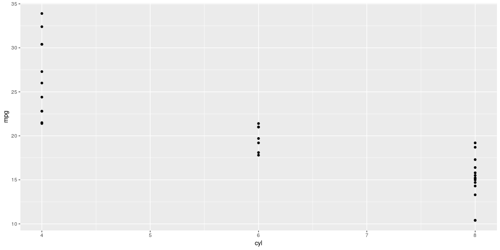<!-- -->

```r
###Exploring ggplot2, Part 2
# Load the ggplot2 package
library(ggplot2)

# Change the command below so that cyl is treated as factor
ggplot(mtcars, aes(x = factor(cyl), y = mpg)) +
  geom_point()
```

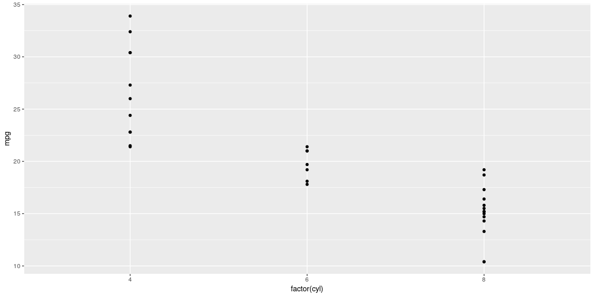<!-- -->

```r
###Exploring ggplot2, Part 3
# A scatter plot has been made for you
ggplot(mtcars, aes(x = wt, y = mpg)) +
  geom_point()
```

<!-- -->

```r
# Replace ___ with the correct vector
ggplot(mtcars, aes(x = wt, y = mpg, col = disp)) +
  geom_point()
```

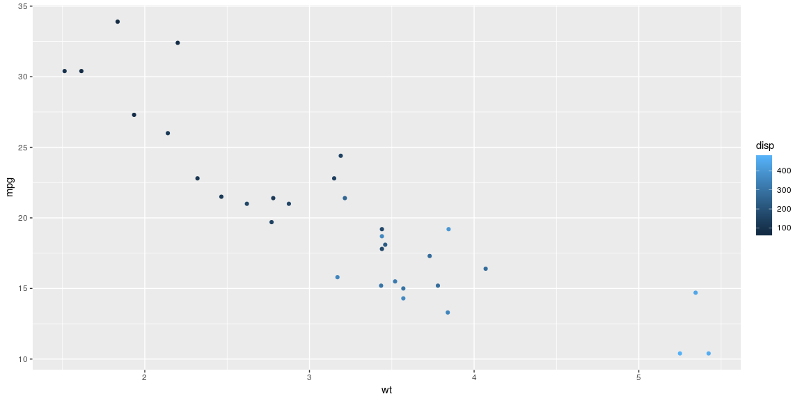<!-- -->

```r
# Replace ___ with the correct vector
ggplot(mtcars, aes(x = wt, y = mpg, size = disp)) +
  geom_point()
```

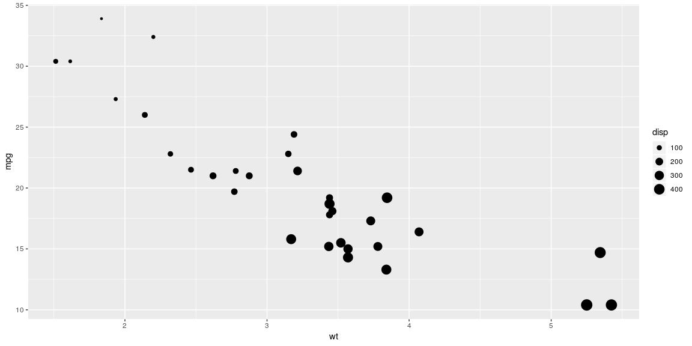<!-- -->

```r
###Understanding Variables
#Expecting an error
#ggplot(mtcars, aes(x = wt, y = mpg, shape = disp)) + geom_point()

###Exploring ggplot2, Part 4
# Explore the diamonds data frame with str()
str(diamonds)
```

```
## Classes 'tbl_df', 'tbl' and 'data.frame':	53940 obs. of  10 variables:
##  $ carat  : num  0.23 0.21 0.23 0.29 0.31 0.24 0.24 0.26 0.22 0.23 ...
##  $ cut    : Ord.factor w/ 5 levels "Fair"<"Good"<..: 5 4 2 4 2 3 3 3 1 3 ...
##  $ color  : Ord.factor w/ 7 levels "D"<"E"<"F"<"G"<..: 2 2 2 6 7 7 6 5 2 5 ...
##  $ clarity: Ord.factor w/ 8 levels "I1"<"SI2"<"SI1"<..: 2 3 5 4 2 6 7 3 4 5 ...
##  $ depth  : num  61.5 59.8 56.9 62.4 63.3 62.8 62.3 61.9 65.1 59.4 ...
##  $ table  : num  55 61 65 58 58 57 57 55 61 61 ...
##  $ price  : int  326 326 327 334 335 336 336 337 337 338 ...
##  $ x      : num  3.95 3.89 4.05 4.2 4.34 3.94 3.95 4.07 3.87 4 ...
##  $ y      : num  3.98 3.84 4.07 4.23 4.35 3.96 3.98 4.11 3.78 4.05 ...
##  $ z      : num  2.43 2.31 2.31 2.63 2.75 2.48 2.47 2.53 2.49 2.39 ...
```

```r
# Add geom_point() with +
ggplot(diamonds, aes(x = carat, y = price))  +
  geom_point()
```

<!-- -->

```r
# Add geom_point() and geom_smooth() with +
ggplot(diamonds, aes(x = carat, y = price)) +
  geom_point() +
  geom_smooth()
```

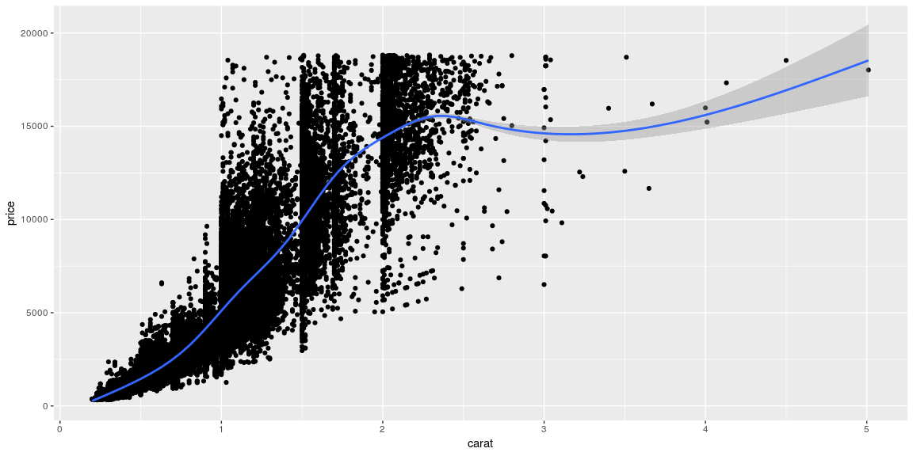<!-- -->

```r
###Exploring ggplot2, Part 5
# The plot you created in the previous exercise
ggplot(diamonds, aes(x = carat, y = price)) +
  geom_point() +
  geom_smooth()
```

<!-- -->

```r
# Copy the above command but show only the smooth line
ggplot(diamonds, aes(x = carat, y = price)) +
  geom_smooth()
```

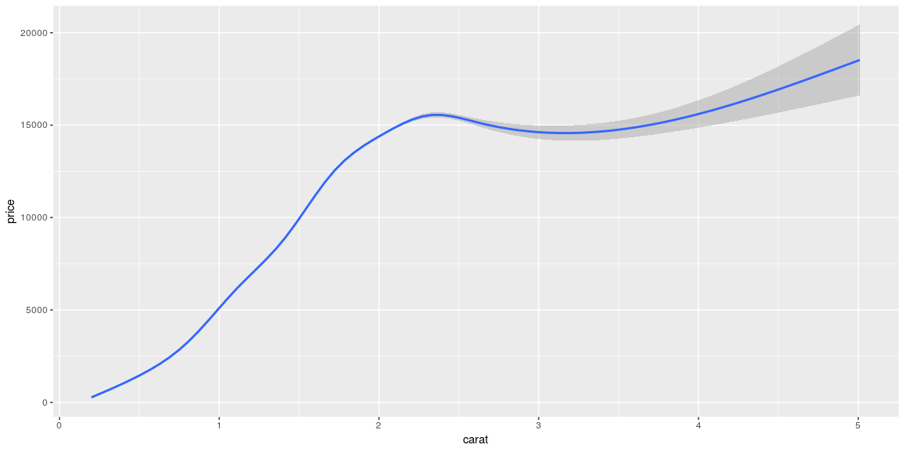<!-- -->

```r
# Copy the above command and assign the correct value to col in aes()
ggplot(diamonds, aes(x = carat, y = price, col = clarity)) +
  geom_smooth()
```

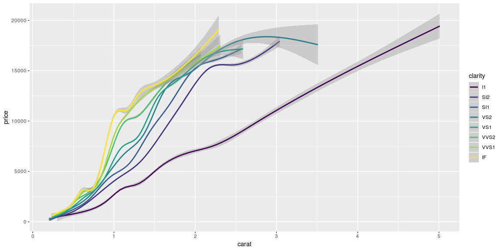<!-- -->

```r
# Keep the color settings from previous command. Plot only the points with argument alpha.
ggplot(diamonds, aes(x = carat, y = price, col = clarity)) +
  geom_point(alpha = 0.4)
```

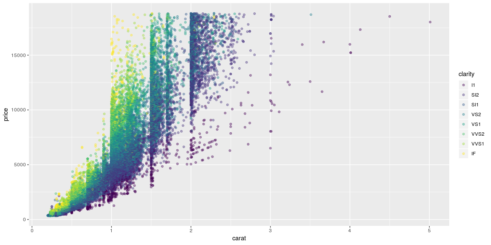<!-- -->

```r
###Understanding The Grammar, Part 1
# Create the object containing the data and aes layers: dia_plot
dia_plot <- ggplot(diamonds, aes(x = carat, y = price))

# Add a geom layer with + and geom_point()
dia_plot + geom_point()
```

<!-- -->

```r
# Add the same geom layer, but with aes() inside
dia_plot + geom_point(aes(col = clarity))
```

<!-- -->

```r
###Understanding The Grammar, Part 2
set.seed(1)

# The dia_plot object has been created for you
dia_plot <- ggplot(diamonds, aes(x = carat, y = price))

# Expand dia_plot by adding geom_point() with alpha set to 0.2
dia_plot <- dia_plot + 
  geom_point(alpha = 0.2)

# Plot dia_plot with additional geom_smooth() with se set to FALSE
dia_plot + geom_smooth(se = FALSE)
```

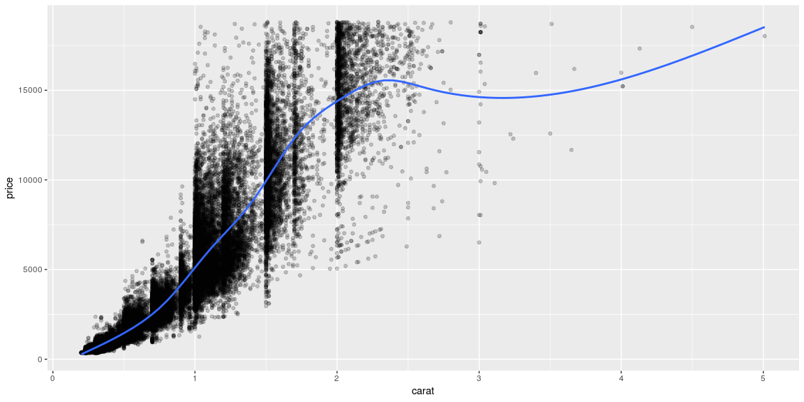<!-- -->

```r
# Copy the command from above and add aes() with the correct mapping to geom_smooth()
dia_plot + geom_smooth(aes(col = clarity), se = FALSE)
```

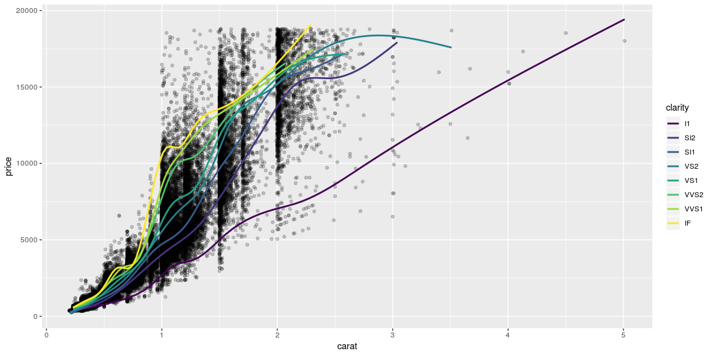<!-- -->

## Data


```r
###Chapter 2 Data

###base Package and ggplot2, Part 1 - Plot
# Plot the correct variables of mtcars
plot(mtcars$wt, mtcars$mpg, col = mtcars$cyl)
```

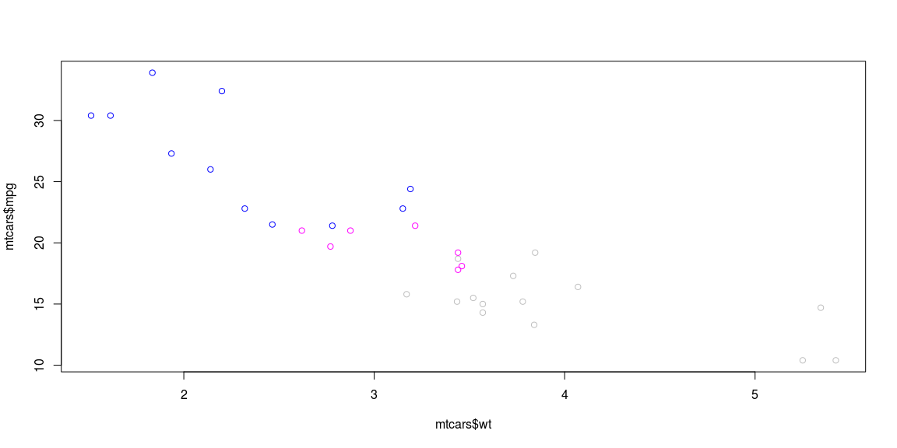<!-- -->

```r
# Change cyl inside mtcars to a factor
mtcars$fcyl <- as.factor(mtcars$cyl)

# Make the same plot as in the first instruction
plot(mtcars$wt, mtcars$mpg, col = mtcars$fcyl)

###base Package And ggplot2, Part 2 - lm
# Basic plot
mtcars$cyl <- as.factor(mtcars$cyl)
plot(mtcars$wt, mtcars$mpg, col = mtcars$cyl)

# Use lm() to calculate a linear model and save it as carModel
carModel <- lm(mpg ~ wt, data = mtcars)

# Call abline() with carModel as first argument and lty as second
abline(carModel, lty = 2)

# Plot each subset efficiently with lapply
# You don't have to edit this code
lapply(mtcars$cyl, function(x) {
  abline(lm(mpg ~ wt, mtcars, subset = (cyl == x)), col = x)
})
```

```
## [[1]]
## NULL
## 
## [[2]]
## NULL
## 
## [[3]]
## NULL
## 
## [[4]]
## NULL
## 
## [[5]]
## NULL
## 
## [[6]]
## NULL
## 
## [[7]]
## NULL
## 
## [[8]]
## NULL
## 
## [[9]]
## NULL
## 
## [[10]]
## NULL
## 
## [[11]]
## NULL
## 
## [[12]]
## NULL
## 
## [[13]]
## NULL
## 
## [[14]]
## NULL
## 
## [[15]]
## NULL
## 
## [[16]]
## NULL
## 
## [[17]]
## NULL
## 
## [[18]]
## NULL
## 
## [[19]]
## NULL
## 
## [[20]]
## NULL
## 
## [[21]]
## NULL
## 
## [[22]]
## NULL
## 
## [[23]]
## NULL
## 
## [[24]]
## NULL
## 
## [[25]]
## NULL
## 
## [[26]]
## NULL
## 
## [[27]]
## NULL
## 
## [[28]]
## NULL
## 
## [[29]]
## NULL
## 
## [[30]]
## NULL
## 
## [[31]]
## NULL
## 
## [[32]]
## NULL
```

```r
# This code will draw the legend of the plot
# You don't have to edit this code
legend(x = 5, y = 33, legend = levels(mtcars$cyl), 
       col = 1:3, pch = 1, bty = "n")
```

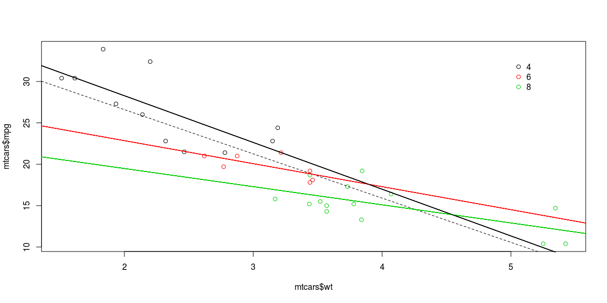<!-- -->

```r
###base Package And ggplot2, Part 3
# Convert cyl to factor
mtcars$cyl <- as.factor(mtcars$cyl)

# Example from base R
plot(mtcars$wt, mtcars$mpg, col = mtcars$cyl)
abline(lm(mpg ~ wt, data = mtcars), lty = 2)
lapply(mtcars$cyl, function(x) {
  abline(lm(mpg ~ wt, mtcars, subset = (cyl == x)), col = x)
})
```

```
## [[1]]
## NULL
## 
## [[2]]
## NULL
## 
## [[3]]
## NULL
## 
## [[4]]
## NULL
## 
## [[5]]
## NULL
## 
## [[6]]
## NULL
## 
## [[7]]
## NULL
## 
## [[8]]
## NULL
## 
## [[9]]
## NULL
## 
## [[10]]
## NULL
## 
## [[11]]
## NULL
## 
## [[12]]
## NULL
## 
## [[13]]
## NULL
## 
## [[14]]
## NULL
## 
## [[15]]
## NULL
## 
## [[16]]
## NULL
## 
## [[17]]
## NULL
## 
## [[18]]
## NULL
## 
## [[19]]
## NULL
## 
## [[20]]
## NULL
## 
## [[21]]
## NULL
## 
## [[22]]
## NULL
## 
## [[23]]
## NULL
## 
## [[24]]
## NULL
## 
## [[25]]
## NULL
## 
## [[26]]
## NULL
## 
## [[27]]
## NULL
## 
## [[28]]
## NULL
## 
## [[29]]
## NULL
## 
## [[30]]
## NULL
## 
## [[31]]
## NULL
## 
## [[32]]
## NULL
```

```r
legend(x = 5, y = 33, legend = levels(mtcars$cyl), 
       col = 1:3, pch = 1, bty = "n")
```

<!-- -->

```r
# Add geom_point() to this command to create a scatter plot
ggplot(mtcars, aes(x = wt, y = mpg, col = cyl)) +
  geom_point()
```

<!-- -->

```r
# Copy, paste and expand previous command to include the lines of the linear models, per cyl
ggplot(mtcars, aes(x = wt, y = mpg, col = cyl)) +
  geom_point() +
  geom_smooth(method = "lm", se = FALSE)
```

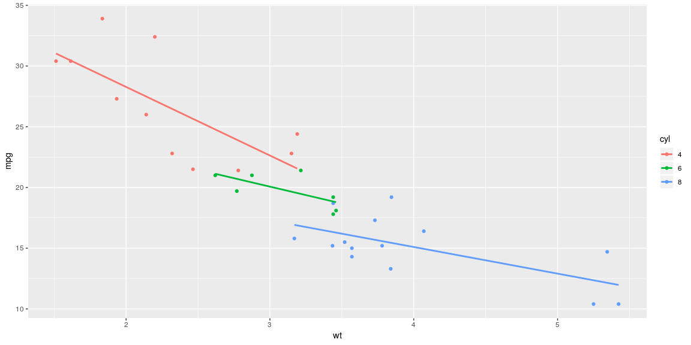<!-- -->

```r
# Copy, paste and expand previous command to include a lm for the entire dataset in its whole
ggplot(mtcars, aes(x = wt, y = mpg, col = cyl)) +
  geom_point() +
  geom_smooth(method = "lm", se = FALSE) +
  geom_smooth(aes(group = 1), method = "lm", se = FALSE, linetype = 2)
```

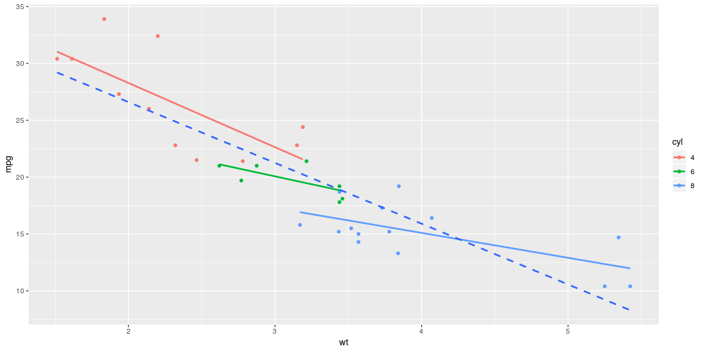<!-- -->

```r
###Plotting The ggplot2 Way
# Option 1
#ggplot(iris, aes(x = Sepal.Length, y = Sepal.Width)) +
 # geom_point() +
  #geom_point(aes(x = Petal.Length, y = Petal.Width), col = "red")

# Option 2
#ggplot(iris.wide, aes(x = Length, y = Width, col = Part)) +
 # geom_point()

###Variables To Visuals, Part 1
# Consider the structure of iris, iris.wide and iris.tidy (in that order)
iris.wide <- read.csv("iris.wide.csv")
iris.tidy <- read.csv("iris.tidy.csv")
str(iris)
```

```
## 'data.frame':	150 obs. of  5 variables:
##  $ Sepal.Length: num  5.1 4.9 4.7 4.6 5 5.4 4.6 5 4.4 4.9 ...
##  $ Sepal.Width : num  3.5 3 3.2 3.1 3.6 3.9 3.4 3.4 2.9 3.1 ...
##  $ Petal.Length: num  1.4 1.4 1.3 1.5 1.4 1.7 1.4 1.5 1.4 1.5 ...
##  $ Petal.Width : num  0.2 0.2 0.2 0.2 0.2 0.4 0.3 0.2 0.2 0.1 ...
##  $ Species     : Factor w/ 3 levels "setosa","versicolor",..: 1 1 1 1 1 1 1 1 1 1 ...
```

```r
str(iris.wide)
```

```
## 'data.frame':	300 obs. of  5 variables:
##  $ X      : int  1 2 3 4 5 6 7 8 9 10 ...
##  $ Species: Factor w/ 3 levels "setosa","versicolor",..: 1 1 1 1 1 1 1 1 1 1 ...
##  $ Part   : Factor w/ 2 levels "Petal","Sepal": 1 1 1 1 1 1 1 1 1 1 ...
##  $ Length : num  1.4 1.4 1.3 1.5 1.4 1.7 1.4 1.5 1.4 1.5 ...
##  $ Width  : num  0.2 0.2 0.2 0.2 0.2 0.4 0.3 0.2 0.2 0.1 ...
```

```r
str(iris.tidy)
```

```
## 'data.frame':	600 obs. of  5 variables:
##  $ X      : int  1 2 3 4 5 6 7 8 9 10 ...
##  $ Species: Factor w/ 3 levels "setosa","versicolor",..: 1 1 1 1 1 1 1 1 1 1 ...
##  $ Part   : Factor w/ 2 levels "Petal","Sepal": 2 2 2 2 2 2 2 2 2 2 ...
##  $ Measure: Factor w/ 2 levels "Length","Width": 1 1 1 1 1 1 1 1 1 1 ...
##  $ Value  : num  5.1 4.9 4.7 4.6 5 5.4 4.6 5 4.4 4.9 ...
```

```r
# Think about which dataset you would use to get the plot shown right
# Fill in the ___ to produce the plot given to the right
ggplot(iris.tidy, aes(x = Species, y = Value, col = Part)) +
  geom_jitter() +
  facet_grid(. ~ Measure)
```

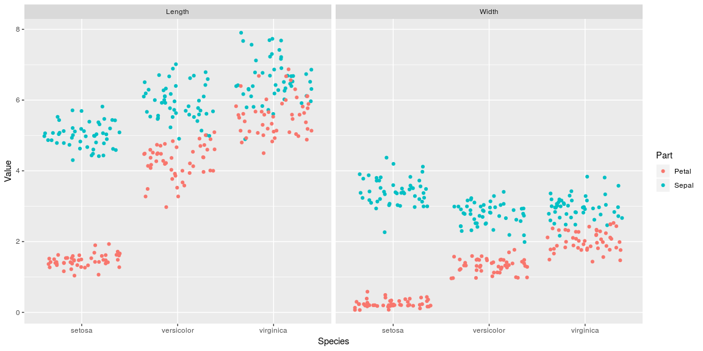<!-- -->

```r
###Variables To Visuals, Part 1b
# Load the tidyr package
library(tidyr)

# Fill in the ___ to produce to the correct iris.tidy dataset
iris.tidy <- iris %>%
  gather(key, Value, -Species) %>%
  separate(key, c("Part", "Measure"), "\\.")

###Variables To Visuals, Part 2
# Consider the head of iris, iris.wide and iris.tidy (in that order)
head(iris)
```

```
##   Sepal.Length Sepal.Width Petal.Length Petal.Width Species
## 1          5.1         3.5          1.4         0.2  setosa
## 2          4.9         3.0          1.4         0.2  setosa
## 3          4.7         3.2          1.3         0.2  setosa
## 4          4.6         3.1          1.5         0.2  setosa
## 5          5.0         3.6          1.4         0.2  setosa
## 6          5.4         3.9          1.7         0.4  setosa
```

```r
head(iris.wide)
```

```
##   X Species  Part Length Width
## 1 1  setosa Petal    1.4   0.2
## 2 2  setosa Petal    1.4   0.2
## 3 3  setosa Petal    1.3   0.2
## 4 4  setosa Petal    1.5   0.2
## 5 5  setosa Petal    1.4   0.2
## 6 6  setosa Petal    1.7   0.4
```

```r
head(iris.tidy)
```

```
##   Species  Part Measure Value
## 1  setosa Sepal  Length   5.1
## 2  setosa Sepal  Length   4.9
## 3  setosa Sepal  Length   4.7
## 4  setosa Sepal  Length   4.6
## 5  setosa Sepal  Length   5.0
## 6  setosa Sepal  Length   5.4
```

```r
# Think about which dataset you would use to get the plot shown right
# Fill in the ___ to produce the plot given to the right
ggplot(iris.wide, aes(x = Length, y = Width, col = Part)) +
  geom_jitter() +
  facet_grid(. ~ Species)
```

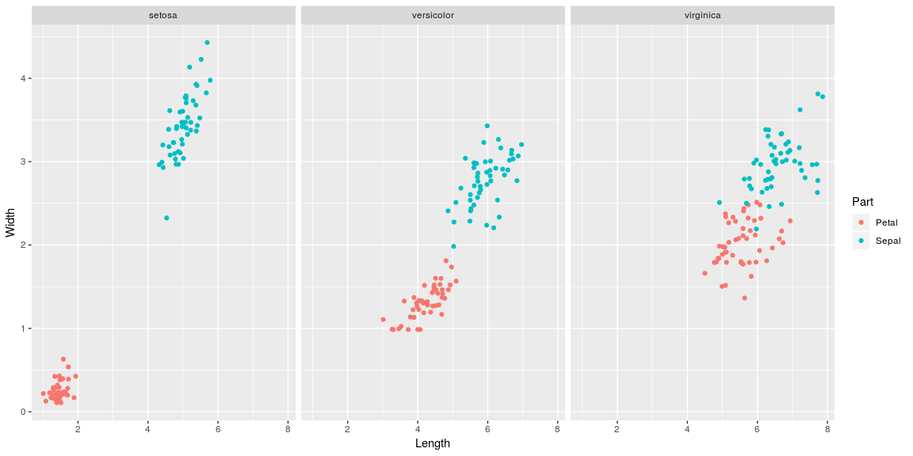<!-- -->

```r
###Variables To Visuals, Part 2b
# Load the tidyr package
library(tidyr)

# Add a new column, Flower, to iris that contains unique ids
iris$Flower <- 1:nrow(iris)

# Fill in the ___ to produce to the correct iris.wide dataset
iris.wide <- iris %>%
  gather(key, value, -Species, -Flower) %>%
  separate(key, c("Part", "Measure"), "\\.") %>%
  spread(Measure, value)
```

## Aesthetics


```r
###Chapter 3 Aesthetics

###All About Aesthetics, Part 1
# 1 - Map mpg to x and cyl to y
ggplot(mtcars, aes(x = mpg, y = cyl)) +
  geom_point()
```

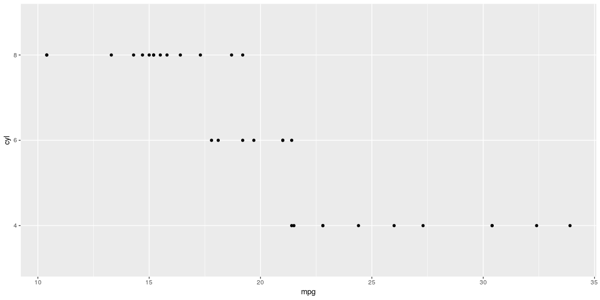<!-- -->

```r
# 2 - Reverse: Map cyl to x and mpg to y
ggplot(mtcars, aes(x = cyl, y = mpg)) +
  geom_point()
```

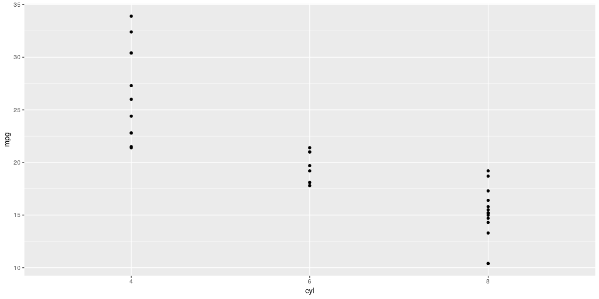<!-- -->

```r
# 3 - Map wt to x, mpg to y and cyl to col
ggplot(mtcars, aes(x = wt, y = mpg, col = cyl)) +
  geom_point()
```

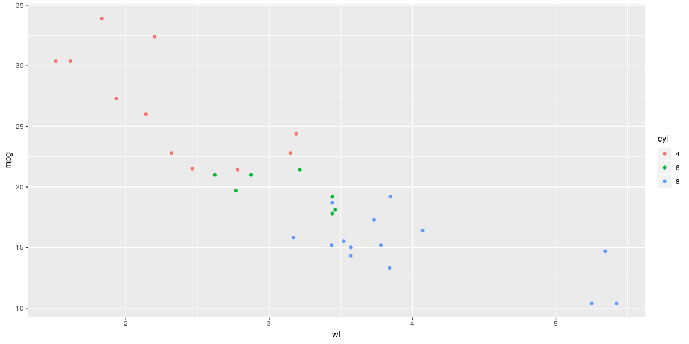<!-- -->

```r
# Change shape and size of the points in the above plot
ggplot(mtcars, aes(x = wt, y = mpg, col = cyl)) +
  geom_point(shape = 1, size = 4)
```

<!-- -->

```r
###All About Aesthetics, Part 2
# am and cyl are factors, wt is numeric
class(mtcars$am)
```

```
## [1] "numeric"
```

```r
class(mtcars$cyl)
```

```
## [1] "factor"
```

```r
class(mtcars$wt)
```

```
## [1] "numeric"
```

```r
# Given from the previous exercise
ggplot(mtcars, aes(x = wt, y = mpg, col = cyl)) +
  geom_point(shape = 1, size = 4)
```

<!-- -->

```r
# 1 - Map cyl to fill
ggplot(mtcars, aes(x = wt, y = mpg, fill = cyl)) +
  geom_point(shape = 1, size = 4)
```

<!-- -->

```r
# 2 - Change shape and alpha of the points in the above plot
ggplot(mtcars, aes(x = wt, y = mpg, fill = cyl)) +
  geom_point(shape = 21, size = 4, alpha = 0.6)
```

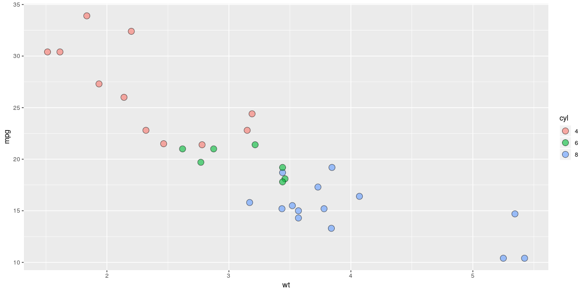<!-- -->

```r
# 3 - Map am to col in the above plot
ggplot(mtcars, aes(x = wt, y = mpg, fill = cyl, col = am)) +
  geom_point(shape = 21, size = 4, alpha = 0.6)
```

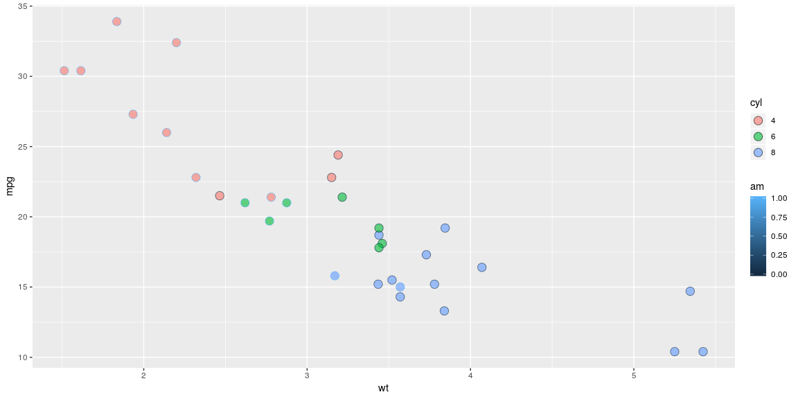<!-- -->

```r
###All About Aesthetics, Part 3
# Map cyl to size
ggplot(mtcars, aes(x = wt, y = mpg, size = cyl)) +
  geom_point()
```

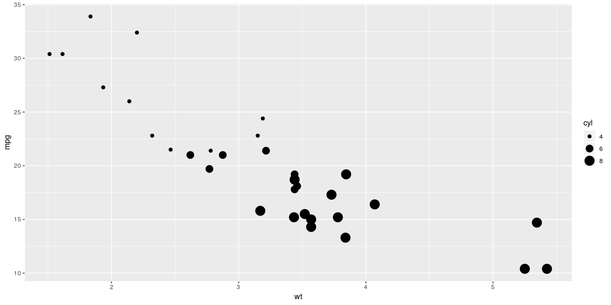<!-- -->

```r
# Map cyl to alpha
ggplot(mtcars, aes(x = wt, y = mpg, alpha = cyl)) +
  geom_point()
```

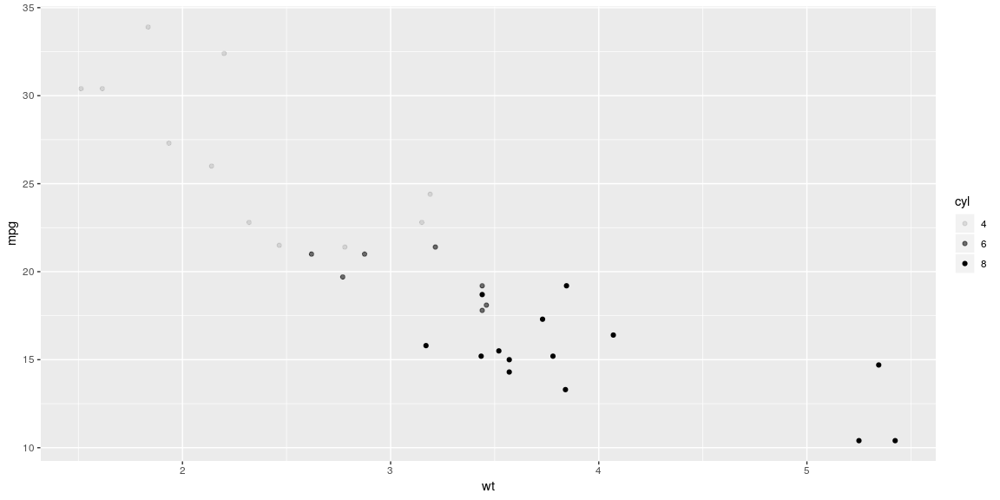<!-- -->

```r
# Map cyl to shape 
ggplot(mtcars, aes(x = wt, y = mpg, shape = cyl)) +
  geom_point()
```

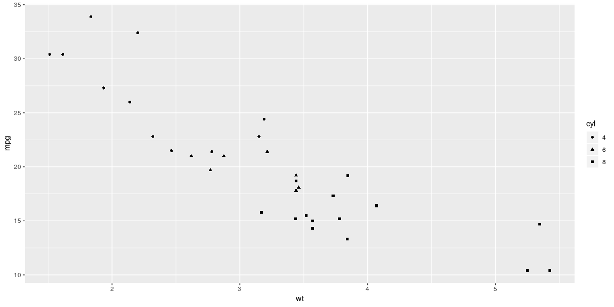<!-- -->

```r
# Map cyl to labels
ggplot(mtcars, aes(x = wt, y = mpg, label = cyl)) +
  geom_text()
```

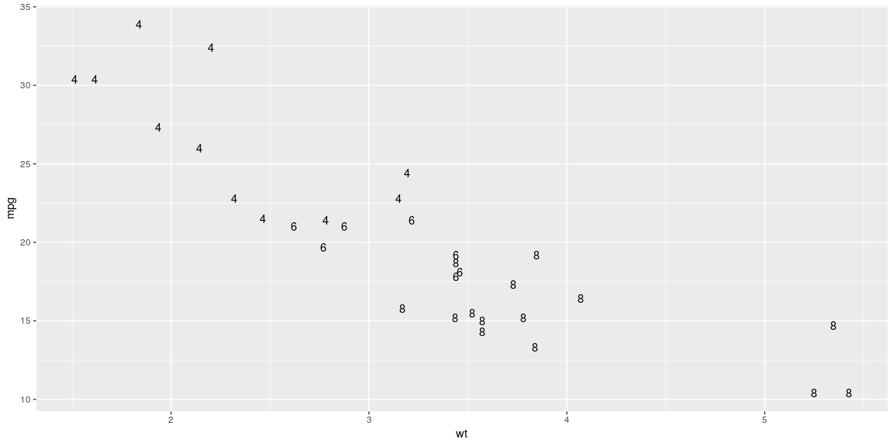<!-- -->

```r
###All About Attributes, Part 1
# Define a hexadecimal color
my_color <- "#4ABEFF"

# Set the color aesthetic 
ggplot(mtcars, aes(x = wt, y = mpg, color = cyl)) +
  geom_point()
```

<!-- -->

```r
# Set the color aesthetic and attribute 
ggplot(mtcars, aes(x = wt, y = mpg, color = cyl)) +
  geom_point(color = my_color)
```

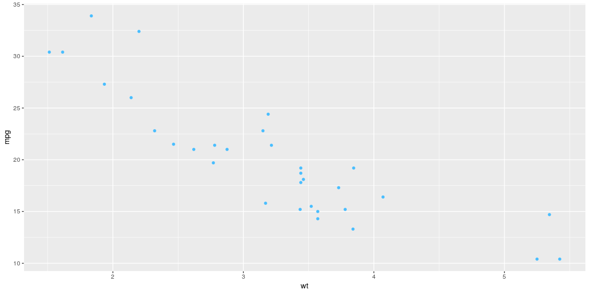<!-- -->

```r
# Set the fill aesthetic and color, size and shape attributes
ggplot(mtcars, aes(x = wt, y = mpg, fill = cyl)) +
  geom_point(size = 10, shape = 23, color = my_color)
```

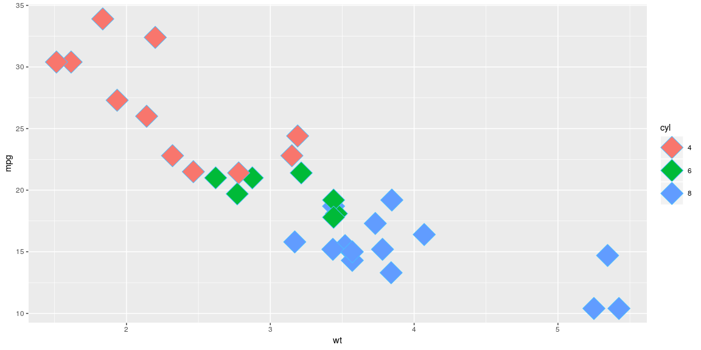<!-- -->

```r
###All About Attributes, Part 2
# Expand to draw points with alpha 0.5
ggplot(mtcars, aes(x = wt, y = mpg, fill = cyl)) +
  geom_point(alpha = 0.5)
```

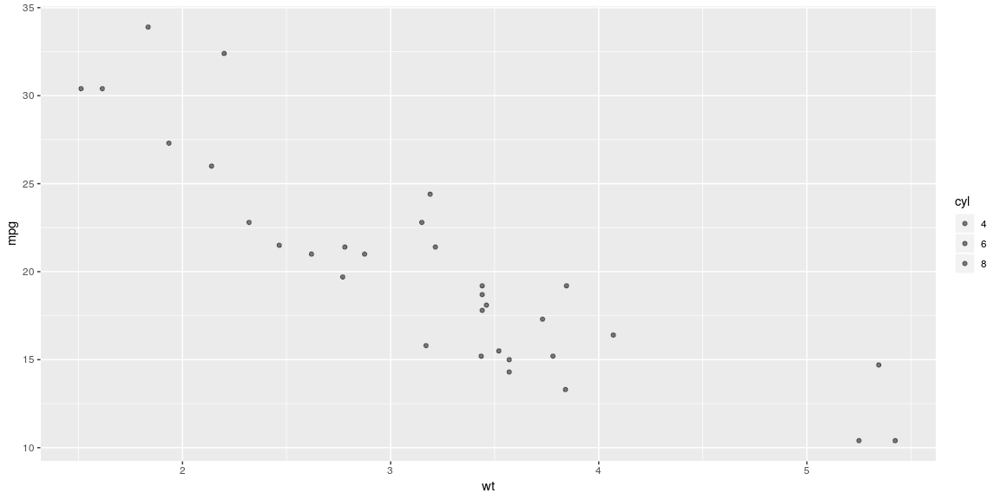<!-- -->

```r
# Expand to draw points with shape 24 and color yellow
ggplot(mtcars, aes(x = wt, y = mpg, fill = cyl)) +
  geom_point(shape = 24, color = 'yellow')
```

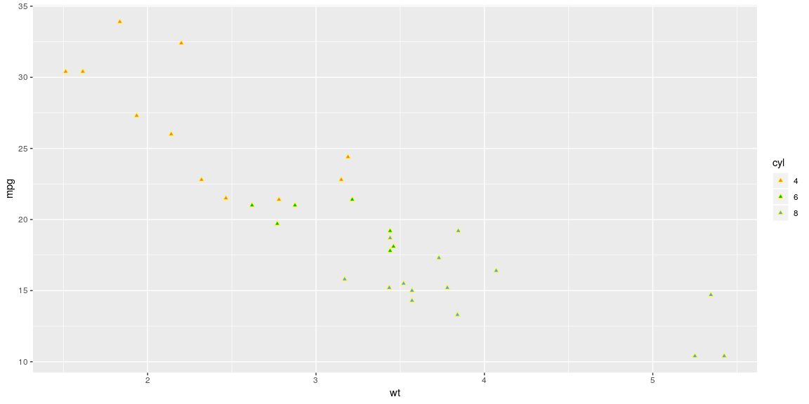<!-- -->

```r
# Expand to draw text with label x, color red and size 10
ggplot(mtcars, aes(x = wt, y = mpg, fill = cyl)) +
  geom_text(label = "x", color = 'red', size = 10)
```

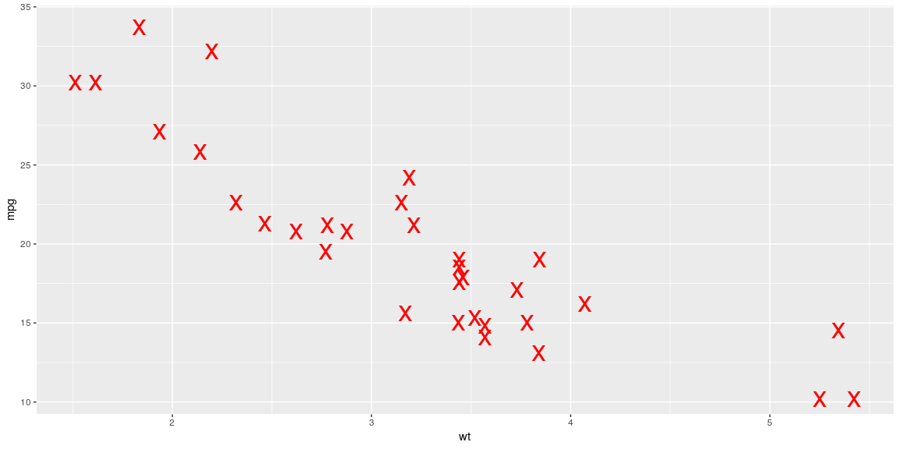<!-- -->

```r
###Going All Out
# Map mpg onto x, qsec onto y and factor(cyl) onto col
ggplot(mtcars, aes(x = mpg, y = qsec, col = factor(cyl))) +
  geom_point()
```

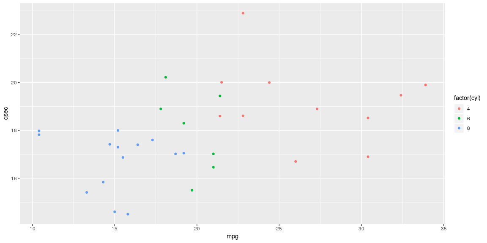<!-- -->

```r
# Add mapping: factor(am) onto shape
ggplot(mtcars, aes(x = mpg, y = qsec, col = factor(cyl), shape = factor(am))) +
  geom_point()
```

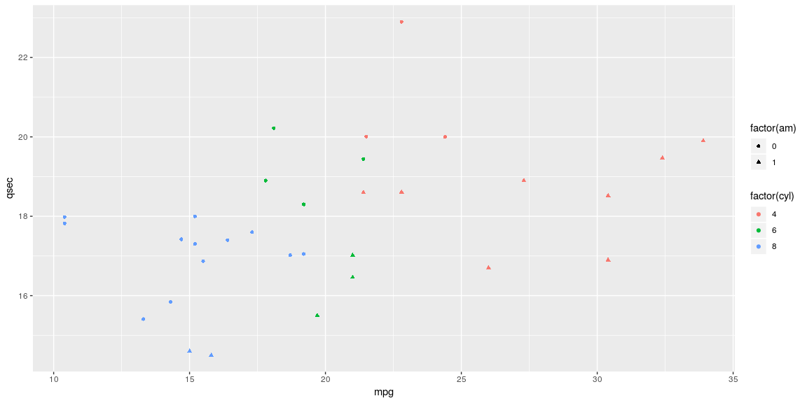<!-- -->

```r
# Add mapping: (hp/wt) onto size
ggplot(mtcars, aes(x = mpg, y = qsec, col = factor(cyl), shape = factor(am), size = (hp/wt))) +
  geom_point()
```

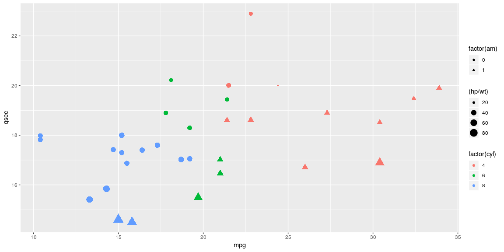<!-- -->

```r
###Position
# The base layer, cyl.am, is available for you
cyl.am <- ggplot(mtcars, aes(x = factor(cyl), fill = factor(am)))
# Add geom (position = "stack" by default)
cyl.am + 
  geom_bar()
```

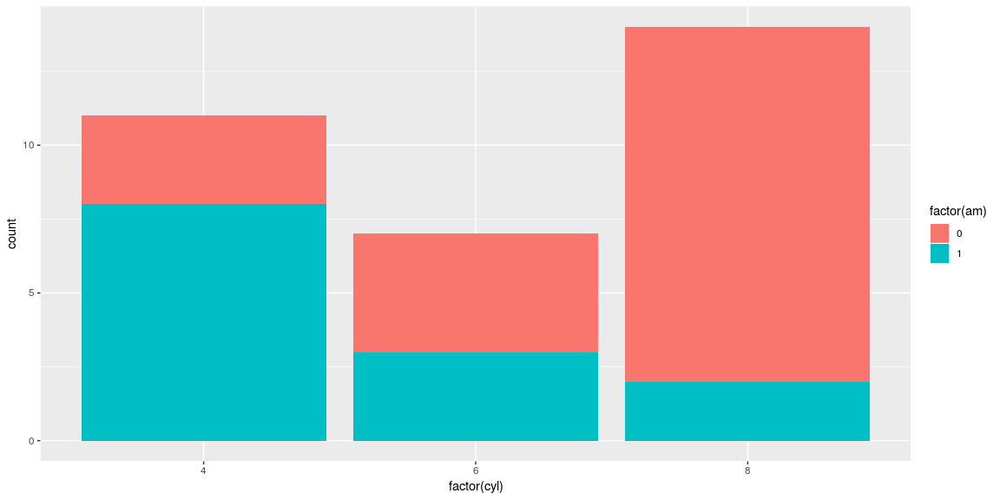<!-- -->

```r
# Fill - show proportion
cyl.am + 
  geom_bar(position = "fill")  
```

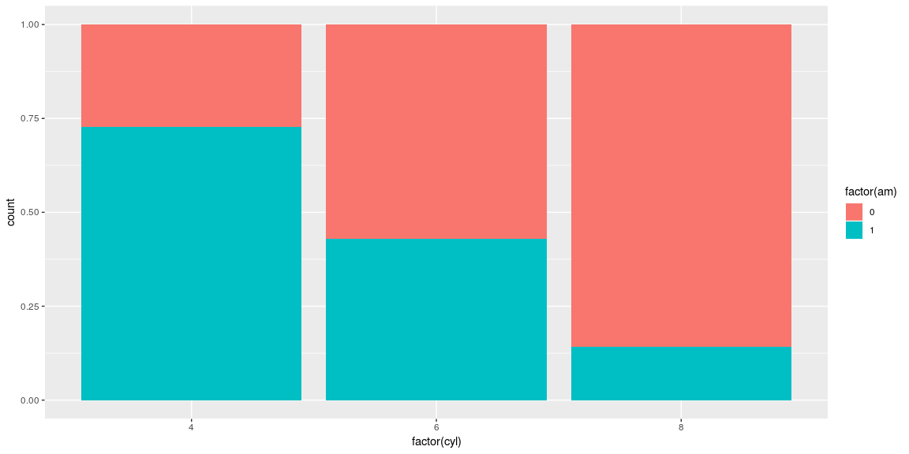<!-- -->

```r
# Dodging - principles of similarity and proximity
cyl.am +
  geom_bar(position = "dodge") 
```

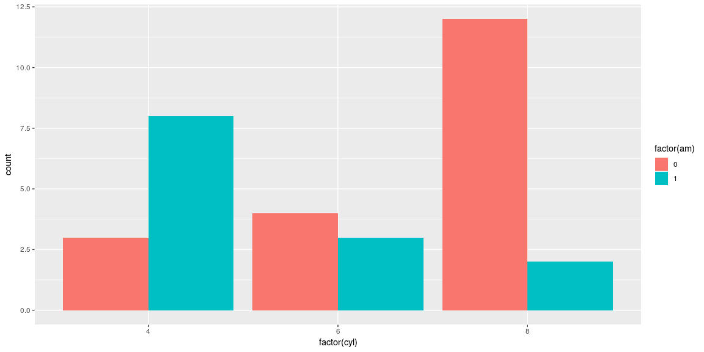<!-- -->

```r
# Clean up the axes with scale_ functions
val = c("#E41A1C", "#377EB8")
lab = c("Manual", "Automatic")
cyl.am +
  geom_bar(position = "dodge") +
  scale_x_discrete("Cylinders") + 
  scale_y_continuous("Number") +
  scale_fill_manual("Transmission", 
                    values = val,
                    labels = lab) 
```

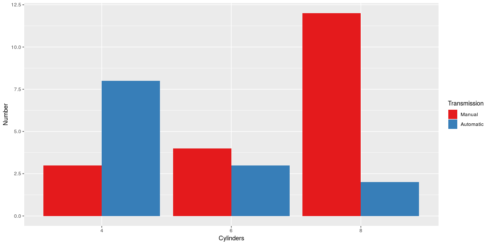<!-- -->

```r
###Setting A Dummy Aesthetic
# 1 - Create jittered plot of mtcars, mpg onto x, 0 onto y
ggplot(mtcars, aes(x = mpg, y = 0)) +
  geom_jitter()
```

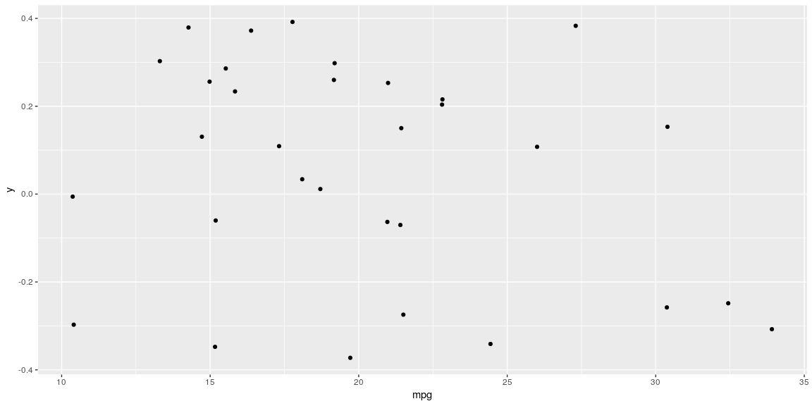<!-- -->

```r
# 2 - Add function to change y axis limits
ggplot(mtcars, aes(x = mpg, y = 0)) +
  geom_jitter() +
  scale_y_continuous(limits = c(-2,2))
```

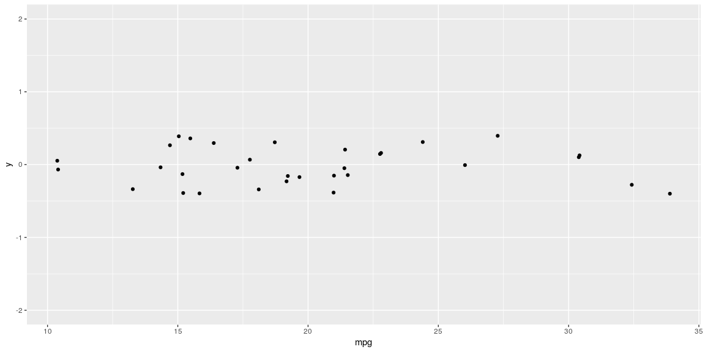<!-- -->

```r
###Overplotting 1 - Point Shape And Transparency
# Basic scatter plot of wt on x-axis and mpg on y-axis; map cyl to col
ggplot(mtcars, aes(x = wt, y = mpg, color = cyl)) +
  geom_point(size = 4)
```

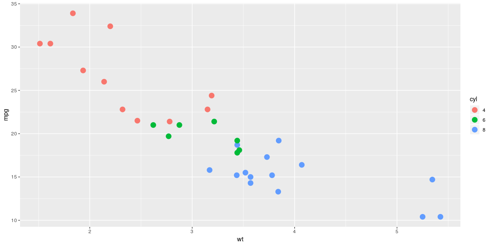<!-- -->

```r
# Hollow circles - an improvement
ggplot(mtcars, aes(x = wt, y = mpg, color = cyl)) +
  geom_point(size = 4, shape = 1)
```

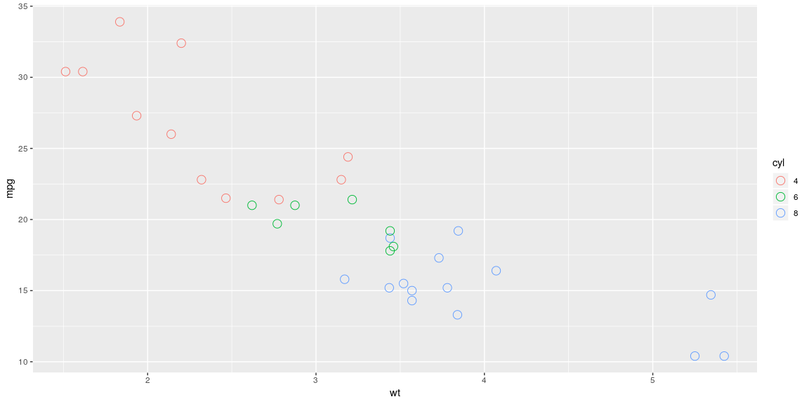<!-- -->

```r
# Add transparency - very nice
ggplot(mtcars, aes(x = wt, y = mpg, color = cyl)) +
  geom_point(size = 4, alpha = 0.6)
```

<!-- -->

```r
###Overplotting 2 - Alpha With Large Datasets
# Scatter plot: carat (x), price (y), clarity (col)
ggplot(diamonds, aes(x = carat, y = price, col = clarity)) +
  geom_point()
```

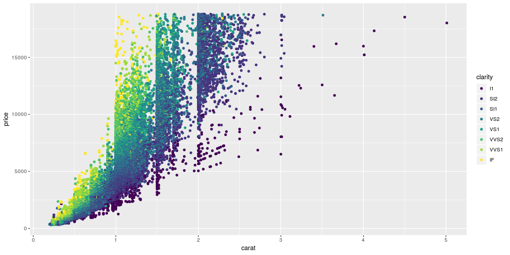<!-- -->

```r
# Adjust for overplotting
ggplot(diamonds, aes(x = carat, y = price, col = clarity)) +
  geom_point(alpha = 0.5)
```

<!-- -->

```r
# Scatter plot: clarity (x), carat (y), price (col)
ggplot(diamonds, aes(x = clarity, y = carat, col = price)) +
  geom_point(alpha = 0.5)
```

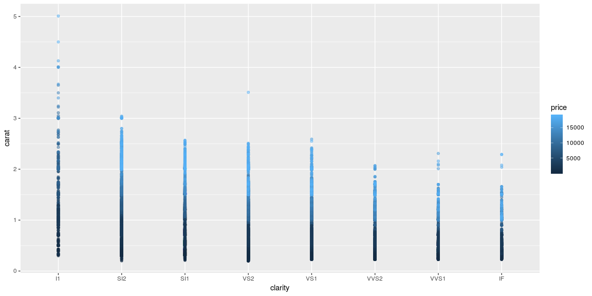<!-- -->

```r
# Dot plot with jittering
ggplot(diamonds, aes(x = clarity, y = carat, col = price)) +
  geom_point(alpha = 0.5, position = "jitter")
```

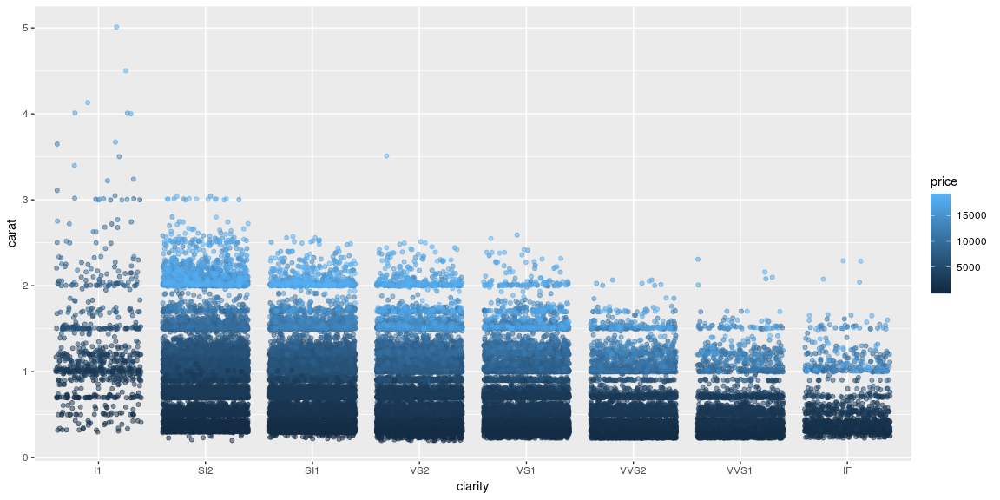<!-- -->

## Geom


```r
###Chapter 4 Geometries

###Scatter Plots And Jittering (1)
# Plot the cyl on the x-axis and wt on the y-axis
ggplot(mtcars, aes(x = cyl, y = wt)) +
  geom_point()
```

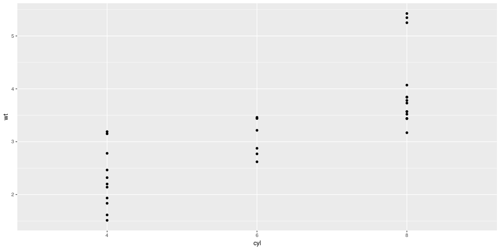<!-- -->

```r
# Try using geom_jitter instead of geom_point:
ggplot(mtcars, aes(x = cyl, y = wt)) +
  geom_jitter()
```

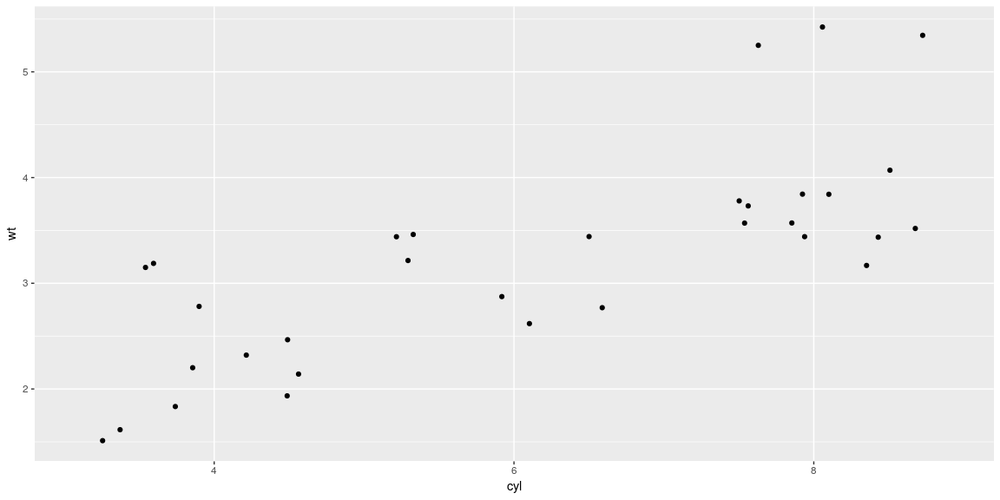<!-- -->

```r
# Define the position object using position_jitter(): posn.j
posn.j <- position_jitter(0.1)

# Use posn.j in geom_point()
ggplot(mtcars, aes(x = cyl, y = wt)) +
  geom_point(position = posn.j)
```

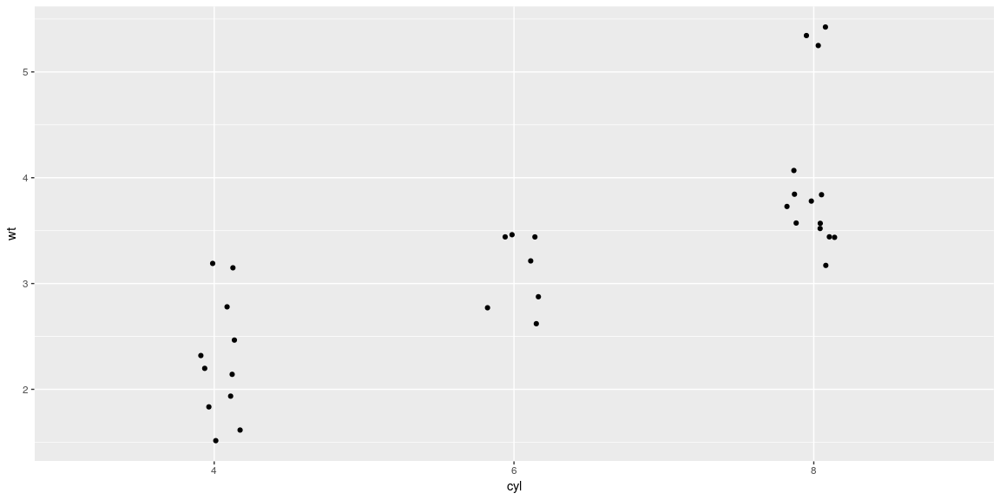<!-- -->

```r
###Scatter Plots And Jittering (2)
# Examine the structure of Vocab
# Vocab dataset is in Data Camp's workspace
# Dataset is from US General Social Surveys from 1972-2004
# Dataset contains data about years of education and integer score on Vocab test

Vocab <- read.csv("Vocab.csv")
str(Vocab)
```

```
## 'data.frame':	21638 obs. of  5 variables:
##  $ X         : int  20040001 20040002 20040003 20040005 20040008 20040010 20040012 20040013 20040016 20040017 ...
##  $ year      : int  2004 2004 2004 2004 2004 2004 2004 2004 2004 2004 ...
##  $ sex       : Factor w/ 2 levels "Female","Male": 1 1 2 1 2 2 1 2 2 1 ...
##  $ education : int  9 14 14 17 14 14 12 10 11 9 ...
##  $ vocabulary: int  3 6 9 8 1 7 6 6 5 1 ...
```

```r
# Basic scatter plot of vocabulary (y) against education (x). Use geom_point()
ggplot(Vocab, aes(x = education, y = vocabulary)) +
  geom_point()
```

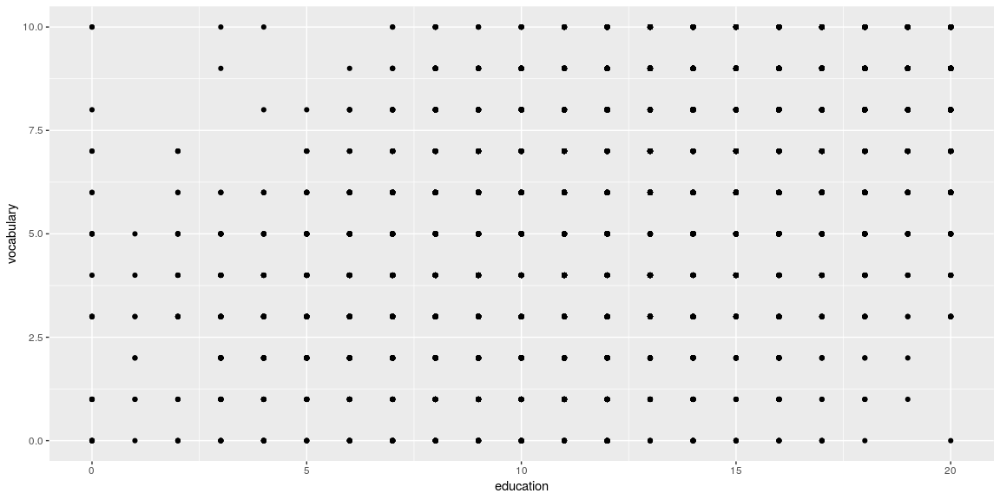<!-- -->

```r
# Use geom_jitter() instead of geom_point()
ggplot(Vocab, aes(x = education, y = vocabulary)) +
  geom_jitter()
```

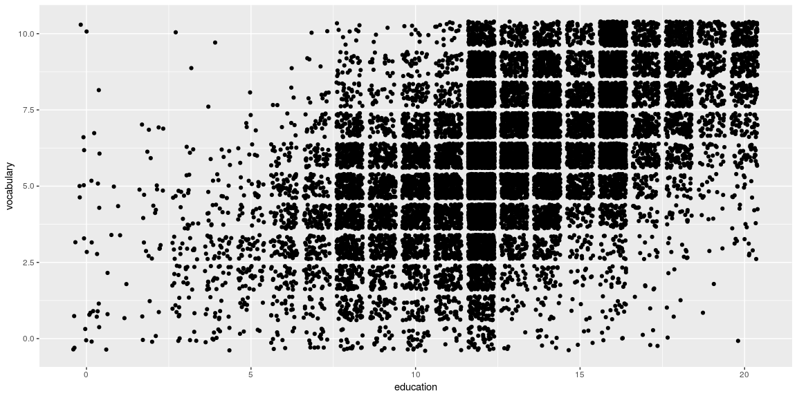<!-- -->

```r
# Using the above plotting command, set alpha to a very low 0.2
ggplot(Vocab, aes(x = education, y = vocabulary)) +
  geom_jitter(alpha = 0.2)
```

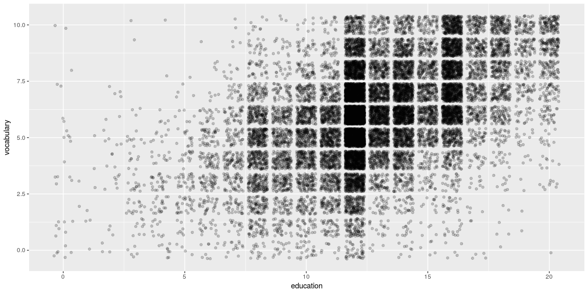<!-- -->

```r
# Using the above plotting command, set the shape to 1
ggplot(Vocab, aes(x = education, y = vocabulary)) +
  geom_jitter(shape = 1)
```

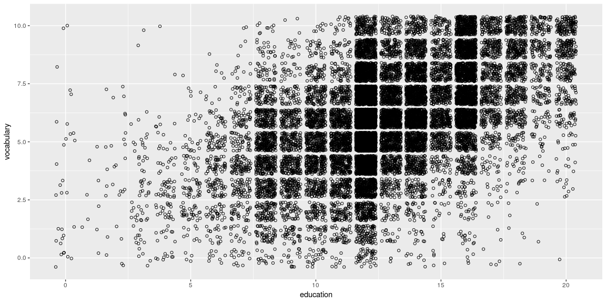<!-- -->

```r
###Histograms
# Make a univariate histogram
ggplot(mtcars, aes(mpg)) +
  geom_histogram()
```

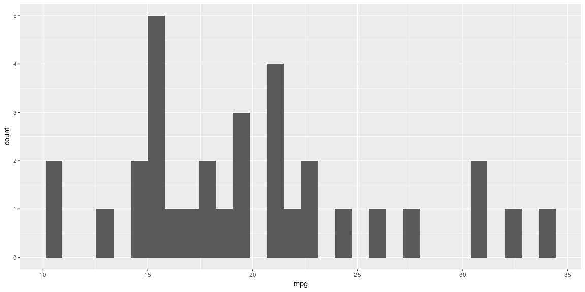<!-- -->

```r
# Change the bin width to 1
ggplot(mtcars, aes(mpg)) +
  geom_histogram(binwidth = 1)
```

<!-- -->

```r
# Change the y aesthetic to density
ggplot(mtcars, aes(mpg)) +
  geom_histogram(aes(y=..density..), binwidth = 1)
```

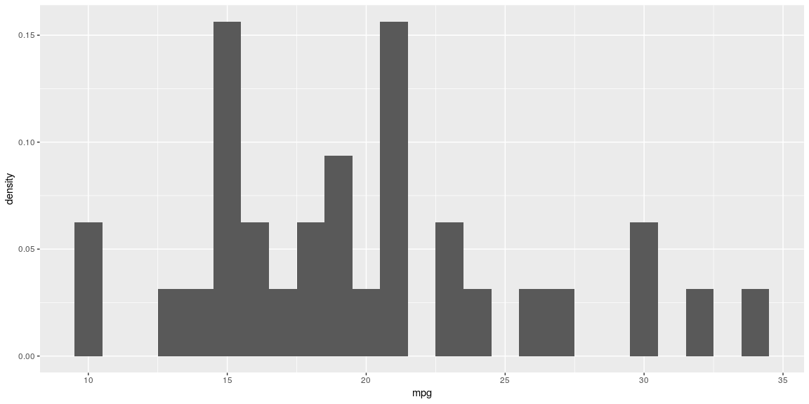<!-- -->

```r
# Custom color code
myBlue <- "#377EB8"

# Change the fill color to myBlue
ggplot(mtcars, aes(mpg)) +
  geom_histogram(aes(y = ..density..),
                 binwidth = 1, fill = myBlue)
```

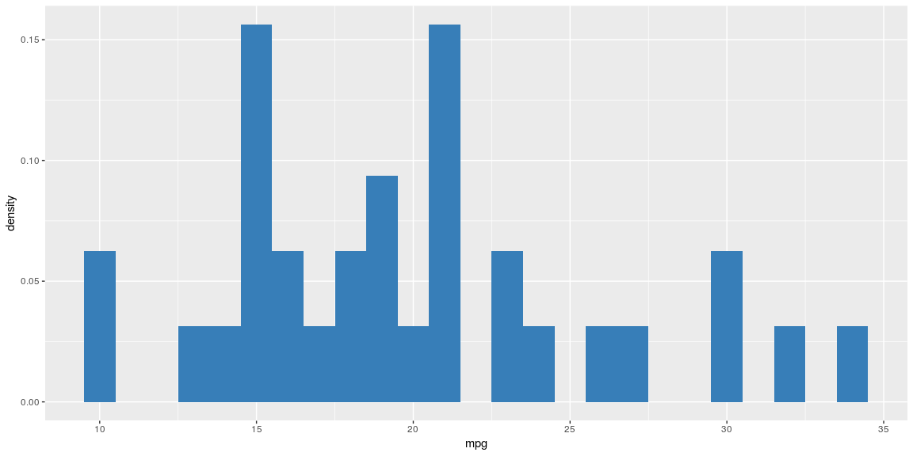<!-- -->

```r
###Position
# Draw a bar plot of cyl, filled according to am
ggplot(mtcars, aes(x = cyl, fill = am)) +
  geom_bar()
```

<!-- -->

```r
# Change the position argument to "stack""
ggplot(mtcars, aes(x = cyl, fill = am)) +
  geom_bar(position = "stack")
```

<!-- -->

```r
# Change the position argument to "fill""
ggplot(mtcars, aes(x = cyl, fill = am)) +
  geom_bar(position = "fill") 
```

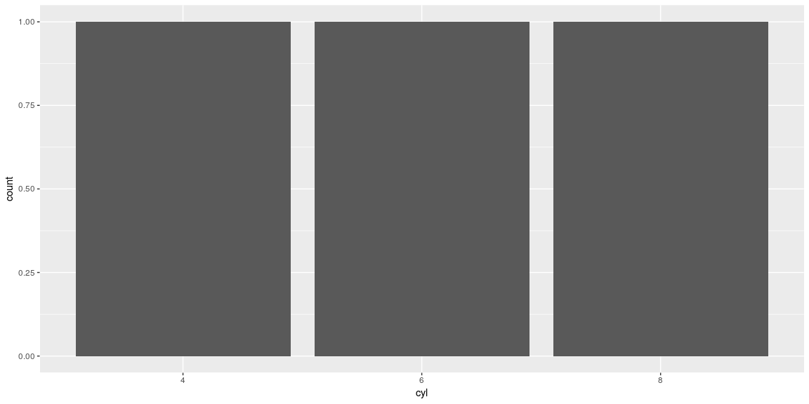<!-- -->

```r
# Change the position argument to "dodge""
ggplot(mtcars, aes(x = cyl, fill = am)) +
  geom_bar(position = "dodge")
```

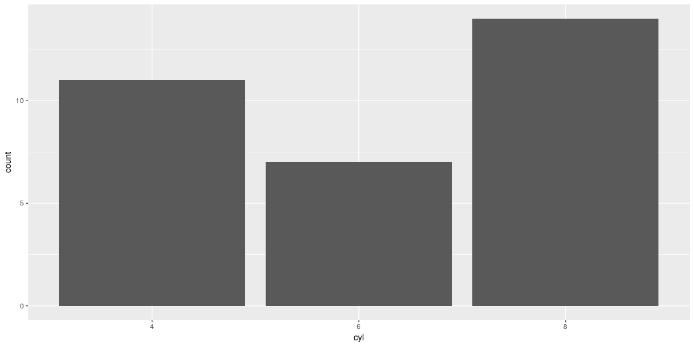<!-- -->

```r
###Overlapping Bar Plots
# 1 - The last plot form the previous exercise
ggplot(mtcars, aes(x = cyl, fill = am)) + 
  geom_bar(position = "dodge")
```

<!-- -->

```r
# 2 - Define posn_d with position_dodge()
posn_d <- position_dodge(0.2)

# 3 - Change the position argument to posn_d
ggplot(mtcars, aes(x = cyl, fill = am)) + 
  geom_bar(position = posn_d)
```

<!-- -->

```r
# 4 - Use posn_d as position and adjust alpha to 0.6
ggplot(mtcars, aes(x = cyl, fill = am)) + 
  geom_bar(position = posn_d, alpha = 0.6)
```

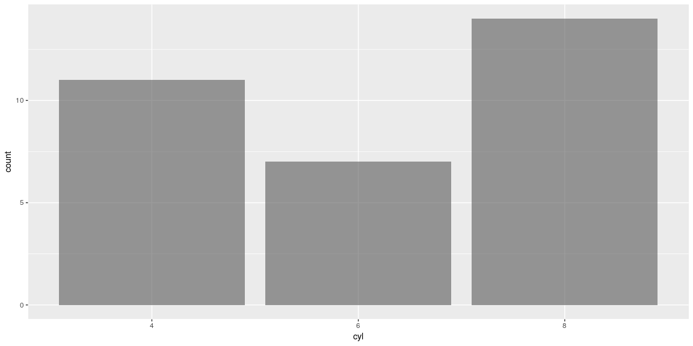<!-- -->

```r
###Overlapping Histograms
# A basic histogram, add coloring defined by cyl 
ggplot(mtcars, aes(mpg, fill = cyl)) +
  geom_histogram(binwidth = 1)
```

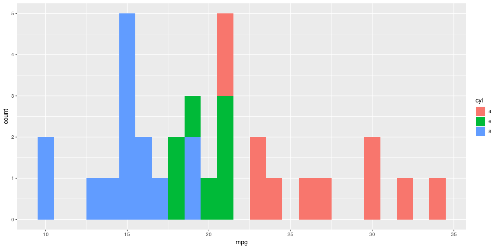<!-- -->

```r
# Change position to identity 
ggplot(mtcars, aes(mpg, fill = cyl)) +
  geom_histogram(binwidth = 1, position = "identity")
```

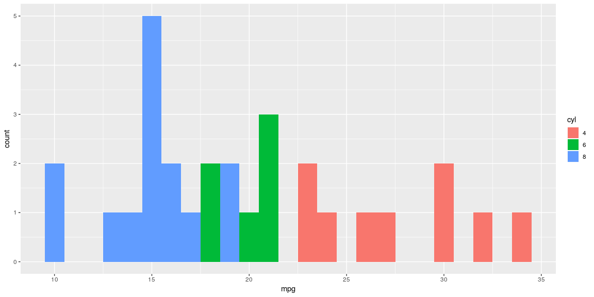<!-- -->

```r
# Change geom to freqpoly (position is identity by default) 
ggplot(mtcars, aes(mpg, col = cyl)) +
  geom_freqpoly(binwidth = 1)
```

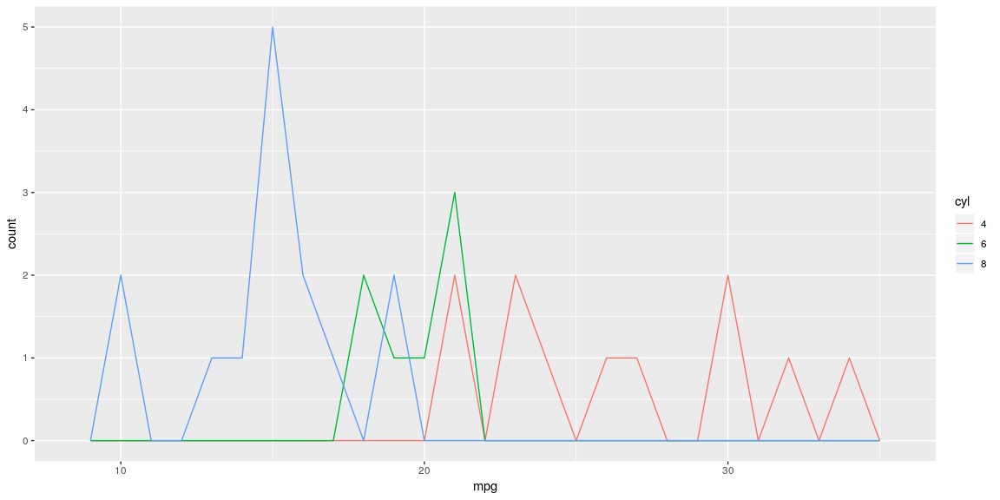<!-- -->

```r
###Bar Plots With Color Ramp, Part 1
# Example of how to use a brewed color palette
ggplot(mtcars, aes(x = cyl, fill = am)) +
  geom_bar() +
  scale_fill_brewer(palette = "Set1")
```

<!-- -->

```r
# Use str() on Vocab to check out the structure
Vocab <- read.csv("Vocab.csv")
str(Vocab)
```

```
## 'data.frame':	21638 obs. of  5 variables:
##  $ X         : int  20040001 20040002 20040003 20040005 20040008 20040010 20040012 20040013 20040016 20040017 ...
##  $ year      : int  2004 2004 2004 2004 2004 2004 2004 2004 2004 2004 ...
##  $ sex       : Factor w/ 2 levels "Female","Male": 1 1 2 1 2 2 1 2 2 1 ...
##  $ education : int  9 14 14 17 14 14 12 10 11 9 ...
##  $ vocabulary: int  3 6 9 8 1 7 6 6 5 1 ...
```

```r
# Plot education on x and vocabulary on fill
# Use the default brewed color palette
ggplot(Vocab, aes(x = education, fill = vocabulary)) +
  geom_bar(position = "fill") +
  scale_fill_brewer()
```

<!-- -->

```r
###Bar Plots With Color Ramp, Part 2
# Final plot of last exercise
ggplot(Vocab, aes(x = education, fill = vocabulary)) +
  geom_bar(position = "fill") +
  scale_fill_brewer()
```

<!-- -->

```r
# Definition of a set of blue colors
blues <- brewer.pal(9, "Blues")

# Make a color range using colorRampPalette() and the set of blues
blue_range <- colorRampPalette(blues)

# Use blue_range to adjust the color of the bars, use scale_fill_manual()
ggplot(Vocab, aes(x = education, fill = vocabulary)) +
  geom_bar(position = "fill") +
  scale_fill_manual(values = blue_range(11))
```

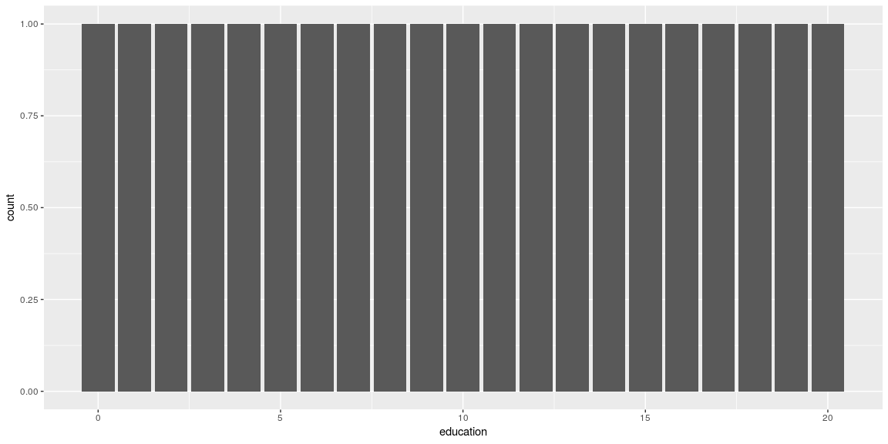<!-- -->

```r
###Overlapping Histograms (2)
# Basic histogram plot command
ggplot(mtcars, aes(mpg)) + 
  geom_histogram(binwidth = 1)
```

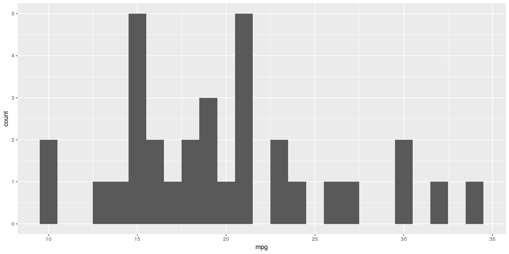<!-- -->

```r
# Expand the histogram to fill using am
ggplot(mtcars, aes(mpg, fill = am)) +
  geom_histogram(binwidth = 1)
```

<!-- -->

```r
# Change the position argument to "dodge"
ggplot(mtcars, aes(mpg, fill = am)) +
  geom_histogram(binwidth = 1, position = "dodge")
```

<!-- -->

```r
# Change the position argument to "fill"
ggplot(mtcars, aes(mpg, fill = am)) +
  geom_histogram(binwidth = 1, position = "fill")
```

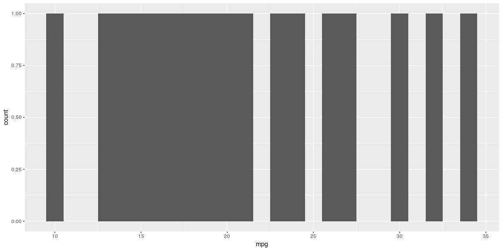<!-- -->

```r
# Change the position argument to "identity" and set alpha to 0.4
ggplot(mtcars, aes(mpg, fill = am)) +
  geom_histogram(binwidth = 1, position = "identity", alpha = 0.4)
```

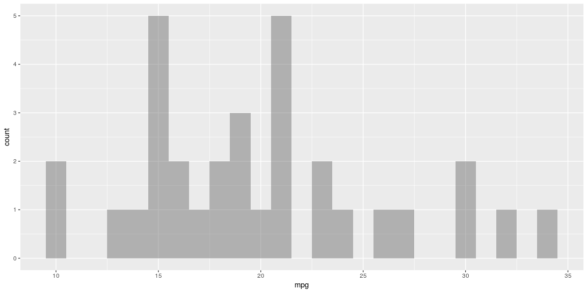<!-- -->

```r
# Change fill to cyl
ggplot(mtcars, aes(mpg, fill = cyl)) +
  geom_histogram(binwidth = 1, position = "identity", alpha = 0.4)
```

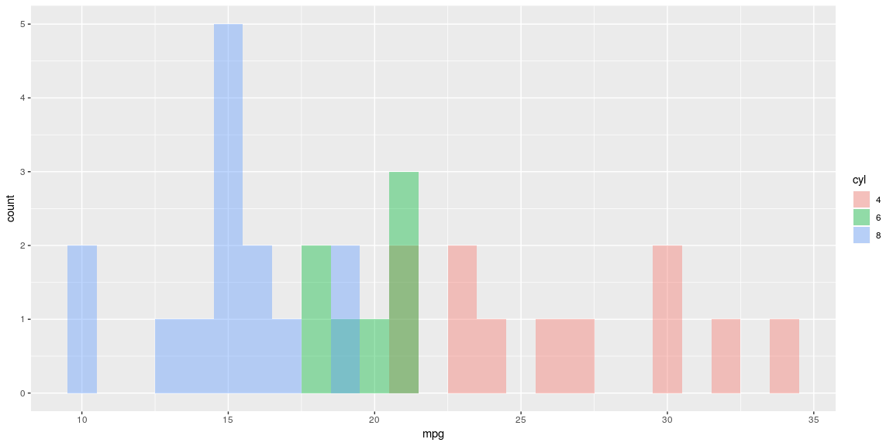<!-- -->

```r
###Line Plots
# Print out head of economics
head(economics)
```

```
## # A tibble: 6 x 6
##   date         pce    pop psavert uempmed unemploy
##   <date>     <dbl>  <int>   <dbl>   <dbl>    <int>
## 1 1967-07-01  507. 198712    12.5     4.5     2944
## 2 1967-08-01  510. 198911    12.5     4.7     2945
## 3 1967-09-01  516. 199113    11.7     4.6     2958
## 4 1967-10-01  513. 199311    12.5     4.9     3143
## 5 1967-11-01  518. 199498    12.5     4.7     3066
## 6 1967-12-01  526. 199657    12.1     4.8     3018
```

```r
# Plot unemploy as a function of date using a line plot
ggplot(economics, aes(x = date, y = unemploy)) +
  geom_line()
```

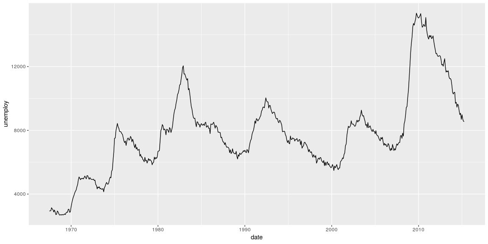<!-- -->

```r
# Adjust plot to represent the fraction of total population that is unemployed
ggplot(economics, aes(x = date, y = unemploy/pop)) +
  geom_line()
```

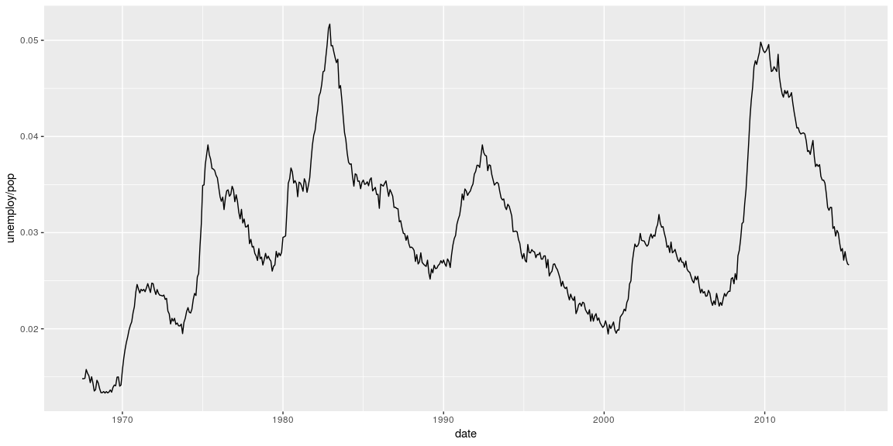<!-- -->

```r
###Periods Of Recession

recess <- read.csv("recess.csv")
recess <- recess %>% select(2:3) %>% mutate(begin = as.Date(begin),end = as.Date(end))
# Expand the following command with geom_rect() to draw the recess periods
ggplot(economics, aes(x = date, y = unemploy/pop)) +
  geom_line() +
  geom_rect(data = recess, 
            aes(xmin = begin, xmax = end, ymin = -Inf, ymax = +Inf), 
            inherit.aes = FALSE, fill = "red", alpha = 0.2)
```

<!-- -->

```r
###Multiple Time Series, Part 1
fish.species <- read.csv("fish.species.csv")
# Check the structure as a starting point
str(fish.species)
```

```
## 'data.frame':	61 obs. of  9 variables:
##  $ X       : int  1 2 3 4 5 6 7 8 9 10 ...
##  $ Year    : int  1950 1951 1952 1953 1954 1955 1956 1957 1958 1959 ...
##  $ Pink    : int  100600 259000 132600 235900 123400 244400 203400 270119 200798 200085 ...
##  $ Chum    : int  139300 155900 113800 99800 148700 143700 158480 125377 132407 113114 ...
##  $ Sockeye : int  64100 51200 58200 66100 83800 72000 84800 69676 100520 62472 ...
##  $ Coho    : int  30500 40900 33600 32400 38300 45100 40000 39900 39200 32865 ...
##  $ Rainbow : int  0 100 100 100 100 100 100 100 100 100 ...
##  $ Chinook : int  23200 25500 24900 25300 24500 27700 25300 21200 20900 20335 ...
##  $ Atlantic: int  10800 9701 9800 8800 9600 7800 8100 9000 8801 8700 ...
```

```r
# Use gather to go from fish.species to fish.tidy
fish.tidy <- gather(fish.species, Species, Capture, -Year)

###Multiple Time Series, Part 2
# Recreate the plot shown on the right
ggplot(fish.tidy, aes(x = Year, y = Capture, col = Species)) + 
  geom_line()
```

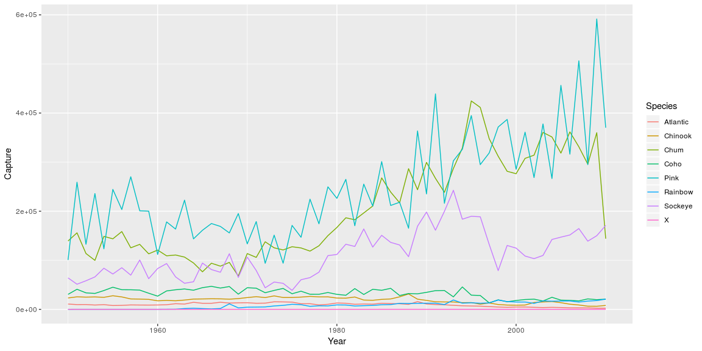<!-- -->

## Qplot


```r
###Chapter 5 Qplot and Wrapup

###Using qplot
# The old way (shown)
plot(mpg ~ wt, data = mtcars)
```

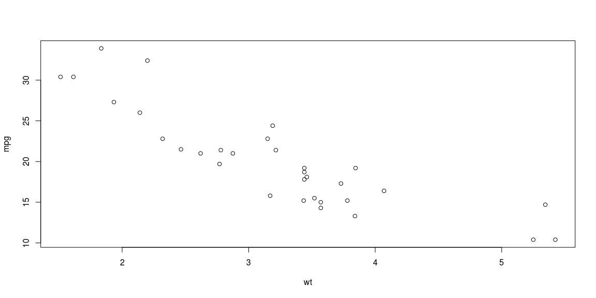<!-- -->

```r
# Using ggplot:
ggplot(mtcars, aes(x = wt, y = mpg)) +
  geom_point()
```

<!-- -->

```r
# Using qplot:
qplot(wt, mpg, data = mtcars)
```

<!-- -->

```r
###Using Aesthetics
# basic scatter plot:
qplot(wt, mpg, data = mtcars)
```

<!-- -->

```r
# Categorical:
# cyl
qplot(wt, mpg, data = mtcars, size = factor(cyl))
```

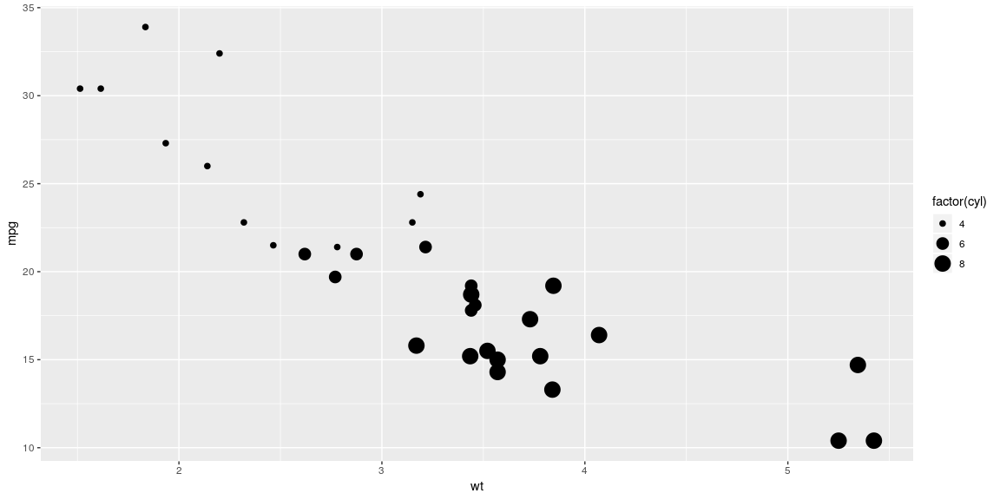<!-- -->

```r
# gear
qplot(wt, mpg, data = mtcars, size = factor(gear))
```

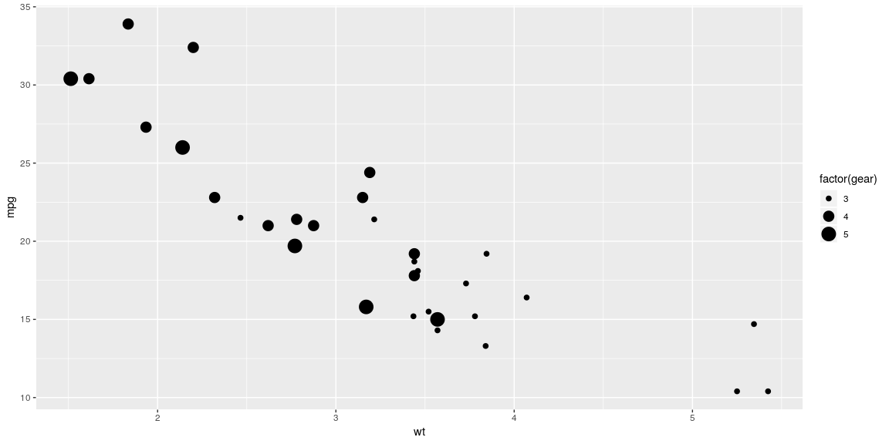<!-- -->

```r
# Continuous
# hp
qplot(wt, mpg, data = mtcars, col = hp)
```

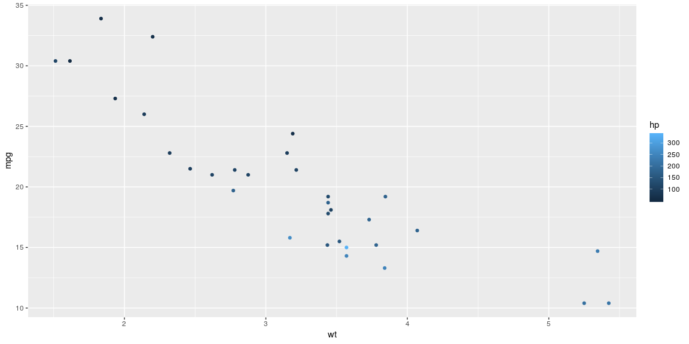<!-- -->

```r
# qsec
qplot(wt, mpg, data = mtcars, col = qsec)
```

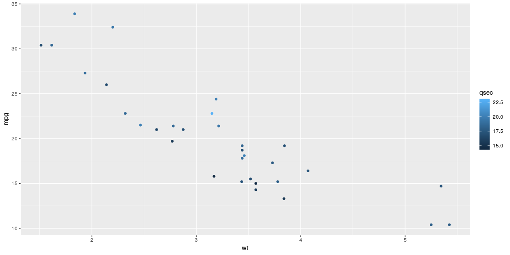<!-- -->

```r
###Choosing Geoms, Part 1
# qplot() with x only
qplot(factor(cyl), data = mtcars) 
```

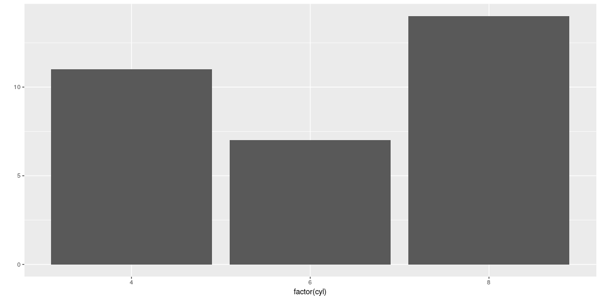<!-- -->

```r
# qplot() with x and y
qplot(factor(cyl), factor(vs), data = mtcars) 
```

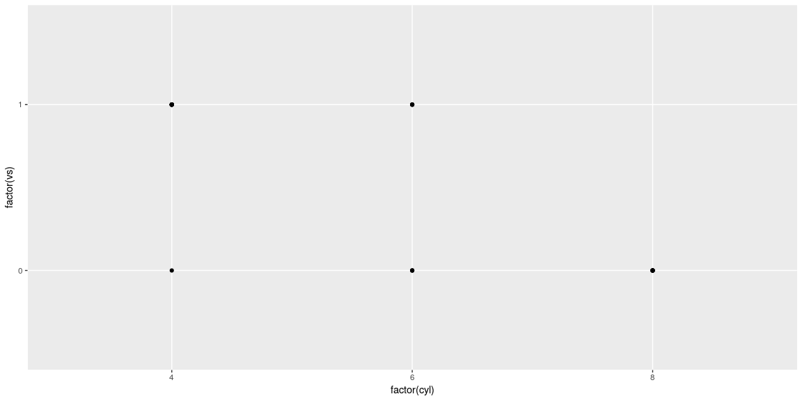<!-- -->

```r
# qplot() with geom set to jitter manually
qplot(factor(cyl), factor(vs), data = mtcars, geom = "jitter") 
```

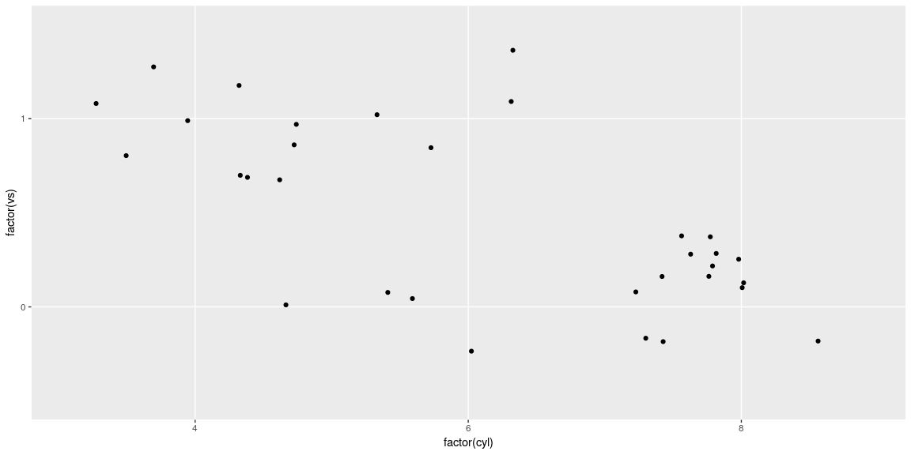<!-- -->

```r
###Choosing Geoms, Part 2 - Dotplot
# cyl and am are factors, wt is numeric
class(mtcars$cyl)
```

```
## [1] "factor"
```

```r
class(mtcars$am)
```

```
## [1] "numeric"
```

```r
class(mtcars$wt)
```

```
## [1] "numeric"
```

```r
# "Basic" dot plot, with geom_point():
ggplot(mtcars, aes(cyl, wt, col = am)) +
  geom_point(position = position_jitter(0.2, 0))
```

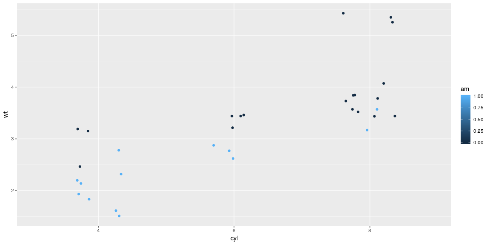<!-- -->

```r
# 1 - "True" dot plot, with geom_dotplot():
ggplot(mtcars, aes(cyl, wt, fill = am)) +
  geom_dotplot(stackdir = "center", binaxis = "y")
```

<!-- -->

```r
# 2 - qplot with geom "dotplot", binaxis = "y" and stackdir = "center"
qplot(
  cyl, wt, 
  data = mtcars, 
  fill = am, 
  geom = "dotplot", 
  binaxis = "y", 
  stackdir = "center"
)
```

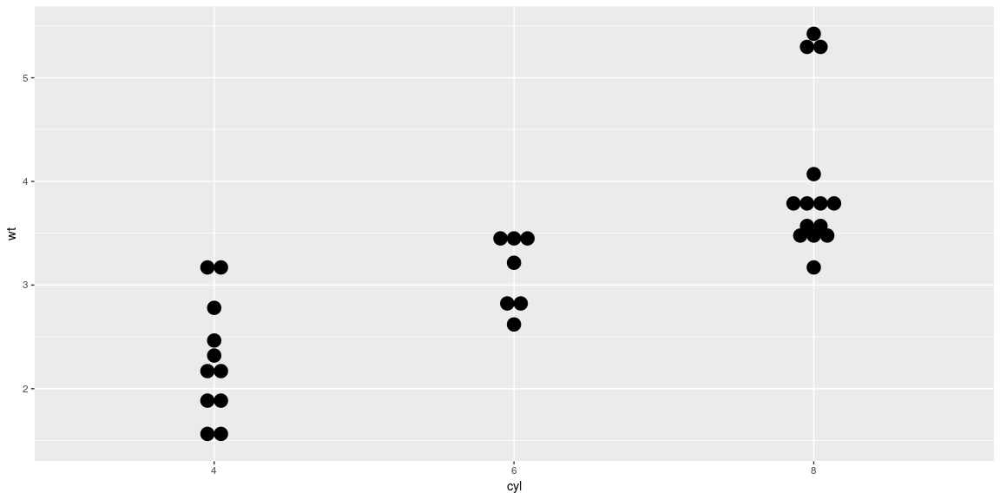<!-- -->

```r
###Chicken Weight
# ChickWeight is available in your workspace

# Check out the head of ChickWeight
head(ChickWeight)
```

```
## Grouped Data: weight ~ Time | Chick
##   weight Time Chick Diet
## 1     42    0     1    1
## 2     51    2     1    1
## 3     59    4     1    1
## 4     64    6     1    1
## 5     76    8     1    1
## 6     93   10     1    1
```

```r
# Use ggplot() for the second instruction
ggplot(ChickWeight, aes(x = Time, y = weight)) + 
  geom_line(aes(group = Chick))
```

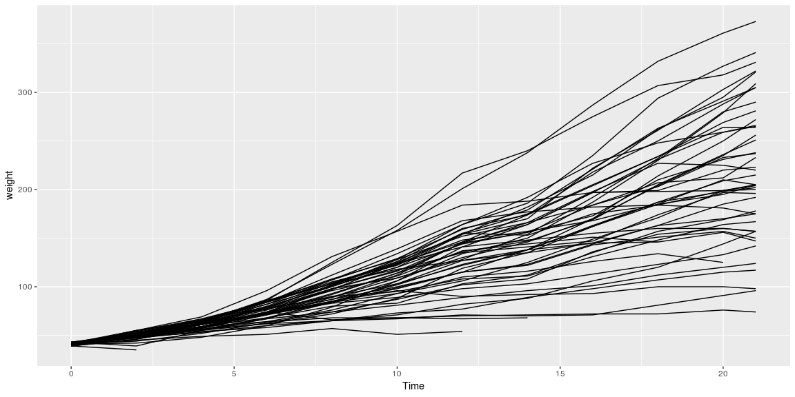<!-- -->

```r
# Use ggplot() for the third instruction
ggplot(ChickWeight, aes(x = Time, y = weight, col = Diet)) + 
  geom_line(aes(group = Chick))
```

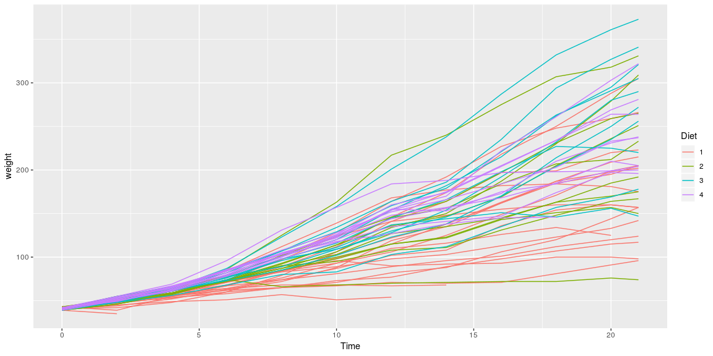<!-- -->

```r
# Use ggplot() for the last instruction
ggplot(ChickWeight, aes(x = Time, y = weight, col = Diet)) + 
  geom_line(aes(group = Chick), alpha = 0.3) + 
  geom_smooth(lwd = 2, se = FALSE)
```

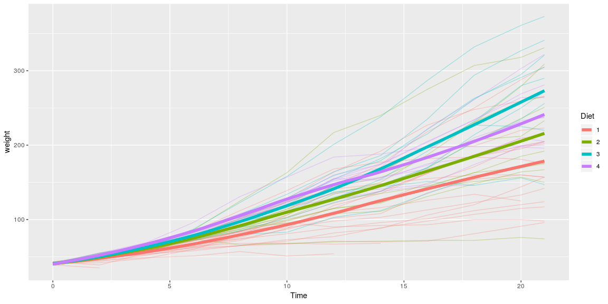<!-- -->

```r
###Titanic
# titanic is avaliable in Data Camp's workspace
titanic <- read.csv("titanic.csv")
# 1 - Check the structure of titanic
str(titanic)
```

```
## 'data.frame':	714 obs. of  5 variables:
##  $ X       : int  1 2 3 4 5 6 7 8 9 10 ...
##  $ Survived: int  0 1 1 1 0 0 0 1 1 1 ...
##  $ Pclass  : int  3 1 3 1 3 1 3 3 2 3 ...
##  $ Sex     : Factor w/ 2 levels "female","male": 2 1 1 1 2 2 2 1 1 1 ...
##  $ Age     : num  22 38 26 35 35 54 2 27 14 4 ...
```

```r
# 2 - Use ggplot() for the first instruction
ggplot(titanic, aes(x = Pclass, fill = Sex)) + 
  geom_bar(position = "dodge")
```

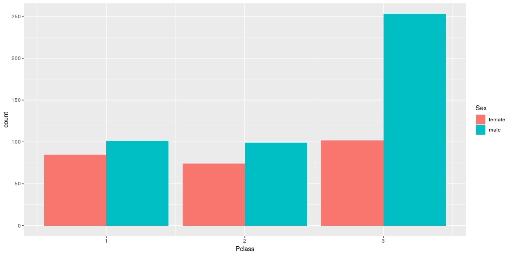<!-- -->

```r
# 3 - Plot 2, add facet_grid() layer
ggplot(titanic, aes(x = Pclass, fill = Sex)) + 
  geom_bar(position = "dodge") + 
  facet_grid(. ~ Survived)
```

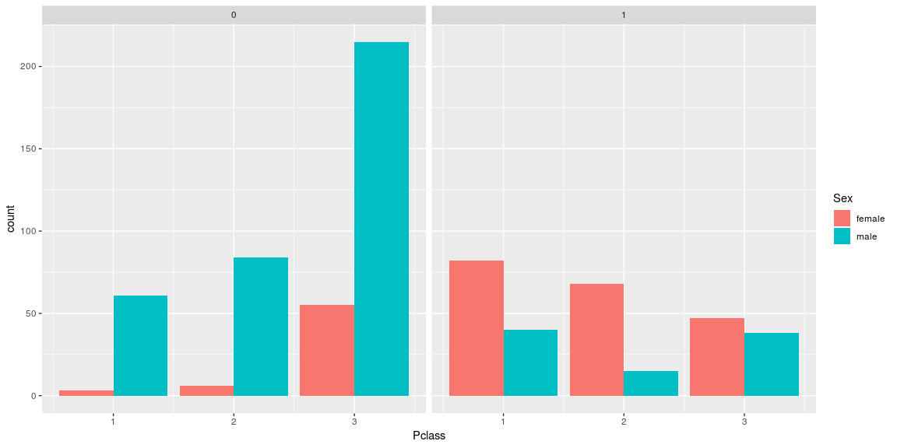<!-- -->

```r
# 4 - Define an object for position jitterdodge, to use below
posn.jd <- position_jitterdodge(0.5, 0, 0.6)

# 5 - Plot 3, but use the position object from instruction 4
ggplot(titanic, aes(x = Pclass, y = Age, color = Sex)) + 
  geom_point(size = 3, alpha = 0.5, position = posn.jd) + 
  facet_grid(. ~ Survived)
```

<!-- -->


