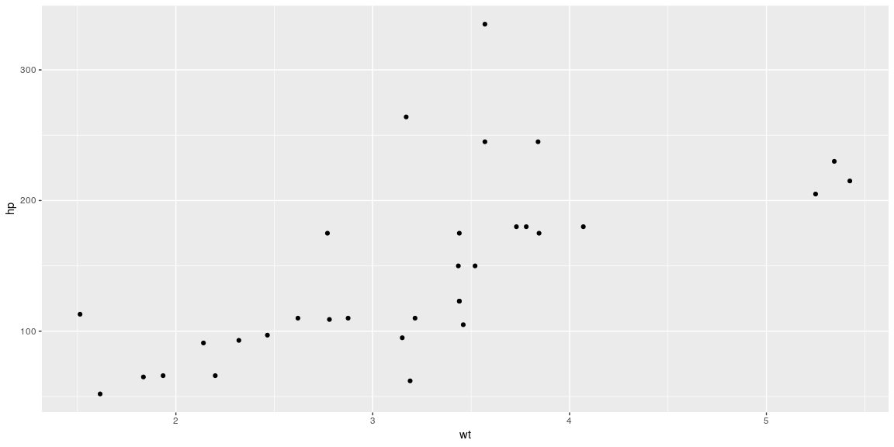

# {.tabset .tabset-fade}


## Background

https://campus.datacamp.com/courses/intermediate-r

https://github.com/JoshuaHaden/Intermediate-R-Programming-Data-Camp

## Conditionals


```r
###Chapter 1 Conditionals And Control Flow

###Equality
# Comparison of logicals
TRUE == FALSE
```

```
## [1] FALSE
```

```r
# Comparison of numerics
-6 * 14 != 17 - 101
```

```
## [1] FALSE
```

```r
# Comparison of character strings
"useR" == "user"
```

```
## [1] FALSE
```

```r
# Compare a logical with a numeric
TRUE == 1
```

```
## [1] TRUE
```

```r
###Greater And Less Than
# Comparison of numerics
-6*5+2 >= -10+1
```

```
## [1] FALSE
```

```r
# Comparison of character strings
"raining" <= "raining dogs"
```

```
## [1] TRUE
```

```r
# Comparison of logicals
TRUE > FALSE
```

```
## [1] TRUE
```

```r
###Compare Vectors
# The linkedin and facebook vectors have already been created for you
linkedin <- c(16, 9, 13, 5, 2, 17, 14)
facebook <- c(17, 7, 5, 16, 8, 13, 14)

# Popular days
linkedin > 15
```

```
## [1]  TRUE FALSE FALSE FALSE FALSE  TRUE FALSE
```

```r
# Quiet days
linkedin <= 5
```

```
## [1] FALSE FALSE FALSE  TRUE  TRUE FALSE FALSE
```

```r
# LinkedIn more popular than Facebook
linkedin > facebook
```

```
## [1] FALSE  TRUE  TRUE FALSE FALSE  TRUE FALSE
```

```r
###Compare Matrices
# The social data has been created for you
linkedin <- c(16, 9, 13, 5, 2, 17, 14)
facebook <- c(17, 7, 5, 16, 8, 13, 14)
views <- matrix(c(linkedin, facebook), nrow = 2, byrow = TRUE)

# When does views equal 13?
views == 13
```

```
##       [,1]  [,2]  [,3]  [,4]  [,5]  [,6]  [,7]
## [1,] FALSE FALSE  TRUE FALSE FALSE FALSE FALSE
## [2,] FALSE FALSE FALSE FALSE FALSE  TRUE FALSE
```

```r
# When is views less than or equal to 14?
views <= 14
```

```
##       [,1] [,2] [,3]  [,4] [,5]  [,6] [,7]
## [1,] FALSE TRUE TRUE  TRUE TRUE FALSE TRUE
## [2,] FALSE TRUE TRUE FALSE TRUE  TRUE TRUE
```

```r
# How often does facebook equal or exceed linkedin times two?
sum(facebook >= linkedin * 2)
```

```
## [1] 2
```

```r
###& And |
# The linkedin and last variable are already defined for you
linkedin <- c(16, 9, 13, 5, 2, 17, 14)
last <- tail(linkedin, 1)

# Is last under 5 or above 10?
last<5 | last>10
```

```
## [1] TRUE
```

```r
# Is last between 15 (exclusive) and 20 (inclusive)?
last>15 & last<=20
```

```
## [1] FALSE
```

```r
# Is last between 0 and 5 or between 10 and 15?
(last > 0 & last < 5) | (last > 10 & last < 15)
```

```
## [1] TRUE
```

```r
###& And | (2)
# The social data (linkedin, facebook, views) has been created for you

# linkedin exceeds 10 but facebook below 10
linkedin>10 & facebook<10
```

```
## [1] FALSE FALSE  TRUE FALSE FALSE FALSE FALSE
```

```r
# When were one or both visited at least 12 times?
linkedin>=12 | facebook>=12
```

```
## [1]  TRUE FALSE  TRUE  TRUE FALSE  TRUE  TRUE
```

```r
# When is views between 11 (exclusive) and 14 (inclusive)?
views>11 & views<=14
```

```
##       [,1]  [,2]  [,3]  [,4]  [,5]  [,6] [,7]
## [1,] FALSE FALSE  TRUE FALSE FALSE FALSE TRUE
## [2,] FALSE FALSE FALSE FALSE FALSE  TRUE TRUE
```

```r
###Reverse The Result: !
x <- 5
y <- 7
!(!(x < 4) & !!!(y > 12))
```

```
## [1] FALSE
```

```r
###Blend It All Together
# li_df is pre-loaded in Data Camp's workspace
li_df <- read.table(file = "li_df.txt", header = TRUE)

# Select the second column, named day2, from li_df: second
second <- li_df$day2

# Build a logical vector, TRUE if value in second is extreme: extremes
extremes <- second > 25 | second < 5

# Count the number of TRUEs in extremes
sum(extremes)
```

```
## [1] 16
```

```r
# Solve it with a one-liner
sum(li_df$day2 > 25 | li_df$day2 < 5)
```

```
## [1] 16
```

```r
###The If Statement
# Variables related to your last day of recordings
medium <- "LinkedIn"
num_views <- 14

# Examine the if statement for medium
if (medium == "LinkedIn") {
  print("Showing LinkedIn information")
}
```

```
## [1] "Showing LinkedIn information"
```

```r
# Write the if statement for num_views
if (num_views>15) {
  print("You're popular!")
}

###Add An Else
# Variables related to your last day of recordings
medium <- "LinkedIn"
num_views <- 14

# Control structure for medium
if (medium == "LinkedIn") {
  print("Showing LinkedIn information")
} else {
  print("Unknown medium")
}
```

```
## [1] "Showing LinkedIn information"
```

```r
# Control structure for num_views
if (num_views > 15) {
  print("You're popular!")
} else {
  print("Try to be more visible!")
}
```

```
## [1] "Try to be more visible!"
```

```r
###Customize Further: Else If
# Variables related to your last day of recordings
medium <- "LinkedIn"
num_views <- 14

# Control structure for medium
if (medium == "LinkedIn") {
  print("Showing LinkedIn information")
} else if (medium == "Facebook") {
  print("Showing Facebook information")
} else {
  print("Unknown medium")
}
```

```
## [1] "Showing LinkedIn information"
```

```r
# Control structure for num_views
if (num_views > 15) {
  print("You're popular!")
} else if (num_views <= 15 & num_views > 10) {
  print("Your number of views is average")
} else {
  print("Try to be more visible!")
}
```

```
## [1] "Your number of views is average"
```

```r
###Else If 2.0
#1.
number <- 6
#2.
number <- 100
#3.
number <- 4
#4.
number <- 2500
if (number < 10) {
  if (number < 5) {
    result <- "extra small"
  } else {
    result <- "small"
  }
} else if (number < 100) {
  result <- "medium"
} else {
  result <- "large"
}
print(result)
```

```
## [1] "large"
```

```r
###Take Control!
# Variables related to your last day of recordings
li <- 15
fb <- 9

# Code the control-flow construct
if (li >= 15 & fb >= 15) {
  sms <- 2 * (li + fb)
} else if (li < 10 & fb < 10) {
  sms <- 0.5 * (li + fb)
} else {
  sms <- li + fb
}

# Print the resulting sms to the console
print(sms)
```

```
## [1] 24
```

## Loops


```r
###Chapter 2 Loops

###Write A While Loop
# Initialize the speed variable
speed <- 64

# Code the while loop
while (speed>30) {
  print("Slow down!")
  speed <- speed - 7
}
```

```
## [1] "Slow down!"
## [1] "Slow down!"
## [1] "Slow down!"
## [1] "Slow down!"
## [1] "Slow down!"
```

```r
# Print out the speed variable
speed
```

```
## [1] 29
```

```r
###Throw In More Conditionals
# Initialize the speed variable
speed <- 64

# Extend/adapt the while loop
while (speed > 30) {
  print(paste("Your speed is",speed))
  if (speed > 48) {
    print("Slow down big time!")
    speed <- speed - 11
  } else {
    print("Slow down!")
    speed <- speed - 6
  }
}
```

```
## [1] "Your speed is 64"
## [1] "Slow down big time!"
## [1] "Your speed is 53"
## [1] "Slow down big time!"
## [1] "Your speed is 42"
## [1] "Slow down!"
## [1] "Your speed is 36"
## [1] "Slow down!"
```

```r
###Stop The While Loop: Break
# Initialize the speed variable
speed <- 88

while (speed > 30) {
  print(paste("Your speed is",speed))
  
  # Break the while loop when speed exceeds 80
  if (speed > 80)
    break
  
  if (speed > 48) {
    print("Slow down big time!")
    speed <- speed - 11
  } else {
    print("Slow down!")
    speed <- speed - 6
  }
}
```

```
## [1] "Your speed is 88"
```

```r
###Build A While Loop From Scratch
# Initialize i as 1 
i <- 1

# Code the while loop
while (i <= 10) {
  print(i * 3)
  if ( (i * 3) %% 8 == 0) {
    break
  }
  i <- i + 1
}
```

```
## [1] 3
## [1] 6
## [1] 9
## [1] 12
## [1] 15
## [1] 18
## [1] 21
## [1] 24
```

```r
###Loop Over A Vector
# The linkedin vector has already been defined for you
linkedin <- c(16, 9, 13, 5, 2, 17, 14)

# Loop version 1
for (p in linkedin) {
  print(p)
}
```

```
## [1] 16
## [1] 9
## [1] 13
## [1] 5
## [1] 2
## [1] 17
## [1] 14
```

```r
# Loop version 2
for (i in 1:length(linkedin)) {
  print(linkedin[i])
}
```

```
## [1] 16
## [1] 9
## [1] 13
## [1] 5
## [1] 2
## [1] 17
## [1] 14
```

```r
###Loop Over A List
# The nyc list is already specified
nyc <- list(pop = 8405837, 
            boroughs = c("Manhattan", "Bronx", "Brooklyn", "Queens", "Staten Island"), 
            capital = FALSE)

# Loop version 1
for (info in nyc) {
  print(info)
}
```

```
## [1] 8405837
## [1] "Manhattan"     "Bronx"         "Brooklyn"      "Queens"       
## [5] "Staten Island"
## [1] FALSE
```

```r
# Loop version 2
for (i in 1:length(nyc)) {
  print(nyc[[i]])
}
```

```
## [1] 8405837
## [1] "Manhattan"     "Bronx"         "Brooklyn"      "Queens"       
## [5] "Staten Island"
## [1] FALSE
```

```r
###Loop Over A Matrix
# The tic-tac-toe matrix has already been defined for you
ttt <- matrix(c("O", NA, "X", NA, "O", NA, "X", "O", "X"), nrow = 3, ncol = 3)

# define the double for loop
for (i in 1:nrow(ttt)) {
  for (j in 1:ncol(ttt)) {
    print(paste("On row", i, "and column", j, "the board contains", ttt[i,j]))
  }
}
```

```
## [1] "On row 1 and column 1 the board contains O"
## [1] "On row 1 and column 2 the board contains NA"
## [1] "On row 1 and column 3 the board contains X"
## [1] "On row 2 and column 1 the board contains NA"
## [1] "On row 2 and column 2 the board contains O"
## [1] "On row 2 and column 3 the board contains O"
## [1] "On row 3 and column 1 the board contains X"
## [1] "On row 3 and column 2 the board contains NA"
## [1] "On row 3 and column 3 the board contains X"
```

```r
###Mix It Up With Control Flow
# The linkedin vector has already been defined for you
linkedin <- c(16, 9, 13, 5, 2, 17, 14)

# Code the for loop with conditionals
for (li in linkedin) {
  if (li > 10) {
    print("You're popular!")
  } else {
    print("Be more visible!")
  }
  print(li)
}
```

```
## [1] "You're popular!"
## [1] 16
## [1] "Be more visible!"
## [1] 9
## [1] "You're popular!"
## [1] 13
## [1] "Be more visible!"
## [1] 5
## [1] "Be more visible!"
## [1] 2
## [1] "You're popular!"
## [1] 17
## [1] "You're popular!"
## [1] 14
```

```r
###Next, You Break It
# The linkedin vector has already been defined for you
linkedin <- c(16, 9, 13, 5, 2, 17, 14)

# Adapt/extend the for loop
for (li in linkedin) {
  if (li > 10) {
    print("You're popular!")
  } else {
    print("Be more visible!")
  }
  
  # Add code to conditionally break iteration
  if (li > 16) {
    print("This is ridiculous, I'm outta here!")
    break
  }
  
  # Add code to conditionally skip iteration
  if (li < 5) {
    print("This is too embarrassing!")
    next
  }
  
  print(li)
}
```

```
## [1] "You're popular!"
## [1] 16
## [1] "Be more visible!"
## [1] 9
## [1] "You're popular!"
## [1] 13
## [1] "Be more visible!"
## [1] 5
## [1] "Be more visible!"
## [1] "This is too embarrassing!"
## [1] "You're popular!"
## [1] "This is ridiculous, I'm outta here!"
```

```r
###Build A For Loop From Scratch
# Pre-defined variables
rquote <- "r's internals are irrefutably intriguing"
chars <- strsplit(rquote, split = "")[[1]]

# Initialize rcount
rcount <- 0

# Finish the for loop
for (char in chars) {
  if (char == "r") {
    rcount <- rcount + 1
  }
  if (char == "u") {
    break
  }
}

# Print out rcount
rcount
```

```
## [1] 5
```

## Functions


```r
###Chapter 3 Functions

###Function Documentation
# Consult the documentation on the mean() function
help(mean)

# Inspect the arguments of the mean() function
args(mean)
```

```
## function (x, ...) 
## NULL
```

```r
###Use A Function
# The linkedin and facebook vectors have already been created for you
linkedin <- c(16, 9, 13, 5, 2, 17, 14)
facebook <- c(17, 7, 5, 16, 8, 13, 14)

# Calculate average number of views
avg_li = mean(linkedin)
avg_fb = mean(facebook)

# Inspect avg_li and avg_fb
avg_li
```

```
## [1] 10.85714
```

```r
avg_fb
```

```
## [1] 11.42857
```

```r
# Calculate the mean of linkedin minus facebook
mean(linkedin - facebook)
```

```
## [1] -0.5714286
```

```r
###Use A Function (2)
# The linkedin and facebook vectors have already been created for you
linkedin <- c(16, 9, 13, 5, 2, 17, 14)
facebook <- c(17, 7, 5, 16, 8, 13, 14)

# Calculate the mean of the sum
avg_sum = mean(linkedin + facebook)

# Calculate the trimmed mean of the sum
avg_sum_trimmed = mean(linkedin + facebook, trim = 0.2)

# Inspect both new variables
avg_sum
```

```
## [1] 22.28571
```

```r
avg_sum_trimmed
```

```
## [1] 22.6
```

```r
###Use A Function (3)
# The linkedin and facebook vectors have already been created for you
linkedin <- c(16, 9, 13, 5, NA, 17, 14)
facebook <- c(17, NA, 5, 16, 8, 13, 14)

# Basic average of linkedin
mean(linkedin)
```

```
## [1] NA
```

```r
# Advanced average of linkedin
mean(linkedin, na.rm = TRUE)
```

```
## [1] 12.33333
```

```r
###Functions Inside Functions
# The linkedin and facebook vectors have already been created for you
linkedin <- c(16, 9, 13, 5, NA, 17, 14)
facebook <- c(17, 6, 5, 16, 8, 13, 14)

# Calculate the mean absolute deviation
mean(abs(linkedin - facebook), na.rm = TRUE)
```

```
## [1] 4.5
```

```r
###Write Your Own Function
# Create a function pow_two()
pow_two <- function(x) {
  x ^ 2
}

# Use the function 
pow_two(12)
```

```
## [1] 144
```

```r
# Create a function sum_abs()
sum_abs <- function(x, y) {
  abs(x) + abs(y)
}

# Use the function
sum_abs(-2, 3)
```

```
## [1] 5
```

```r
###Write Your Own Function (2)
# Define the function hello()
hello <- function() {
  print("Hi there!")
  TRUE
}

# Call the function hello()
hello()
```

```
## [1] "Hi there!"
```

```
## [1] TRUE
```

```r
# Define the function my_filter()
my_filter <- function(x) {
  if (x > 0) {
    return(x)
  } else {
    return(NULL)
  }
}

# Call the function my_filter() twice
my_filter(5)
```

```
## [1] 5
```

```r
my_filter(-5)
```

```
## NULL
```

```r
###Write Your Own Function (3)
# Extend the pow_two() function
pow_two <- function(x, print_info = TRUE) {
  y <- x ^ 2
  if (print_info) {
    print(paste(x, "to the power two equals", y))
  }
  return(y)
}

###Function Scoping
two_dice <- function() {
  possibilities <- 1:6
  dice1 <- sample(possibilities, size = 1)
  dice2 <- sample(possibilities, size = 1)
  dice1 + dice2
}

###R Passes Arguments By Value
increment <- function(x, inc = 1) {
  x <- x + inc
  x
}
count <- 5
a <- increment(count, 2)
b <- increment(count)
count <- increment(count, 2)

###R You Functional?
# The linkedin and facebook vectors have already been created for you

# Define the interpret function
interpret <- function(num_views) {
  if (num_views > 15) {
    print("You're popular!")
    return(num_views)
  } else {
    print("Try to be more visible!")
    return(0)
  }
}

# Call the interpret function twice
interpret(linkedin[1])
```

```
## [1] "You're popular!"
```

```
## [1] 16
```

```r
interpret(facebook[2])
```

```
## [1] "Try to be more visible!"
```

```
## [1] 0
```

```r
###R You Functional? (2)
# The linkedin and facebook vectors have already been created for you
linkedin <- c(16, 9, 13, 5, 2, 17, 14)
facebook <- c(17, 7, 5, 16, 8, 13, 14)

# The interpret() can be used inside interpret_all()
interpret <- function(num_views) {
  if (num_views > 15) {
    print("You're popular!")
    return(num_views)
  } else {
    print("Try to be more visible!")
    return(0)
  }
}

# Define the interpret_all() function
interpret_all <- function(views, return_sum = TRUE) {
  count <- 0
  for (v in views) {
    count <- count + interpret(v)
  }
  if (return_sum) {
    return(count)
  } else {
    return(NULL)
  }
}

# Call the interpret_all() function on both linkedin and facebook
interpret_all(linkedin)
```

```
## [1] "You're popular!"
## [1] "Try to be more visible!"
## [1] "Try to be more visible!"
## [1] "Try to be more visible!"
## [1] "Try to be more visible!"
## [1] "You're popular!"
## [1] "Try to be more visible!"
```

```
## [1] 33
```

```r
interpret_all(facebook)
```

```
## [1] "You're popular!"
## [1] "Try to be more visible!"
## [1] "Try to be more visible!"
## [1] "You're popular!"
## [1] "Try to be more visible!"
## [1] "Try to be more visible!"
## [1] "Try to be more visible!"
```

```
## [1] 33
```

```r
###Load An R Package
# The mtcars vectors have already been prepared for you
wt <- mtcars$wt
hp <- mtcars$hp

# Request the currently attached packages
search()
```

```
##  [1] ".GlobalEnv"        "package:ggplot2"   "package:stats"    
##  [4] "package:graphics"  "package:grDevices" "package:utils"    
##  [7] "package:datasets"  "package:methods"   "Autoloads"        
## [10] "package:base"
```

```r
# Try the qplot() function with wt and hp
qplot(wt, hp)
```

<!-- -->

```r
# Load the ggplot2 package
library("ggplot2")

# Retry the qplot() function
qplot(wt, hp)
```

<!-- -->

```r
# Check out the currently attached packages again
search()
```

```
##  [1] ".GlobalEnv"        "package:ggplot2"   "package:stats"    
##  [4] "package:graphics"  "package:grDevices" "package:utils"    
##  [7] "package:datasets"  "package:methods"   "Autoloads"        
## [10] "package:base"
```

## Apply


```r
###Chapter 4 The Apply Family

###Use lapply With A Built-In R Function
# The vector pioneers has already been created for you
pioneers <- c("GAUSS:1777", "BAYES:1702", "PASCAL:1623", "PEARSON:1857")

# Split names from birth year: split_math
split_math <- strsplit(pioneers, split = ":")

# Convert to lowercase strings: split_low
split_low <- lapply(split_math, tolower)

# Take a look at the structure of split_low
str(split_low)
```

```
## List of 4
##  $ : chr [1:2] "gauss" "1777"
##  $ : chr [1:2] "bayes" "1702"
##  $ : chr [1:2] "pascal" "1623"
##  $ : chr [1:2] "pearson" "1857"
```

```r
###Use lapply With Your Own Function
# Code from previous exercise:
pioneers <- c("GAUSS:1777", "BAYES:1702", "PASCAL:1623", "PEARSON:1857")
split <- strsplit(pioneers, split = ":")
split_low <- lapply(split, tolower)

# Write function select_first()
select_first <- function(x) {
  x[1]
}

# Apply select_first() over split_low: names
names <- lapply(split_low, select_first)

# Write function select_second()
select_second <- function(x) {
  x[2]
}

###lapply And Anonymous Functions
# Definition of split_low
pioneers <- c("GAUSS:1777", "BAYES:1702", "PASCAL:1623", "PEARSON:1857")
split <- strsplit(pioneers, split = ":")
split_low <- lapply(split, tolower)

names <- lapply(split_low, function(x) { x[1] })

years <- lapply(split_low, function(x) { x[2] })

###Use lapply With Additional Arguments
# Definition of split_low
pioneers <- c("GAUSS:1777", "BAYES:1702", "PASCAL:1623", "PEARSON:1857")
split <- strsplit(pioneers, split = ":")
split_low <- lapply(split, tolower)

# Replace the select_*() functions by a single function: select_el
select_el <- function(x, index) {
  x[index]
}

# Call the select_el() function twice on split_low: names and years
names <- lapply(split_low, select_el, index = 1)
years <- lapply(split_low, select_el, index = 2)

###Apply Functions That Return NULL
lapply(split_low, function(x) {
  if (nchar(x[1]) > 5) {
    return(NULL)
  } else {
    return(x[2])
  }
})
```

```
## [[1]]
## [1] "1777"
## 
## [[2]]
## [1] "1702"
## 
## [[3]]
## NULL
## 
## [[4]]
## NULL
```

```r
###How To Use sapply
# temp has already been defined in Data Camp's workspace
temp <- list(c(3, 7, 9, 6, -1), c(6, 9, 12, 13, 5), c(4, 8, 3, -1, -3), c(1, 4, 7, 2, -2), 
             c(5, 7, 9, 4, 2), c(-3, 5, 8, 9, 4), c(3, 6, 9, 4, 1))
# Use lapply() to find each day's minimum temperature
lapply(temp, min)
```

```
## [[1]]
## [1] -1
## 
## [[2]]
## [1] 5
## 
## [[3]]
## [1] -3
## 
## [[4]]
## [1] -2
## 
## [[5]]
## [1] 2
## 
## [[6]]
## [1] -3
## 
## [[7]]
## [1] 1
```

```r
# Use sapply() to find each day's minimum temperature
sapply(temp, min)
```

```
## [1] -1  5 -3 -2  2 -3  1
```

```r
# Use lapply() to find each day's maximum temperature
lapply(temp, max)
```

```
## [[1]]
## [1] 9
## 
## [[2]]
## [1] 13
## 
## [[3]]
## [1] 8
## 
## [[4]]
## [1] 7
## 
## [[5]]
## [1] 9
## 
## [[6]]
## [1] 9
## 
## [[7]]
## [1] 9
```

```r
# Use sapply() to find each day's maximum temperature
sapply(temp, max)
```

```
## [1]  9 13  8  7  9  9  9
```

```r
###sapply With Your Own Function
# temp is already defined in the workspace

# Define a function calculates the average of the min and max of a vector: extremes_avg
extremes_avg <- function(x) {
  (min(x) + max(x))/2
}

# Apply extremes_avg() over temp using sapply()
sapply(temp, extremes_avg)
```

```
## [1] 4.0 9.0 2.5 2.5 5.5 3.0 5.0
```

```r
# Apply extremes_avg() over temp using lapply()
lapply(temp, extremes_avg)
```

```
## [[1]]
## [1] 4
## 
## [[2]]
## [1] 9
## 
## [[3]]
## [1] 2.5
## 
## [[4]]
## [1] 2.5
## 
## [[5]]
## [1] 5.5
## 
## [[6]]
## [1] 3
## 
## [[7]]
## [1] 5
```

```r
###sapply With Function Returning Vector
# temp is already available in the workspace

# Create a function that returns min and max of a vector: extremes
extremes <- function(x) {
  c(min = min(x), max = max(x))
}

# Apply extremes() over temp with sapply()
sapply(temp, extremes)
```

```
##     [,1] [,2] [,3] [,4] [,5] [,6] [,7]
## min   -1    5   -3   -2    2   -3    1
## max    9   13    8    7    9    9    9
```

```r
# Apply extremes() over temp with lapply()
lapply(temp, extremes)
```

```
## [[1]]
## min max 
##  -1   9 
## 
## [[2]]
## min max 
##   5  13 
## 
## [[3]]
## min max 
##  -3   8 
## 
## [[4]]
## min max 
##  -2   7 
## 
## [[5]]
## min max 
##   2   9 
## 
## [[6]]
## min max 
##  -3   9 
## 
## [[7]]
## min max 
##   1   9
```

```r
###sapply Can't Simplify, Now What?
# temp is already prepared for you in the workspace

# Create a function that returns all values below zero: below_zero
below_zero <- function(x) {
  return(x[x < 0])
}

# Apply below_zero over temp using sapply(): freezing_s
freezing_s <- sapply(temp, below_zero)

# Apply below_zero over temp using lapply(): freezing_l
freezing_l <- lapply(temp, below_zero)

# Compare freezing_s to freezing_l using identical()
identical(freezing_s, freezing_l)
```

```
## [1] TRUE
```

```r
###sapply With Functions That Return NULL
# temp is already available in the workspace

# Write a function that 'cat()s' out the average temperatures: print_info
print_info <- function(x) {
  cat("The average temperature is", mean(x), "\n")
}

# Apply print_info() over temp using lapply()
sapply(temp, print_info)
```

```
## The average temperature is 4.8 
## The average temperature is 9 
## The average temperature is 2.2 
## The average temperature is 2.4 
## The average temperature is 5.4 
## The average temperature is 4.6 
## The average temperature is 4.6
```

```
## [[1]]
## NULL
## 
## [[2]]
## NULL
## 
## [[3]]
## NULL
## 
## [[4]]
## NULL
## 
## [[5]]
## NULL
## 
## [[6]]
## NULL
## 
## [[7]]
## NULL
```

```r
# Apply print_info() over temp using sapply()
lapply(temp, print_info)
```

```
## The average temperature is 4.8 
## The average temperature is 9 
## The average temperature is 2.2 
## The average temperature is 2.4 
## The average temperature is 5.4 
## The average temperature is 4.6 
## The average temperature is 4.6
```

```
## [[1]]
## NULL
## 
## [[2]]
## NULL
## 
## [[3]]
## NULL
## 
## [[4]]
## NULL
## 
## [[5]]
## NULL
## 
## [[6]]
## NULL
## 
## [[7]]
## NULL
```

```r
###Reverse Engineering sapply
sapply(list(runif (10), runif (10)), 
       function(x) c(min = min(x), mean = mean(x), max = max(x)))
```

```
##            [,1]      [,2]
## min  0.02525353 0.0666171
## mean 0.42274440 0.3922186
## max  0.79071800 0.8951343
```

```r
###Use vapply
# temp is already available in the workspace

# Code the basics() function
basics <- function(x) {
  c(min = min(x), mean = mean(x), max = max(x))
}

# Apply basics() over temp using vapply()
vapply(temp, basics, numeric(3))
```

```
##      [,1] [,2] [,3] [,4] [,5] [,6] [,7]
## min  -1.0    5 -3.0 -2.0  2.0 -3.0  1.0
## mean  4.8    9  2.2  2.4  5.4  4.6  4.6
## max   9.0   13  8.0  7.0  9.0  9.0  9.0
```

```r
###Use vapply (2)
# temp is already available in the workspace

# Definition of the basics() function
basics <- function(x) {
  c(min = min(x), mean = mean(x), median = median(x), max = max(x))
}

# Fix the error:
vapply(temp, basics, numeric(4))
```

```
##        [,1] [,2] [,3] [,4] [,5] [,6] [,7]
## min    -1.0    5 -3.0 -2.0  2.0 -3.0  1.0
## mean    4.8    9  2.2  2.4  5.4  4.6  4.6
## median  6.0    9  3.0  2.0  5.0  5.0  4.0
## max     9.0   13  8.0  7.0  9.0  9.0  9.0
```

```r
###From sapply To vapply
# temp is already defined in the workspace

# Convert to vapply() expression
vapply(temp, max, numeric(1))
```

```
## [1]  9 13  8  7  9  9  9
```

```r
# Convert to vapply() expression
vapply(temp, function(x, y) { mean(x) > y }, logical(1), y = 5)
```

```
## [1] FALSE  TRUE FALSE FALSE  TRUE FALSE FALSE
```

```r
# Definition of get_info (don't change)
get_info <- function(x, y) { 
  if (mean(x) > y) {
    return("Not too cold!")
  } else {
    return("Pretty cold!")
  }
}

# Convert to vapply() expression
vapply(temp, get_info, character(1), y = 5)
```

```
## [1] "Pretty cold!"  "Not too cold!" "Pretty cold!"  "Pretty cold!" 
## [5] "Not too cold!" "Pretty cold!"  "Pretty cold!"
```

## Utilities


```r
###Chapter 5 Utilities

###Mathematical Utilities
# The errors vector has already been defined for you
errors <- c(1.9,-2.6,4.0,-9.5,-3.4,7.3)

# Sum of absolute rounded values of errors
sum(round(abs(errors)))
```

```
## [1] 29
```

```r
###Find The Error
# Don't edit these two lines
vec1 <- c(1.5,2.5,8.4,3.7,6.3)
vec2 <- rev(vec1)

# Fix the error
mean(c(abs(vec1), abs(vec2)))
```

```
## [1] 4.48
```

```r
###Data Utilities
# The linkedin and facebook vectors have already been created for you
linkedin <- list(16, 9, 13, 5, 2, 17, 14)
facebook <- list(17, 7, 5, 16, 8, 13, 14)

# Convert linkedin and facebook to a vector: li_vec and fb_vec
li_vec <- unlist(linkedin)
fb_vec <- unlist(facebook)

# Append fb_vec to li_vec: social_vec
social_vec <- append(li_vec, fb_vec)

# Sort social_vec
sort(social_vec, decreasing = TRUE)
```

```
##  [1] 17 17 16 16 14 14 13 13  9  8  7  5  5  2
```

```r
###Find The Error (2)
# Fix me
round(sum(unlist(list(1.1,3,5))))
```

```
## [1] 9
```

```r
# Fix me
rep(seq(1, 7, by = 2), times = 7)
```

```
##  [1] 1 3 5 7 1 3 5 7 1 3 5 7 1 3 5 7 1 3 5 7 1 3 5 7 1 3 5 7
```

```r
###Beat Gauss Using R
# Create first sequence: seq1
seq1 <- seq(1, 500, by = 3)

# Create second sequence: seq2
seq2 <- seq(1200, 900, by = -7)

# Calculate total sum of the sequences
sum(seq1) + sum(seq2)
```

```
## [1] 87029
```

```r
###grepl & grep
# The emails vector has already been defined for you
emails <- c("john.doe@ivyleague.edu", "education@world.gov", "dalai.lama@peace.org", 
            "invalid.edu", "quant@bigdatacollege.edu", "cookie.monster@sesame.tv")

# Use grepl() to match for "edu"
grepl("edu", emails)
```

```
## [1]  TRUE  TRUE FALSE  TRUE  TRUE FALSE
```

```r
# Use grep() to match for "edu", save result to hits
hits <- grep("edu", emails)

# Subset emails using hits
emails[hits]
```

```
## [1] "john.doe@ivyleague.edu"   "education@world.gov"     
## [3] "invalid.edu"              "quant@bigdatacollege.edu"
```

```r
###grepl & grep (2)
# The emails vector has already been defined for you
emails <- c("john.doe@ivyleague.edu", "education@world.gov", "dalai.lama@peace.org", 
            "invalid.edu", "quant@bigdatacollege.edu", "cookie.monster@sesame.tv")

# Use grepl() to match for .edu addresses more robustly
grepl("@.*\\.edu$", emails)
```

```
## [1]  TRUE FALSE FALSE FALSE  TRUE FALSE
```

```r
# Use grep() to match for .edu addresses more robustly, save result to hits
hits <- grep("@.*\\.edu$", emails)

# Subset emails using hits
emails[hits]
```

```
## [1] "john.doe@ivyleague.edu"   "quant@bigdatacollege.edu"
```

```r
###sub & gsub
# The emails vector has already been defined for you
emails <- c("john.doe@ivyleague.edu", "education@world.gov", "global@peace.org",
            "invalid.edu", "quant@bigdatacollege.edu", "cookie.monster@sesame.tv")

# Use sub() to convert the email domains to datacamp.edu
sub("@.*\\.edu$", "@datacamp.edu", emails)
```

```
## [1] "john.doe@datacamp.edu"    "education@world.gov"     
## [3] "global@peace.org"         "invalid.edu"             
## [5] "quant@datacamp.edu"       "cookie.monster@sesame.tv"
```

```r
###sub & gsub (2)
awards <- c("Won 1 Oscar.",
            "Won 1 Oscar. Another 9 wins & 24 nominations.",
            "1 win and 2 nominations.",
            "2 wins & 3 nominations.",
            "Nominated for 2 Golden Globes. 1 more win & 2 nominations.",
            "4 wins & 1 nomination.")

sub(".*\\s([0-9]+)\\snomination.*$", "\\1", awards)
```

```
## [1] "Won 1 Oscar." "24"           "2"            "3"           
## [5] "2"            "1"
```

```r
###Right Here, Right Now
# Get the current date: today
today <- Sys.Date()

# See what today looks like under the hood
unclass(today)
```

```
## [1] 17940
```

```r
# Get the current time: now
now <- Sys.time()

# See what now looks like under the hood
unclass(now)
```

```
## [1] 1550084663
```

```r
###Create And Format Dates
# Definition of character strings representing dates
str1 <- "May 23, '96"
str2 <- "2012-03-15"
str3 <- "30/January/2006"

# Convert the strings to dates: date1, date2, date3
date1 <- as.Date(str1, format = "%b %d, '%y")
date2 <- as.Date(str2)
date3 <- as.Date(str3, format = "%d/%B/%Y")

# Convert dates to formatted strings
format(date1, "%A")
```

```
## [1] "Thursday"
```

```r
format(date2, "%d")
```

```
## [1] "15"
```

```r
format(date3, "%b %Y")
```

```
## [1] "Jan 2006"
```

```r
###Create And Format Times
# Definition of character strings representing times
str1 <- "May 23, '96 hours:23 minutes:01 seconds:45"
str2 <- "2012-3-12 14:23:08"

# Convert the strings to POSIXct objects: time1, time2
time1 <- as.POSIXct(str1, format = "%B %d, '%y hours:%H minutes:%M seconds:%S")
time2 <- as.POSIXct(str2)

# Convert times to formatted strings
format(time1, "%M")
```

```
## [1] "01"
```

```r
format(time2, "%I:%M %p")
```

```
## [1] "02:23 PM"
```

```r
###Calculations With Dates
# day1, day2, day3, day4 and day5 are available in Data Camp's workspace

# Constructing day1, day2, day3, day4 and day5 vectors
day1 <- as.Date("2016-11-21")
day2 <- as.Date("2016-11-16")
day3 <- as.Date("2016-11-27")
day4 <- as.Date("2016-11-14")
day5 <- as.Date("2016-12-02")

# Difference between last and first pizza day
day5 - day1
```

```
## Time difference of 11 days
```

```r
# Create vector pizza
pizza <- c(day1, day2, day3, day4, day5)

# Create differences between consecutive pizza days: day_diff
day_diff <- diff(pizza)

# Average period between two consecutive pizza days
mean(day_diff)
```

```
## Time difference of 2.75 days
```

```r
###Calculations With Times
# login and logout are already defined in the workspace

# Constructing login and logout vectors
login <- as.POSIXct(c("2016-11-18 10:18:04 UTC", 
                      "2016-11-23 09:14:18 UTC", 
                      "2016-11-23 12:21:51 UTC", 
                      "2016-11-23 12:37:24 UTC", 
                      "2016-11-25 21:37:55 UTC"))

logout <- as.POSIXct(c("2016-11-18 10:56:29 UTC", 
                       "2016-11-23 09:14:52 UTC", 
                       "2016-11-23 12:35:48 UTC",
                       "2016-11-23 13:17:22 UTC", 
                       "2016-11-25 22:08:47 UTC"))


# Calculate the difference between login and logout: time_online
time_online <- logout - login

# Inspect the variable time_online
time_online
```

```
## Time differences in secs
## [1] 2305   34  837 2398 1852
```

```r
# Calculate the total time online
sum(time_online)
```

```
## Time difference of 7426 secs
```

```r
# Calculate the average time online
mean(time_online)
```

```
## Time difference of 1485.2 secs
```

```r
###Time Is Of The Essence
# Convert astro to vector of Date objects: astro_dates
# Constructing astro and meteo vectors
astro <- c("20-Mar-2015", "25-Jun-2015", "23-Sep-2015", "22-Dec-2015")
names(astro) <- c("spring", "summer", "fall", "winter")

meteo <- c("March 1, 15", "June 1, 15", "September 1, 15", "December 1, 15")
names(meteo) <- c("spring", "summer", "fall", "winter")


# Source: www.timeanddate.com 
astro_dates <- as.Date(astro, format = "%d-%b-%Y")

# Convert meteo to vector of Date objects: meteo_dates
meteo_dates <- as.Date(meteo, format = "%B %d, %y")

# Calculate the maximum absolute difference between astro_dates and meteo_dates
max(abs(meteo_dates - astro_dates))
```

```
## Time difference of 24 days
```

