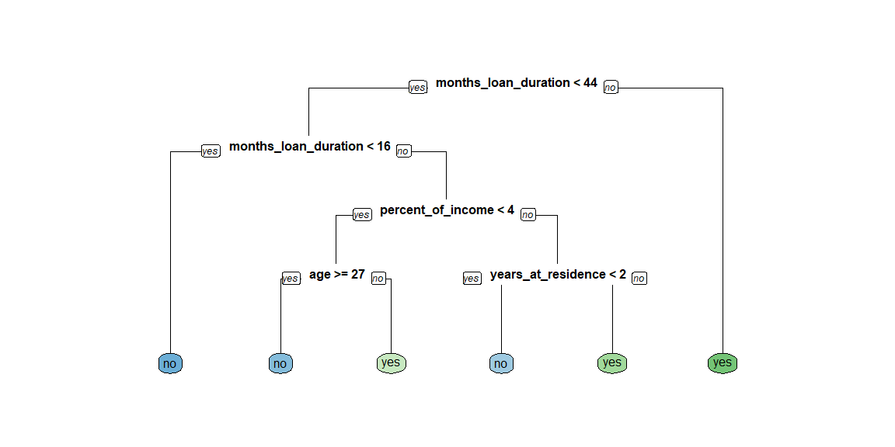
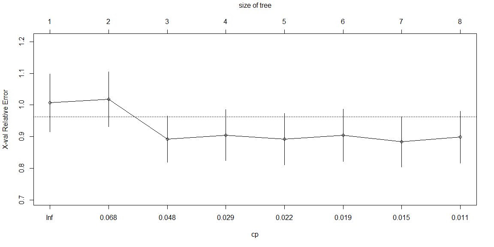
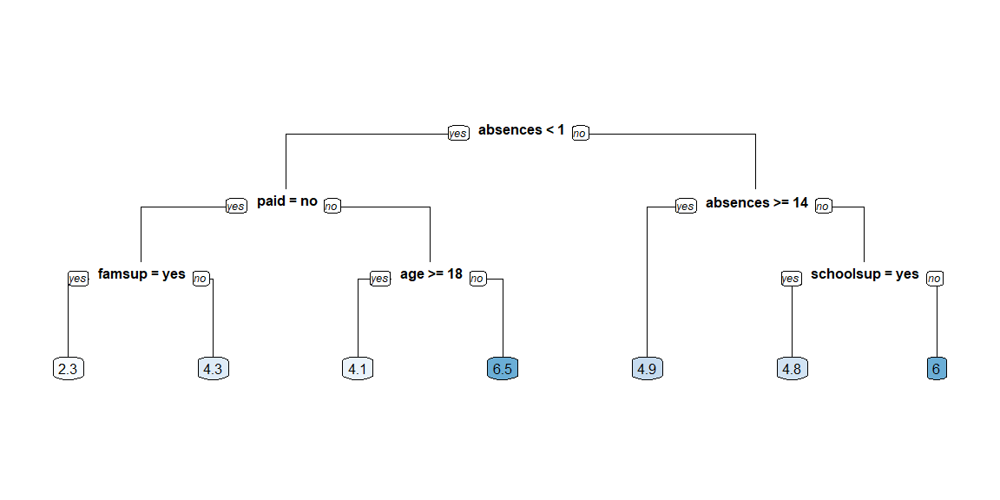
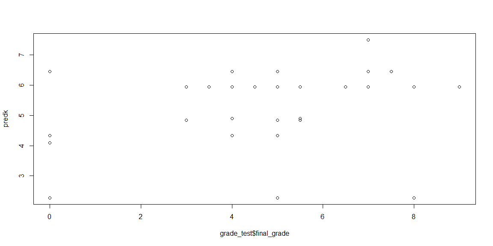
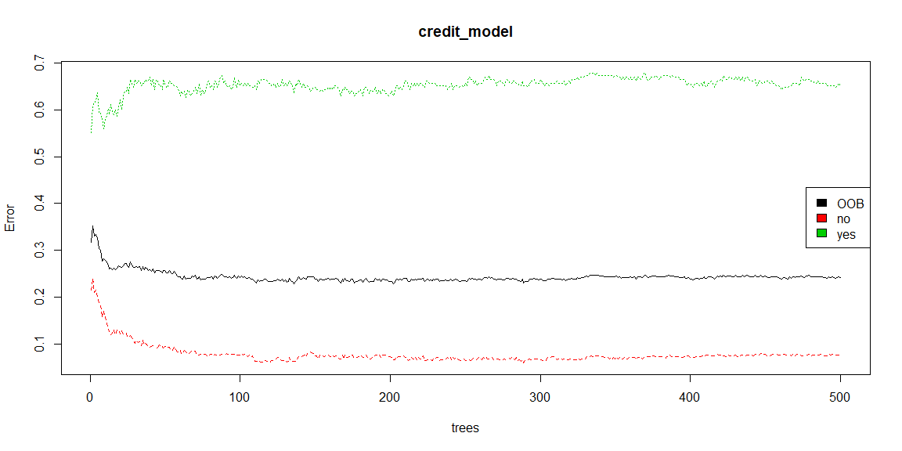
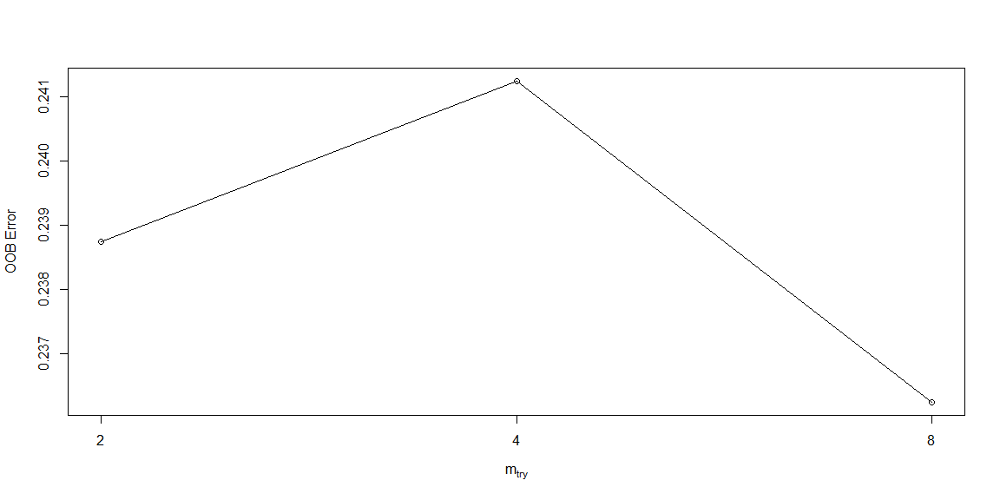

# {.tabset .tabset-fade}


## Classification Trees

Build a classification tree
Let's get started and build our first classification tree. A classification tree is a decision tree that performs a classification (vs regression) task.

You will train a decision tree model to understand which loan applications are at higher risk of default using a subset of the German Credit Dataset. The response variable, called "default", indicates whether the loan went into a default or not, which means this is a binary classification problem (there are just two classes).

You will use the rpart package to fit the decision tree and the rpart.plot package to visualize the tree.

Instructions
100 XP
The data frame creditsub is in the workspace. This data frame is a subset of the original German Credit Dataset, which we will use to train our first classification tree model.

Take a look at the data using the str() function.
In R, formulas are used to model the response as a function of some set of predictors, so the formula here is default ~ ., which means use all columns (except the response column) as predictors.
Fit the classification decision tree using the rpart() function from the rpart package. In the rpart() function, note that you'll also have to provide the training data frame.
Using the model object that you create, plot the decision tree model using the rpart.plot() function from the rpart.plot package.


```r
creditsub <- read.csv("creditsub.csv")

# Look at the data
str(creditsub)
```

```
## 'data.frame':	522 obs. of  5 variables:
##  $ months_loan_duration: int  48 42 24 36 30 12 48 12 24 15 ...
##  $ percent_of_income   : int  2 2 3 2 4 3 3 1 4 2 ...
##  $ years_at_residence  : int  2 4 4 2 2 1 4 1 4 4 ...
##  $ age                 : int  22 45 53 35 28 25 24 22 60 28 ...
##  $ default             : Factor w/ 2 levels "no","yes": 2 1 2 1 2 2 2 1 2 1 ...
```

```r
# Create the model
credit_model <- rpart(formula = default ~ ., data = creditsub, method = "class")

# Display the results
rpart.plot(x = credit_model, yesno = 2, type = 0, extra = 0)
```

<!-- -->

Train/test split
For this exercise, you'll randomly split the German Credit Dataset into two pieces: a training set (80%) called credit_train and a test set (20%) that we will call credit_test. We'll use these two sets throughout the chapter.

Instructions
100 XP
The credit data frame is loaded into the workspace.

Define n, the number of rows in the credit data frame.
Define n_train to be ~80% of n.
Set a seed (for reproducibility) and then sample n_train rows to define the set of training set indices.
Using row indices, subset the credit data frame to create two new datasets: credit_train and credit_test


```r
credit <- read.csv("credit.csv")

# Total number of rows in the credit data frame
n <- nrow(credit)

# Number of rows for the training set (80% of the dataset)
n_train <- round(.8 * n) 

# Create a vector of indices which is an 80% random sample
set.seed(123)
train_indices <- sample(1:n, n_train)

# Subset the credit data frame to training indices only
credit_train <- credit[train_indices, ]  
  
# Exclude the training indices to create the test set
credit_test <- credit[-train_indices, ] 
```

Train a classification tree model
In this exercise, you will train a model on the newly created training set and print the model object to get a sense of the results.


```r
# Train the model (to predict 'default')
credit_model <- rpart(formula = default ~ ., data = credit_train, method = "class")

# Look at the model output                      
print(credit_model)
```

```
## n= 800 
## 
## node), split, n, loss, yval, (yprob)
##       * denotes terminal node
## 
##   1) root 800 230 no (0.7125000 0.2875000)  
##     2) checking_balance=> 200 DM,unknown 365  48 no (0.8684932 0.1315068) *
##     3) checking_balance=< 0 DM,1 - 200 DM 435 182 no (0.5816092 0.4183908)  
##       6) months_loan_duration< 22.5 259  85 no (0.6718147 0.3281853)  
##        12) credit_history=critical,good,poor 235  68 no (0.7106383 0.2893617)  
##          24) months_loan_duration< 11.5 70  11 no (0.8428571 0.1571429) *
##          25) months_loan_duration>=11.5 165  57 no (0.6545455 0.3454545)  
##            50) amount>=1282 112  30 no (0.7321429 0.2678571) *
##            51) amount< 1282 53  26 yes (0.4905660 0.5094340)  
##             102) purpose=business,education,furniture/appliances 34  12 no (0.6470588 0.3529412) *
##             103) purpose=car,renovations 19   4 yes (0.2105263 0.7894737) *
##        13) credit_history=perfect,very good 24   7 yes (0.2916667 0.7083333) *
##       7) months_loan_duration>=22.5 176  79 yes (0.4488636 0.5511364)  
##        14) savings_balance=> 1000 DM,unknown 29   7 no (0.7586207 0.2413793) *
##        15) savings_balance=< 100 DM,100 - 500 DM,500 - 1000 DM 147  57 yes (0.3877551 0.6122449)  
##          30) months_loan_duration< 47.5 119  54 yes (0.4537815 0.5462185)  
##            60) amount>=2313.5 93  45 no (0.5161290 0.4838710)  
##             120) amount< 3026 19   5 no (0.7368421 0.2631579) *
##             121) amount>=3026 74  34 yes (0.4594595 0.5405405)  
##               242) percent_of_income< 2.5 38  15 no (0.6052632 0.3947368)  
##                 484) purpose=business,car,education 23   6 no (0.7391304 0.2608696) *
##                 485) purpose=car0,furniture/appliances,renovations 15   6 yes (0.4000000 0.6000000) *
##               243) percent_of_income>=2.5 36  11 yes (0.3055556 0.6944444) *
##            61) amount< 2313.5 26   6 yes (0.2307692 0.7692308) *
##          31) months_loan_duration>=47.5 28   3 yes (0.1071429 0.8928571) *
```

Compute confusion matrix
As discussed in the previous video, there are a number of different metrics by which you can measure the performance of a classification model. In this exercise, we will evaluate the performance of the model using test set classification error. A confusion matrix is a convenient way to examine the per-class error rates for all classes at once.

The confusionMatrix() function from the caret package prints both the confusion matrix and a number of other useful classification metrics such as "Accuracy" (fraction of correctly classified instances).

The caret package has been loaded for you.

Instructions
100 XP
Generate class predictions for the credit_test data frame using the credit_model object.
Using the caret::confusionMatrix() function, compute the confusion matrix for the test set.


```r
# Generate predicted classes using the model object
class_prediction <- predict(object = credit_model,  
                        newdata = credit_test,   
                        type = "class")  
                            
# Calculate the confusion matrix for the test set
confusionMatrix(data = class_prediction,       
                reference = credit_test$default) 
```

```
## Confusion Matrix and Statistics
## 
##           Reference
## Prediction  no yes
##        no  117  44
##        yes  13  26
##                                           
##                Accuracy : 0.715           
##                  95% CI : (0.6471, 0.7764)
##     No Information Rate : 0.65            
##     P-Value [Acc > NIR] : 0.03046         
##                                           
##                   Kappa : 0.3023          
##                                           
##  Mcnemar's Test P-Value : 7.08e-05        
##                                           
##             Sensitivity : 0.9000          
##             Specificity : 0.3714          
##          Pos Pred Value : 0.7267          
##          Neg Pred Value : 0.6667          
##              Prevalence : 0.6500          
##          Detection Rate : 0.5850          
##    Detection Prevalence : 0.8050          
##       Balanced Accuracy : 0.6357          
##                                           
##        'Positive' Class : no              
## 
```

Compare models with a different splitting criterion
Train two models that use a different splitting criterion and use the validation set to choose a "best" model from this group. To do this you'll use the parms argument of the rpart() function. This argument takes a named list that contains values of different parameters you can use to change how the model is trained. Set the parameter split to control the splitting criterion.

Instructions
100 XP
The datasets credit_test and credit_train have already been loaded for you.

Train a model, splitting the tree based on gini index.
Train a model, splitting the tree based on information index.
Generate predictions on the validation set using both models.
Classification error is the fraction of incorrectly classified instances. Compute and compare the test set classification error of the two models by using the ce() function.


```r
# Train a gini-based model
credit_model1 <- rpart(formula = default ~ ., 
                       data = credit_train, 
                       method = "class",
                       parms = list(split = "gini"))

# Train an information-based model
credit_model2 <- rpart(formula = default ~ ., 
                       data = credit_train, 
                       method = "class",
                       parms = list(split = "information"))

# Generate predictions on the validation set using the gini model
pred1 <- predict(object = credit_model1, 
             newdata = credit_test,
             type = "class")  

# Generate predictions on the validation set using the information model
pred2 <- predict(object = credit_model2, 
             newdata = credit_test,
             type = "class")

# Compare classification error
ce(actual = credit_test$default, 
   predicted = pred1)
```

```
## [1] 0.285
```

```r
ce(actual = credit_test$default, 
   predicted = pred2) 
```

```
## [1] 0.285
```

## Regression Trees

Split the data
These examples will use a subset of the Student Performance Dataset from UCI ML Dataset Repository.

The goal of this exercise is to predict a student's final Mathematics grade based on the following variables: sex, age, address, studytime (weekly study time), schoolsup (extra educational support), famsup (family educational support), paid (extra paid classes within the course subject) and absences.

The response is final_grade (numeric: from 0 to 20, output target).

After initial exploration, split the data into training, validation, and test sets. In this chapter, we will introduce the idea of a validation set, which can be used to select a "best" model from a set of competing models.

In Chapter 1, we demonstrated a simple way to split the data into two pieces using the sample() function. In this exercise, we will take a slightly different approach to splitting the data that allows us to split the data into more than two parts (here, we want three: train, validation, test). We still use the sample() function, but instead of sampling the indices themselves, we will assign each row to either the training, validation or test sets according to a probability distribution.

The dataset grade is already in your workspace.

Instructions
100 XP
Take a look at the data using the str() function.
Set a seed (for reproducibility) and then sample n_train rows to define the set of training set indices.
Draw a sample of size nrow(grade) from the number 1 to 3 (with replacement). You want approximately 70% of the sample to be 1 and the remaining 30% to be equally split between 2 and 3.
Subset grade using the sample you just drew so that indices with the value 1 are in grade_train, indices with the value 2 are in grade_valid, and indices with 3 are in grade_test.


```r
grade <- read.csv("grades.csv")

# Look at the data
str(grade)
```

```
## 'data.frame':	395 obs. of  8 variables:
##  $ final_grade: num  3 3 5 7.5 5 7.5 5.5 3 9.5 7.5 ...
##  $ age        : int  18 17 15 15 16 16 16 17 15 15 ...
##  $ address    : Factor w/ 2 levels "R","U": 2 2 2 2 2 2 2 2 2 2 ...
##  $ studytime  : int  2 2 2 3 2 2 2 2 2 2 ...
##  $ schoolsup  : Factor w/ 2 levels "no","yes": 2 1 2 1 1 1 1 2 1 1 ...
##  $ famsup     : Factor w/ 2 levels "no","yes": 1 2 1 2 2 2 1 2 2 2 ...
##  $ paid       : Factor w/ 2 levels "no","yes": 1 1 2 2 2 2 1 1 2 2 ...
##  $ absences   : int  6 4 10 2 4 10 0 6 0 0 ...
```

```r
# Set seed and create assignment
set.seed(1)
assignment <- sample(1:3, size = nrow(grade), prob = c(.7,.15,.15), replace = TRUE)

# Create a train, validation and tests from the original data frame 
grade_train <- grade[assignment == 1, ]    # subset grade to training indices only
grade_valid <- grade[assignment == 2, ]  # subset grade to validation indices only
grade_test <- grade[assignment == 3, ]   # subset grade to test indices only
```

Train a regression tree model
In this exercise, we will use the grade_train dataset to fit a regression tree using rpart() and visualize it using rpart.plot(). A regression tree plot looks identical to a classification tree plot, with the exception that there will be numeric values in the leaf nodes instead of predicted classes.

This is very similar to what we did previously in Chapter 1. When fitting a classification tree, we use method = "class", however, when fitting a regression tree, we need to set method = "anova". By default, the rpart() function will make an intelligent guess as to what the method value should be based on the data type of your response column, but it's recommened that you explictly set the method for reproducibility reasons (since the auto-guesser may change in the future).

The grade_train training set is loaded into the workspace.

Instructions
100 XP
Using the grade_train dataframe and the given formula, train a regresion tree.
Look at the model output by printing the model object.
Plot the decision tree using rpart.plot().


```r
# Train the model
grade_model <- rpart(formula = final_grade ~ ., 
                     data = grade_train,
                     method = "anova")

# Look at the model output                      
print(grade_model)
```

```
## n= 282 
## 
## node), split, n, deviance, yval
##       * denotes terminal node
## 
##  1) root 282 1519.49700 5.271277  
##    2) absences< 0.5 82  884.18600 4.323171  
##      4) paid=no 50  565.50500 3.430000  
##        8) famsup=yes 22  226.36360 2.272727 *
##        9) famsup=no 28  286.52680 4.339286 *
##      5) paid=yes 32  216.46880 5.718750  
##       10) age>=17.5 10   82.90000 4.100000 *
##       11) age< 17.5 22   95.45455 6.454545 *
##    3) absences>=0.5 200  531.38000 5.660000  
##      6) absences>=13.5 42  111.61900 4.904762 *
##      7) absences< 13.5 158  389.43670 5.860759  
##       14) schoolsup=yes 23   50.21739 4.847826 *
##       15) schoolsup=no 135  311.60000 6.033333  
##         30) studytime< 3.5 127  276.30710 5.940945 *
##         31) studytime>=3.5 8   17.00000 7.500000 *
```

```r
# Plot the tree model
rpart.plot(x = grade_model, yesno = 2, type = 0, extra = 0)
```

<!-- -->

Evaluate a regression tree model
Predict the final grade for all students in the test set. The grade is on a 0-20 scale. Evaluate the model based on test set RMSE (Root Mean Squared Error). RMSE tells us approximately how far away our predictions are from the true values.

Instructions
100 XP
First generate predictions on the grade_test data frame using the grade_model object.
After generating test set predictions, use the rmse() function from the Metrics package to compute test set RMSE.


```r
# Generate predictions on a test set
pred <- predict(object = grade_model,   # model object 
                newdata = grade_test)  # test dataset
predk <- pred

# Compute the RMSE
rmse(actual = grade_test$final_grade, 
     predicted = pred)
```

```
## [1] 2.278249
```

Tuning the model
Tune (or "trim") the model using the prune() function by finding the best "CP" value (CP stands for "Complexity Parameter").

Instructions
100 XP
Print the CP Table, a matrix of information on the optimal prunings (based on CP).
Retrieve the optimal CP value; the value for CP which minimizes cross-validated error of the model.
Use the prune() function trim the tree, snipping off the least important splits, based on CP.


```r
# Plot the "CP Table"
plotcp(grade_model)
```

<!-- -->

```r
# Print the "CP Table"
print(grade_model$cptable)
```

```
##           CP nsplit rel error    xerror       xstd
## 1 0.06839852      0 1.0000000 1.0066743 0.09169976
## 2 0.06726713      1 0.9316015 1.0185398 0.08663026
## 3 0.03462630      2 0.8643344 0.8923588 0.07351895
## 4 0.02508343      3 0.8297080 0.9046335 0.08045100
## 5 0.01995676      4 0.8046246 0.8920489 0.08153881
## 6 0.01817661      5 0.7846679 0.9042142 0.08283114
## 7 0.01203879      6 0.7664912 0.8833557 0.07945742
## 8 0.01000000      7 0.7544525 0.8987112 0.08200148
```

```r
# Retrieve optimal cp value based on cross-validated error
opt_index <- which.min(grade_model$cptable[, "xerror"])
cp_opt <- grade_model$cptable[opt_index, "CP"]

# Prune the model (to optimized cp value)
grade_model_opt <- prune(tree = grade_model, 
                         cp = cp_opt)
                          
# Plot the optimized model
rpart.plot(x = grade_model_opt, yesno = 2, type = 0, extra = 0)
```

<!-- -->

Generate a grid of hyperparameter values
Use expand.grid() to generate a grid of maxdepth and minsplit values.

Instructions
100 XP
Establish a list of possible values for minsplit and maxdepth
Use the expand.grid() function to generate a data frame containing all combinations
Take a look at the resulting grid object


```r
# Establish a list of possible values for minsplit and maxdepth
minsplit <- seq(1, 4, 1)
maxdepth <- seq(1, 6, 1)

# Create a data frame containing all combinations 
hyper_grid <- expand.grid(minsplit = minsplit, maxdepth = maxdepth)

# Check out the grid
head(hyper_grid)
```

```
##   minsplit maxdepth
## 1        1        1
## 2        2        1
## 3        3        1
## 4        4        1
## 5        1        2
## 6        2        2
```

```r
# Print the number of grid combinations
nrow(hyper_grid)
```

```
## [1] 24
```

Generate a grid of models
In this exercise, we will write a simple loop to train a "grid" of models and store the models in a list called grade_models. R users who are familiar with the apply functions in R could think about how this loop could be easily converted into a function applied to a list as an extra-credit thought experiment.

Instructions
100 XP
Create an empty list to store the models from the grid search.
Write a loop that trains a model for each row in hyper_grid and adds it to the grade_models list.
The loop will by indexed by the rows of hyper_grid.
For each row, there is a unique combination of the minsplit and maxdepth values that will be used to train a model.


```r
# Number of potential models in the grid
num_models <- nrow(hyper_grid)

# Create an empty list to store models
grade_models <- list()

# Write a loop over the rows of hyper_grid to train the grid of models
for (i in 1:num_models) {

    # Get minsplit, maxdepth values at row i
    minsplit <- hyper_grid$minsplit[i]
    maxdepth <- hyper_grid$maxdepth[i]

    # Train a model and store in the list
    grade_models[[i]] <- rpart(formula = final_grade ~ ., 
                               data = grade_train, 
                               method = "anova",
                               minsplit = minsplit,
                               maxdepth = maxdepth)
}
```

Evaluate the grid
Earlier in the chapter we split the dataset into three parts: training, validation and test.

A dataset that is not used in training is sometimes referred to as a "holdout" set. A holdout set is used to estimate model performance and although both validation and test sets are considered to be holdout data, there is a key difference:

Just like a test set, a validation set is used to evaluate the performance of a model. The difference is that a validation set is specifically used to compare the performance of a group of models with the goal of choosing a "best model" from the group. All the models in a group are evaluated on the same validation set and the model with the best performance is considered to be the winner.
Once you have the best model, a final estimate of performance is computed on the test set.
A test set should only ever be used to estimate model performance and should not be used in model selection. Typically if you use a test set more than once, you are probably doing something wrong.
Instructions
100 XP
Write a loop that evaluates each model in the grade_models list and stores the validation RMSE in a vector called rmse_values.
The which.min() function can be applied to the rmse_values vector to identify the index containing the smallest RMSE value.
The model with the smallest validation set RMSE will be designated as the "best model".
Inspect the model parameters of the best model.
Generate predictions on the test set using the best model to compute test set RMSE.


```r
# Number of potential models in the grid
num_models <- length(grade_models)

# Create an empty vector to store RMSE values
rmse_values <- c()

# Write a loop over the models to compute validation RMSE
for (i in 1:num_models) {

    # Retrieve the i^th model from the list
    model <- grade_models[[i]]
    
    # Generate predictions on grade_valid 
    pred <- predict(object = model,
                    newdata = grade_valid)
    
    # Compute validation RMSE and add to the 
    rmse_values[i] <- rmse(actual = grade_valid$final_grade, 
                           predicted = pred)
}

# Identify the model with smallest validation set RMSE
best_model <- grade_models[[which.min(rmse_values)]]

# Print the model paramters of the best model
best_model$control
```

```
## $minsplit
## [1] 2
## 
## $minbucket
## [1] 1
## 
## $cp
## [1] 0.01
## 
## $maxcompete
## [1] 4
## 
## $maxsurrogate
## [1] 5
## 
## $usesurrogate
## [1] 2
## 
## $surrogatestyle
## [1] 0
## 
## $maxdepth
## [1] 1
## 
## $xval
## [1] 10
```

```r
# Compute test set RMSE on best_model
pred <- predict(object = best_model,
                newdata = grade_test)
rmse(actual = grade_test$final_grade, 
     predicted = pred)
```

```
## [1] 2.124109
```

Plot the results


```r
plot(grade_test$final_grade, predk)
```

<!-- -->

## Bagging Trees

Bootstrapping Aggrigateing

Train a bagged tree model
Let's start by training a bagged tree model. You'll be using the bagging() function from the ipred package. The number of bagged trees can be specified using the nbagg parameter, but here we will use the default (25).

If we want to estimate the model's accuracy using the "out-of-bag" (OOB) samples, we can set the the coob parameter to TRUE. The OOB samples are the training obsevations that were not selected into the bootstrapped sample (used in training). Since these observations were not used in training, we can use them instead to evaluate the accuracy of the model (done automatically inside the bagging() function).

Instructions
100 XP
The credit_train and credit_test datasets from Chapter 1 are already loaded in the workspace.
Use the bagging() function to train a bagged tree model.
Inspect the model by printing it.


```r
# Bagging is a randomized model, so let's set a seed (123) for reproducibility
set.seed(123)

# Train a bagged model
credit_model <- bagging(formula = default ~ ., 
                        data = credit_train,
                        coob = TRUE)

# Print the model
print(credit_model)
```

```
## 
## Bagging classification trees with 25 bootstrap replications 
## 
## Call: bagging.data.frame(formula = default ~ ., data = credit_train, 
##     coob = TRUE)
## 
## Out-of-bag estimate of misclassification error:  0.2537
```

Prediction and confusion matrix
As you saw in the video, a confusion matrix is a very useful tool for examining all possible outcomes of your predictions (true positive, true negative, false positive, false negative).

In this exercise, you will predict those who will default using bagged trees. You will also create the confusion matrix using the confusionMatrix() function from the caret package.

It's always good to take a look at the output using the print() function.

Instructions
100 XP
The fitted model object, credit_model, is already in your workspace.

Use the predict() function with type = "class" to generate predicted labels on the credit_test dataset.
Take a look at the prediction using the print() function.
Calculate the confusion matrix using the confusionMatrix function.


```r
# Generate predicted classes using the model object
class_prediction <- predict(object = credit_model, 
                            newdata = credit_test,  
                            type = "class")         # return classification labels
# Print the predicted classes
print(class_prediction)
```

```
##   [1] no  no  no  no  yes no  no  no  no  no  no  no  no  yes no  no  no 
##  [18] no  no  no  yes no  no  no  no  no  yes no  no  no  no  no  no  no 
##  [35] no  no  yes yes no  yes no  yes no  no  no  no  no  no  no  yes no 
##  [52] yes no  yes yes no  yes no  yes no  no  yes no  no  yes yes no  yes
##  [69] no  no  no  yes yes no  no  no  no  no  no  yes no  no  no  no  yes
##  [86] no  no  yes no  no  no  no  no  yes yes no  no  no  no  no  no  yes
## [103] no  no  yes no  no  no  no  no  no  no  no  no  no  no  no  no  no 
## [120] no  yes no  yes no  no  yes yes no  yes no  no  no  no  no  yes no 
## [137] yes yes no  no  no  no  yes no  no  no  yes no  no  no  no  yes no 
## [154] no  no  no  no  no  no  yes no  no  yes no  yes no  no  no  no  no 
## [171] no  no  no  no  no  no  no  no  no  no  no  no  yes yes yes no  yes
## [188] no  no  no  no  no  yes no  no  no  yes no  no  yes
## Levels: no yes
```

```r
# Calculate the confusion matrix for the test set
confusionMatrix(data = class_prediction,         
                reference = credit_test$default)  
```

```
## Confusion Matrix and Statistics
## 
##           Reference
## Prediction  no yes
##        no  119  33
##        yes  11  37
##                                           
##                Accuracy : 0.78            
##                  95% CI : (0.7161, 0.8354)
##     No Information Rate : 0.65            
##     P-Value [Acc > NIR] : 4.557e-05       
##                                           
##                   Kappa : 0.4787          
##                                           
##  Mcnemar's Test P-Value : 0.001546        
##                                           
##             Sensitivity : 0.9154          
##             Specificity : 0.5286          
##          Pos Pred Value : 0.7829          
##          Neg Pred Value : 0.7708          
##              Prevalence : 0.6500          
##          Detection Rate : 0.5950          
##    Detection Prevalence : 0.7600          
##       Balanced Accuracy : 0.7220          
##                                           
##        'Positive' Class : no              
## 
```

Predict on a test set and compute AUC
In binary classification problems, we can predict numeric values instead of class labels. In fact, class labels are created only after you use the model to predict a raw, numeric, predicted value for a test point.

The predicted label is generated by applying a threshold to the predicted value, such that all tests points with predicted value greater than that threshold get a predicted label of "1" and, points below that threshold get a predicted label of "0".

In this exercise, generate predicted values (rather than class labels) on the test set and evaluate performance based on AUC (Area Under the ROC Curve). The AUC is a common metric for evaluating the discriminatory ability of a binary classification model.

Instructions
100 XP
Use the predict() function with type = "prob" to generate numeric predictions on the credit_test dataset.
Compute the AUC using the auc() function from the Metrics package.


```r
# Generate predictions on the test set
pred <- predict(object = credit_model, 
                newdata = credit_test,
                type = "prob")

# `pred` is a matrix
class(pred)
```

```
## [1] "matrix"
```

```r
# Look at the pred format
head(pred)                
```

```
##        no  yes
## [1,] 0.92 0.08
## [2,] 0.92 0.08
## [3,] 1.00 0.00
## [4,] 1.00 0.00
## [5,] 0.16 0.84
## [6,] 0.84 0.16
```

```r
# Compute the AUC (`actual` must be a binary vector)
credit_ipred_model_test_auc<-auc(actual = ifelse(credit_test$default == "yes", 1, 0), 
    predicted = pred[,"yes"])   
```

Cross-validate a bagged tree model in caret
Use caret::train() with the "treebag" method to train a model and evaluate the model using cross-validated AUC. The caret package allows the user to easily cross-validate any model across any relevant performance metric. In this case, we will use 5-fold cross validation and evaluate cross-validated AUC (Area Under the ROC Curve).

Instructions
100 XP
The credit_train dataset is in your workspace. You will use this data frame as the training data.

First specify a ctrl object, which is created using the caret::trainControl() function.
In the trainControl() function, you can specify many things. We will set: method = "cv", number = 5 for 5-fold cross-validation. Also, two options that are required if you want to use AUC as the metric: classProbs = TRUE and summaryFunction = twoClassSummary.


```r
# Specify the training configuration
ctrl <- trainControl(method = "cv",     # Cross-validation
                     number = 5,        # 5 folds
                     classProbs = TRUE,                  # For AUC
                     summaryFunction = twoClassSummary)  # For AUC

# Cross validate the credit model using "treebag" method; 
# Track AUC (Area under the ROC curve)
set.seed(1)  # for reproducibility
credit_caret_model <- train(default ~ ., 
                            data = credit_train, 
                            method = "treebag",
                            metric = "ROC",
                            trControl = ctrl)
                      
# Look at the model object
print(credit_caret_model)
```

```
## Bagged CART 
## 
## 800 samples
##  16 predictor
##   2 classes: 'no', 'yes' 
## 
## No pre-processing
## Resampling: Cross-Validated (5 fold) 
## Summary of sample sizes: 640, 640, 640, 640, 640 
## Resampling results:
## 
##   ROC        Sens       Spec     
##   0.7309497  0.8789474  0.4086957
```

```r
# Inspect the contents of the model list 
names(credit_caret_model)
```

```
##  [1] "method"       "modelInfo"    "modelType"    "results"     
##  [5] "pred"         "bestTune"     "call"         "dots"        
##  [9] "metric"       "control"      "finalModel"   "preProcess"  
## [13] "trainingData" "resample"     "resampledCM"  "perfNames"   
## [17] "maximize"     "yLimits"      "times"        "levels"      
## [21] "terms"        "coefnames"    "contrasts"    "xlevels"
```

```r
# Print the CV AUC
credit_caret_model$results[,"ROC"]
```

```
## [1] 0.7309497
```

Generate predictions from the caret model
Generate predictions on a test set for the caret model.

Instructions
100 XP
First generate predictions on the credit_test data frame using the credit_caret_model object.
After generating test set predictions, use the auc() function from the Metrics package to compute AUC.


```r
# Generate predictions on the test set
pred <- predict(object = credit_caret_model, 
                newdata = credit_test,
                type = "prob")

# Compute the AUC (`actual` must be a binary (or 1/0 numeric) vector)
credit_caret_model_test_auc<-auc(actual = ifelse(credit_test$default == "yes", 1, 0), predicted = pred[,"yes"])
```

Compare test set performance to CV performance
In this excercise, you will print test set AUC estimates that you computed in previous exercises. These two methods use the same code underneath, so the estimates should be very similar.

The credit_ipred_model_test_auc object stores the test set AUC from the model trained using the ipred::bagging() function.
The credit_caret_model_test_auc object stores the test set AUC from the model trained using the caret::train() function with method = "treebag".
Lastly, we will print the 5-fold cross-validated estimate of AUC that is stored within the credit_caret_model object. This number will be a more accurate estimate of the true model performance since we have averaged the performance over five models instead of just one.

On small datasets like this one, the difference between test set model performance estimates and cross-validated model performance estimates will tend to be more pronounced. When using small data, it's recommended to use cross-validated estimates of performance because they are more stable.

Instructions
100 XP
Instructions
100 XP
Print the object credit_ipred_model_test_auc.
Print the object credit_caret_model_test_auc.
Compare these to the 5-fold cross validated AUC.


```r
# Print ipred::bagging test set AUC estimate
print(credit_ipred_model_test_auc)
```

```
## [1] 0.8084066
```

```r
# Print caret "treebag" test set AUC estimate
print(credit_caret_model_test_auc)
```

```
## [1] 0.7782967
```

```r
# Compare to caret 5-fold cross-validated AUC
credit_caret_model$results[,"ROC"]
```

```
## [1] 0.7309497
```

## Random Forest

Train a Random Forest model
Here you will use the randomForest() function from the randomForest package to train a Random Forest classifier to predict loan default.

Instructions
100 XP
The credit_train and credit_test datasets (from Chapter 1 & 3) are already loaded in the workspace.

Use the randomForest::randomForest() function to train a Random Forest model on the credit_train dataset.
The formula used to define the model is the same as in previous chapters -- we want to predict "default" as a function of all the other columns in the training set.
Inspect the model output.


```r
# Train a Random Forest
set.seed(1)  # for reproducibility
credit_model <- randomForest(formula = default ~ ., 
                             data = credit_train)
                             
# Print the model output                             
print(credit_model)
```

```
## 
## Call:
##  randomForest(formula = default ~ ., data = credit_train) 
##                Type of random forest: classification
##                      Number of trees: 500
## No. of variables tried at each split: 4
## 
##         OOB estimate of  error rate: 24.12%
## Confusion matrix:
##      no yes class.error
## no  527  43   0.0754386
## yes 150  80   0.6521739
```

Evaluate out-of-bag error
Here you will plot the OOB error as a function of the number of trees trained, and extract the final OOB error of the Random Forest model from the trained model object.

Instructions
100 XP
The credit_model trained in the previous exercise is loaded in the workspace.
Get the OOB error rate for the Random Forest model.
Plot the OOB error rate against the number of trees in the forest.


```r
# Grab OOB error matrix & take a look
err <- credit_model$err.rate
head(err)
```

```
##            OOB        no       yes
## [1,] 0.3170732 0.2150000 0.5517241
## [2,] 0.3525641 0.2400000 0.6083916
## [3,] 0.3310924 0.2091346 0.6145251
## [4,] 0.3333333 0.2154812 0.6192893
## [5,] 0.3264746 0.1992263 0.6367925
## [6,] 0.3040000 0.1872659 0.5925926
```

```r
# Look at final OOB error rate (last row in err matrix)
oob_err <- err[nrow(err), "OOB"]
print(oob_err)
```

```
##     OOB 
## 0.24125
```

```r
# Plot the model trained in the previous exercise
plot(credit_model)

# Add a legend since it doesn't have one by default
legend(x = "right", 
       legend = colnames(err),
       fill = 1:ncol(err))
```

<!-- -->

Evaluate model performance on a test set
Use the caret::confusionMatrix() function to compute test set accuracy and generate a confusion matrix. Compare the test set accuracy to the OOB accuracy.

Instructions
100 XP
Generate class predictions for the credit_test data frame using the credit_model object.
Using the caret::confusionMatrix() function, compute the confusion matrix for the test set.
Compare the test set accuracy reported from the confusion matrix to the OOB accuracy. The OOB error is stored in oob_err, which is already in your workspace, and so OOB accuracy is just 1 - oob_err.


```r
# Generate predicted classes using the model object
class_prediction <- predict(object = credit_model,  # model object 
                            newdata = credit_test,  # test dataset
                            type = "class")         # return classification labels
                            
# Calculate the confusion matrix for the test set
cm <- confusionMatrix(data = class_prediction,          # predicted classes
                      reference = credit_test$default)  # actual classes
print(cm)
```

```
## Confusion Matrix and Statistics
## 
##           Reference
## Prediction  no yes
##        no  123  40
##        yes   7  30
##                                        
##                Accuracy : 0.765        
##                  95% CI : (0.7, 0.8219)
##     No Information Rate : 0.65         
##     P-Value [Acc > NIR] : 0.0002983    
##                                        
##                   Kappa : 0.4205       
##                                        
##  Mcnemar's Test P-Value : 3.046e-06    
##                                        
##             Sensitivity : 0.9462       
##             Specificity : 0.4286       
##          Pos Pred Value : 0.7546       
##          Neg Pred Value : 0.8108       
##              Prevalence : 0.6500       
##          Detection Rate : 0.6150       
##    Detection Prevalence : 0.8150       
##       Balanced Accuracy : 0.6874       
##                                        
##        'Positive' Class : no           
## 
```

```r
# Compare test set accuracy to OOB accuracy
paste0("Test Accuracy: ", cm$overall[1])
```

```
## [1] "Test Accuracy: 0.765"
```

```r
paste0("OOB Accuracy: ", 1 - oob_err)
```

```
## [1] "OOB Accuracy: 0.75875"
```

Evaluate test set AUC
In Chapter 3, we learned about the AUC metric for evaluating binary classification models. In this exercise, you will compute test set AUC for the Random Forest model.

Instructions
100 XP
Use the predict() function with type = "prob" to generate numeric predictions on the credit_test dataset.
Compute the AUC using the auc() function from the Metrics package.


```r
# Generate predictions on the test set
pred <- predict(object = credit_model, 
                newdata = credit_test,
                type = "prob")

# `pred` is a matrix
class(pred)
```

```
## [1] "matrix" "votes"
```

```r
# Look at the pred format
head(pred)                
```

```
##       no   yes
## 1  0.904 0.096
## 3  0.902 0.098
## 7  1.000 0.000
## 9  0.970 0.030
## 12 0.216 0.784
## 22 0.826 0.174
```

```r
# Compute the AUC (`actual` must be a binary 1/0 numeric vector)
auc(actual = ifelse(credit_test$default == "yes", 1, 0), 
    predicted = pred[,"yes"])   
```

```
## [1] 0.8187363
```

Tuning a Random Forest via mtry
In this exercise, you will use the randomForest::tuneRF() to tune mtry (by training several models). This function is a specific utility to tune the mtry parameter based on OOB error, which is helpful when you want a quick & easy way to tune your model. A more generic way of tuning Random Forest parameters will be presented in the following exercise.

Instructions
100 XP
Use the tuneRF() function in place of the randomForest() function to train a series of models with different mtry values and examine the the results.
Note that (unfortunately) the tuneRF() interface does not support the typical formula input that we've been using, but instead uses two arguments, x (matrix or data frame of predictor variables) and y (response vector; must be a factor for classification).
The tuneRF() function has an argument, ntreeTry that defaults to 50 trees. Set nTreeTry = 500 to train a random forest model of the same size as you previously did.
After tuning the forest, this function will also plot model performance (OOB error) as a function of the mtry values that were evaluated.
Keep in mind that if we want to evaluate the model based on AUC instead of error (accuracy), then this is not the best way to tune a model, as the selection only considers (OOB) error.


```r
# Execute the tuning process
set.seed(1)              
res <- tuneRF(x = subset(credit_train, select = -default),
              y = credit_train$default,
              ntreeTry = 500)
```

```
## mtry = 4  OOB error = 24.12% 
## Searching left ...
## mtry = 2 	OOB error = 23.88% 
## 0.01036269 0.05 
## Searching right ...
## mtry = 8 	OOB error = 23.62% 
## 0.02072539 0.05
```

<!-- -->

```r
# Look at results
print(res)
```

```
##       mtry OOBError
## 2.OOB    2  0.23875
## 4.OOB    4  0.24125
## 8.OOB    8  0.23625
```

```r
# Find the mtry value that minimizes OOB Error
mtry_opt <- res[,"mtry"][which.min(res[,"OOBError"])]
print(mtry_opt)
```

```
## 8.OOB 
##     8
```

```r
# If you just want to return the best RF model (rather than results)
# you can set `doBest = TRUE` in `tuneRF()` to return the best RF model
# instead of a set performance matrix.
```

Tuning a Random Forest via tree depth
In Chapter 2, we created a manual grid of hyperparameters using the expand.grid() function and wrote code that trained and evaluated the models of the grid in a loop. In this exercise, you will create a grid of mtry, nodesize and sampsize values. In this example, we will identify the "best model" based on OOB error. The best model is defined as the model from our grid which minimizes OOB error.

Keep in mind that there are other ways to select a best model from a grid, such as choosing the best model based on validation AUC. However, for this exercise, we will use the built-in OOB error calculations instead of using a separate validation set.

Instructions
100 XP
Create a grid of mtry, nodesize and sampsize values.
Write a simple loop to train all the models and choose the best one based on OOB error.
Print the set of hyperparameters which produced the best model.


```r
# Establish a list of possible values for mtry, nodesize and sampsize
mtry <- seq(4, ncol(credit_train) * 0.8, 2)
nodesize <- seq(3, 8, 2)
sampsize <- nrow(credit_train) * c(0.7, 0.8)

# Create a data frame containing all combinations 
hyper_grid <- expand.grid(mtry = mtry, nodesize = nodesize, sampsize = sampsize)

# Create an empty vector to store OOB error values
oob_err <- c()

# Write a loop over the rows of hyper_grid to train the grid of models
for (i in 1:nrow(hyper_grid)) {

    # Train a Random Forest model
    model <- randomForest(formula = default ~ ., 
                          data = credit_train,
                          mtry = hyper_grid$mtry[i],
                          nodesize = hyper_grid$nodesize[i],
                          sampsize = hyper_grid$sampsize[i])
                          
    # Store OOB error for the model                      
    oob_err[i] <- model$err.rate[nrow(model$err.rate), "OOB"]
}

# Identify optimal set of hyperparmeters based on OOB error
opt_i <- which.min(oob_err)
print(hyper_grid[opt_i,])
```

```
##   mtry nodesize sampsize
## 2    6        3      560
```

