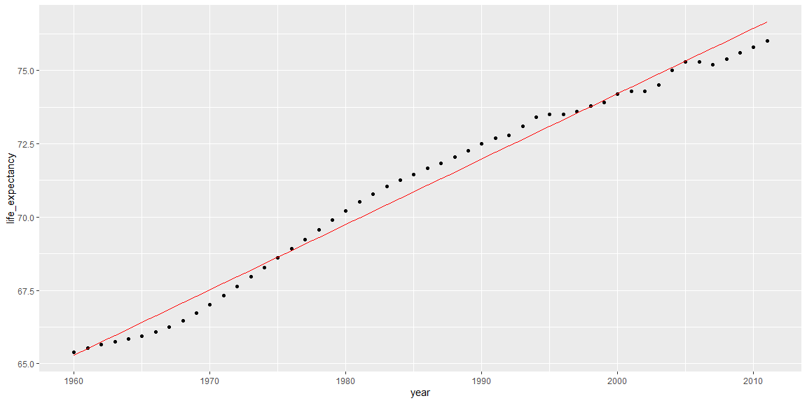
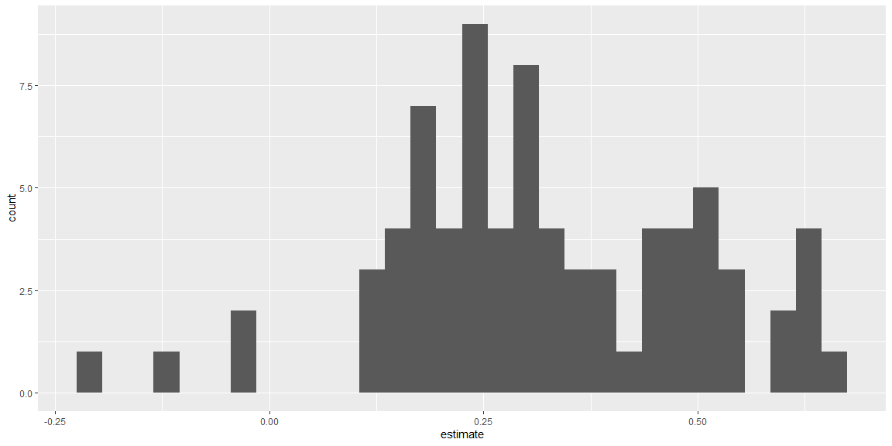
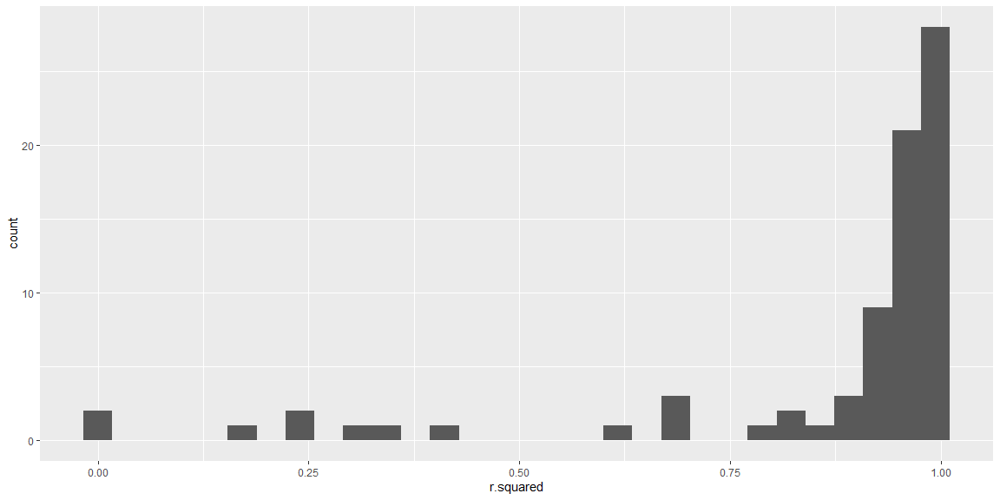
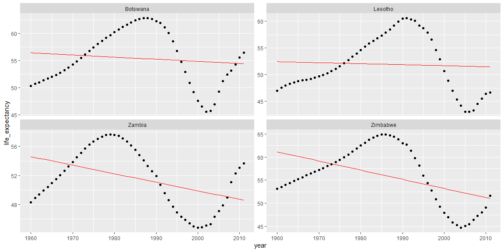

# {.tabset .tabset-fade}


## Background

https://campus.datacamp.com/courses/machine-learning-in-the-tidyverse/foundations-of-tidy-machine-learning?ex=1

## Foundations

Nesting your data
In this course, you will work with a collection of economic and social indicators for 77 countries over a period of 52 years. This data is stored in the gapminder dataframe.

In this exercise, you will transform your gapminder data into a nested dataframe by using the first tool needed to build the foundation of tidy machine learning skills: nest().

Note: This is a more granular version than the dataset available from the gapminder package. This version is available in the dslabs package.


```r
# Explore gapminder
head(gapminder)
```

```
## # A tibble: 6 x 7
##   country  year infant_mortality life_expectancy fertility population
##   <fct>   <int>            <dbl>           <dbl>     <dbl>      <int>
## 1 Algeria  1960             148.            47.5      7.65   11124892
## 2 Algeria  1961             148.            48.0      7.65   11404859
## 3 Algeria  1962             148.            48.6      7.65   11690152
## 4 Algeria  1963             148.            49.1      7.65   11985130
## 5 Algeria  1964             149.            49.6      7.65   12295973
## 6 Algeria  1965             149.            50.1      7.66   12626953
## # ... with 1 more variable: gdpPercap <int>
```

```r
# Prepare the nested dataframe gap_nested
gap_nested <- gapminder %>% group_by(country) %>% nest()

# Explore gap_nested
head(gap_nested)
```

```
## # A tibble: 6 x 2
##   country    data             
##   <fct>      <list>           
## 1 Algeria    <tibble [52 x 6]>
## 2 Argentina  <tibble [52 x 6]>
## 3 Australia  <tibble [52 x 6]>
## 4 Austria    <tibble [52 x 6]>
## 5 Bangladesh <tibble [52 x 6]>
## 6 Belgium    <tibble [52 x 6]>
```

Unnesting your data
As you've seen in the previous exercise, a nested dataframe is simply a way to shape your data. Essentially taking the group_by() windows and packaging them in corresponding rows.

In the same way you can use the nest() function to break your data into nested chunks, you can use the unnest() function to expand the dataframes that are nested in these chunks.


```r
# Create the unnested dataframe called gap_unnnested
gap_unnested <- gap_nested %>% unnest() %>% arrange(year) %>% as.data.frame() 

# Confirm that your data was not modified  
identical(gapminder, gap_unnested)
```

```
## [1] FALSE
```

Explore a nested cell
In the first exercise, you successfully created a nested dataframe gap_nested. The data column contains tibbles for each country. In this exercise, you will explore one of these nested chunks.


```r
# Extract the data of Algeria
algeria_df <- gap_nested$data[[2]]

# Calculate the minimum of the population vector
min(algeria_df$population)
```

```
## [1] 20619075
```

```r
# Calculate the maximum of the population vector
max(algeria_df$population)
```

```
## [1] 41655616
```

```r
# Calculate the mean of the population vector
mean(algeria_df$population)
```

```
## [1] 30783053
```

Mapping your data
In combination with mutate(), you can use map() to append the results of your calculation to a dataframe. Since the map() function always returns a vector of lists you must use unnest() to extract this information into a numeric vector.

Here you will explore this functionality by calculating the mean population of each country in the gapminder dataset.


```r
# Calculate the mean population for each country
pop_nested <- gap_nested %>% mutate(mean_pop = map(data, ~mean(.x$population)))

# Take a look at pop_nested
head(pop_nested)
```

```
## # A tibble: 6 x 3
##   country    data              mean_pop 
##   <fct>      <list>            <list>   
## 1 Algeria    <tibble [52 x 6]> <dbl [1]>
## 2 Argentina  <tibble [52 x 6]> <dbl [1]>
## 3 Australia  <tibble [52 x 6]> <dbl [1]>
## 4 Austria    <tibble [52 x 6]> <dbl [1]>
## 5 Bangladesh <tibble [52 x 6]> <dbl [1]>
## 6 Belgium    <tibble [52 x 6]> <dbl [1]>
```

```r
# Extract the mean_pop value by using unnest
pop_mean <- pop_nested %>% unnest(mean_pop)

# Take a look at pop_mean
head(pop_mean)
```

```
## # A tibble: 6 x 3
##   country    data               mean_pop
##   <fct>      <list>                <dbl>
## 1 Algeria    <tibble [52 x 6]> 23129438.
## 2 Argentina  <tibble [52 x 6]> 30783053.
## 3 Australia  <tibble [52 x 6]> 16074837.
## 4 Austria    <tibble [52 x 6]>  7746272.
## 5 Bangladesh <tibble [52 x 6]> 97649407.
## 6 Belgium    <tibble [52 x 6]>  9983596.
```

Expecting mapped output
When you know that the output of your mapped function is an expected type (here it is a numeric vector) you can leverage the map_*() family of functions to explicitly try to return that object type instead of a list.

Here you will again calculate the mean population of each country, but instead, you will use map_dbl() to explicitly append the numeric vector returned by mean() to your dataframe.


```r
# Calculate mean population and store result as a double
pop_mean <- gap_nested %>% mutate(mean_pop = map_dbl(data, ~mean(.x$population)))

# Take a look at pop_mean
head(pop_mean)
```

```
## # A tibble: 6 x 3
##   country    data               mean_pop
##   <fct>      <list>                <dbl>
## 1 Algeria    <tibble [52 x 6]> 23129438.
## 2 Argentina  <tibble [52 x 6]> 30783053.
## 3 Australia  <tibble [52 x 6]> 16074837.
## 4 Austria    <tibble [52 x 6]>  7746272.
## 5 Bangladesh <tibble [52 x 6]> 97649407.
## 6 Belgium    <tibble [52 x 6]>  9983596.
```

Mapping many models
The gap_nested dataframe available in your workspace contains the gapminder dataset nested by country.

You will use this data to build a linear model for each country to predict life expectancy using the year feature.

Note: The term feature is synonymous with the terms variable or predictor. It refers to an attribute of your data that can be used to build a machine learning model.


```r
# Build a linear model for each country
gap_models <- gap_nested %>% mutate(model = map(data, ~lm(formula = life_expectancy~year, data = .x)))
    
# Extract the model for Algeria    
algeria_model <- gap_models$model[[2]]

# View the summary for the Algeria model
summary(algeria_model)
```

```
## 
## Call:
## lm(formula = life_expectancy ~ year, data = .x)
## 
## Residuals:
##      Min       1Q   Median       3Q      Max 
## -0.66385 -0.36252 -0.01827  0.44965  0.62041 
## 
## Coefficients:
##               Estimate Std. Error t value Pr(>|t|)    
## (Intercept) -3.718e+02  7.906e+00  -47.03   <2e-16 ***
## year         2.230e-01  3.982e-03   56.01   <2e-16 ***
## ---
## Signif. codes:  0 '***' 0.001 '**' 0.01 '*' 0.05 '.' 0.1 ' ' 1
## 
## Residual standard error: 0.4309 on 50 degrees of freedom
## Multiple R-squared:  0.9843,	Adjusted R-squared:  0.984 
## F-statistic:  3137 on 1 and 50 DF,  p-value: < 2.2e-16
```

Extracting model statistics tidily
In this exercise, you will use the tidy() and glance() functions to extract information from algeria_model in a tidy manner.

For a linear model, tidy() extracts the model coefficients while glance() returns the model statistics such as the R2.


```r
# Extract the coefficients of the algeria_model as a dataframe
tidy(algeria_model)
```

```
## # A tibble: 2 x 5
##   term        estimate std.error statistic  p.value
##   <chr>          <dbl>     <dbl>     <dbl>    <dbl>
## 1 (Intercept) -372.      7.91        -47.0 4.66e-43
## 2 year           0.223   0.00398      56.0 8.78e-47
```

```r
# Extract the statistics of the algeria_model as a dataframe
glance(algeria_model)
```

```
## # A tibble: 1 x 11
##   r.squared adj.r.squared sigma statistic  p.value    df logLik   AIC   BIC
##       <dbl>         <dbl> <dbl>     <dbl>    <dbl> <int>  <dbl> <dbl> <dbl>
## 1     0.984         0.984 0.431     3137. 8.78e-47     2  -29.0  64.0  69.8
## # ... with 2 more variables: deviance <dbl>, df.residual <int>
```

Augmenting your data
From the results of glance(), you learned that using the available features the linear model fits well with an adjusted R2 of 0.99. The augment() function can help you explore this fit by appending the predictions to the original data.

Here you will leverage this to compare the predicted values of life_expectancy with the original ones based on the year feature.


```r
# Build the augmented dataframe
algeria_fitted <- augment(algeria_model)

# Compare the predicted values with the actual values of life expectancy
algeria_fitted %>% ggplot(aes(x = year)) +
  geom_point(aes(y = life_expectancy)) + 
  geom_line(aes(y = .fitted), color = "red")
```

<!-- -->

## Multiple Models

Tidy up the coefficients of your models
In this exercise you will leverage the list column workflow along with the tidy() function from broom to extract and explore the coefficients for the 77 models you built.

Remember the gap_models dataframe contains a model predicting life expectancy by year for 77 countries.


```r
# Extract the coefficient statistics of each model into nested dataframes
model_coef_nested <- gap_models %>% mutate(coef = map(model, ~tidy(.x)))
    
# Simplify the coef dataframes for each model    
model_coef <- model_coef_nested %>% unnest(coef)

# Plot a histogram of the coefficient estimates for year         
model_coef %>% filter(term == "year") %>% ggplot(aes(x = estimate)) +
  geom_histogram()
```

<!-- -->

Glance at the fit of your models
In this exercise you will use glance() to calculate how well the linear models fit the data for each country.


```r
# Extract the fit statistics of each model into dataframes
model_perf_nested <- gap_models %>% mutate(fit = map(model, ~glance(.x)))

# Simplify the fit dataframes for each model    
model_perf <- model_perf_nested %>% unnest(fit)
    
# Look at the first six rows of model_perf
head(model_perf)
```

```
## # A tibble: 6 x 14
##   country data  model r.squared adj.r.squared sigma statistic  p.value
##   <fct>   <lis> <lis>     <dbl>         <dbl> <dbl>     <dbl>    <dbl>
## 1 Algeria <tib~ <lm>      0.952         0.951 2.18       996. 1.11e-34
## 2 Argent~ <tib~ <lm>      0.984         0.984 0.431     3137. 8.78e-47
## 3 Austra~ <tib~ <lm>      0.983         0.983 0.511     2905. 5.83e-46
## 4 Austria <tib~ <lm>      0.987         0.986 0.438     3702. 1.48e-48
## 5 Bangla~ <tib~ <lm>      0.949         0.947 1.83       921. 7.10e-34
## 6 Belgium <tib~ <lm>      0.990         0.990 0.331     5094. 5.54e-52
## # ... with 6 more variables: df <int>, logLik <dbl>, AIC <dbl>, BIC <dbl>,
## #   deviance <dbl>, df.residual <int>
```

Best and worst fitting models
In this exercise you will answer the following questions:

Overall, how well do your models fit your data?
Which are the best fitting models?
Which models do not fit the data well?


```r
# Plot a histogram of rsquared for the 77 models    
model_perf %>% ggplot(aes(x = r.squared)) + geom_histogram()
```

<!-- -->

```r
# Extract the 4 best fitting models
best_fit <- model_perf %>% top_n(n = 4, wt = r.squared)

# Extract the 4 models with the worst fit
worst_fit <- model_perf %>% top_n(n = 4, wt = -r.squared)
```

Augment the fitted values of each model
In this exercise you will prepare your four best and worst fitting models for further exploration by augmenting your model data with augment().


```r
best_augmented <- best_fit %>% 
  # Build the augmented dataframe for each country model
  mutate(augmented = map(model, ~augment(.x))) %>% 
  # Expand the augmented dataframes
  unnest(augmented)

worst_augmented <- worst_fit %>% 
  # Build the augmented dataframe for each country model
  mutate(augmented = map(model, ~augment(.x))) %>% 
  # Expand the augmented dataframes
  unnest(augmented)
```

Explore your best and worst fitting models
Let's explore your four best and worst fitting models by comparing the fitted lines with the actual values.


```r
# Compare the predicted values with the actual values of life expectancy 
# for the top 4 best fitting models
best_augmented %>% 
  ggplot(aes(x = year)) +
  geom_point(aes(y = life_expectancy)) + 
  geom_line(aes(y = .fitted), color = "red") +
  facet_wrap(~country, scales = "free_y")
```

<!-- -->

```r
# Compare the predicted values with the actual values of life expectancy 
# for the top 4 worst fitting models
worst_augmented %>% 
  ggplot(aes(x = year)) +
  geom_point(aes(y = life_expectancy)) + 
  geom_line(aes(y = .fitted), color = "red") +
  facet_wrap(~country, scales = "free_y")
```

<!-- -->

Build better models
Earlier you built a collection of simple models to fit life expectancy using the year feature. Your previous analysis showed that some of these models didn't fit very well.

In this exercise you will build multiple regression models for each country using all available features. 


```r
# Build a linear model for each country using all features
gap_fullmodel <- gap_nested %>% mutate(model = map(data, ~lm(life_expectancy~., data = .x)))

fullmodel_perf <- gap_fullmodel %>% 
  # Extract the fit statistics of each model into dataframes
  mutate(fit = map(model, ~glance(.x))) %>% 
  # Simplify the fit dataframes for each model
  unnest(fit)
  
# View the performance for the four countries with the worst fitting 
# four simple models you looked at before
fullmodel_perf %>% 
  filter(country %in% worst_fit$country) %>% 
  select(country, adj.r.squared)
```

```
## # A tibble: 4 x 2
##   country  adj.r.squared
##   <fct>            <dbl>
## 1 Botswana         0.844
## 2 Lesotho          0.908
## 3 Zambia           0.706
## 4 Zimbabwe         0.978
```

## Build and Tune

The test-train split
In a disciplined machine learning workflow it is crucial to withhold a portion of your data (testing data) from any decision-making process. This allows you to independently assess the performance of your model when it is finalized. The remaining data, the training data, is used to build and select the best model.

In this exercise, you will use the rsample package to split your data to perform the initial train-test split of your gapminder data.

Note: Since this is a random split of the data it is good practice to set a seed before splitting it.


```r
set.seed(42)

# Prepare the initial split object
gap_split <- initial_split(gapminder, prop = .75)

# Extract the training dataframe
training_data <- training(gap_split)

# Extract the testing dataframe
testing_data <- testing(gap_split)

# Calculate the dimensions of both training_data and testing_data
dim(training_data)
```

```
## [1] 3003    7
```

```r
dim(testing_data)
```

```
## [1] 1001    7
```

Cross-validation dataframes
Now that you have withheld a portion of your data as testing data, you can use the remaining portion to find the best performing model.

In this exercise, you will split the training data into a series of 5 train-validate sets using the vfold_cv() function from the rsample package.


```r
set.seed(42)

# Prepare the dataframe containing the cross validation partitions
cv_split <- vfold_cv(training_data, v = 5)

cv_data <- cv_split %>% 
  mutate(
    # Extract the train dataframe for each split
    train = map(splits, ~training(.x)), 
    # Extract the validate dataframe for each split
    validate = map(splits, ~testing(.x))
  )

# Use head() to preview cv_data
head(cv_data)
```

```
## # A tibble: 5 x 4
##   splits             id    train                validate          
## * <named list>       <chr> <named list>         <named list>      
## 1 <split [2.4K/601]> Fold1 <tibble [2,402 x 7]> <tibble [601 x 7]>
## 2 <split [2.4K/601]> Fold2 <tibble [2,402 x 7]> <tibble [601 x 7]>
## 3 <split [2.4K/601]> Fold3 <tibble [2,402 x 7]> <tibble [601 x 7]>
## 4 <split [2.4K/600]> Fold4 <tibble [2,403 x 7]> <tibble [600 x 7]>
## 5 <split [2.4K/600]> Fold5 <tibble [2,403 x 7]> <tibble [600 x 7]>
```

Build cross-validated models
In this exercise, you will build a linear model predicting life_expectancy using all available features. You will do this for the train data of each cross-validation fold.


```r
# Build a model using the train data for each fold of the cross validation
cv_models_lm <- cv_data %>% mutate(model = map(train, ~lm(formula = life_expectancy~., data = .x)))
```

Preparing for evaluation
In order to measure the validate performance of your models you need compare the predicted values of life_expectancy for the observations from validate set to the actual values recorded. Here you will prepare both of these vectors for each partition.


```r
cv_prep_lm <- cv_models_lm %>% 
  mutate(
    # Extract the recorded life expectancy for the records in the validate dataframes
    validate_actual = map(validate, ~.x$life_expectancy),
    # Predict life expectancy for each validate set using its corresponding model
    validate_predicted = map2(.x = model, .y = validate, ~predict(.x, .y))
  )
```

Evaluate model performance
Now that you have both the actual and predicted values of each fold you can compare them to measure performance.

For this regression model, you will measure the Mean Absolute Error (MAE) between these two vectors. This value tells you the average difference between the actual and predicted values.


```r
library(Metrics)
mae <- Metrics::mae
# Calculate the mean absolute error for each validate fold       
cv_eval_lm <- cv_prep_lm %>% 
  mutate(validate_mae = map2_dbl(validate_actual, validate_predicted, ~mae(actual = .x, predicted = .y)))

# Print the validate_mae column
cv_eval_lm$validate_mae
```

```
##        1        2        3        4        5 
## 1.457072 1.452005 1.465948 1.358451 1.512336
```

```r
# Calculate the mean of validate_mae column
mean(cv_eval_lm$validate_mae)
```

```
## [1] 1.449162
```

Build a random forest model
Here you will use the same cross-validation data to build (using train) and evaluate (using validate) random forests for each partition. Since you are using the same cross-validation partitions as your regression models, you are able to directly compare the performance of the two models.

Note: We will limit our random forests to contain 100 trees to ensure they finish fitting in a reasonable time. The default number of trees for ranger() is 500.


```r
library(ranger)

# Build a random forest model for each fold
cv_models_rf <- cv_data %>% 
  mutate(model = map(train, ~ranger(formula = life_expectancy~., data = .x,
                                    num.trees = 100, seed = 42)))

# Generate predictions using the random forest model
cv_prep_rf <- cv_models_rf %>% 
  mutate(validate_actual = map(validate, ~.x$life_expectancy), validate_predicted = map2(.x = model, .y = validate, ~predict(.x, .y)$predictions))
```

Evaluate a random forest model
Similar to the linear regression model, you will use the MAE metric to evaluate the performance of the random forest model.


```r
library(ranger)

# Calculate validate MAE for each fold
cv_eval_rf <- cv_prep_rf %>% 
  mutate(validate_mae = map2_dbl(validate_actual, validate_predicted, ~mae(actual = .x, predicted = .y)))

# Print the validate_mae column
cv_eval_rf$validate_mae
```

```
##         1         2         3         4         5 
## 0.7876360 0.7907325 0.7728321 0.7718576 0.7681765
```

```r
# Calculate the mean of validate_mae column
mean(cv_eval_rf$validate_mae)
```

```
## [1] 0.7782469
```

Fine tune your model
Wow! That was a significant improvement over a regression model. Now let's see if you can further improve this performance by fine tuning your random forest models. To do this you will vary the mtry parameter when building your random forest models on your train data.

The default value of mtry for ranger is the rounded down square root of the total number of features (6). This results in a value of 2.


```r
# Prepare for tuning your cross validation folds by varying mtry
cv_tune <- cv_data %>% crossing(mtry = 2:5) 

# Build a model for each fold & mtry combination
cv_model_tunerf <- cv_tune %>% mutate(model = map2(.x = train, .y = mtry, ~ranger(formula = life_expectancy~., 
                                              data = .x, mtry = .y, 
                                              num.trees = 100, seed = 42)))
```

The best performing parameter
You've now built models where you've varied the random forest-specific hyperparameter mtry in the hopes of improving your model further. Now you will measure the performance of each mtry value across the 5 cross validation partitions to see if you can improve the model.

Remember that the validate MAE you calculated two exercises ago of 0.795 was for the default mtry value of 2.


```r
# Generate validate predictions for each model
cv_prep_tunerf <- cv_model_tunerf %>% mutate(validate_actual = map(validate, ~.x$life_expectancy), validate_predicted = map2(.x = model, .y = validate, ~predict(.x, .y)$predictions))

# Calculate validate MAE for each fold and mtry combination
cv_eval_tunerf <- cv_prep_tunerf %>% 
  mutate(validate_mae = map2_dbl(.x = validate_actual, .y = validate_predicted, ~mae(actual = .x, predicted = .y)))

# Calculate the mean validate_mae for each mtry used  
cv_eval_tunerf %>% 
  group_by(mtry) %>% 
  summarise(mean_mae = mean(validate_mae))
```

```
## # A tibble: 4 x 2
##    mtry mean_mae
##   <int>    <dbl>
## 1     2    0.778
## 2     3    0.774
## 3     4    0.773
## 4     5    0.780
```

Build & evaluate the best model
Using cross-validation you were able to identify the best model for predicting life_expectancy using all the features in gapminder. Now that you've selected your model, you can use the independent set of data (testing_data) that you've held out to estimate the performance of this model on new data.

You will build this model using all training_data and evaluate using testing_data.


```r
# Build the model using all training data and the best performing parameter
best_model <- ranger(formula = life_expectancy~., data = training_data,
                     mtry = 4, num.trees = 100, seed = 42)

# Prepare the test_actual vector
test_actual <- testing_data$life_expectancy

# Predict life_expectancy for the testing_data
test_predicted <- predict(best_model, testing_data)$predictions

# Calculate the test MAE
mae(test_actual, test_predicted)
```

```
## [1] 0.7295088
```

## Classification Models

Prepare train-test-validate parts
In this exercise, you will leverage the tools that you have learned thus far to build a classification model to predict employee attrition.

You will work with the attrition dataset, which contains 30 features about employees which you will use to predict if they have left the company.

You will first prepare the training & testing data sets, then you will further split the training data using cross-validation so that you can search for the best performing model for this task.


```r
set.seed(42)

attrition <- read.csv("attrition.csv") %>% select(-1)

# Prepare the initial split object
data_split <- initial_split(attrition, prop = 0.75)

# Extract the training dataframe
training_data <- training(data_split)

# Extract the testing dataframe
testing_data <- testing(data_split)

cv_split <- vfold_cv(training_data, v = 5)

cv_data <- cv_split %>% 
  mutate(
    # Extract the train dataframe for each split
    train = map(splits, ~training(.x)),
    # Extract the validate dataframe for each split
    validate = map(splits, ~testing(.x))
  )
```

Build cross-validated models
In this exercise, you will build logistic regression models for each fold in your cross-validation.

You will build this using the glm() function and by setting the family argument to "binomial".


```r
# Build a model using the train data for each fold of the cross validation
cv_models_lr <- cv_data %>% 
  mutate(model = map(train, ~glm(formula = Attrition~., data = .x, family = "binomial")))
```

Predictions of a single model
To calculate the performance of a classification model you need to compare the actual values of Attrition to those predicted by the model. When calculating metrics for binary classification tasks (such as precision and recall), the actual and predicted vectors must be converted to binary values.

In this exercise, you will learn how to prepare these vectors using the model and validate dataframes from the first cross-validation fold as an example.


```r
# Extract the first model and validate 
model <- cv_models_lr$model[[1]]
validate <- cv_models_lr$validate[[1]]

# Prepare binary vector of actual Attrition values in validate
validate_actual <- validate$Attrition == "Yes"

# Predict the probabilities for the observations in validate
validate_prob <- predict(model, validate, type = "response")

# Prepare binary vector of predicted Attrition values for validate
validate_predicted <- validate_prob > 0.5
```

Performance of a single model
Now that you have the binary vectors for the actual and predicted values of the model, you can calculate many commonly used binary classification metrics. In this exercise you will focus on:

accuracy: rate of correctly predicted values relative to all predictions.
precision: portion of predictions that the model correctly predicted as TRUE.
recall: portion of actual TRUE values that the model correctly recovered.


```r
# Compare the actual & predicted performance visually using a table
table(validate_actual, validate_predicted)
```

```
##                validate_predicted
## validate_actual FALSE TRUE
##           FALSE   182    6
##           TRUE     22   11
```

```r
# Calculate the accuracy
accuracy(validate_actual, validate_predicted)
```

```
## [1] 0.8733032
```

```r
# Calculate the precision
precision(validate_actual, validate_predicted)
```

```
## [1] 0.6470588
```

```r
# Calculate the recall
recall(validate_actual, validate_predicted)
```

```
## [1] 0.3333333
```

Prepare for cross-validated performance
Now that you know how to calculate the performance metrics for a single model, you are now ready to expand this for all the folds in the cross-validation dataframe.


```r
cv_prep_lr <- cv_models_lr %>% 
  mutate(
    # Prepare binary vector of actual Attrition values in validate
    validate_actual = map(validate, ~.x$Attrition == "Yes"),
    # Prepare binary vector of predicted Attrition values for validate
    validate_predicted = map2(.x = model, .y = validate, ~predict(.x, .y, type = "response") > 0.5)
  )
```

Calculate cross-validated performance
It is crucial to optimize models using a carefully selected metric aimed at achieving the goal of the model.

Imagine that in this case you want to use this model to identify employees that are predicted to leave the company. Ideally, you want a model that can capture as many of the ready-to-leave employees as possible so that you can intervene. The corresponding metric that captures this is the recall metric. As such, you will exclusively use recall to optimize and select your models.


```r
# Calculate the validate recall for each cross validation fold
cv_perf_recall <- cv_prep_lr %>% 
  mutate(validate_recall = map2_dbl(validate_actual, validate_predicted, 
                                    ~recall(actual = .x, predicted = .y)))

# Print the validate_recall column
cv_perf_recall$validate_recall
```

```
##         1         2         3         4         5 
## 0.3333333 0.4166667 0.3333333 0.3750000 0.6136364
```

```r
# Calculate the average of the validate_recall column
mean(cv_perf_recall$validate_recall)
```

```
## [1] 0.4143939
```

Tune random forest models
Now that you have a working logistic regression model you will prepare a random forest model to compare it with.


```r
# Prepare for tuning your cross validation folds by varying mtry
cv_tune <- cv_data %>%
  crossing(mtry = c(2, 4, 8, 16)) 

# Build a cross validation model for each fold & mtry combination
cv_models_rf <- cv_tune %>% 
  mutate(model = map2(train, mtry, ~ranger(formula = Attrition~., 
                                           data = .x, mtry = .y,
                                           num.trees = 100, seed = 42)))
```

Random forest performance
It is now time to see whether the random forests models you built in the previous exercise are able to outperform the logistic regression model.

Remember that the validate recall for the logistic regression model was 0.43.


```r
cv_prep_rf <- cv_models_rf %>% 
  mutate(
    # Prepare binary vector of actual Attrition values in validate
    validate_actual = map(validate, ~.x$Attrition == "Yes"),
    # Prepare binary vector of predicted Attrition values for validate
    validate_predicted = map2(.x = model, .y = validate, ~predict(.x, .y, type = "response")$predictions == "Yes")
  )

# Calculate the validate recall for each cross validation fold
cv_perf_recall <- cv_prep_rf %>% 
  mutate(recall = map2_dbl(.x = validate_actual, .y = validate_predicted, ~recall(actual = .x, predicted = .y)))

# Calculate the mean recall for each mtry used  
cv_perf_recall %>% 
  group_by(mtry) %>% 
  summarise(mean_recall = mean(recall))
```

```
## # A tibble: 4 x 2
##    mtry mean_recall
##   <dbl>       <dbl>
## 1     2      0.0931
## 2     4      0.134 
## 3     8      0.174 
## 4    16      0.220
```

Build final classification model
Comparing the recall performance between the logistic regression model (0.4) and the best performing random forest model (0.2), you've learned that the model with the best performance is the logistic regression model. In this exercise, you will build the logistic regression model using all of the train data and you will prepare the necessary vectors for evaluating this model's test performance.


```r
# Build the logistic regression model using all training data
best_model <- glm(formula = Attrition~., 
                  data = training_data, family = "binomial")

# Prepare binary vector of actual Attrition values for testing_data
test_actual <- testing_data$Attrition == "Yes"

# Prepare binary vector of predicted Attrition values for testing_data
test_predicted <- predict(best_model, testing_data, type = "response") > 0.5
```

Measure final model performance
Now its time to calculate the test performance of your final model (logistic regression). Here you will use the held out testing data to characterize the performance you would expect from this model when it is applied to new data.


```r
# Compare the actual & predicted performance visually using a table
table(test_actual, test_predicted)
```

```
##            test_predicted
## test_actual FALSE TRUE
##       FALSE   293   13
##       TRUE     31   30
```

```r
# Calculate the test accuracy
accuracy(test_actual, test_predicted)
```

```
## [1] 0.880109
```

```r
# Calculate the test precision
precision(test_actual, test_predicted)
```

```
## [1] 0.6976744
```

```r
# Calculate the test recall
recall(test_actual, test_predicted)
```

```
## [1] 0.4918033
```


