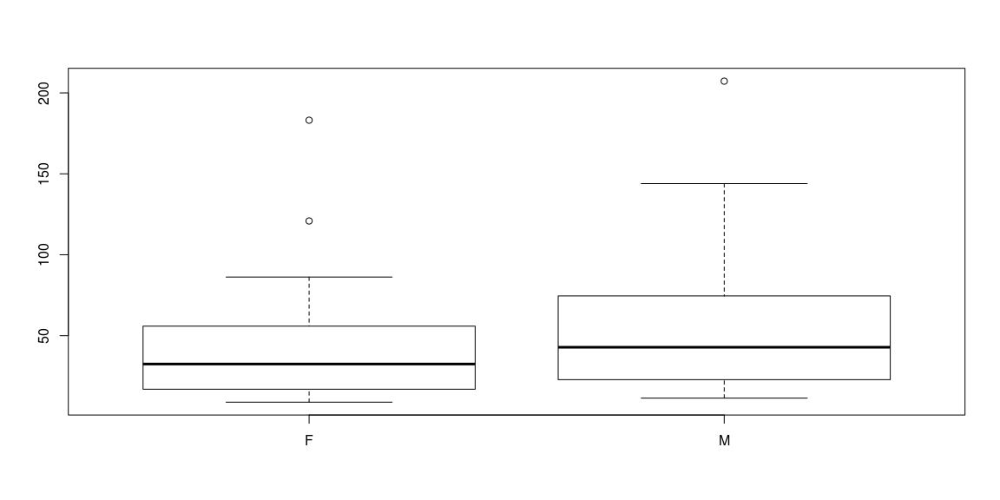
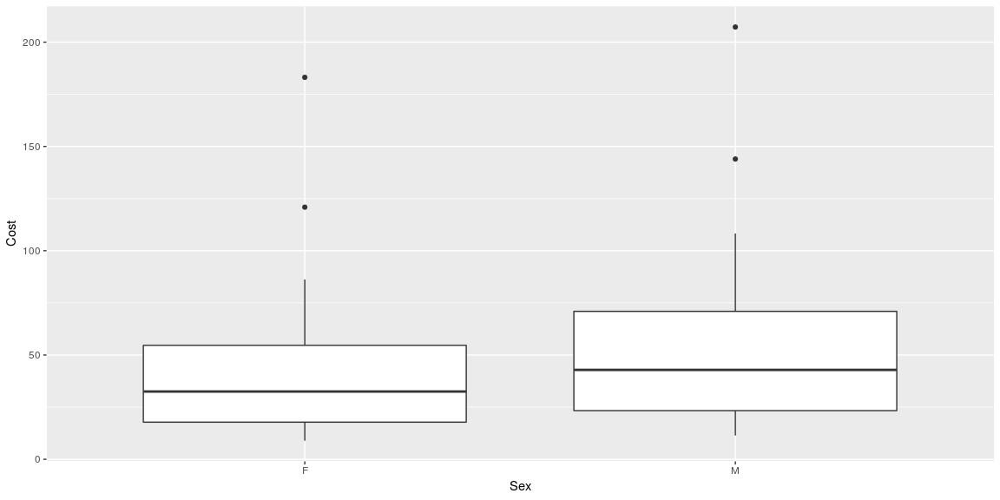
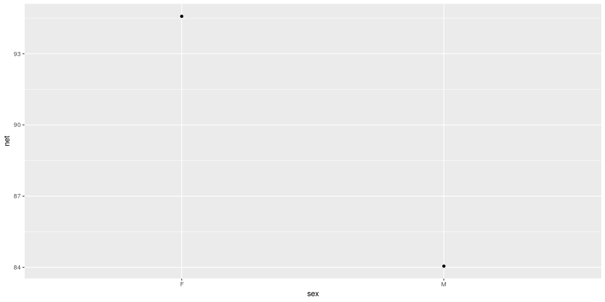
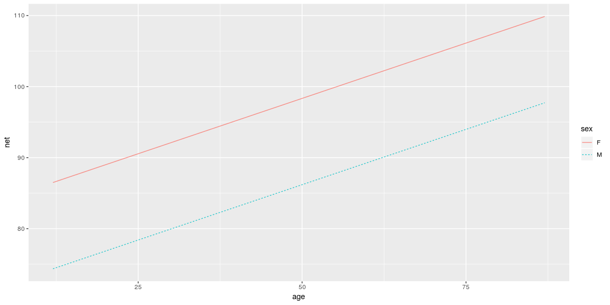

# {.tabset .tabset-fade}


```
## ── Attaching packages ─────────────────────────────────────────────────────────────────────────────────────────── tidyverse 1.2.1 ──
```

```
## ✔ tibble  2.1.1     ✔ purrr   0.2.5
## ✔ tidyr   0.8.2     ✔ dplyr   0.7.8
## ✔ readr   1.3.1     ✔ stringr 1.3.1
## ✔ tibble  2.1.1     ✔ forcats 0.3.0
```

```
## ── Conflicts ────────────────────────────────────────────────────────────────────────────────────────────── tidyverse_conflicts() ──
## ✖ dplyr::filter() masks stats::filter()
## ✖ dplyr::lag()    masks stats::lag()
```

```
## Loading required package: lattice
```

```
## Loading required package: ggformula
```

```
## Loading required package: ggstance
```

```
## 
## Attaching package: 'ggstance'
```

```
## The following objects are masked from 'package:ggplot2':
## 
##     geom_errorbarh, GeomErrorbarh
```

```
## 
## New to ggformula?  Try the tutorials: 
## 	learnr::run_tutorial("introduction", package = "ggformula")
## 	learnr::run_tutorial("refining", package = "ggformula")
```

```
## Loading required package: mosaicData
```

```
## Loading required package: Matrix
```

```
## 
## Attaching package: 'Matrix'
```

```
## The following object is masked from 'package:tidyr':
## 
##     expand
```

```
## 
## The 'mosaic' package masks several functions from core packages in order to add 
## additional features.  The original behavior of these functions should not be affected by this.
## 
## Note: If you use the Matrix package, be sure to load it BEFORE loading mosaic.
```

```
## 
## Attaching package: 'mosaic'
```

```
## The following object is masked from 'package:Matrix':
## 
##     mean
```

```
## The following objects are masked from 'package:dplyr':
## 
##     count, do, tally
```

```
## The following object is masked from 'package:purrr':
## 
##     cross
```

```
## The following object is masked from 'package:ggplot2':
## 
##     stat
```

```
## The following objects are masked from 'package:stats':
## 
##     binom.test, cor, cor.test, cov, fivenum, IQR, median,
##     prop.test, quantile, sd, t.test, var
```

```
## The following objects are masked from 'package:base':
## 
##     max, mean, min, prod, range, sample, sum
```

```
## Skipping install of 'statisticalModeling' from a github remote, the SHA1 (4c5383d3) has not changed since last install.
##   Use `force = TRUE` to force installation
```

## Background

https://www.datacamp.com/courses/statistical-modeling-in-r-part-1

## What is Statistical Modeling


```r
## Accessing Data

# Use data() to load Trucking_jobs
data("Trucking_jobs", package = "statisticalModeling")

# View the number rows in Trucking_jobs
nrow(Trucking_jobs)
```

```
## [1] 129
```

```r
# Use names() to find variable names in mosaicData::Riders
names(mosaicData::Riders)
```

```
##  [1] "date"    "day"     "highT"   "lowT"    "hi"      "lo"      "precip" 
##  [8] "clouds"  "riders"  "ct"      "weekday" "wday"
```

```r
# Load ggplot2 package
library(ggplot2)

# Look at the head() of diamonds
head(diamonds)
```

```
## # A tibble: 6 x 10
##   carat cut       color clarity depth table price     x     y     z
##   <dbl> <ord>     <ord> <ord>   <dbl> <dbl> <int> <dbl> <dbl> <dbl>
## 1 0.23  Ideal     E     SI2      61.5    55   326  3.95  3.98  2.43
## 2 0.21  Premium   E     SI1      59.8    61   326  3.89  3.84  2.31
## 3 0.23  Good      E     VS1      56.9    65   327  4.05  4.07  2.31
## 4 0.290 Premium   I     VS2      62.4    58   334  4.2   4.23  2.63
## 5 0.31  Good      J     SI2      63.3    58   335  4.34  4.35  2.75
## 6 0.24  Very Good J     VVS2     62.8    57   336  3.94  3.96  2.48
```

```r
##Starting with formulas

data("AARP", package = "statisticalModeling")

# Find the variable names in AARP
names(AARP)
```

```
## [1] "Age"      "Sex"      "Coverage" "Cost"
```

```r
# Find the mean cost broken down by sex
mosaic::mean(Cost~Sex, data = AARP)
```

```
##        F        M 
## 47.29778 57.53056
```

```r
## Graphics with Formulas

# Create a boxplot using base, lattice, or ggplot2
boxplot(Cost ~ Sex, data = AARP)
```

<!-- -->

```r
bwplot(Cost ~ Sex, data = AARP)
```

<!-- -->

```r
gf_boxplot(Cost ~ Sex, data = AARP)
```

<!-- -->

```r
# Make a scatterplot using base, lattice, or ggplot2
plot(Cost ~ Age, data = AARP)
```

<!-- -->

```r
xyplot(Cost ~ Age, data = AARP)
```

<!-- -->

```r
gf_point(Cost ~ Age, data = AARP)
```

<!-- -->

```r
## Modeling running times
# Find the variable names in Runners 
names(Runners)
```

```
## [1] "age"            "net"            "gun"            "sex"           
## [5] "year"           "previous"       "nruns"          "start_position"
```

```r
# Build models: handicap_model_1, handicap_model_2, handicap_model_3 
handicap_model_1 <- lm(net~age, data = Runners)
handicap_model_2 <- lm(net~sex, data = Runners)
handicap_model_3 <- lm(net~age+sex, data = Runners)

# For now, here's a way to visualize the models
fmodel(handicap_model_1)
```

<!-- -->

```r
fmodel(handicap_model_2)
```

<!-- -->

```r
fmodel(handicap_model_3)
```

<!-- -->

```r
##Using the recursive partitioning model architecture
```


